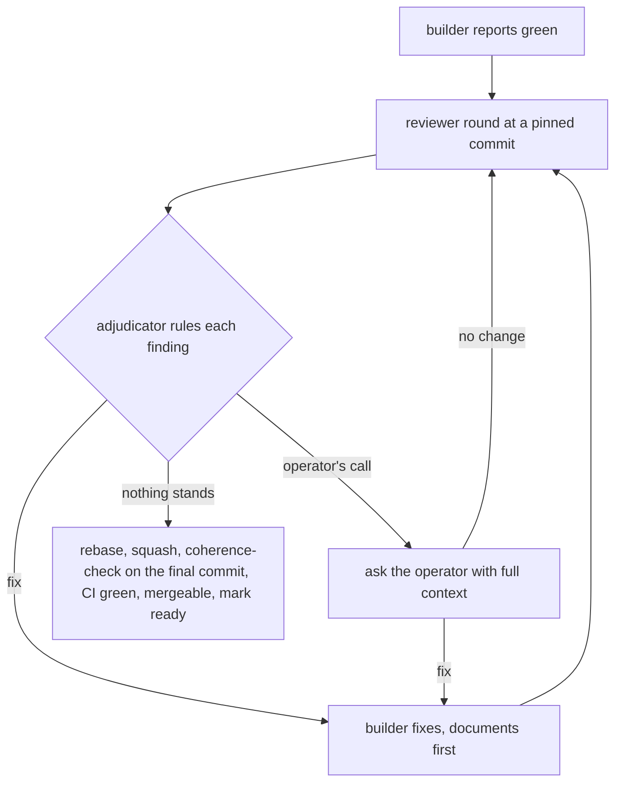

# Adversarial review until nothing stands

A pull request an agent builds reaches the operator only after an adversarial reviewer has found
nothing left to fix, CI is green, and the branch merges cleanly onto current `main`. Until then it
stays in draft. The review exists because the builder's own report, green CI and a clean diff each
miss the defects that matter here. Those are a control whose tests pass with the mechanism broken, a
document that claims more than the code does, and a rebase that quietly drops a landed change.

| Role | Who | Does | Never does |
| --- | --- | --- | --- |
| Builder | A subagent | Builds the change and fixes findings as ruled, following the `builder` skill, reports every line of `main` it removed with the reason | Squashes, marks ready, rules on a finding |
| Reviewer | A different subagent | Runs part 2 and reports each finding with evidence | Edits the tree, pushes, changes GitHub state, decides a finding |
| Adjudicator | The main session | Runs part 1, rules on every finding, squashes, marks ready | Forwards a report as the answer, or fixes a finding by guessing |
| Operator | The person | Decides design choices, departures from a record's words, names, and merges | |

## Part 1. The adjudicator

### Who reviews

The reviewer is never the agent that built the work, since a reviewer that wrote the code reviews
its own assumptions. Start the review with a fresh subagent on Opus, with none of the builder's
context. After the first round, send every later round to the **same reviewer** through
`SendMessage`. It keeps what it already verified, and a new reviewer each round re-reads everything
from nothing, re-argues settled ground and never converges.

Start a new reviewer only when independence from the first one is warranted, and say why. That is
when the work changed so much that the earlier review no longer covers it, when the reviewer took
part in deciding a fix it would now judge, when its context has drifted or been compacted so it no
longer holds what it verified, or when the operator asks.

### The brief

Tell the reviewer to launch this skill with the Skill tool and use part 2 in full, following the
approach it lays out, never bits and pieces of it, then fill this in. A brief
carries reasoning to test, not verdicts to comply with.

```text
Pull request, pinned commit, branch, and the base it was built on.
Sources first: the ticket and the records and documents it rests on. Read these before the
  builder's account, and derive the governing constraints from them.
Then: the builder's report (claims to check), and where the rulings already made are written
  (hypotheses the reviewer may refute).
Hypotheses: the specific ways this change could be wrong.
Conflicts, when the branch was rebased: the builder's conflict list.
Operator instructions given during the work, verbatim.
Report file path.
```

### Ruling on a report

1. **Read the report, not the digest.** Separate what it shows from what it asserts, and spot-check
   a load-bearing claim yourself.
2. **Rule on every finding.** Fix it, or reject it with the standard it fails, or take it to the
   operator when it is a design choice, a departure from a record's words, a name, or a change to
   what the operator decided. A question to the operator carries its full context, the options and
   what each implies, and a recommendation.
3. **Rule on the class, not the instance.** When a finding is a second instance of an earlier one's
   class, rule a sweep of the whole class.
4. **Send the rulings to the same builder,** with the reasoning. The builder fixes documents first,
   re-runs the gates and every patch it touched, and reports the commit and any line of `main` it
   removed.
5. **Send the next round to the same reviewer** at the new pinned commit, with the rulings.
6. **Stop when a round finds nothing that stands.** An Info finding may remain once it is ruled on.



### Presenting

Rebase onto current `main` so that nothing is lost on either side, as pass 5 of part 2 defines.
When the rebase met a conflict, list each one with what each side meant and how it was resolved,
and send the rebased tree to the same reviewer for a round on the rebase, since that is the tree
that lands. Squash to one commit whose message, like the pull request's title and body, describes
the whole change for a cold reader. Commit on its own, confirm the new commit exists and that its
diff against `main` equals the reviewed diff, then push with a lease. Launch the `coherence-check`
skill with the Skill tool and use it in full on that final commit, following the approach it lays
out, never bits and pieces of it, since it is the tree that lands.
Its report file, naming that commit, is the evidence that the check ran, and the main session gives
that file's path and the commit when it reports the pull request ready. A finding it raises sends
the pull request back through the loop. Wait for every check, confirm GitHub reports the pull
request mergeable and clean, then mark it ready.

After anything lands on `main`, re-check the mergeability of every pull request already presented
as ready. One that conflicts goes back through the rebase and its review before it is presented
again.

## Part 2. The reviewer

Work at the pinned commit in your own detached worktree, and remove it at the end. Install the
browser's modules there when browser gates run. Use your own ports and tunnel for integration
tests. Kill only processes and containers you started. Change no GitHub state.

### How a finding is made

Every finding goes through these four steps before it is written down.

1. **Show it.** Reproduce a defect in behaviour by probing a scratch copy, planting a fault, or
   applying a patch by hand and reading the failing assertion. Show a defect in a document by
   quoting it beside the code or record it contradicts, or beside its two readings. A defect that
   looks wrong but is not shown is a lead, not a finding.
2. **Name its class, then find every instance.** A stale memo in one component is a class, and the
   next round should not find the same class somewhere else. Grep and read for the whole class
   before reporting, and report the class with every instance found.
3. **Pass it through restraint,** below.
4. **Rank it.**

Rank by the worst consequence the defect can credibly lead to, not by its kind. An ambiguous
sentence in a record that governs a safety property can rank High, and a false sentence that
misleads no one can rank Low.

| Rank | Worst credible consequence | Typical examples |
| --- | --- | --- |
| High | Wrong behaviour ships, a safety property is broken, or a control is believed proven when it is not | A leak path, a proof that passes with the mechanism broken, a document that would lead an implementer to build either |
| Medium | Later work is misled or pays for the gap, or a record's decision is departed from | A false statement about the code, a control proven only one way, a gap the next unit builds on |
| Low | A reader is slowed or may misread, with no credible wrong outcome | Wording, an incomplete ledger row, a naming slip |
| Info | Nothing needs to change | Context worth knowing |

### Restraint

A finding earns its fix by the value it adds. Weigh each one before raising it. The adjudicator
weighs it again before ruling.

- **No demonstrated need, no finding.** A demonstrated need is a rule broken, a claim made false, a
  failure reproduced, a consumer that exists, an operator instruction the change leaves unmet, or a
  cost that later work would pay for the gap being left open, the next work in `ROADMAP.md` first.
  Something wider than needed, a style preference, or a hardening that nothing needs, later work
  included, is busy work and is not raised. Before ruling something out as busy work, weigh what
  doing it and not doing it each mean for later work and for what comes next in the roadmap. A gap
  that is cheap to close now and expensive once later work builds on it is a need.
- **A fix fits the need, not the instance.** A requested fix must not overfit, the way a model
  overfits its training data. That means a fix shaped around the one reproduction that passes it
  while the underlying need stays unmet, or a mechanism far larger than the need calls for. State
  the need, and suggest the smallest fix that meets it in general.
- **Landed work and settled design stand unless shown otherwise.** A finding that would reverse
  work already on `main` or a design choice already decided must show why the thing is there, from
  the record, the pull request or the ruling that put it there, and a demonstrated, documented need
  to change it. Without both, it is not raised as a fix. At most it becomes a question for the
  operator, with that context.
- **Settled rulings are not re-argued.** A ruling in the brief is a hypothesis you may refute with
  new evidence, never a question to raise again without it.

You pick the lenses with purchase on the change and on each call. Suggested, never imposed, are
invert (what failure passes every gate), falsifiability (can this test go red), necessary
consequence (what must be present if a claim is true), Chesterton's fence (why is the removed thing
there), Pareto (the few things that carry most of the weight) and asymmetric payoff (try what is
cheap to undo, hold back what is costly to undo).

### The first round

The passes below are the floor of a review, not its ceiling, and not a script to follow when the
change calls for something else. Take them in this order unless the change gives a reason not to.
Each leaves an artifact in the report, which is what shows the pass was done. Scale each pass to
what the change touches. A pass with nothing to do, such as the controls pass on a change that adds
no control, says so in one line. Whatever the change's own shape calls for beyond these passes is
part of the review too, since the next change may not look like the last ones.

**Pass 1. The constraints, before the builder's account.** Read the ticket and the records and
documents it rests on, and write down the constraints the change must meet in the records' own
words. Only then read the builder's report. The artifact is the constraint list, each with its
source.

**Pass 2. Map the change.** Read the whole diff. List every claim the change's documents and
comments make about the code, every control it adds or changes, and every line of `main` it
removes. The artifact is three lists.

**Pass 3. Hunt.** For each hypothesis in the brief and each one you add, try to make the change fail
while every gate stays green. Planted faults, probes in a scratch copy and edge inputs are the
tools. Every test the change adds counts as evidence only once seen to fail, whether or not it
proves a control, and it watches the outcome the user or the next stage sees. Check that each one
goes red without the change it covers. The artifact is each hypothesis with its verdict and
evidence, and each new test with how it was seen to fail.

**Pass 4. Controls and their proof.** For each control, check it against what `TESTING.md`,
[ADR-0046](../../../docs/adr/engineering/0046-tests-are-evidence-once-seen-to-fail.md) and the
preamble of `docs/MUTATIONS.md` require of its kind, held to those documents' words. Apply each
patch and read the failing assertion, not only the runner's summary. A patch whose tests stay green
is the defect those documents name. A patch's description says exactly what it breaks. Every patch
that touches a file the change edited still applies, a comment edit included. Tests watch the
outcome, what the user or the next stage sees, not only a count of calls or renders. The artifact is
one row per control.

| Control | VERIFICATIONS row | Breaks, and the direction of each | Each red for its stated reason | Applies |
| --- | --- | --- | --- | --- |

**Pass 5. What `main` has, and what the change removes.**

- **No reversal of landed work or settled design without cause.** Give each removed line from pass
  2 its reason. A removal that undoes work on `main` or a decided design is a finding, even when the
  reversal is the change's intent, unless the change shows why the thing was there and a
  demonstrated, documented need to change it. With both, it still goes to the operator when the
  thing reversed was the operator's decision.
- **A rebase loses nothing on either side.** It neither undoes or overwrites what `main` received
  with the branch's older text, nor overwrites the branch's intended changes with `main`'s text.
  Each conflict is resolved by what each side meant, so both hold. Where `main` rewrote a passage
  the branch edits, the branch's change is re-applied on `main`'s text, and dropped with a stated
  reason only when `main` already carries it or made it false. Taking one side wholesale, in either
  direction, is a finding. Check the conflict list, check that `git diff origin/main --stat` lists
  only the change's files, check that its word-level diff against the new base equals its diff
  against the old base apart from the conflicts listed, and check that in `ROADMAP.md`,
  `docs/MUTATIONS.md` and `docs/VERIFICATIONS.md` the references to each recently landed pull
  request match `main`.
- **No widening without a consumer.** No import list, grant, ban, allow entry or expected finding is
  loosened unless something in the same change needs it, and never beyond what the records allow.

The artifact is each removed line with its reason, and the rebase checks.

**Pass 6. Claims against the code.** Take the claims list from pass 2, and every statement elsewhere
that the change makes false. Wherever a statement about the code is written, it must hold of the
code as the change leaves it. That covers `CLAUDE.md`'s layout and conventions, `.claude/rules/`,
each library's README, `docs/UI.md`'s contracts, `ROADMAP.md`'s state, package and function
comments, patch descriptions and the expected findings in violation files. A document that claims a
check refuses more than it does is a finding, and so is a list of what stays with review that leaves
out a case you found the code misses. The artifact is one row per claim.

| Claim | Where written | What in the code makes it true | Holds |
| --- | --- | --- | --- |

**Pass 7. The documents as a cold reader.**

- **Read as the next cold reader will.** Read every document the change adds or edits the way a
  future reader will, human or model, while implementing something, making a decision, or choosing
  between paths with their tradeoffs. Its intent must come through as stated, saying nothing more
  and nothing less. A sentence that can be read more broadly or more narrowly than its author meant
  is a finding.
- **The records' own words.** The change implements what the decision records, `DESIGN.md`,
  `USE_CASES.md` and `docs/UI.md` say, not a narrowed or reworded reading. A compatible
  clarification is edited into its record in place. A departure from a record's words is a finding
  unless the operator ruled it.
- **Documents first.** Every document the work touches changed in the same pull request.
- **What the records leave to review.** Some checks have no gate and are held by review alone. They
  are the rows of `docs/VERIFICATIONS.md` whose proof is review, the rules under `.claude/rules/`
  and the decision records that assign a check to review, and every list of what stays with review
  in `CLAUDE.md` and in the code's comments. Find each one the change touches and apply it.
- **The whole-set coherence check.** Launch the `coherence-check` skill with the Skill tool and use
  it in full over the entire document set and the code, not only the diff, following the approach
  it lays out, never bits and pieces of it. It writes its report
  file, which names the commit it checked.

The artifact is each finding with the passage and both readings where a reading splits.

**Pass 8. State after merge and gates.** `ROADMAP.md` reads true the moment the change lands,
section moves and the delivered register included. The ticket's and the pull request's labels match
the diff. The title and commit header follow `.claude/rules/commits.md`. Run the steps CI runs for
the paths touched, and the mechanical checks (lychee, markdownlint and pre-commit), and read
`gh pr checks`. The artifact is each gate with its result.

### Every later round

1. **Close each earlier finding with evidence.** For every finding of the last round, show from the
   tree that it is fixed as ruled, or say why it is not. The artifact is one row per earlier
   finding.
2. **Hunt what the fix broke.** Read the diff since the last pinned commit, and run passes 2 to 6
   over it. Sweep each class the round's findings named, in case the fix closed one instance only.
3. **Run the `coherence-check` skill again,** launched afresh with the Skill tool and used in full
   over the whole repository at the round's pinned commit, following the approach it lays out,
   never bits and pieces of it, and writing its report file. A run from an
   earlier round does not cover the fix.
4. **Re-run pass 8.**
5. **Apply new operator instructions** from the brief to the whole change, not only to the diff.

### The report

Write it to the file the brief names, and reply with its path and a digest. A round that finds
nothing that stands says so first.

```text
Round N at <commit>. Verdict: nothing stands | <counts by rank>.
Earlier findings: <one row each, closed or not, with evidence>   (later rounds)
Findings: <rank> <id>. <class>. <file:line for every instance>. <failure scenario>. <evidence>.
  <the need it meets>. <smallest fix that meets it in general, or "operator's call">.
Hypotheses: <each with its verdict and evidence>.
Pass artifacts: constraints, change map, controls table, removals and rebase checks, claims table,
  cold-reader findings, gates.
Considered and not raised: <each with the reason restraint dropped it>.
Unverified: <anything not checked, and why>.
```
