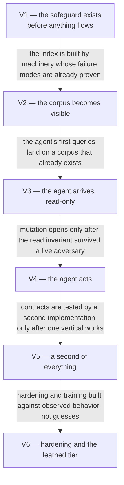

# Mediated Mailbox MCP — Roadmap

All the work in one place: the delivery posture, the value path, the work units, their
dependencies, and the open decisions. This is the one top-level document that changes as work
progresses; [USE_CASES.md](./USE_CASES.md) and [DESIGN.md](./DESIGN.md) are the stable contract it
is measured against.

**Reading rules.** Status distinguishes *authored → merged → released → deployed-and-observed* —
four different states, never collapsed (`main` is not deployed state, in either direction). Claims
are **[measured]** (read from the repo, an API, or a record that records its own measurement) or
**[inferred]**. Effort notes on units (≈ days) are sizing guesses, not commitments.

**Acceptance.** Every control's proving injection lives in
[docs/VERIFICATIONS.md](./docs/VERIFICATIONS.md), keyed to the units below. A unit is not done
while its pending verification rows are unproven. An automatable control's acceptance also
includes its mutation demonstration — the proof its tests go red when the mechanism is
removed — catalogued in [docs/MUTATIONS.md](./docs/MUTATIONS.md) (ADR-0046).

**Identifiers.** Outcomes (C1–C4, G1–G4, P1–P3, A1–A4, O1–O5) are defined in
[USE_CASES.md](./USE_CASES.md). Work units (S·F·D·M·X·H + number) and value increments (V1–V6) are
defined here. Decisions are cited by number and resolved through the
[decision-record index](./docs/adr/README.md). Every reference in prose links to the section
defining it; table cells and dependency edges within this document may use bare identifiers.

**How this document relates to tickets.** No tickets exist yet. As units are cut into tickets, the
rule binds both directions: every ticket names the one unit it serves, every unit here names its
tickets, and the **Position** line below is re-dated whenever the checklists are reconciled
against the tickets, so staleness is detectable instead of silent.

**Position: 2026-09-06.**

## Delivery posture

Three commitments govern how every unit is scoped and sequenced. They exist to pre-empt a known
failure mode: implementation that tries to account for every minute thing before shipping, and
takes forever to put value in front of its user.

1. **Deliver value faster.** Each increment on the value path is cut at the smallest shape that
   ships real value, not at capability-complete.
2. **Learn from production; iterate on learnings.** First passes are deliberately minimal, and
   what running against the real mailbox teaches drives the next pass. Discoveries that do not
   block the value path become tickets, not scope.
3. **Harden and tighten later, once real behavior exists.** Broader drills, dashboards, and the
   learned detection tier sit in a deliberate late band — built against observed behavior rather
   than guesses, which is also what makes them cheap.

Four things are **not** deferrable under this posture. The membership test: *deferral is
irreversible, or the failure it permits is silent.*

- **The fail-closed safeguard machinery before any body flows** ([V1](#v1--the-safeguard-exists-before-anything-flows)
  precedes everything). A gate bug fails catastrophically and silently; it cannot be "learned
  from" in production because nothing visibly breaks when it leaks.
- **Credential-rotation writeback, exercised deliberately in [F1](#group-f--foundation)** — its
  failure surfaces only at the restart after a rotation, the classic quiet death of systems like
  this.
- **The rate hard cap before the first corpus-scale workload** ([F3](#group-f--foundation) precedes
  [D1](#group-d--data-flows)) — collectively overrunning the provider's budget risks a
  provider-side account restriction on the operator's personal mailbox, which is not recoverable
  by iteration.
- **Audit and measurement emission riding as acceptance criteria on the units being built anyway**
  (gate decisions, masking events, audit rows, rate gauges) — an uninstrumented window is gone
  forever, and the design refuses unmeasured accepted risks.

The same posture bounds quality scope in the other direction: first passes of detection rules,
gate predicates, and heuristics are expected to be tuned from observed traffic via the review
loops, not perfected up front.

## Where things stand, in one table

| Layer | State |
| --- | --- |
| Documents (design, outcomes, decisions, this roadmap, verifications) | Authored **[measured]** |
| Code | None exists |
| Infrastructure (database, secrets sync, deployments) | None provisioned for this system |
| Verifications | All pending or parked — see [docs/VERIFICATIONS.md](./docs/VERIFICATIONS.md) |
| Mutations | None demonstrable — the ledger starts empty until implementation; see [docs/MUTATIONS.md](./docs/MUTATIONS.md) |
| **The delivery gap** | Everything: no unit has started; V1 is the front of the line |

## Delivered, mapped to outcomes

Nothing is delivered — this roadmap predates the first line of code, and the register starts
empty, deliberately.

What does **not** exist yet, so a cold reader does not assume otherwise: no API or MCP endpoint,
no index, no gate, no deployment, and no proven property of any kind — every claim in the design
is authored, none is yet demonstrated.

## The value path

### V1 — The safeguard exists before anything flows

**Units:** [S1](#group-s--safeguard-machinery) · [S2](#group-s--safeguard-machinery) ·
[F1](#group-f--foundation).
**Value shipped:** the two failure modes that would quietly kill the project — a leaking gate and
a decaying credential — are proven survivable, offline and cheaply, before anything is built on
top of them.
**Why it is first:** the gate is the only component that fails catastrophically *and* silently,
so it is built where correctness is provable against fixtures; and if refresh-token durability
breaks this design, it breaks in a half-day spike instead of mid-backfill.

### V2 — The corpus becomes visible

**Units:** [F2](#group-f--foundation) · [F3](#group-f--foundation) ·
[D1](#group-d--data-flows) · [D2](#group-d--data-flows).
**Value shipped:** the full-history metadata index exists — every sender classified, every subject
masked, sender statistics built, scan verdicts recorded — acquired politely enough to never
antagonize the provider.
**Why here:** the index is the instrument every later acceptance depends on; and backfill is where
the canonical mapping meets the real corpus, where a flaw costs a re-run now versus a redesign
after agent workflows exist.

### V3 — The agent arrives, read-only

**Units:** [D3](#group-d--data-flows) · [S3](#group-s--safeguard-machinery) ·
[D4](#group-d--data-flows).
**Value shipped:** the first real user value — an agent doing whole-mailbox analysis over live,
current data, with the invariant holding against a live adversary (the operator deliberately
trying to talk it into a restricted body).
**Why here:** connecting the agent read-only is the first end-to-end proof of the invariant
against a real adversary; mutation capability opens only after that proof exists.

### V4 — The agent acts

**Units:** [M1](#group-m--mutation-and-approval) · [M2](#group-m--mutation-and-approval) ·
[M3](#group-m--mutation-and-approval) · [M4](#group-m--mutation-and-approval).
**Value shipped:** the system's headline capability — organize, then propose and enact a
mailbox-wide reorganization — with approval, rollback, and the review loops that keep the policy
list alive.
**One disposition inside this band, stated honestly:** approval is command-line-only until M3
lands; the UI is what makes review humane, and it arrives inside the same band as the engine it
reviews.

### V5 — A second of everything

**Units:** [X3](#group-x--expansion) · [X4](#group-x--expansion) · [X2](#group-x--expansion).
**Value shipped:** the second account and the second mail backend — the deferred proofs of the
account model and the provider contract — plus calendar joining mail behind the same invariant.
**Why here:** each is the real test of a contract authored earlier — if anything above the port
must change to accommodate it, the contract was wrong, and finding that out cheaply is the point.

### V6 — Hardening and the learned tier

**Units:** [H1](#group-h--hardening) · [X1](#group-x--expansion).
**Value shipped:** off-cluster audit evidence, dashboards and alerts over the metrics that have
been accumulating since V2, admission-enforced pod policy, backup verification — and the learned
detection tier, trained on the labeled data the earlier bands produced.
**One disposition inside this band, stated honestly:** deferring dashboards is the posture's
knowing trade — the *emission* is non-deferrable and has been riding every unit; the *presentation*
is cheap to pull forward any time.

## Remaining work — the units

Each unit serves exactly one outcome; where a unit's machinery also carries another outcome's
acceptance criteria, that rides in *Criteria:* rather than splitting the unit. Checkboxes are the
only state marker; nuance lives in prose.

### Group S — safeguard machinery

The invariant's enforcement components, built first, offline, against fixtures — no network, no
database, no provider.

- [ ] **S1 — Redaction Gate + Sender Classifier + Mutation Authorizer, isolated** →
  [C2](./USE_CASES.md#c2--sensitive-sender-content-never-released) · V1 · ≈1–2 days
  Property test that no message-body value with non-normal sensitivity or a denying scan state can
  even be constructed; fail-closed paths tested **first**, because production never exercises
  them; types carry sensitivity so a leak is a static type error, with a strict type checker in CI
  as the enforcing gate. *Criteria:* every deny writes an audit row; an invalid policy update
  retains the last-good snapshot and raises the reload-failure alarm (ADR-0041).
- [ ] **S2 — Content Scanner tiers 1–2 + subject masking** →
  [C3](./USE_CASES.md#c3--content-based-secrets-caught) · V1 · ≈1–2 days
  Fixture-driven; verdict-cannot-carry-content verified by type and by a test that searches
  scanner output and logs for fixture body text. The real MFA-format corpus gets built from the
  operator's own mail during D1. *Criteria:* masking events recorded from the first run.
- [ ] **S3 — Body sanitization + injection hardening** →
  [A4](./USE_CASES.md#a4--released-bodies-are-clean-markdown-that-cannot-do-anything) · V3 · ≈1 day
  HTML-to-Markdown conversion via an existing library, untrusted-content delimiters, the
  serve-time pattern check on unscanned bodies, egress lockdown, anomalous body-fetch alerting.
  *Criteria:* the serve-time check denies on a hit from the first serve, with an audit row.

### Group F — foundation

What everything runs on: credentials, store, adapter, budget.

- [ ] **F1 — Auth spike** → [O3](./USE_CASES.md#o3--survives-its-failure-modes) · V1 · ≈½ day
  No client surface, no redaction, no database: obtain the Gmail refresh token, store it, mount
  it via the secret-sync path, make one authenticated list call — and **deliberately exercise
  rotation writeback**. *Criteria:* writeback survives a pod restart.
- [ ] **F2 — Postgres + schema + Gmail adapter, metadata path** →
  [G1](./USE_CASES.md#g1--whole-mailbox-visibility) · V2 · ≈2 days
  Metadata-only fetches throughout; seed a sensitive fixture and verify no snippet survives the
  gate; confirm partitioning and account-scoped query enforcement before there is data to migrate.
- [ ] **F3 — Rate limiter + Gmail cost profile** →
  [O1](./USE_CASES.md#o1--rate-limited-politely) · V2 · ≈1 day
  Cost profile, adaptive controller, priority classes, database lease coordination — tested
  against a **simulated** provider that throttles on schedule, so convergence and recovery are
  proven before pointing at the real one; verify the hard cap holds when the controller is fed
  deliberately bad inputs. *Criteria:* rate, lease, and throttle gauges emitting.

### Group D — data flows

The index and the surfaces that read it. This group carries
[O5](./USE_CASES.md#o5--clients-can-tell-failures-apart)'s failure-transparency criteria inside
D3 — flagged here rather than split, because the error contract and the surface are built as one
piece.

- [ ] **D1 — Backfill pass 1, full history** →
  [G2](./USE_CASES.md#g2--historical-understanding) · V2 · ≈1–2 days
  Metadata, sender classification, subject masking, sender aggregates. Validates rate limiting
  under real conditions, checkpoint/resume, and the canonical mapping against messy real data.
  **Deliberately kill the pod mid-run and confirm clean resume.** Watch the rate gauge throughout:
  this run is where the real ceiling for this account reveals itself, as opposed to the documented
  one.
- [ ] **D2 — Scan gate + backfill pass 2** →
  [C3](./USE_CASES.md#c3--content-based-secrets-caught) · V2 · ≈1 day
  The composite gate evaluated with pass-1 statistics; gated body scanning; skip decisions
  recorded from the first evaluation; the delisting transition (ADR-0037). Review skip rates
  before trusting the compromise.
- [ ] **D3 — Client surface (API + thin MCP adapter), read-only** →
  [G1](./USE_CASES.md#g1--whole-mailbox-visibility) · V3 · ≈1–2 days
  The canonical API contract (OpenAPI) with its one-to-one MCP mirror, exposing `list_threads`,
  `get_message_metadata`, `get_message_body`, `search_messages`, `list_policy_rules`,
  `corpus_stats`, a labels listing and an accounts listing (ADR-0035), and a per-account
  system-status read (ADR-0034); TLS and bearer auth on both roots; connect the real agent.
  **Manually attempt to
  talk the agent into a restricted body** — the first end-to-end proof of the invariant against a
  live adversary. *Criteria:* every serve and denial audited; API operations and MCP tools match
  one-to-one; timestamps on both roots are UTC-only, with non-UTC input rejected; no operation
  requires an identifier the surface's read operations cannot supply; failure responses let a
  client tell its own failure from the system's from the provider's.
- [ ] **D4 — Delta sync** →
  [G4](./USE_CASES.md#g4--the-index-tracks-the-live-mailbox) · V3 · ≈1 day
  Cursor management, gap detection and bounded recovery, idempotency. Run alongside backfill for a
  few days and reconcile counts against the provider to catch drift.

### Group M — mutation and approval

The write path, in escalating blast radius. This group carries
[A3](./USE_CASES.md#a3--bulk-change-is-reversible)'s machinery inside M2 and
[G3](./USE_CASES.md#g3--reorganization)'s plan review view inside M3 — flagged here rather than
split, because the engine and its reversibility, and the UI and its views, are each built as one
piece.

- [ ] **M1 — Mutations, non-reorg** →
  [A1](./USE_CASES.md#a1--asymmetric-mutation) · V4 · ≈1 day
  Single and batch label/move/archive under the authorization matrix; dry-run first; verify
  provider effects after mutating. *Criteria:* mixed-class batch with a disposal verb fails
  whole; a batch with an invalid operation anywhere in it fails whole before any write; every
  mutating operation offers a dry-run mode that changes no state of any kind.
- [ ] **M2 — Reorg engine** →
  [G3](./USE_CASES.md#g3--reorganization) · V4 · ≈3 days
  Plan storage and validation (at creation, re-validation at apply, the plan-age check), the
  `describe_reorg_plan` / `sample_reorg_plan` tools, checkpointed apply, op log, rollback.
  **Test rollback on a real ~1000-message plan before trusting it on 40k.** Approval is
  command-line-only until M3.
- [ ] **M3 — Reporting + approval UI** →
  [O4](./USE_CASES.md#o4--the-operator-can-see-and-steer) · V4 · ≈2–3 days
  Corpus overview, plan diff and approval, review queue, masking events, gate decisions, audit
  view; separate deployment and scoped database role. *Criteria:* the accepted-residual and
  masking loops become operator-reviewable.
- [ ] **M4 — Heuristics job + embeddings** →
  [C4](./USE_CASES.md#c4--the-sensitive-sender-list-keeps-pace) · V4 · ≈1–2 days
  Candidate generation into the review queue; needs M3 to be useful, hence after it.

### Group X — expansion

Each unit is a deliberate test of a contract authored long before it.

- [ ] **X1 — Scanner tier 3** →
  [C3](./USE_CASES.md#c3--content-based-secrets-caught) · V6 · ≈1–2 days
  Only once a few hundred confirmed examples exist from real traffic. Train, evaluate against
  held-out fixtures, ship behind the scanner-version flag so rollback is trivial.
- [ ] **X2 — Calendar** →
  [C1](./USE_CASES.md#c1--metadata-always-visible) · V5 · ≈2 days
  Calendar port + Google Calendar adapter, attendee-domain classification.
- [ ] **X3 — Second account** →
  [P3](./USE_CASES.md#p3--multi-account) · V5 · ≈½ day
  The real test of the account model: if anything above the port needs changing, the model was
  wrong — and finding out here, cheaply, is the point.
- [ ] **X4 — Fastmail adapter** →
  [P2](./USE_CASES.md#p2--backend-swap) · V5 · ≈2–3 days
  The real test of the provider contract, same principle one layer down — including discovering
  the provider's actual throttling behavior, which is undocumented.

### Group H — hardening

- [ ] **H1 — Operational hardening** →
  [O2](./USE_CASES.md#o2--observable) · V6
  Off-cluster audit shipping, dashboards and alerts over the long-emitting metrics (deny rate,
  unclassified-sender volume, scan backlog, gate skip rate, body-fetch rate, rate-controller
  gauges), admission-enforced pod policy, backup verification. Carries
  [O3](./USE_CASES.md#o3--survives-its-failure-modes)'s remaining drills — flagged, not split.

### The mapping at a glance

| Outcome | Remaining units | Gaps |
| --- | --- | --- |
| [C1](./USE_CASES.md#c1--metadata-always-visible) metadata visible | X2 | Mail-side visibility is built by F2 and D3 (G1 units); X2 is the calendar half |
| [C2](./USE_CASES.md#c2--sensitive-sender-content-never-released) content never released | S1 | Injection hardening on released bodies rides S3, now serving A4; the calendar content-release side rides X2 |
| [C3](./USE_CASES.md#c3--content-based-secrets-caught) secrets caught | S2 · D2 · X1 | The serve-time check rides S3 (an A4 unit) |
| [C4](./USE_CASES.md#c4--the-sensitive-sender-list-keeps-pace) list keeps pace | M4 | — |
| [G1](./USE_CASES.md#g1--whole-mailbox-visibility) whole-mailbox view | F2 · D3 | — |
| [G2](./USE_CASES.md#g2--historical-understanding) historical understanding | D1 | — |
| [G3](./USE_CASES.md#g3--reorganization) reorganization | M2 | The plan review view rides M3, flagged in Group M's preamble |
| [G4](./USE_CASES.md#g4--the-index-tracks-the-live-mailbox) index tracks live | D4 | — |
| [P1](./USE_CASES.md#p1--one-contract) one contract | — | No dedicated unit, correctly: the contract is authored in the decision records and proven by X4 |
| [P2](./USE_CASES.md#p2--backend-swap) backend swap | X4 | — |
| [P3](./USE_CASES.md#p3--multi-account) multi-account | X3 | The identifier-discoverability criterion (ADR-0035) rides D3 |
| [A1](./USE_CASES.md#a1--asymmetric-mutation) asymmetric mutation | M1 | — |
| [A2](./USE_CASES.md#a2--no-destructive-action-on-sensitive-mail) no destructive action | — | No dedicated unit, correctly: one structural half lands with F1 (token scope), the other with M1 (client surface); criteria ride those units |
| [A3](./USE_CASES.md#a3--bulk-change-is-reversible) reversible bulk change | — | Carried inside M2, flagged in Group M's preamble |
| [A4](./USE_CASES.md#a4--released-bodies-are-clean-markdown-that-cannot-do-anything) harmless released bodies | S3 | — |
| [O1](./USE_CASES.md#o1--rate-limited-politely) rate-limited | F3 | — |
| [O2](./USE_CASES.md#o2--observable) observable | H1 | Emission rides S1 · S2 · F3 · D2 · D3 as criteria; H1 is presentation and shipping |
| [O3](./USE_CASES.md#o3--survives-its-failure-modes) survives failure | F1 | Drills ride D1 (kill mid-run) · F3 (rate-controller pathology) · H1 (the rest); the gap-recovery drill keys to G4 and the rollback drill to A3 |
| [O4](./USE_CASES.md#o4--the-operator-can-see-and-steer) operator legibility | M3 | — |
| [O5](./USE_CASES.md#o5--clients-can-tell-failures-apart) failures tellable apart | — | Rides D3 as criteria, flagged in Group D's preamble; the system-status read (ADR-0034) is the transparency half |

## Dependencies

Three kinds, kept apart because conflating them is how phase numbering ossifies.

### Structural — the capability cannot exist without it

| Edge | What only the dependency supplies |
| --- | --- |
| F1 → F2 | A working, rotation-durable credential for the adapter to authenticate with |
| F2 → D1 | The schema and adapter backfill writes through |
| F3 → D1 | The budget machinery backfill spends from — the first workload big enough to trip real limits |
| D1 → D2 | The sender statistics the gate evaluates; they cannot exist before pass 1 builds them |
| S2 → D2 | The tiers pass 2 scans with |
| S1 → D3 | The gate the read surface serves through |
| S1 → M1 | The authorization matrix every mutation is checked against |
| M1 → M2 | The authorized batched-mutation path apply executes through |
| M2 → M3 | Plans, for the approval screen to approve |
| S2 → X1 | The tier boundary and version flag tier 3 slots into |

### Conventional — real reasons, but the capability would function

| Edge | Reason | Standing |
| --- | --- | --- |
| D1 → D3 | The read surface is worth connecting when the index has history in it | "Nothing to read", not "cannot function" |
| D3 → S3 | Sanitization hardens a surface that must first exist to be hardened | Could be built earlier against fixtures |
| M3 → M4 | Candidate review needs the queue view to be useful | The job itself runs headless |
| V4 → X2/X3/X4 | Expansion multiplies surface; one vertical should work first | Posture, not physics |

### Operational — bookkeeping, not design

- Provision the Postgres cluster and the secret-store machine account before F1/F2.
- Publish the OAuth consent screen to production before F1 (testing-mode tokens die in 7 days).
- Releases cut per merged unit; deployment manifests land with the unit they deploy.

## Orderings that would guarantee waste

The inverse of the value path — each is an anti-constraint the posture must not be read as
licensing:

- Building the client surface before the gate exists, "adding redaction after" — retrofitting the
  invariant is the fail-open path.
- Running backfill before the rate limiter exists — debugging two new systems against a live
  provider at once, with the account-restriction failure mode in play on day one.
- Evaluating the scan gate before pass-1 statistics exist — a gate deciding blind is either
  scan-everything (the cost it exists to avoid) or skip-blind (the leak it exists to prevent).
- Building the UI before the reorg engine — a review screen with nothing to review.
- Training tier 3 on synthetic data because real labels haven't accumulated — confident wrong
  answers on exactly the ambiguous cases.
- Adding a second datastore for coordination before contention exists — infrastructure for a
  predicted bottleneck.
- Trusting the scan gate's compromise before reviewing its recorded skip rates — the rule is
  review before trust.

## Open decisions

Where a decision is recorded, the row cites its number, resolved through the
[decision-record index](./docs/adr/README.md).

| Decision | Gates | Standing |
| --- | --- | --- |
| Tier-3 model choice and training setup | X1 | Deliberately open — ADR-0006 defers it until real labeled data exists |
| Off-cluster audit destination | H1 | ADR-0028 requires shipping; the destination is unchosen |
| UI browser framework | M3 | ADR-0021 fixes the shape (small SPA, thin read API, two verbs) and ADR-0042 settles the languages (Go on the UI's server side, TypeScript in the browser); the browser framework is deliberately unchosen until M3 approaches |
| Ingress answer if the agent ever leaves the LAN | nothing yet | Conditional; ADR-0014 names the likely answer (overlay network) without deciding it |
| Maximum plan age | M2 | ADR-0032 requires rejecting plans older than a maximum age at apply time; the value is unchosen |
| Real-provider contract-suite runs | nothing yet | ADR-0043 defers whether the provider contract suite ever runs against the real provider, and against what mailbox, until the first real adapter is implemented (F2) — complexity and payoff at that point drive it |
| Data-access production mechanism | F2 | ADR-0047 fixes the approach (schema as sole authority, per-query result types, one shared library) and deliberately defers the mechanism — generation versus hand-written under the same discipline, and the specific tool — to its own record when F2 begins |
