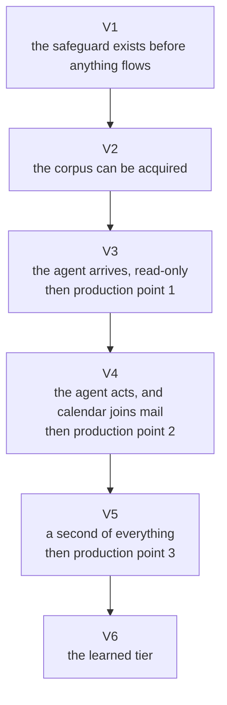
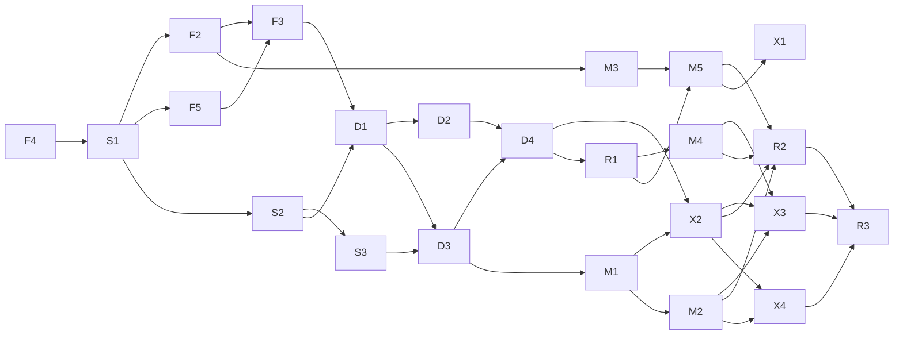

# Mediated Mailbox MCP — Roadmap

This file holds all the work in one place, meaning the delivery posture, the value path, the work
units with their finish lines, the production points, the dependencies, and the open decisions. It
is the one top-level document that changes as work progresses. [USE_CASES.md](./USE_CASES.md) and
[DESIGN.md](./DESIGN.md) are the stable contract it is measured against.

**Reading rules.** Status distinguishes *authored → merged → released → deployed-and-observed*, four
different states, never collapsed (`main` is not deployed state, in either direction). Claims are
**[measured]** (read from the repo, an API, or a record that records its own measurement) or
**[inferred]**.

**Finish lines.** Every unit names the state it must reach to be done, the lowest one that proves
what it delivers. *Tested* means implemented with the tests [TESTING.md](./TESTING.md) requires for
what the unit holds, its automatable verification rows proven, and their mutation demonstrations
recorded. *Image* means tested, and the deployable's image builds, which the images workflow proves.
*Packaged* means image, and the chart stands the deployables up on a bare kind cluster under the
chainsaw suite, against a release
([ADR-0052](./docs/adr/engineering/0052-kubernetes-deployment-helm-chart.md)). A unit that delivers
code inside a deployable or a library is proven at tested. A unit that delivers a deployable, by
creating or changing its composition root, is proven at image, the deployable's artifact
([ADR-0049](./docs/adr/engineering/0049-image-per-component-lockstep.md)). A unit that delivers the
chart's coverage is proven at packaged. Continuous integration builds every image and lints the
chart on the changes the workflow table of [CLAUDE.md](./CLAUDE.md#ci-workflows) names, so the upper
rungs add no check of their own beyond what they name.

**Production points.** Taking the system to production is outside this repository. A production
point is a point in the sequence where production first needs new supplied inputs or platform-side
steps, and there are three. Between points, new versions flow as ordinary version bumps with no
manual step. Each point names the units behind it, any precondition a build or a proof needs from
the real mailbox or the deployed system, the inputs the chart declares that arrive there
([ADR-0052](./docs/adr/engineering/0052-kubernetes-deployment-helm-chart.md)), the proofs, and the
learning that can happen only there. The work of standing the system up, a module in the operator's
repository homelab-ops-kubernetes-apps used from the repository homelab-ops-kubernetes-clusters, and
its tickets belong to those repositories. *The real mailbox* and *production* are terms of
[DESIGN.md's Glossary](./DESIGN.md#glossary).

**Acceptance.** Every control's proving injection lives in
[docs/VERIFICATIONS.md](./docs/VERIFICATIONS.md), keyed to the units and production points below. A
unit is not done while the rows keyed to it are unproven for the part they key to it. A row keyed to
a unit and a production point is proven at the unit for the mechanism and at the point for the rest.
An automatable control's acceptance also includes the mutation demonstration recorded in
[docs/MUTATIONS.md](./docs/MUTATIONS.md)
([ADR-0046](./docs/adr/engineering/0046-tests-are-evidence-once-seen-to-fail.md)). A drill or manual
exercise keyed to a production point is proven there, on its date.

**Identifiers.** Outcomes
([C1](./USE_CASES.md#c1--metadata-always-visible)–[C4](./USE_CASES.md#c4--the-sensitive-sender-list-keeps-pace),
[G1](./USE_CASES.md#g1--whole-mailbox-visibility)–[G4](./USE_CASES.md#g4--the-index-tracks-the-live-mailbox),
[P1](./USE_CASES.md#p1--one-contract)–[P3](./USE_CASES.md#p3--multi-account),
[A1](./USE_CASES.md#a1--asymmetric-mutation)–[A4](./USE_CASES.md#a4--released-bodies-are-clean-markdown-that-cannot-do-anything),
[O1](./USE_CASES.md#o1--rate-limited-politely)–[O6](./USE_CASES.md#o6--deployable)) are defined in
[USE_CASES.md](./USE_CASES.md). Work units (S·F·D·M·X·R + number), value increments
([V1](#v1--the-safeguard-exists-before-anything-flows)–[V6](#v6--the-learned-tier)) and production
points (1 to 3) are defined here. A retired unit identifier is never reused, and F1 and H1 are
retired. Decisions are cited by number, each linked to its record, and indexed in the
[decision-record index](./docs/adr/README.md). Every reference in prose links to the section
defining it. Table cells and dependency edges within this document may use bare identifiers.

**How this document relates to tickets.** How a ticket is cut and when it is done are
[CLAUDE.md](./CLAUDE.md#repository-process)'s. Every ticket names the one unit it serves and is a
sub-issue of [#118](https://github.com/ppat/mediated-mailbox-mcp/issues/118), which lists the
tickets by unit. The **Position** line below is re-dated whenever the checklists are reconciled
against the tickets, so staleness is detectable instead of silent.

**Position: 2026-09-23.**

## Delivery posture

Four commitments govern how every unit is scoped and sequenced. They exist to pre-empt a known
failure mode, an implementation effort that tries to account for every minute thing before shipping
and takes forever to put value in front of its user.

1. **Deliver value faster.** Each increment on the value path is cut at the smallest shape that
   ships real value, not at capability-complete.
2. **Learn from the real mailbox, and iterate on what it teaches.** First passes are deliberately
   minimal, and what running against the real mailbox teaches drives the next pass. Discoveries that
   do not block the value path become tickets, not scope.
3. **Harden and tighten later, once real behavior exists.** The learned detection tier is built
   against observed behavior rather than guesses, which is also what makes it cheap. A dashboard on
   a metric that exists is a configuration change ([O2](./USE_CASES.md#o2--observable)), the
   collection, shipping and retention of what the application emits and alerting based on logs are
   the platform's ([ADR-0051](./docs/adr/engineering/0051-environment-contract.md),
   [ADR-0028](./docs/adr/operability/0028-trust-anchor-hardening.md)), admission policy is the
   cluster's ([ADR-0052](./docs/adr/engineering/0052-kubernetes-deployment-helm-chart.md)), and
   backups are the deployment's ([ADR-0028](./docs/adr/operability/0028-trust-anchor-hardening.md)),
   so none of them is a unit here. Every condition a record names is raised by the unit that owns
   it.
4. **Do no more per unit than what proves it.** Every unit stops at the lowest finish line that
   proves what it delivers.

Four things are **not** deferrable under this posture. The membership test is that *deferral is
irreversible, or the failure it permits is silent*.

- **The fail-closed safeguard machinery before any body flows**
  ([V1](#v1--the-safeguard-exists-before-anything-flows) precedes everything). A gate bug fails
  catastrophically and silently. It cannot be "learned from" on the real mailbox because nothing
  visibly breaks when it leaks.
- **The rate hard cap before the first corpus-scale run against the real mailbox**, which is
  [production point 1](#production-point-1--the-read-path). [F3](#group-f--foundation) also precedes
  [D1](#group-d--data-flows) as a build dependency, so backfill spends from the budget from its
  first page. Collectively overrunning the provider's budget risks a provider-side account
  restriction on the operator's personal mailbox, which is not recoverable by iteration.
- **Audit and measurement emission riding as acceptance criteria on the units being built anyway**
  (gate decisions, masking events, audit rows, rate gauges). An uninstrumented window is gone
  forever, and the design refuses unmeasured accepted risks.
- **Every production touch batched into one of the three [production points](#production-points)**,
  with every manual step and every proof that needs the real mailbox or the deployed system. A
  manual step performed outside a point cannot be gathered into one afterwards, and the spread it
  leaves is the failure the points exist to prevent.

The same posture bounds quality scope in the other direction. First passes of detection rules, gate
predicates and heuristics are expected to be tuned from observed traffic via the review loops, not
perfected up front.

## Where things stand, in one table

| Layer | State |
| --- | --- |
| Documents (design, outcomes, decisions, this roadmap, verifications, mutations) | Authored **[measured]** |
| Code | F4's layout and tooling, merged from pull requests [#60](https://github.com/ppat/mediated-mailbox-mcp/pull/60), [#131](https://github.com/ppat/mediated-mailbox-mcp/pull/131), [#132](https://github.com/ppat/mediated-mailbox-mcp/pull/132), [#134](https://github.com/ppat/mediated-mailbox-mcp/pull/134), [#137](https://github.com/ppat/mediated-mailbox-mcp/pull/137) and [#138](https://github.com/ppat/mediated-mailbox-mcp/pull/138), and S1's marker text, synthetic fixtures, sensitivity types, property-testing harness, policy snapshot and sender classifier, merged from pull requests [#141](https://github.com/ppat/mediated-mailbox-mcp/pull/141), [#142](https://github.com/ppat/mediated-mailbox-mcp/pull/142), [#143](https://github.com/ppat/mediated-mailbox-mcp/pull/143) and [#144](https://github.com/ppat/mediated-mailbox-mcp/pull/144), none of it yet released. No deployable runs any of it yet **[measured]** |
| Infrastructure (database, secrets, deployments) | None provisioned for this system |
| Verifications | Every row keyed to F4 is proven, by pull requests #60, [#131](https://github.com/ppat/mediated-mailbox-mcp/pull/131) and [#137](https://github.com/ppat/mediated-mailbox-mcp/pull/137). The S1 rows of the sensitivity types and the property-testing harness are proven by pull request [#142](https://github.com/ppat/mediated-mailbox-mcp/pull/142), those of the policy snapshot by pull request [#143](https://github.com/ppat/mediated-mailbox-mcp/pull/143), and those of the sender classifier by pull request [#144](https://github.com/ppat/mediated-mailbox-mcp/pull/144). Every other row is pending or parked (see [docs/VERIFICATIONS.md](./docs/VERIFICATIONS.md)) **[measured]** |
| Mutations | The controls of S1's sensitivity types and property-testing harness are demonstrated, by pull request [#142](https://github.com/ppat/mediated-mailbox-mcp/pull/142), those of the policy snapshot by pull request [#143](https://github.com/ppat/mediated-mailbox-mcp/pull/143), and those of the sender classifier by pull request [#144](https://github.com/ppat/mediated-mailbox-mcp/pull/144). See [docs/MUTATIONS.md](./docs/MUTATIONS.md) **[measured]** |
| **The delivery gap** | Every unit except F4, which is delivered. S1 has started, and no other unit has |

## Delivered, mapped to outcomes

- [x] **F4 — Layout, build, test and static-analysis tooling** → [O6](./USE_CASES.md#o6--deployable)
  · [V1](#v1--the-safeguard-exists-before-anything-flows) · finished at image
  Delivered by pull requests [#60](https://github.com/ppat/mediated-mailbox-mcp/pull/60),
  [#131](https://github.com/ppat/mediated-mailbox-mcp/pull/131),
  [#132](https://github.com/ppat/mediated-mailbox-mcp/pull/132),
  [#137](https://github.com/ppat/mediated-mailbox-mcp/pull/137) and
  [#138](https://github.com/ppat/mediated-mailbox-mcp/pull/138), which closed its tickets
  [#90](https://github.com/ppat/mediated-mailbox-mcp/issues/90),
  [#69](https://github.com/ppat/mediated-mailbox-mcp/issues/69),
  [#135](https://github.com/ppat/mediated-mailbox-mcp/issues/135) and
  [#136](https://github.com/ppat/mediated-mailbox-mcp/issues/136), and not yet released. Every
  component laid out as documented packages, the Go module with its linters, formatters and the
  ban-proof program over its violation files, the data-access checks, the browser's build, lint and
  test runner, every Dockerfile, the chart skeleton, the chainsaw configuration and every CI
  workflow, including the release workflow that publishes and signs every image and the chart by
  digest ([ADR-0028](./docs/adr/operability/0028-trust-anchor-hardening.md),
  [ADR-0049](./docs/adr/engineering/0049-image-per-component-lockstep.md),
  [ADR-0052](./docs/adr/engineering/0052-kubernetes-deployment-helm-chart.md)). The layout is
  [CLAUDE.md](./CLAUDE.md#code-layout-and-conventions)'s, deciding records
  [ADR-0042](./docs/adr/engineering/0042-implementation-stack.md),
  [ADR-0046](./docs/adr/engineering/0046-tests-are-evidence-once-seen-to-fail.md),
  [ADR-0050](./docs/adr/engineering/0050-shared-code-pure-or-narrow.md),
  [ADR-0054](./docs/adr/engineering/0054-one-repository-flat-layout-naming-convention.md),
  [ADR-0068](./docs/adr/engineering/0068-test-substrate-containers-directly.md),
  [ADR-0069](./docs/adr/engineering/0069-property-and-crash-sequences-from-rapid.md),
  [ADR-0070](./docs/adr/engineering/0070-unit-comparison-through-one-options-value.md),
  [ADR-0071](./docs/adr/engineering/0071-static-enforcement-toolchain.md) and
  [ADR-0072](./docs/adr/engineering/0072-browser-bans-under-oxlint-and-ast-grep.md). Every
  verification row keyed to it is proven, each seen to fail through a violation file or a
  deliberately broken input
  ([ADR-0046](./docs/adr/engineering/0046-tests-are-evidence-once-seen-to-fail.md)). It also
  delivered the runner that records mutation demonstrations, which runs ordinary Go tests,
  property tests included. F4 carries the static controls of other outcomes as well, the import
  boundaries, the lint bans and the lint half of the unconstructability checks, because one
  program proves them all. It also delivered the commit vocabulary with its gates over the branch
  commits and the pull request title, and the check that derives every header Renovate and
  release-please can emit and requires each to be inside the vocabulary and true of its file
  ([ADR-0073](./docs/adr/engineering/0073-commit-header-type-sizes-release-scope-names-surface.md)),
  and the workflow that sets a pull request's component labels from its diff.
  **What it did not deliver.** No feature code. No mutation demonstration of any of its controls,
  each of which is recorded with the implementation work that touches the surface area the control
  interacts with. The runner's support for integration tests, crash sequences and browser tests,
  which the first demonstration needing each kind adds. A real release, so the release workflow's
  keyless signing has run only against a local registry with a key pair standing in, and the first
  real release is the first to exercise it. Component labels on a pull request from a fork, whose
  token cannot write labels, and on the ticket, which the author still corrects by hand.

What does **not** exist yet, stated so a cold reader does not assume otherwise. There is no API or
MCP endpoint, no index, no gate and no deployment. The properties and checks whose verification rows
are marked proven are demonstrated by the code of the pull requests those rows name. Every other
claim in the design is authored, and none is yet demonstrated by code in this repository.

## The value path

The value path is the order value lands in. The order units are built in is the [parallel
build](#what-can-be-built-in-parallel) table, and the two differ.

### V1 — The safeguard exists before anything flows

**Units:** [F4](#delivered-mapped-to-outcomes) · [S1](#group-s--safeguard-machinery) ·
[S2](#group-s--safeguard-machinery) · [S3](#group-s--safeguard-machinery). **Value shipped:** the
operator gets the safeguard proven before anything is built on it. The tooling's checks that stand
in for controls exist and have been seen to fail, and the whole path a body would take, the gate,
the scanner and the sanitization step, is proven offline and cheaply. **Why it is first:** the gate
is the only component that fails catastrophically *and* silently, so it is built where correctness
is provable against fixtures.

### V2 — The corpus can be acquired

**Units:** [F2](#group-f--foundation) · [F5](#group-f--foundation) · [F3](#group-f--foundation) ·
[D1](#group-d--data-flows) · [D2](#group-d--data-flows). **Value shipped:** the machinery that
acquires a full-history metadata index (every sender classified, every subject masked, sender
statistics built, scan verdicts recorded) politely enough to never antagonize the provider, proven
against the provider fake and a real database, ready to meet the real corpus at [production point
1](#production-point-1--the-read-path). **Why here:** the index is built by machinery whose failure
modes are already proven, and it is the instrument every later acceptance depends on. And backfill
is where the canonical mapping meets the real corpus, where a flaw costs a re-run now versus a
redesign after agent workflows exist.

### V3 — The agent arrives, read-only

**Units:** [D3](#group-d--data-flows) · [D4](#group-d--data-flows) · [R1](#group-r--packaging), then
[production point 1](#production-point-1--the-read-path). **Value shipped:** the first value from
the deployed system, an agent doing whole-mailbox analysis over live, current data, with the
invariant proven against a live adversary (the operator deliberately trying to talk the real agent
into a restricted body) before the point. **Why here:** connecting the agent read-only is the first
end-to-end proof of the invariant against a real adversary. Mutation capability opens only after
that proof exists.

### V4 — The agent acts, and calendar joins mail

**Units:** [M1](#group-m--mutation-and-approval) · [M2](#group-m--mutation-and-approval) ·
[M3](#group-m--mutation-and-approval) · [M4](#group-m--mutation-and-approval) ·
[M5](#group-m--mutation-and-approval) · [X2](#group-x--expansion) · [R2](#group-r--packaging), then
[production point 2](#production-point-2--the-agent-acts). **Value shipped:** the system's headline
capability (organize, then propose and enact a mailbox-wide reorganization) with approval, rollback
and the review loops that keep the policy list alive, and calendar behind the same invariant. **Why
here:** mutation opens only after the read invariant survived a live adversary, and calendar joins
once the mail vertical it mirrors works. **One disposition inside this band:** approval is a
hand-written database update until [M5](#group-m--mutation-and-approval) lands. The UI is what makes
review humane, and it arrives inside the same band as the engine it reviews.

### V5 — A second of everything

**Units:** [X3](#group-x--expansion) · [X4](#group-x--expansion) · [R3](#group-r--packaging), then
[production point 3](#production-point-3--a-second-of-everything). **Value shipped:** the second
account and the second mail backend, the deferred proofs of the account model and the provider
contract. **Why here:** each is the real test of a contract authored earlier. If anything above the
port must change to accommodate it, the contract was wrong, and finding that out cheaply is the
point.

### V6 — The learned tier

**Units:** [X1](#group-x--expansion). **Value shipped:** the learned detection tier, trained on
examples confirmed from the real mailbox's masking events and gate decisions, shipped as a version
bump behind the scanner-version flag. **Why it is last:** the tier is trained on labels only the
real mailbox produces ([ADR-0006](./docs/adr/classification/0006-tier-3-local-model-deferred.md)),
and confirming them needs the feedback verb that is open against [X1](#group-x--expansion).

## Production points

Three points, each following the last unit of an increment. Everything a point needs is either an
input the chart declares
([ADR-0052](./docs/adr/engineering/0052-kubernetes-deployment-helm-chart.md)), a platform-side step,
or a proof that needs the real mailbox or the deployed system. All of it is supplied or performed on
the deploying side, and the roadmap names it so nothing is discovered late. What is proven only
there is a drill or manual exercise whose row in [docs/VERIFICATIONS.md](./docs/VERIFICATIONS.md)
keys to the unit for the mechanism, proven at that unit's finish line, and to the point for the
exercise. What is learned only there is a question the catalogue's answerable-by-doing section
holds, with an entry naming the point.

### Production point 1 — the read path

- **After:** [F4](#delivered-mapped-to-outcomes) · [S1](#group-s--safeguard-machinery) ·
  [S2](#group-s--safeguard-machinery) · [S3](#group-s--safeguard-machinery) ·
  [F2](#group-f--foundation) · [F5](#group-f--foundation) · [F3](#group-f--foundation) ·
  [D1](#group-d--data-flows) · [D2](#group-d--data-flows) · [D3](#group-d--data-flows) ·
  [D4](#group-d--data-flows) · [R1](#group-r--packaging), the end of
  [V3](#v3--the-agent-arrives-read-only).
- **Supplied there:**
  - PostgreSQL with the superuser bootstrap, the migration role and the runtime roles' credentials
    ([ADR-0048](./docs/adr/data/0048-forward-only-migrations.md),
    [ADR-0067](./docs/adr/data/0067-migration-runner-goose.md)).
  - The Gmail OAuth client and refresh token, with the consent screen published so the token does
    not expire in testing mode
    ([ADR-0011](./docs/adr/provider/0011-gmail-auth-installed-app-oauth.md)).
  - The client bearer token and TLS material
    ([ADR-0030](./docs/adr/operability/0030-api-core-mcp-thin-adapter.md)).
  - The policy data ([ADR-0004](./docs/adr/classification/0004-sender-list-decides.md)).
  - Credential delivery as mounted files, the writable location rotation write-back uses, and the
    sync from it back to the store
    ([ADR-0038](./docs/adr/operability/0038-credentials-as-mounted-files.md),
    [ADR-0039](./docs/adr/operability/0039-rotation-writeback.md)). Which value the store keeps when
    two deployables receive rotations close together is an [open decision](#open-decisions) answered
    on the deploying side.
  - The module in homelab-ops-kubernetes-apps and its use from homelab-ops-kubernetes-clusters, the
    first deployment of the system, with their tickets cut in those repositories.
  - The credential-rotation runbook
    ([ADR-0028](./docs/adr/operability/0028-trust-anchor-hardening.md)), written on the deploying
    side.
- **Proven only there:** rotation write-back's loop through the store
  ([ADR-0039](./docs/adr/operability/0039-rotation-writeback.md)), and backfill killed mid-run on
  real substrate ([O3](./USE_CASES.md#o3--survives-its-failure-modes)).
- **Learned only there:** the real Gmail ceiling for the account
  ([ADR-0024](./docs/adr/operability/0024-conservative-target-aimd.md)), the canonical mapping
  against the real corpus ([ADR-0017](./docs/adr/data/0017-two-pass-backfill.md)), the real
  MFA-format corpus the scanner's patterns are tuned against
  ([ADR-0003](./docs/adr/redaction/0003-subject-masking.md),
  [ADR-0005](./docs/adr/classification/0005-tiered-detection.md)), the skip-rate review before the
  residual is trusted ([ADR-0007](./docs/adr/redaction/0007-composite-scan-gate.md)), and whether
  the index drifts from the provider over days of delta sync beside backfill
  ([ADR-0018](./docs/adr/data/0018-delta-sync-polls.md)).

### Production point 2 — the agent acts

- **After:** [M1](#group-m--mutation-and-approval) · [M2](#group-m--mutation-and-approval) ·
  [M3](#group-m--mutation-and-approval) · [M4](#group-m--mutation-and-approval) ·
  [M5](#group-m--mutation-and-approval) · [X2](#group-x--expansion) · [R2](#group-r--packaging), the
  end of [V4](#v4--the-agent-acts-and-calendar-joins-mail).
- **Preconditions:** [production point 1](#production-point-1--the-read-path) has run long enough
  for the index to hold the real corpus and the review loops to have traffic.
- **Supplied there:**
  - The UI's database role credential and TLS material, and whether an authenticating proxy forwards
    an identity header ([ADR-0021](./docs/adr/mutation/0021-approval-surface.md)).
  - Re-consent on the first account's grant for the calendar scope
    ([ADR-0027](./docs/adr/provider/0027-calendar-classification.md)).
  - The module's change for the three new deployables and the UI's inputs, with its tickets in the
    sibling repositories.
- **Proven only there:** rollback of a real plan of around a thousand messages before any plan of
  corpus scale is trusted
  ([ADR-0020](./docs/adr/mutation/0020-reorg-plan-approve-apply-rollback.md)), apply after a
  referenced message was removed at the provider
  ([ADR-0032](./docs/adr/mutation/0032-whole-batch-validation.md)), and calendar classification on
  the real grant ([ADR-0027](./docs/adr/provider/0027-calendar-classification.md)).
- **Learned only there:** the provider effects of the non-reorg mutations on the real mailbox
  ([ADR-0019](./docs/adr/mutation/0019-asymmetric-mutation.md)).

### Production point 3 — a second of everything

- **After:** [X3](#group-x--expansion) · [X4](#group-x--expansion) · [R3](#group-r--packaging), the
  end of [V5](#v5--a-second-of-everything).
- **Supplied there:**
  - The second account's Gmail credential, an independent grant
    ([ADR-0026](./docs/adr/provider/0026-multi-account-contexts.md)).
  - The Fastmail mail and calendar tokens
    ([ADR-0012](./docs/adr/provider/0012-fastmail-scoped-jmap-tokens.md)).
  - The module's change for the second account and the Fastmail credentials, with its tickets in the
    sibling repositories.
- **Proven only there:** isolation with a real second mailbox
  ([ADR-0026](./docs/adr/provider/0026-multi-account-contexts.md)).
- **Learned only there:** how Fastmail throttles under the system's real workload, which Fastmail
  does not document ([ADR-0023](./docs/adr/operability/0023-adapter-declares-cost.md)). Simpler
  facts, such as whether Fastmail sends a `Retry-After` header, can already show up when the
  contract suite is run by hand against Fastmail at [X4](#group-x--expansion)
  ([ADR-0024](./docs/adr/operability/0024-conservative-target-aimd.md)).

What accumulates from [production point 1](#production-point-1--the-read-path) onward is the masking
events and gate decisions [X1](#group-x--expansion)'s examples are drawn from, the tier 1 and 2 hits
and the gate-passing misses
([ADR-0006](./docs/adr/classification/0006-tier-3-local-model-deferred.md)). Confirming an example
needs a feedback verb on masking and gate events, which [X1](#group-x--expansion) builds first, and
training starts once a few hundred confirmed examples exist. After
[production point 3](#production-point-3--a-second-of-everything) nothing new is supplied.
[X1](#group-x--expansion) and every later change ship as version bumps, [X1](#group-x--expansion)
behind the scanner-version flag
([ADR-0006](./docs/adr/classification/0006-tier-3-local-model-deferred.md),
[ADR-0009](./docs/adr/redaction/0009-scanner-verdicts-carry-no-content.md)).

## Remaining work — the units

Each unit serves exactly one outcome and names its finish line. Where a unit's machinery also
carries another outcome's acceptance, its group's preamble flags it rather than splitting the unit.
Checkboxes are the only state marker. Nuance lives in prose. A unit names the records whose
mechanisms it carries, what proves it, and which of its proofs wait for a production point. What
each unit needs before it can start is the [parallel build](#what-can-be-built-in-parallel) table.

### Group S — safeguard machinery

The invariant's enforcement components, built first, offline, against fixtures. No network, no
database, no provider. A criterion that needs a table rides the first unit holding both the
mechanism and the table, [D1](#group-d--data-flows) for masking events and the policy-snapshot
loader, [D2](#group-d--data-flows) for the leak search over persisted rows and workload logs, and
[D3](#group-d--data-flows) for body-denial audit rows and the sensitive-fixture check, and those
units say so.
[S3](#group-s--safeguard-machinery) serves
[A4](./USE_CASES.md#a4--released-bodies-are-clean-markdown-that-cannot-do-anything) and also carries
[C3](./USE_CASES.md#c3--content-based-secrets-caught)'s serve-time check, because the check runs
inside the sanitization step ([ADR-0002](./docs/adr/redaction/0002-fetch-time-re-evaluation.md)).

- [ ] **S1 — Redaction Gate + Sender Classifier + Mutation Authorizer, isolated** →
  [C2](./USE_CASES.md#c2--sensitive-sender-content-never-released) ·
  [V1](#v1--the-safeguard-exists-before-anything-flows) · finishes at tested
  The gate's field-level matrix ([ADR-0001](./docs/adr/redaction/0001-redaction-matrix.md)),
  fetch-time re-evaluation and the deny branches
  ([ADR-0002](./docs/adr/redaction/0002-fetch-time-re-evaluation.md)), the sender classifier and the
  pure half of policy snapshots, meaning validation, the atomic swap and composing the base policy
  with an account's overlay so an overlay only adds restrictions
  ([ADR-0004](./docs/adr/classification/0004-sender-list-decides.md),
  [ADR-0041](./docs/adr/engineering/0041-policy-as-immutable-snapshots.md),
  [ADR-0026](./docs/adr/provider/0026-multi-account-contexts.md)), and the authorization
  matrix ([ADR-0019](./docs/adr/mutation/0019-asymmetric-mutation.md)), as pure cores whose verdicts
  are values ([ADR-0040](./docs/adr/engineering/0040-pure-core-decisions-as-values.md)). Sensitivity
  travels in types no unsafe value can be constructed in
  ([ADR-0042](./docs/adr/engineering/0042-implementation-stack.md)). Fail-closed paths are tested
  **first**, because production never exercises them. The first property-based tests land here
  ([ADR-0055](./docs/adr/engineering/0055-property-based-safety-invariants.md)), and with them the
  generator report, the failing-case store and the go vet analyser's rules of
  [ADR-0069](./docs/adr/engineering/0069-property-and-crash-sequences-from-rapid.md), because this
  is the first unit that can prove them. The marker text and the synthetic fixtures that every later
  fixture-based test uses are also built here
  ([ADR-0044](./docs/adr/engineering/0044-synthetic-fixtures-marker-text.md)). The operation sampler
  is built with the crash harness at [D1](#group-d--data-flows). The audit row written for every
  denied body is built in [D3](#group-d--data-flows), the audit row written for every refused
  mutation in [M1](#group-m--mutation-and-approval), and the policy loader that reads the policy
  tables in [D1](#group-d--data-flows).
- [ ] **S2 — Content Scanner tiers 1–2 + subject masking** →
  [C3](./USE_CASES.md#c3--content-based-secrets-caught) ·
  [V1](#v1--the-safeguard-exists-before-anything-flows) · finishes at tested
  The detection tiers ([ADR-0005](./docs/adr/classification/0005-tiered-detection.md)), subject
  masking ([ADR-0003](./docs/adr/redaction/0003-subject-masking.md)) and the verdict type that
  cannot carry content ([ADR-0009](./docs/adr/redaction/0009-scanner-verdicts-carry-no-content.md)),
  fixture-driven over marker text
  ([ADR-0044](./docs/adr/engineering/0044-synthetic-fixtures-marker-text.md)), with a test that
  searches scanner output for fixture body text. The same search over persisted rows and workload
  logs rides [D2](#group-d--data-flows), where verdicts are first stored. Masking events are recorded
  from the first run that masks a corpus, which is [D1](#group-d--data-flows). Tuning against the
  real MFA-format corpus waits for [production point 1](#production-point-1--the-read-path).
- [ ] **S3 — Body sanitization + injection hardening** →
  [A4](./USE_CASES.md#a4--released-bodies-are-clean-markdown-that-cannot-do-anything) ·
  [V1](#v1--the-safeguard-exists-before-anything-flows) · finishes at tested
  HTML-to-Markdown conversion through an existing library, which sits in a shell package rather
  than a pure core because it is outside code, and the untrusted-content delimiters
  ([ADR-0036](./docs/adr/redaction/0036-released-bodies-are-clean-markdown.md)), and the serve-time
  pattern check on bodies released unscanned
  ([ADR-0002](./docs/adr/redaction/0002-fetch-time-re-evaluation.md)). Needs
  [S1](#group-s--safeguard-machinery) and a fixture in the gate-skipped state. Every released body
  passes through it, so it precedes [D3](#group-d--data-flows), where each serve and each serve-time
  denial is audited. What proves it is its rows over fixtures, the clean Markdown output and the
  serve-time check's verdict. Release volume is observable from the first serve, as
  [ADR-0036](./docs/adr/redaction/0036-released-bodies-are-clean-markdown.md) decides. The audit
  rows and counts are [D3](#group-d--data-flows)'s to emit, and the alert
  [A4](./USE_CASES.md#a4--released-bodies-are-clean-markdown-that-cannot-do-anything) names is the
  body-serves rule of [docs/UI.md section 8.1](./docs/UI.md#81-home), carried by
  [M3](#group-m--mutation-and-approval).

### Group F — foundation

What everything runs on. The tooling, the store, the adapter, the budget. F1 is retired. Its
application half lives in [F5](#group-f--foundation) and its platform half at [production point
1](#production-point-1--the-read-path). F4 is delivered and sits in the [delivered
register](#delivered-mapped-to-outcomes). [F5](#group-f--foundation) serves
[G1](./USE_CASES.md#g1--whole-mailbox-visibility) and also carries
[A2](./USE_CASES.md#a2--no-destructive-action-on-sensitive-mail)'s token half, the scope that
excludes permanent delete, because the grant is the adapter's.

- [ ] **F2 — The data layer** → [G1](./USE_CASES.md#g1--whole-mailbox-visibility) ·
  [V2](#v2--the-corpus-can-be-acquired) · finishes at tested
  PostgreSQL as the one store ([ADR-0015](./docs/adr/data/0015-postgres-not-a-kv-store.md)), the
  schema with no body column and every table account-keyed
  ([ADR-0016](./docs/adr/data/0016-schema.md)), the forward-only migration chain under its own role
  ([ADR-0048](./docs/adr/data/0048-forward-only-migrations.md),
  [ADR-0067](./docs/adr/data/0067-migration-runner-goose.md)), data access generated from
  hand-written statements ([ADR-0047](./docs/adr/data/0047-schema-first-data-access.md),
  [ADR-0066](./docs/adr/data/0066-data-access-generated-from-sql.md)), a chain that holds no
  database-resident code ([ADR-0060](./docs/adr/engineering/0060-no-code-in-the-database.md)), and
  the runtime roles with their grants, including the append-only audit grants and the plan-scoped
  op-log policy ([ADR-0016](./docs/adr/data/0016-schema.md),
  [ADR-0021](./docs/adr/mutation/0021-approval-surface.md),
  [ADR-0028](./docs/adr/operability/0028-trust-anchor-hardening.md)). Integration-tested against a
  real PostgreSQL container
  ([ADR-0068](./docs/adr/engineering/0068-test-substrate-containers-directly.md)). How many runtime
  roles exist is open against this unit. Each statement file is written by the unit whose code
  first calls it.
- [ ] **F5 — The Gmail adapter** → [G1](./USE_CASES.md#g1--whole-mailbox-visibility) ·
  [V2](#v2--the-corpus-can-be-acquired) · finishes at tested
  The provider port's first compilation to a real backend
  ([ADR-0010](./docs/adr/provider/0010-one-provider-port.md)), installed-app OAuth with the modify
  scope ([ADR-0011](./docs/adr/provider/0011-gmail-auth-installed-app-oauth.md)), credentials read
  as mounted files ([ADR-0038](./docs/adr/operability/0038-credentials-as-mounted-files.md)), the
  application half of rotation write-back, writing a rotated credential to the one writable location
  and re-reading it on restart ([ADR-0039](./docs/adr/operability/0039-rotation-writeback.md)), and
  every operation of the port. The provider fake and the contract suite every port implementation
  passes ([ADR-0043](./docs/adr/engineering/0043-no-mocking.md)) land here, and the adapter is
  measured by them. The adapter is not done until the suite has also passed against the real
  provider. That run is an integration test started by hand whenever it is needed, never on a pull
  request or a schedule. Which mailbox and credential that run uses is an open decision. No database. The first real
  call from a deployable, and write-back's
  loop through the store, happen at [production point 1](#production-point-1--the-read-path).
- [ ] **F3 — Rate limiter + Gmail cost profile** → [O1](./USE_CASES.md#o1--rate-limited-politely) ·
  [V2](#v2--the-corpus-can-be-acquired) · finishes at tested
  The cost profile the adapter declares
  ([ADR-0023](./docs/adr/operability/0023-adapter-declares-cost.md)), the conservative target with
  the hard cap and AIMD ([ADR-0024](./docs/adr/operability/0024-conservative-target-aimd.md)),
  priority classes and database leases
  ([ADR-0025](./docs/adr/operability/0025-priority-classes-and-leases.md)), tested against a
  simulated provider that throttles on schedule, so convergence and recovery are proven before the
  real one. The hard cap holds when the controller is fed deliberately bad inputs, and the
  interactive class keeps its reserved share while batch work absorbs a rate reduction
  ([O1](./USE_CASES.md#o1--rate-limited-politely)). Needs [F2](#group-f--foundation)'s rate-state
  row. *Criteria:* rate, lease and throttle gauges and the total observed request rate are emitted,
  and the two conditions of [ADR-0024](./docs/adr/operability/0024-conservative-target-aimd.md)
  are raised, one when the rate stays at its floor for more than a few minutes, and one when the
  observed rate exceeds the hard cap, which the record says must page someone rather than only show
  on a dashboard.
  The real ceiling for the account reveals itself at [production point
  1](#production-point-1--the-read-path).

### Group D — data flows

The index and the surfaces that read it. This group carries
[O5](./USE_CASES.md#o5--clients-can-tell-failures-apart)'s failure-transparency criteria inside
[D3](#group-d--data-flows), flagged here rather than split, because the error contract and the
surface are built as one piece. [D1](#group-d--data-flows), [D2](#group-d--data-flows) and
[D3](#group-d--data-flows) also carry the S group's criteria that need a table, as Group S states.
[D3](#group-d--data-flows) also carries
[P3](./USE_CASES.md#p3--multi-account)'s identifier-discoverability criterion
([ADR-0035](./docs/adr/operability/0035-required-identifiers-are-discoverable.md)), because the
listings are operations of the one surface. [D3](#group-d--data-flows) also carries
[C2](./USE_CASES.md#c2--sensitive-sender-content-never-released)'s release-time falsifiers, the
absent override setting, prompt injection, the live adversary and the provider never contacted on a
denial, because release happens on the surface. [D3](#group-d--data-flows) also carries
[G2](./USE_CASES.md#g2--historical-understanding)'s reads over sender aggregates and label
distribution, because they are operations on the same surface. [D4](#group-d--data-flows) also
carries [C3](./USE_CASES.md#c3--content-based-secrets-caught)'s scanning of new mail as it
arrives, because each delta sync tick runs the scan gate.

- [ ] **D1 — Backfill pass 1, full history** → [G2](./USE_CASES.md#g2--historical-understanding) ·
  [V2](#v2--the-corpus-can-be-acquired) · finishes at image
  The backfill workload ([ADR-0022](./docs/adr/operability/0022-four-workloads.md)) making the first
  pass of [ADR-0017](./docs/adr/data/0017-two-pass-backfill.md), metadata, sender classification,
  subject masking and sender aggregates, checkpointed per page, spending from
  [F3](#group-f--foundation)'s budget. The first deployable that loads a policy snapshot from the
  tables and raises the reload-failure alarm
  ([ADR-0041](./docs/adr/engineering/0041-policy-as-immutable-snapshots.md)), through a shared
  library every later deployable that loads policy uses. It is the first deployable
  that calls a provider, so it also creates the account's database rows from the account's
  configuration ([ADR-0016](./docs/adr/data/0016-schema.md),
  [ADR-0026](./docs/adr/provider/0026-multi-account-contexts.md)), and every later deployable that
  calls a provider does the same. Checkpoint and resume are proven by the crash harness
  ([ADR-0045](./docs/adr/engineering/0045-crash-injection-testing.md),
  [ADR-0069](./docs/adr/engineering/0069-property-and-crash-sequences-from-rapid.md)). *Criteria:*
  the run, its progress events and its per-item failures are recorded in the job tables from the
  first page, and pass 1 sets its completion flag when it ends
  ([ADR-0022](./docs/adr/operability/0022-four-workloads.md),
  [ADR-0017](./docs/adr/data/0017-two-pass-backfill.md)), masking events are recorded from the first
  masked message ([ADR-0003](./docs/adr/redaction/0003-subject-masking.md)), the unclassified-sender
  volume is emitted as a metric ([O2](./USE_CASES.md#o2--observable)), and the workload serves the
  health probe, the metrics endpoint and structured logs
  ([ADR-0051](./docs/adr/engineering/0051-environment-contract.md)). At
  [production point 1](#production-point-1--the-read-path) the canonical mapping meets the real
  corpus, the pod is killed mid-run on real substrate, and the rate gauge is watched for the real
  ceiling.
- [ ] **D2 — Scan gate + backfill pass 2** → [C3](./USE_CASES.md#c3--content-based-secrets-caught) ·
  [V2](#v2--the-corpus-can-be-acquired) · finishes at image
  The composite gate over pass-1 statistics
  ([ADR-0007](./docs/adr/redaction/0007-composite-scan-gate.md)), restricted bodies never scanned
  ([ADR-0008](./docs/adr/redaction/0008-restricted-senders-are-never-scanned.md)), gated scanning
  out of band ([ADR-0009](./docs/adr/redaction/0009-scanner-verdicts-carry-no-content.md)), skip
  decisions recorded from the first evaluation, and the delisting transition
  ([ADR-0037](./docs/adr/redaction/0037-delisting-transition.md)). Wired into the backfill
  workload's root beside pass 1. Pass 2 spends from [F3](#group-f--foundation)'s budget in the
  batch class ([ADR-0025](./docs/adr/operability/0025-priority-classes-and-leases.md)). The
  delisting transition applies to a rule removed by any path, and how a removal reaches it is an
  [open decision](#open-decisions) settled here. Every improvement to the scanner's patterns is a
  reviewed change that bumps the scanner version
  ([ADR-0005](./docs/adr/classification/0005-tiered-detection.md)), and tuning against the real mail
  starts at [production point 1](#production-point-1--the-read-path). So this unit also builds the
  planned operation that re-scans and re-masks the stored index after a version change
  ([ADR-0009](./docs/adr/redaction/0009-scanner-verdicts-carry-no-content.md)), and how that
  operation is started and run is an open decision settled here. What proves it is its rows over a fixture corpus with pass-1
  statistics, and the leak search over persisted rows and workload logs. *Criteria:* pass 2 records
  its runs, progress events and per-item failures, and sets backfill's completion flag when it ends
  ([ADR-0022](./docs/adr/operability/0022-four-workloads.md),
  [ADR-0017](./docs/adr/data/0017-two-pass-backfill.md)), and scan backlog depth is emitted as a
  metric ([ADR-0007](./docs/adr/redaction/0007-composite-scan-gate.md)). The residual is trusted
  only after its skip rates are reviewed at [production point
  1](#production-point-1--the-read-path).
- [ ] **D3 — Client surface (API + thin MCP adapter), read-only** →
  [G1](./USE_CASES.md#g1--whole-mailbox-visibility) · [V3](#v3--the-agent-arrives-read-only) ·
  finishes at image
  The mediator's serving surface, one service layer under two thin roots generated from one registry
  ([ADR-0030](./docs/adr/operability/0030-api-core-mcp-thin-adapter.md),
  [ADR-0053](./docs/adr/engineering/0053-parity-by-construction.md)), with the read operations
  [G1](./USE_CASES.md#g1--whole-mailbox-visibility) names, enumerating, counting, sorting, grouping
  and searching over the index, and the reads over sender aggregates and label distribution
  [G2](./USE_CASES.md#g2--historical-understanding) names
  ([ADR-0017](./docs/adr/data/0017-two-pass-backfill.md)), whose shapes are decided when they are
  built, the identifier listings
  ([ADR-0035](./docs/adr/operability/0035-required-identifiers-are-discoverable.md)), the
  per-account system status ([ADR-0034](./docs/adr/operability/0034-system-status-operation.md)),
  the masking-events listing ([ADR-0003](./docs/adr/redaction/0003-subject-masking.md)), UTC-only
  timestamps ([ADR-0033](./docs/adr/operability/0033-utc-only-timestamps.md)), and the failure
  contract clients tell apart. TLS and bearer auth on both roots. Every served body passes through
  [S3](#group-s--safeguard-machinery). Body fetches spend from [F3](#group-f--foundation)'s budget
  in the interactive class ([ADR-0025](./docs/adr/operability/0025-priority-classes-and-leases.md)).
  A newly deny-listed domain is denied on the next call
  ([ADR-0002](./docs/adr/redaction/0002-fetch-time-re-evaluation.md)), and how the mediator meets
  that beside [ADR-0041](./docs/adr/engineering/0041-policy-as-immutable-snapshots.md)'s snapshot
  loads is an [open decision](#open-decisions) settled here. The system status operation reads the
  outcome of the last provider authentication, which backfill and then the mediator record
  ([ADR-0016](./docs/adr/data/0016-schema.md),
  [ADR-0034](./docs/adr/operability/0034-system-status-operation.md)). The adapter has no database
  access, so how the outcome gets recorded is an open decision settled here, and delta sync and the
  reorg workload record it the same way. The readiness endpoint reports not ready while a known-sensitive fixture is not denied,
  and withholding traffic on that answer is the platform's
  ([ADR-0051](./docs/adr/engineering/0051-environment-contract.md)). *Criteria:* every serve and
  denial audited ([ADR-0002](./docs/adr/redaction/0002-fetch-time-re-evaluation.md)), no snippet
  of a sensitive fixture survives the gate, served bodies and denied bodies, whether denied by the
  gate or by the serve-time check, are counted as metrics ([ADR-0036](./docs/adr/redaction/0036-released-bodies-are-clean-markdown.md)), and the
  mediator serves the health probe, the metrics
  endpoint and structured logs ([ADR-0051](./docs/adr/engineering/0051-environment-contract.md)).
  API operations and MCP tools match one-to-one. Non-UTC input is rejected. No operation requires an identifier the read operations cannot supply. Failure
  responses let a client tell apart its own failure, the system's and the provider's. **The real
  agent is pointed at the mediator over the fixture corpus and talked into requesting a restricted
  body**, the first end-to-end proof of the invariant against a live adversary, needing no platform.
- [ ] **D4 — Delta sync** → [G4](./USE_CASES.md#g4--the-index-tracks-the-live-mailbox) ·
  [V3](#v3--the-agent-arrives-read-only) · finishes at image
  The sync workload ([ADR-0022](./docs/adr/operability/0022-four-workloads.md)) polling on the sync
  interval ([ADR-0018](./docs/adr/data/0018-delta-sync-polls.md)), cursor management, gap detection
  with the alert it raises and bounded recovery, idempotency. Each tick classifies new senders,
  masks their subjects, runs the scan gate on added messages and scans the bodies the gate selects
  ([ADR-0018](./docs/adr/data/0018-delta-sync-polls.md)). Messages can also go back to pending scan,
  for example when their sender is removed from the sensitive list. The normal scanning machinery
  picks them up ([ADR-0037](./docs/adr/redaction/0037-delisting-transition.md)), and how it reaches
  them once backfill's pass 2 has ended is an [open decision](#open-decisions) settled here. Every tick spends from
  [F3](#group-f--foundation)'s budget in the sync class
  ([ADR-0025](./docs/adr/operability/0025-priority-classes-and-leases.md)). What proves it is the
  cursor-gap injection over the fake, and the leak search over delta sync's logs. *Criteria:* every tick and every gap recovery is a recorded
  run, the cursor's write time is recorded with it, gate decisions and masking events are recorded
  the same way backfill records them
  ([ADR-0022](./docs/adr/operability/0022-four-workloads.md),
  [ADR-0016](./docs/adr/data/0016-schema.md)), the unclassified-sender volume is emitted as a
  metric ([O2](./USE_CASES.md#o2--observable)), scan backlog depth is emitted as a metric
  once backfill's pass 2 has ended ([ADR-0007](./docs/adr/redaction/0007-composite-scan-gate.md)), and the workload serves
  the health probe, the metrics endpoint and structured logs
  ([ADR-0051](./docs/adr/engineering/0051-environment-contract.md)). Running beside backfill for
  days and reconciling counts against the provider waits for [production point
  1](#production-point-1--the-read-path).

### Group M — mutation and approval

The write path, in escalating blast radius, and the operator's surface. This group carries
[A3](./USE_CASES.md#a3--bulk-change-is-reversible)'s machinery inside
[M2](#group-m--mutation-and-approval), flagged here rather than split, because the engine and its
reversibility are built as one piece. [M5](#group-m--mutation-and-approval) serves
[G3](./USE_CASES.md#g3--reorganization) and also carries
[C4](./USE_CASES.md#c4--the-sensitive-sender-list-keeps-pace)'s candidate review and
[O4](./USE_CASES.md#o4--the-operator-can-see-and-steer)'s decision screens, because the four
decision requests are one write surface ([ADR-0021](./docs/adr/mutation/0021-approval-surface.md))
and are built as one piece. [M1](#group-m--mutation-and-approval) serves
[A1](./USE_CASES.md#a1--asymmetric-mutation) and also carries
[A2](./USE_CASES.md#a2--no-destructive-action-on-sensitive-mail)'s surface half, the absence of a
permanent-delete verb, because the surface is one registry. [M4](#group-m--mutation-and-approval)
serves [C4](./USE_CASES.md#c4--the-sensitive-sender-list-keeps-pace) and also carries
[C2](./USE_CASES.md#c2--sensitive-sender-content-never-released)'s editable-list falsifier, because
a confirmed candidate's rule binds on the next classification there
([ADR-0004](./docs/adr/classification/0004-sender-list-decides.md)).
[M3](#group-m--mutation-and-approval) serves [O4](./USE_CASES.md#o4--the-operator-can-see-and-steer)
and also carries
[A4](./USE_CASES.md#a4--released-bodies-are-clean-markdown-that-cannot-do-anything)'s volume alert
as the body-serves rule of [docs/UI.md section 8.1](./docs/UI.md#81-home), because that rule is one
of its screens' worth-a-look cards. [M3](#group-m--mutation-and-approval) reads the schema over
synthetic fixtures
([ADR-0064](./docs/adr/engineering/0064-browser-tests-run-under-bun-against-a-dom-shim.md)), so it
starts once [F2](#group-f--foundation) and [S1](#group-s--safeguard-machinery)'s marker text and
fixtures exist and builds beside the D group and the rest of this group, and
[M5](#group-m--mutation-and-approval) follows it, because the decisions live in the UI's server and
browser app. M4 and M5 also come after [R1](#group-r--packaging), which decides how a newly added
policy rule changes the classifications already stored in the index.

- [ ] **M1 — Mutations, non-reorg** → [A1](./USE_CASES.md#a1--asymmetric-mutation) ·
  [V4](#v4--the-agent-acts-and-calendar-joins-mail) · finishes at tested
  Single and batch label and unlabel, move, archive, mark read, star, trash, spam and mute on the
  client surface
  under the authorization matrix ([ADR-0019](./docs/adr/mutation/0019-asymmetric-mutation.md)),
  spending from [F3](#group-f--foundation)'s budget in the interactive class
  ([ADR-0025](./docs/adr/operability/0025-priority-classes-and-leases.md)), dry-run on every
  mutating operation ([ADR-0031](./docs/adr/mutation/0031-dry-run-on-mutating-operations.md)), and
  whole-batch validation before the first write
  ([ADR-0032](./docs/adr/mutation/0032-whole-batch-validation.md)), built in the shared pure core
  the reorg workload also uses. Permanent delete exists on
  neither the surface nor the granted scope. It adds operations inside the mediator's service layer
  and touches no composition root, so it finishes at tested. *Criteria:* every applied and every
  refused mutation writes an audit row ([ADR-0016](./docs/adr/data/0016-schema.md)) and is counted
  as a metric ([O2](./USE_CASES.md#o2--observable)). A mixed-class
  batch with a disposal verb fails whole. A batch with an invalid operation anywhere in it fails
  whole before any write. Dry-run changes no state of any kind. Provider effects are verified
  against the fake here, and what the real provider does with them is learned at [production point
  2](#production-point-2--the-agent-acts).
- [ ] **M2 — Reorg engine** → [G3](./USE_CASES.md#g3--reorganization) ·
  [V4](#v4--the-agent-acts-and-calendar-joins-mail) · finishes at image
  The reorg workload ([ADR-0022](./docs/adr/operability/0022-four-workloads.md)) and the plan
  lifecycle of [ADR-0020](./docs/adr/mutation/0020-reorg-plan-approve-apply-rollback.md), plan
  storage with flows, validation at creation and re-validation at apply with the plan-age check
  ([ADR-0032](./docs/adr/mutation/0032-whole-batch-validation.md)), the client operation that
  writes a draft plan with its dry-run
  ([ADR-0031](./docs/adr/mutation/0031-dry-run-on-mutating-operations.md)), a read operation listing
  plans so the two read-only plan tools have their identifiers
  ([ADR-0035](./docs/adr/operability/0035-required-identifiers-are-discoverable.md)), the two
  read-only plan tools on the client surface, checkpointed apply spending from
  [F3](#group-f--foundation)'s budget in the batch class
  ([ADR-0025](./docs/adr/operability/0025-priority-classes-and-leases.md)), the op log, and rollback
  as exact replay. How an approved plan starts applying, and how a rollback is requested, are an
  [open decision](#open-decisions) settled where the reorg workload is built, and neither is a
  request the UI makes
  ([docs/UI.md](./docs/UI.md)). Apply and rollback are the crash harness's first target by payoff
  ([ADR-0045](./docs/adr/engineering/0045-crash-injection-testing.md)). *Criteria:* saving a plan
  writes its operations as rows with their flows, apply and rollback runs are recorded with their
  per-operation failures, and every operation that apply or rollback performs is checked by the
  authorizer, spends from the batch class, writes its audit row and is counted as a metric, and the workload serves
  the health probe, the metrics endpoint and structured logs
  ([ADR-0020](./docs/adr/mutation/0020-reorg-plan-approve-apply-rollback.md),
  [ADR-0022](./docs/adr/operability/0022-four-workloads.md),
  [ADR-0016](./docs/adr/data/0016-schema.md),
  [ADR-0051](./docs/adr/engineering/0051-environment-contract.md)). Approval is a hand-written
  database update until [M5](#group-m--mutation-and-approval) lands. The maximum plan age is open against
  this unit. Rollback of a real plan waits for [production point
  2](#production-point-2--the-agent-acts).
- [ ] **M3 — The UI's reads** → [O4](./USE_CASES.md#o4--the-operator-can-see-and-steer) ·
  [V4](#v4--the-agent-acts-and-calendar-joins-mail) · finishes at image
  The UI's Go server and browser app ([ADR-0021](./docs/adr/mutation/0021-approval-surface.md),
  [ADR-0042](./docs/adr/engineering/0042-implementation-stack.md),
  [ADR-0063](./docs/adr/engineering/0063-browser-app-is-preact-with-signals.md)), the dataset
  registry and its endpoint
  ([ADR-0057](./docs/adr/operability/0057-one-dataset-endpoint-behind-a-registry.md),
  [ADR-0066](./docs/adr/data/0066-data-access-generated-from-sql.md)), the contract pipeline
  ([ADR-0065](./docs/adr/engineering/0065-contract-built-from-registry-consumed-as-generated-types.md)),
  the recorded fixtures with the golden-file helper that writes and compares them
  ([ADR-0070](./docs/adr/engineering/0070-unit-comparison-through-one-options-value.md)) and the
  browser tests
  ([ADR-0064](./docs/adr/engineering/0064-browser-tests-run-under-bun-against-a-dom-shim.md)), the
  lens model and every screen without a decision control, the live surfaces
  ([ADR-0058](./docs/adr/operability/0058-live-surfaces-stream-over-server-sent-events.md)), the
  palettes
  ([ADR-0059](./docs/adr/operability/0059-two-palettes-derived-in-oklch-and-checked-for-contrast.md))
  and the content security policy
  ([ADR-0062](./docs/adr/operability/0062-ui-content-security-policy.md)), built to
  [docs/UI.md](./docs/UI.md). Its scoped database role is created at [F2](#group-f--foundation)
  and its separate deployment is packaged at [R2](#group-r--packaging). The UI's Go server and
  its fixture database exist before the browser tests are written
  ([ADR-0064](./docs/adr/engineering/0064-browser-tests-run-under-bun-against-a-dom-shim.md)).
  *Criteria:* message-derived text renders inert, the dataset registry refuses what it does not
  declare, no lens answers without an account
  ([ADR-0056](./docs/adr/operability/0056-ui-organized-around-the-operators-work.md),
  [ADR-0057](./docs/adr/operability/0057-one-dataset-endpoint-behind-a-registry.md)), and the
  content security policy holds
  ([ADR-0062](./docs/adr/operability/0062-ui-content-security-policy.md)), and the UI's server
  serves the health and readiness probes, the metrics endpoint and structured logs
  ([ADR-0051](./docs/adr/engineering/0051-environment-contract.md)). The worth-a-look rules
  surface scan backlog, masking, body-serve volume, sync gaps and plan expiry inside the
  application. The framework spike ran on 2026-09-10 **[measured]**, outside this repository and on
  the chosen candidate, so
  [ADR-0063](./docs/adr/engineering/0063-browser-app-is-preact-with-signals.md) weighs its result
  and nothing from it is code here. The live-update transport is open against this unit.
  So is whether a run's detail is a panel of the `runs` dataset or the Run screen.
- [ ] **M4 — Heuristics job + embeddings** →
  [C4](./USE_CASES.md#c4--the-sensitive-sender-list-keeps-pace) ·
  [V4](#v4--the-agent-acts-and-calendar-joins-mail) · finishes at image
  The heuristics workload ([ADR-0022](./docs/adr/operability/0022-four-workloads.md)) proposing
  candidates into the review queue from the heuristics of
  [ADR-0004](./docs/adr/classification/0004-sender-list-decides.md), over the sender statistics
  [D1](#group-d--data-flows) builds. It runs headless, and [M5](#group-m--mutation-and-approval) is
  what makes its queue reviewable. What proves it is a confirmed candidate's rule binding on the
  next classification ([ADR-0004](./docs/adr/classification/0004-sender-list-decides.md)).
  Confirmation is a hand-written database update until [M5](#group-m--mutation-and-approval) lands.
  How a newly added policy rule changes the classifications already stored in the index is an
  [open decision](#open-decisions) settled at [R1](#group-r--packaging), because the policy import
  is the first work that adds rules to a filled index. This unit and M5 follow that answer.
  *Criteria:* each run is recorded, and the workload serves the health probe, the metrics endpoint
  and structured logs ([ADR-0022](./docs/adr/operability/0022-four-workloads.md),
  [ADR-0051](./docs/adr/engineering/0051-environment-contract.md)).
- [ ] **M5 — The UI's decisions** → [G3](./USE_CASES.md#g3--reorganization) ·
  [V4](#v4--the-agent-acts-and-calendar-joins-mail) · finishes at tested
  The plan reviewer with approve and reject, and the review queue with confirm and dismiss, the four
  requests that are the UI's only writes ([ADR-0021](./docs/adr/mutation/0021-approval-surface.md)),
  with the second confirmation a plan touching more than a quarter of the corpus demands
  ([ADR-0020](./docs/adr/mutation/0020-reorg-plan-approve-apply-rollback.md)), and whether a plan
  touching exactly a quarter also needs it is an [open decision](#open-decisions) settled here. The
  four requests are each bound to the session's request token ([ADR-0061](./docs/adr/operability/0061-ui-browser-security-posture.md))
  and the declared identity, each one transaction written by the UI's own code
  ([ADR-0060](./docs/adr/engineering/0060-no-code-in-the-database.md)). One integration test drives
  a fixture plan from DRAFT to APPROVED through the real server. It adds handlers and screens inside
  the UI's server and browser app and touches no composition root, so it finishes at tested.
  *Criteria:* a verb without its request token or its declared identity is refused. No path writes a
  decision's status without its companion columns and, on confirm, its rule row
  ([ADR-0060](./docs/adr/engineering/0060-no-code-in-the-database.md)). Decision outcomes are counted
  as metrics ([docs/UI.md](./docs/UI.md#182-the-uis-own-observability)).

### Group X — expansion

Each unit is a deliberate test of a contract authored long before it. [X2](#group-x--expansion)
serves [C1](./USE_CASES.md#c1--metadata-always-visible) and also carries
[C2](./USE_CASES.md#c2--sensitive-sender-content-never-released)'s calendar content-release side,
flagged here rather than split, because one gate decides both. [X4](#group-x--expansion) serves
[P2](./USE_CASES.md#p2--backend-swap) and also carries the part of
[A2](./USE_CASES.md#a2--no-destructive-action-on-sensitive-mail) that concerns Fastmail's mail
token, whether that token can be kept from permanently deleting mail, because the token belongs to
the adapter.

- [ ] **X2 — Calendar** → [C1](./USE_CASES.md#c1--metadata-always-visible) ·
  [V4](#v4--the-agent-acts-and-calendar-joins-mail) · finishes at image
  The calendar port and the Google Calendar adapter on the first account's grant, participant-set
  classification and private-event restriction through the same gate, the join link as a content
  flag, and mutation rights mirroring mail in the authorization matrix
  ([ADR-0027](./docs/adr/provider/0027-calendar-classification.md)), wired into the mediator,
  backfill and delta sync deployables with dry-run on each calendar mutation
  ([ADR-0031](./docs/adr/mutation/0031-dry-run-on-mutating-operations.md)). The index gains
  calendar tables, whose schema is decided and recorded when they are built beside
  [ADR-0016](./docs/adr/data/0016-schema.md). Where the adapter is built, two
  [open decisions](#open-decisions) are settled. One is what the calendar side of the provider port
  and the canonical calendar model look like. The other is how calendar calls share an account's rate
  budget. What proves it is its rows over
  calendar fixtures, including dry-run on calendar mutations. As with [F5](#group-f--foundation), the
  adapter is not done until the contract suite has also passed against the real provider in a run
  started by hand. *Criteria:* every release and every denial of gated calendar content writes its
  audit row, a released event description is converted to clean Markdown like a message body
  ([ADR-0002](./docs/adr/redaction/0002-fetch-time-re-evaluation.md),
  [ADR-0036](./docs/adr/redaction/0036-released-bodies-are-clean-markdown.md)), and every applied and
  refused calendar mutation writes its audit row and is counted as a metric. Re-consent on the real
  grant waits for [production point 2](#production-point-2--the-agent-acts).
- [ ] **X3 — Second account** → [P3](./USE_CASES.md#p3--multi-account) ·
  [V5](#v5--a-second-of-everything) · finishes at tested
  The real test of the account model
  ([ADR-0026](./docs/adr/provider/0026-multi-account-contexts.md)). A second account is
  configuration of the deployables that exist, another account context, so no composition root
  changes and the unit finishes at tested. Two fixture accounts run the adversarial cross-account
  injection. The real second mailbox and its independent grant arrive at [production point
  3](#production-point-3--a-second-of-everything). If anything above the port needs changing, the
  model was wrong, and finding out here, cheaply, is the point.
- [ ] **X4 — The Fastmail backend** → [P2](./USE_CASES.md#p2--backend-swap) ·
  [V5](#v5--a-second-of-everything) · finishes at image
  The JMAP mail adapter and the CalDAV calendar adapter, with scoped tokens per protocol
  ([ADR-0012](./docs/adr/provider/0012-fastmail-scoped-jmap-tokens.md),
  [ADR-0027](./docs/adr/provider/0027-calendar-classification.md)) and the JMAP rate profile
  ([ADR-0023](./docs/adr/operability/0023-adapter-declares-cost.md)), passing the same contract
  suite ([ADR-0043](./docs/adr/engineering/0043-no-mocking.md)), selected per account by
  configuration and wired into every deployable that calls a provider
  ([ADR-0026](./docs/adr/provider/0026-multi-account-contexts.md)). Whether a Fastmail mail token
  can be issued without the ability to permanently delete mail, which
  [A2](./USE_CASES.md#a2--no-destructive-action-on-sensitive-mail) requires of the token, is an
  [open decision](#open-decisions) settled where the JMAP adapter is built. The real
  test of the provider contract, one layer down from [X3](#group-x--expansion). What running the
  contract suite by hand against Fastmail shows about its throttling is learned here, and how it
  throttles under the system's real workload is learned at
  [production point 3](#production-point-3--a-second-of-everything).
- [ ] **X1 — Scanner tier 3** → [C3](./USE_CASES.md#c3--content-based-secrets-caught) ·
  [V6](#v6--the-learned-tier) · finishes at tested
  The small local model of
  [ADR-0006](./docs/adr/classification/0006-tier-3-local-model-deferred.md), trained once a few
  hundred confirmed examples exist from the real mailbox, evaluated against held-out fixtures, and
  shipped inside the scanning workloads behind the scanner-version flag so rollback is a version
  bump ([ADR-0006](./docs/adr/classification/0006-tier-3-local-model-deferred.md)). It finishes at
  tested as code inside those workloads. Its model, its training setup, the feedback verb that
  confirms its examples, and whether its weights ship in the binary or beside it in the image, are
  open against this unit. The feedback verb is built first, before any training, because the
  confirmed examples accumulate only once it exists, and it needs its own record, since it is a
  third decision beside the UI's two ([ADR-0021](./docs/adr/mutation/0021-approval-surface.md),
  [docs/UI.md](./docs/UI.md#20-what-remains-open)). The scanner-version flag itself is built here, since
  the tier is the first thing to ship behind it. Shipping the tier re-scans the stored index with
  the operation [D2](#group-d--data-flows) builds.

### Group R — packaging

The chart of [ADR-0052](./docs/adr/engineering/0052-kubernetes-deployment-helm-chart.md) stands up
the assembled system, so its templates, its Helm tests and the chainsaw suite are built once per
production point rather than once per deployable. Each unit finishes packaged, which needs a
release, because the chainsaw suite deploys the images published for a version. Until
[R2](#group-r--packaging) lands the chart stands up the migration step and the read path's three
deployables, the mediator, backfill and delta sync, and no other, whatever else a release's images
carry, and from [R2](#group-r--packaging) it stands up every deployable, as
[ADR-0052](./docs/adr/engineering/0052-kubernetes-deployment-helm-chart.md) requires.
[R3](#group-r--packaging) adds inputs only. What proves an R unit is the chainsaw suite passing
against its release, as [ADR-0052](./docs/adr/engineering/0052-kubernetes-deployment-helm-chart.md)
states, and the install on a bare kind cluster is the standing proof that the chart assumes nothing
about its cluster.

- [ ] **R1 — Package the read path** → [O6](./USE_CASES.md#o6--deployable) ·
  [V3](#v3--the-agent-arrives-read-only) · finishes at packaged
  Templates, Helm tests and chainsaw tests for the migration step, the mediator, backfill and delta
  sync, with the pod security contexts of
  [ADR-0028](./docs/adr/operability/0028-trust-anchor-hardening.md), credentials mounted as files
  ([ADR-0038](./docs/adr/operability/0038-credentials-as-mounted-files.md)), the one writable
  location rotation write-back uses
  ([ADR-0039](./docs/adr/operability/0039-rotation-writeback.md)), memory-backed scratch space for
  the workloads that handle bodies
  ([ADR-0009](./docs/adr/redaction/0009-scanner-verdicts-carry-no-content.md)), backfill's manual
  start and delta sync's schedule
  ([ADR-0022](./docs/adr/operability/0022-four-workloads.md)), importing the policy from a file into
  the tables and exporting it to one, with the policy file as the import's input, so the policy
  data can be supplied at [production point 1](#production-point-1--the-read-path)
  ([ADR-0004](./docs/adr/classification/0004-sender-list-decides.md)), and every input supplied as
  values or pre-existing objects
  ([ADR-0052](./docs/adr/engineering/0052-kubernetes-deployment-helm-chart.md)). How the chart runs
  the migration step is open against this unit
  ([ADR-0048](./docs/adr/data/0048-forward-only-migrations.md)). Two
  [open decisions](#open-decisions) are settled here. One is how a newly added policy rule changes
  the classifications already stored in the index, and the chart includes whatever that answer
  needs. The other is which pull request closes a packaging ticket whose proof needs a release
  published after it merges. The chart also includes whatever [D2](#group-d--data-flows)'s re-scan
  after a scanner version change needs. The bare-cluster install proof stands from here.
- [ ] **R2 — Package the action path and calendar** → [O6](./USE_CASES.md#o6--deployable) ·
  [V4](#v4--the-agent-acts-and-calendar-joins-mail) · finishes at packaged
  Templates, Helm tests and chainsaw tests for the reorg, heuristics and UI deployables, with the
  reorg workload under the same pod security contexts, mounted credentials and writable write-back
  location as the read path's provider-calling deployables
  ([ADR-0028](./docs/adr/operability/0028-trust-anchor-hardening.md),
  [ADR-0038](./docs/adr/operability/0038-credentials-as-mounted-files.md),
  [ADR-0039](./docs/adr/operability/0039-rotation-writeback.md)), the UI's separate deployment and
  database role
  ([ADR-0021](./docs/adr/mutation/0021-approval-surface.md)), the two workloads' invocation, the
  heuristics job on its schedule and reorg apply on approval
  ([ADR-0022](./docs/adr/operability/0022-four-workloads.md)), and the calendar scope's inputs
  ([ADR-0027](./docs/adr/provider/0027-calendar-classification.md)), added to the chart and its
  suites. The UI's configuration key names are an [open decision](#open-decisions) settled here.
- [ ] **R3 — Package the second account and the Fastmail backend** →
  [O6](./USE_CASES.md#o6--deployable) · [V5](#v5--a-second-of-everything) · finishes at packaged
  The inputs a second account context needs
  ([ADR-0026](./docs/adr/provider/0026-multi-account-contexts.md)) and the Fastmail mail and
  calendar tokens as mounted files
  ([ADR-0012](./docs/adr/provider/0012-fastmail-scoped-jmap-tokens.md),
  [ADR-0038](./docs/adr/operability/0038-credentials-as-mounted-files.md)), added to the chart and
  its suites.

### The mapping at a glance

| Outcome | Remaining units | Gaps |
| --- | --- | --- |
| [C1](./USE_CASES.md#c1--metadata-always-visible) metadata visible | X2 | Mail-side visibility is built by F2, F5 and D3 (G1 units). X2 is the calendar half |
| [C2](./USE_CASES.md#c2--sensitive-sender-content-never-released) content never released | S1 | Injection hardening on released bodies is A4's, at S3. The calendar content-release side rides X2. The static controls, import boundaries and the lint half of unconstructability, ride F4. The release-time falsifiers are proven at D3, flagged in Group D's preamble, and the editable-list falsifier at M4, where a confirmed candidate's rule binds, flagged in Group M's preamble |
| [C3](./USE_CASES.md#c3--content-based-secrets-caught) secrets caught | S2 · D2 · X1 | The serve-time check is built in S3 (an A4 unit). Scanning new mail as it arrives is built in D4, a G4 unit |
| [C4](./USE_CASES.md#c4--the-sensitive-sender-list-keeps-pace) list keeps pace | M4 | Candidate review rides M5 |
| [G1](./USE_CASES.md#g1--whole-mailbox-visibility) whole-mailbox view | F2 · F5 · D3 | — |
| [G2](./USE_CASES.md#g2--historical-understanding) historical understanding | D1 | The agent's reads over sender aggregates and label distribution ride D3 |
| [G3](./USE_CASES.md#g3--reorganization) reorganization | M2 · M5 | — |
| [G4](./USE_CASES.md#g4--the-index-tracks-the-live-mailbox) index tracks live | D4 | — |
| [P1](./USE_CASES.md#p1--one-contract) one contract | — | No dedicated unit, correctly. The contract is authored in the decision records, first compiled by F5 and proven by X4 |
| [P2](./USE_CASES.md#p2--backend-swap) backend swap | X4 | — |
| [P3](./USE_CASES.md#p3--multi-account) multi-account | X3 | The identifier-discoverability criterion ([ADR-0035](./docs/adr/operability/0035-required-identifiers-are-discoverable.md)) rides D3 |
| [A1](./USE_CASES.md#a1--asymmetric-mutation) asymmetric mutation | M1 | — |
| [A2](./USE_CASES.md#a2--no-destructive-action-on-sensitive-mail) no destructive action | — | No dedicated unit, correctly. One structural half lands with F5 (token scope), the other with M1 (client surface). Whether Fastmail's mail token can be kept from permanently deleting mail is an open decision in X4. Criteria ride those units |
| [A3](./USE_CASES.md#a3--bulk-change-is-reversible) reversible bulk change | — | Carried inside M2, flagged in Group M's preamble |
| [A4](./USE_CASES.md#a4--released-bodies-are-clean-markdown-that-cannot-do-anything) harmless released bodies | S3 | The volume alert rides M3 as the body-serves rule of [docs/UI.md section 8.1](./docs/UI.md#81-home), over the audit rows D3 writes |
| [O1](./USE_CASES.md#o1--rate-limited-politely) rate-limited | F3 | — |
| [O2](./USE_CASES.md#o2--observable) observable | — | No dedicated unit. Emission rides F3 · D1 · D2 · D3 · D4 · M1 · M2 · M3 · M4 · M5 · X2 as criteria, every condition a record names is raised by the unit that owns it, and the UI's surfacing is M3's. The collection, shipping and retention of what is emitted and alerting based on logs are the platform's ([ADR-0051](./docs/adr/engineering/0051-environment-contract.md), [ADR-0028](./docs/adr/operability/0028-trust-anchor-hardening.md)) |
| [O3](./USE_CASES.md#o3--survives-its-failure-modes) survives failure | — | No dedicated unit. The recovery mechanisms are proven at their units' finish lines, checkpoint and resume by the crash harness at D1 and M2, lease expiry at F3, rotation write-back's application half at F5, and the evidence that survives a compromise by F2's append-only audit grants and R1's pod security contexts. The drills on real substrate happen at the production points |
| [O4](./USE_CASES.md#o4--the-operator-can-see-and-steer) operator legibility | M3 | The decisions ride M5, a G3 unit |
| [O5](./USE_CASES.md#o5--clients-can-tell-failures-apart) failures distinguishable | — | Rides D3 as criteria, flagged in Group D's preamble. The system-status read ([ADR-0034](./docs/adr/operability/0034-system-status-operation.md)) is the transparency half |
| [O6](./USE_CASES.md#o6--deployable) deployable | R1 · R2 · R3 | The chart's skeleton and every workflow landed with F4, which is delivered. The bare-cluster install proof stands from R1 |

## Dependencies

One kind, structural, meaning the unit cannot be built and tested without what the dependency
supplies. What a unit needs from the real mailbox or the deployed system is stated at the
[production point](#production-points) that supplies it, never as an edge here. The order value
lands in is the [value path](#the-value-path)'s.

| Edge | What only the dependency supplies |
| --- | --- |
| F4 → every unit | The module, the checks, the workflows, the images and the chart skeleton |
| S1 → S2 | The sensitivity types the scanner's verdict carries |
| S1 → S3, S2 → S3 | The sensitivity types and the scan state the serve-time check reads, and the pattern tier it runs ([ADR-0002](./docs/adr/redaction/0002-fetch-time-re-evaluation.md)) |
| S1 → F3, F2 → F3, F5 → F3 | The property-testing setup the hard-cap test runs under ([ADR-0069](./docs/adr/engineering/0069-property-and-crash-sequences-from-rapid.md)), the rate-state row leases are held in ([ADR-0025](./docs/adr/operability/0025-priority-classes-and-leases.md)), and the provider fake whose throttle schedule the controller is tested against ([ADR-0043](./docs/adr/engineering/0043-no-mocking.md)) |
| F2 → M3, M3 → M5 | The schema the fixtures populate, and the UI's server and browser app the decisions live in |
| F2 → every later unit that holds a database role | The runtime database roles, created with the schema, that each unit's component connects to the database as |
| S1 → M3, S1 → F5 | The marker text and synthetic fixtures the UI's recorded fixtures, the provider fake and the adapter's tests are built from ([ADR-0044](./docs/adr/engineering/0044-synthetic-fixtures-marker-text.md)) |
| S1 → R1, D2 → R1 | The policy snapshot validation the import writes through, how a removed rule reaches the delisting transition, and the re-scan after a scanner version change, which the packaged read path runs |
| S1 → D1, S2 → D1 | Sender classification, the policy snapshot the policy loader builds on, and subject masking, which pass 1 applies |
| F2 → D1, F3 → D1, F5 → D1 | The schema backfill writes through, the budget it spends from, the adapter it reads with |
| F3 → D1, F3 → D4 | How the conditions the application raises are surfaced. The policy loader's reload-failure alarm and delta sync's gap alert use the same answer |
| D1 → D2 | The sender statistics the gate evaluates, which cannot exist before pass 1 builds them |
| S2 → D2 | The tiers pass 2 scans with |
| S1 → D3, S3 → D3, F2 → D3, F5 → D3, D1 → D3 | The gate the surface serves through, the sanitization every body passes, the index it reads, the adapter it fetches with, the policy loader, the account rows backfill creates, and backfill as the first deployable whose authentication outcome is recorded |
| D2 → D4, F5 → D4 | The gate the tick runs and the body scanning pass 2 builds, and the adapter's change cursor |
| F5 → M2 | The provider fake, the contract suite, and the run by hand against the real provider, which any addition to the port for renaming and deleting labels must pass |
| D3 → M1 | The surface the mutating operations live on |
| M1 → M2, D3 → M2, D1 → M2 | The authorized batch mutation path apply runs through, the surface the two read-only plan tools live on, the crash harness with its operation sampler, the policy loader and the account rows, and how the last authentication outcome is recorded |
| R1 → M4, R1 → M5 | How a newly added policy rule changes the classifications already stored in the index. The import decides it, and a confirmed candidate's rule follows it |
| D1 → M4 | The sender statistics the heuristics read, and the policy loader the heuristics workload uses |
| D1 → X2, D3 → X2, D4 → X2, F5 → X2, M1 → X2 | The surface, the workloads and the Google grant calendar joins, the dry-run and authorized mutation path calendar mutations run through, the provider fake, and the convention for running the contract suite by hand against the real provider. Calendar also follows the answers on account rows, on recording the authentication outcome and on denying a newly deny-listed domain on the next call |
| F3 → D2, F3 → D3, F3 → D4, F3 → M1, F3 → M2, F3 → X2 | The rate budget each spends from ([ADR-0025](./docs/adr/operability/0025-priority-classes-and-leases.md)) |
| S3 → X2 | The sanitization a released event description goes through ([ADR-0036](./docs/adr/redaction/0036-released-bodies-are-clean-markdown.md)) |
| D1 → D4 | The policy loader and the account rows delta sync reuses |
| D3 → D4 | How the last provider authentication outcome is recorded, which delta sync follows |
| M3 → X1, M5 → X1 | The masking-events and gate views and the UI's decision path the feedback verb joins |
| S1 → D2, S1 → M1, S1 → M2, S1 → X2 | The pure cores these units run, the classifier, the gate and the authorization matrix |
| F2 → M1, F2 → M2, F2 → M4, F2 → X2, F2 → D4 | The schema each writes through |
| F2 → R2 | The runtime database roles the reorg, heuristics and UI deployables connect as |
| D1 → X3 | How an account's rows are created from the account's configuration, which a second account follows |
| M1 → X3, M2 → X3, D4 → X3, M4 → X3, X2 → X3 | The mutation the cross-account injection attempts, the reorg, delta sync and heuristics workloads a second account also configures, and the calendar client every account holds, which the injection also covers |
| S1 → F2, and S1 → every later unit | The marker text and synthetic fixtures later tests are built from ([ADR-0044](./docs/adr/engineering/0044-synthetic-fixtures-marker-text.md)) |
| F5 → X4, F3 → X4, D1 → X4, D3 → X4, D4 → X4, M2 → X4, X2 → X4 | The contract suite, the provider fake, the convention for running the suite by hand against the real provider, the rate limiter the Fastmail backend spends through, the deployables that call a provider, how a label is renamed and deleted at the provider, and the calendar side of the port the CalDAV adapter implements. The Fastmail wiring also follows the answers on account rows and on recording the authentication outcome |
| S2 → X1, D2 → X1, D4 → X1 | The tier boundary and the scanner version tier 3 fits into, the masking events and gate decisions its training examples come from, the re-scan that ships it, and the scanning workloads it runs in |
| F2 → R1, D1 → R1, D3 → R1, D4 → R1 | The migration chain the step runs, and the read path's deployables |
| M2 → R2, M3 → R2, M4 → R2, M5 → R2, X2 → R2, R1 → R2 | The action path's deployables, the calendar inputs, and the chart and suites R2 adds to |
| X3 → R3, X4 → R3, R2 → R3 | The second account's inputs, the Fastmail backend, and the chart and suites R3 adds to |
| R1 → R2, R1 → R3 | Which pull request closes a packaging ticket whose proof needs a release published after it merges, which R2 and R3 follow |

### What can be built in parallel

Units in one row share no structural dependency and can be built at once. A row starts once the
units in its second column are done, and [X1](#group-x--expansion)'s training also waits for the
confirmed examples stated under [production points](#production-points). A ticket can start once every ticket
it is blocked by is closed, even if its unit cannot start yet. The table and the graph below show
only the edges no other edge implies, while the dependency table above lists each edge with what it
supplies, including edges another edge implies.

| Can start together | Once |
| --- | --- |
| S1 | F4 lands |
| F2 · F5 | S1 |
| S2 | S1 |
| S3 | S2 |
| M3 | F2 |
| F3 | F2 · F5 |
| D1 | S2 · F3 |
| D3 | S3 · D1 |
| D2 | D1 |
| D4 | D2 · D3 |
| M1 | D3 |
| X2 | D4 · M1 |
| M2 | M1 |
| X3 | M2 · M4 · X2 |
| X4 | M2 · X2 |
| R1 | D4 |
| M4 | R1 |
| M5 | M3 · R1 |
| R2 | M2 · M4 · M5 · X2 |
| R3 | X3 · X4 · R2 |
| X1 | M5 |

## Orderings that would guarantee waste

The inverse of the value path. Each is an anti-constraint the posture must not be read as licensing.

- Building the client surface before the gate exists, "adding redaction after". Retrofitting the
  invariant is the fail-open path.
- Running backfill against the real mailbox before the rate limiter exists. That is debugging two
  new systems against a live provider at once, with the account-restriction failure mode in play on
  day one.
- Evaluating the scan gate before pass-1 statistics exist. A gate deciding blind is either
  scan-everything (the cost it exists to avoid) or skip-blind (the leak it exists to prevent).
- Shipping the UI's value before the reorg engine's. Building the UI in parallel against fixtures is
  fine, but the increment that carries it carries the engine first, because a review screen with
  nothing to review is no value.
- Training tier 3 on synthetic data because real labels haven't accumulated. Confident wrong answers
  on exactly the ambiguous cases.
- Adding a second datastore for coordination before contention exists. Infrastructure for a
  predicted bottleneck.
- Trusting the scan gate's compromise before reviewing its recorded skip rates. The rule is review
  before trust.
- Touching production for one unit's proof when that proof can wait for the next production point.
  Every such touch spreads the manual steps the points exist to batch.

## Open decisions

Where a decision is recorded, the row cites its number, resolved through the [decision-record
index](./docs/adr/README.md).

| Decision | Gates | Standing |
| --- | --- | --- |
| Tier-3 model choice and training setup | X1 | Deliberately open. [ADR-0006](./docs/adr/classification/0006-tier-3-local-model-deferred.md) defers it until real labeled data exists |
| Whether the tier-3 model's weights ship in the binary or beside it in the image | X1 | [ADR-0049](./docs/adr/engineering/0049-image-per-component-lockstep.md) lets a final stage copy runtime artifacts and [CLAUDE.md](./CLAUDE.md#images) says a Go deployable's image copies only its binary. No record decides which the model is, and beside the binary would need that convention to admit a second artifact |
| The feedback verb on masking and gate events | X1 | [ADR-0006](./docs/adr/classification/0006-tier-3-local-model-deferred.md) takes its confirmed examples from corrections the operator makes in the UI's masking-events view, and [docs/UI.md](./docs/UI.md#20-what-remains-open) leaves that verb to a record that does not exist yet. No unit produces a confirmed example until the verb exists, so X1 builds the verb and writes its record first. Training waits for the examples the verb then produces |
| Live-update transport for the UI | M3 | [ADR-0058](./docs/adr/operability/0058-live-surfaces-stream-over-server-sent-events.md) proposes server-sent events from the UI's Go server, with polling as the fallback. The operator asked for the behavior on 2026-09-10 and has not ruled on the transport. In the browser only the stream client depends on it, and on the server only the stream endpoint does ([docs/UI.md](./docs/UI.md#9-live-surfaces)). So it is decided where the UI's server and its stream endpoint are built |
| Policy editing outside the UI, including import and export to a file | R1 | [ADR-0004](./docs/adr/classification/0004-sender-list-decides.md) keeps the policy in the database and a file form for import and export. The operator said on 2026-09-10 that such a mechanism may exist, and on 2026-09-17 that the policy lives in the database and can be imported from or exported to a file. The first thing that needs it is supplying the policy through the chart at [production point 1](#production-point-1--the-read-path), so R1 builds the import and export and records their format |
| How the audit of every applied and refused mutation is guaranteed | M1 | [docs/VERIFICATIONS.md](./docs/VERIFICATIONS.md) names the violation to refuse, a mutation reaching the provider with no audit row. It has no injection for it until a record decides between two mechanisms, writing the audit row before the provider call, or a structural check that refuses any path without an audit row. M1 writes the first audited mutation, so it decides, and M2's apply follows the same answer |
| Maximum plan age | M2 | [ADR-0032](./docs/adr/mutation/0032-whole-batch-validation.md) requires rejecting plans older than a maximum age at apply time. The value has not been chosen. The UI reads the same value from configuration ([docs/UI.md](./docs/UI.md)), so the screens depend only on the setting existing, not on its value |
| How an approved plan starts applying, and how a rollback is requested | M2 | [ADR-0022](./docs/adr/operability/0022-four-workloads.md) starts apply on human approval and [ADR-0020](./docs/adr/mutation/0020-reorg-plan-approve-apply-rollback.md) rolls back by replaying the op log, and neither says what starts either one. The UI only writes the plan's status and never calls the mediator ([docs/UI.md](./docs/UI.md)). The reorg workload's composition root depends on the answer, so it is decided where that root is built |
| How a newly deny-listed domain is denied on the next call when each process loads policy on its own schedule | D3 | [ADR-0002](./docs/adr/redaction/0002-fetch-time-re-evaluation.md) and [C2](./USE_CASES.md#c2--sensitive-sender-content-never-released) require the denial on the next call, and [ADR-0041](./docs/adr/engineering/0041-policy-as-immutable-snapshots.md) lets each process decide how often it loads a policy snapshot. Releasing a message body is the first thing that needs the answer, so it is decided where body release is built. Releasing gated calendar content follows the same answer |
| Which pull request closes a packaging ticket whose proof needs a release published after it merges | R1 | An R unit is proven by running the chainsaw suite against the images published for a release ([ADR-0052](./docs/adr/engineering/0052-kubernetes-deployment-helm-chart.md)), and that release is only cut after the pull request that changes the chart has merged. [CLAUDE.md](./CLAUDE.md#repository-process) says a ticket is closed by the pull request that meets its part of the unit's acceptance. Nothing says which pull request closes a packaging ticket in that case, or who starts the chainsaw run. It is decided where the first packaging unit is built, and R2 and R3 follow it |
| How the last provider authentication outcome is recorded | D3 | [ADR-0016](./docs/adr/data/0016-schema.md) has the provider adapter write it on every attempt, but the adapter built in F5 has no database access. The system status operation is the first thing that reads it, so it is decided in D3 once that operation exists, starting with backfill, the first deployable to authenticate. The mediator, delta sync, the reorg workload and the later calendar and Fastmail wiring follow the answer, and so do the later adapters if the answer involves the adapter |
| How an account's database rows are created from the account's configuration | D1 | [ADR-0016](./docs/adr/data/0016-schema.md) points every table at the account row and keeps rate state per account, and [ADR-0026](./docs/adr/provider/0026-multi-account-contexts.md) defines an account in configuration. No record says what creates those rows. It is decided by the first deployable that needs them, after the rate limiter that defines the rate-state row's values is built |
| How a removed policy rule reaches the delisting transition | D2 | [ADR-0037](./docs/adr/redaction/0037-delisting-transition.md) sets a removed sender's messages back to pending scan, and nothing says how the removal is detected. It is decided where that transition is built |
| How messages returned to pending scan are scanned once backfill has ended | D4 | [ADR-0037](./docs/adr/redaction/0037-delisting-transition.md) has the normal scanning machinery pick up a delisted sender's messages like any other unscanned mail, and [ADR-0007](./docs/adr/redaction/0007-composite-scan-gate.md) treats a growing pending backlog as a failure. Backfill's pass 2 scans them while it runs, and no record says how the normal machinery reaches them after pass 2 ends. Delta sync is the scanning that keeps running after backfill, so it is decided there |
| How a newly added policy rule changes the classifications already stored in the index | R1 | [ADR-0032](./docs/adr/mutation/0032-whole-batch-validation.md) says policy edits reclassify senders, and [docs/UI.md](./docs/UI.md) shows a confirmed rule as in effect, but nothing says how a new rule changes classifications already stored. The first import happens before the index is filled, and every later import adds rules to a filled index, so the import is the first work that needs the answer and it is decided there. M4 and M5 come after R1 and follow the same answer |
| How the contract suite is run by hand against the real provider | F5 | The operator ruled that an adapter is not done until the contract suite passes against the real provider, in a run started by hand, never on a pull request or a schedule. The repository's integration tests run on every pull request, and [ADR-0068](./docs/adr/engineering/0068-test-substrate-containers-directly.md)'s test runner fails any run that creates no database, so this run needs its own way to start. It is decided where the first adapter is built, and the later adapters follow it |
| Whether bounded crash-sequence runs gate pull requests or run on the schedule | D1 | [ADR-0045](./docs/adr/engineering/0045-crash-injection-testing.md) and [TESTING.md](./TESTING.md) allow them in the gating suite if they prove fast enough. It is decided where the crash harness is first built, and M2's crash sequences follow it |
| How the conditions the application raises are surfaced | F3 | [ADR-0024](./docs/adr/operability/0024-conservative-target-aimd.md)'s two rate conditions, [ADR-0041](./docs/adr/engineering/0041-policy-as-immutable-snapshots.md)'s alarm when a policy reload fails, and [ADR-0018](./docs/adr/data/0018-delta-sync-polls.md)'s alert on a cursor gap must all be loud and immediate, and ADR-0041 says how they surface is not its decision. The rate limiter raises the first of them, so it is decided there, and the policy loader and delta sync follow it |
| What ADR-0001's per-rule subject-masking switch does, and how policy rows store it | nothing yet | [ADR-0001](./docs/adr/redaction/0001-redaction-matrix.md) says the policy schema keeps a per-rule switch for subject masking, off by default, [ADR-0016](./docs/adr/data/0016-schema.md) has no column for it, and [ADR-0003](./docs/adr/redaction/0003-subject-masking.md) masks every message. No outcome, verification row or screen depends on it, so no unit needs it yet |
| How a reorganization renames and deletes a label at the provider | M2 | [ADR-0020](./docs/adr/mutation/0020-reorg-plan-approve-apply-rollback.md) plans creating, renaming and deleting labels, and [ADR-0010](./docs/adr/provider/0010-one-provider-port.md)'s port has `ensure_label` and `mutate` and nothing to rename or delete a label. It is decided where apply is built, together with any addition to the port, the provider fake and the contract suite |
| The UI's configuration key names | R2 | [docs/UI.md](./docs/UI.md#181-the-configuration-the-ui-declares) lists the keys with example names and says the names are settled when the chart of [ADR-0052](./docs/adr/engineering/0052-kubernetes-deployment-helm-chart.md) carries them. The UI's server built at M3 and the decisions built at M5 read the keys under those example names, so they depend on the keys existing, not on their final names. The chart is the first thing that needs the final names. R2 adds the UI's deployment to the chart, so they are decided there, and the UI's server switches to the names settled there |
| Whether a run's detail is shown as a panel of the `runs` dataset or on the Run screen | M3 | [docs/UI.md](./docs/UI.md#5-information-architecture-and-the-url) lists `runs` among the datasets with a row detail, but its route table and [section 8.4](./docs/UI.md#84-run) open every run on the Run screen, which is the reason `plans` and `candidates` have no row detail. The contract generator refuses a row path that both a dataset and a screen claim. It is decided where the `runs` dataset and the Run screen are built |
| Whether a plan touching exactly a quarter of the corpus needs the second confirmation | M5 | [ADR-0020](./docs/adr/mutation/0020-reorg-plan-approve-apply-rollback.md) requires it for a plan touching more than a quarter, and [docs/UI.md](./docs/UI.md#82-plan-reviewer) for a plan touching a quarter or more. It is decided where approve, and the server's recalculation of the plan's share, are built |
| How the stored index is re-scanned and re-masked after a scanner version change | D2 | [ADR-0009](./docs/adr/redaction/0009-scanner-verdicts-carry-no-content.md) marks rows as stale and re-scans them as a planned operation, without saying how that operation is started or run. [ADR-0005](./docs/adr/classification/0005-tiered-detection.md) makes every pattern improvement a reviewed change that bumps the scanner version, and tuning against the real mail starts at production point 1, so the first version change comes after that point. Between production points a new version ships with no manual step, so the read path packaged at R1 must already re-scan on a version change. It is decided where scan results are first stored, R1 packages whatever the answer needs, and the learned tier, shipped behind the scanner-version flag, follows it |
| How a reorganization or batch operation is represented in Go | M1 | [ADR-0071](./docs/adr/engineering/0071-static-enforcement-toolchain.md) leaves the representation undecided. The shared validation core used by both the mediator and the reorg workload depends on it, so it is decided where that core is first built |
| Whether the heuristics' embeddings run in Go or in a separate deployable | M4 | [ADR-0042](./docs/adr/engineering/0042-implementation-stack.md) allows either. It is decided where the heuristics workload is built |
| The calendar index schema | X2 | [ADR-0016](./docs/adr/data/0016-schema.md) has no calendar table, and storing calendar data needs one. It is decided, and recorded beside ADR-0016, where the tables are built, before calendar is wired into the deployables |
| The calendar side of the provider port and the canonical calendar model | X2 | [ADR-0026](./docs/adr/provider/0026-multi-account-contexts.md) puts a calendar provider on each account, [ADR-0027](./docs/adr/provider/0027-calendar-classification.md) adds a calendar part to the data model, and [ADR-0010](./docs/adr/provider/0010-one-provider-port.md) defines only the mail side of the port. The Google Calendar adapter is the first work that implements it, so it is decided there. Calendar classification, the calendar tables, the calendar operations and the CalDAV adapter follow it |
| How calendar calls share an account's rate budget | X2 | [ADR-0026](./docs/adr/provider/0026-multi-account-contexts.md) gives an account one rate profile and one rate controller, [ADR-0016](./docs/adr/data/0016-schema.md) keeps one rate-state row per account, and [ADR-0023](./docs/adr/operability/0023-adapter-declares-cost.md) defines costs for mail calls only. No record says what a calendar call costs, or how throttling on calendar calls affects the account's controller. The Google Calendar adapter makes the first calendar calls, so it is decided there. The calendar wiring, the CalDAV adapter and the Fastmail wiring follow it |
| Which mailbox and credential the contract suite uses when run by hand against the real provider | F5, X2, X4 | [ADR-0043](./docs/adr/engineering/0043-no-mocking.md) put off deciding whether the contract suite ever runs against the real provider, and against which mailbox, until the first real adapter is built (F5). The operator ruled on 2026-09-17 that an adapter is not done until the suite passes against the real provider, in a run started by hand whenever needed, never on a pull request or a schedule. Which mailbox each run uses, and which credential it holds, is still open, and each adapter unit settles it for its provider before its adapter can be done. The run needs a credential before the production point that would normally supply one, so the answer also says how that credential is supplied. Running it against the operator's real mailbox would touch production outside a production point, which the delivery posture does not allow |
| Whether a Fastmail mail token can be issued without the ability to permanently delete mail | X4 | [A2](./USE_CASES.md#a2--no-destructive-action-on-sensitive-mail) requires that the granted token cannot permanently delete, [ADR-0012](./docs/adr/provider/0012-fastmail-scoped-jmap-tokens.md) scopes Fastmail tokens by protocol, and [DESIGN.md](./DESIGN.md) treats a capability missing from a credential as a guarantee wherever the provider allows it. No record says whether a Fastmail mail token can leave out permanent delete, or what takes its place if it cannot. The JMAP adapter is the first work that holds that token, so it is decided there, and its run by hand against Fastmail attempts the delete |
| Whether one in-memory model serves both crash-harness targets | M2, D1 | [ADR-0069](./docs/adr/engineering/0069-property-and-crash-sequences-from-rapid.md) runs sequence reduction against an in-memory model of the machinery and leaves open whether one model serves both of [ADR-0045](./docs/adr/engineering/0045-crash-injection-testing.md)'s targets, the reorganization apply path at M2 and backfill resume at D1, or each gets its own. Only the harness's own internals depend on the answer |
| Whether the backfill target's generators use the same shape as the reorganization plan generator | D1 | [ADR-0069](./docs/adr/engineering/0069-property-and-crash-sequences-from-rapid.md) measured the collection-generator shape for the reorganization plan generator only, and states two options for backfill resume, using the same shape and reading the generator report, or measuring a conditional generator against it first |
| Whether the operation sampler also runs in the gating run | D1, M2 | [ADR-0069](./docs/adr/engineering/0069-property-and-crash-sequences-from-rapid.md) places it in the scheduled run and leaves the gating run open, stating what each option costs |
| How many runtime database roles exist | F2 | [ADR-0048](./docs/adr/data/0048-forward-only-migrations.md) gives migrations their own role and [ADR-0021](./docs/adr/mutation/0021-approval-surface.md) gives the user interface its own. The mapping from the deployables to runtime roles is stated nowhere. [ADR-0066](./docs/adr/data/0066-data-access-generated-from-sql.md)'s grant check reads that mapping before any component's import list may admit a data-access subsection |
| How rotations arriving at two credential-holding deployables close together are reconciled | Production point 1 | [ADR-0039](./docs/adr/operability/0039-rotation-writeback.md) has the deployable that receives a rotated credential write it to the one writable location. Every deployable that calls a provider holds the credential ([ADR-0038](./docs/adr/operability/0038-credentials-as-mounted-files.md)), so two of them can receive rotations close together, and which value the store keeps is the store's behavior, answered on the deploying side |
| How the chart runs the migration step | R1 | [ADR-0048](./docs/adr/data/0048-forward-only-migrations.md) runs migrations as their own step before the deployables, from the migration image [ADR-0049](./docs/adr/engineering/0049-image-per-component-lockstep.md) lists. The chart can run it as an init container in each deployable's pod or as one job before them. The migration role's credential must reach only the migrating container, and several pods starting together must not run the chain at once |
| Whether the audit log is ever trimmed, and by what | nothing yet | No runtime role may delete from it ([ADR-0016](./docs/adr/data/0016-schema.md)), so nothing in the running system trims it. Never trimming is affordable at the stated corpus and is the strongest form of the surviving-evidence claim. If trimming is ever wanted it is a forward migration plus a step under a role that does not exist today |
