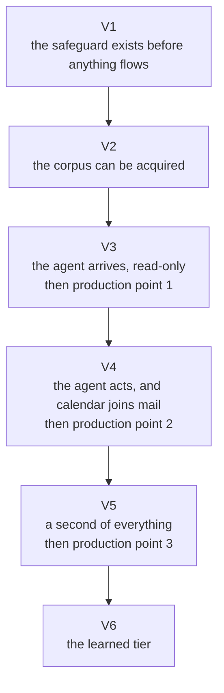
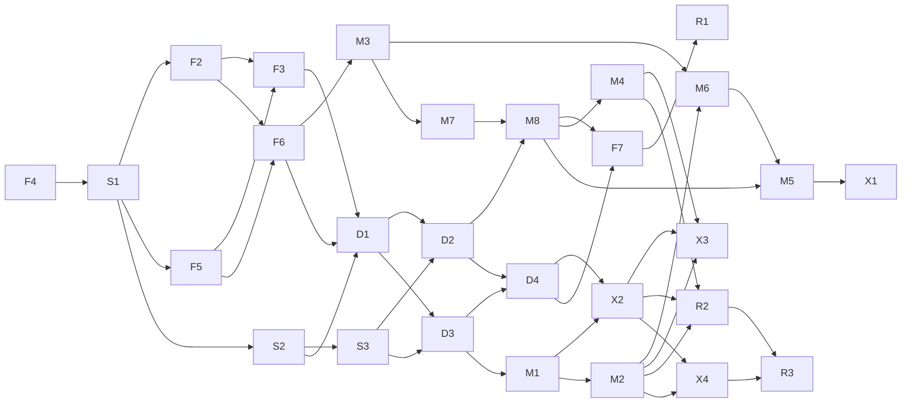

# Mediated Mailbox MCP — Roadmap

This file holds all the work in one place, meaning the delivery posture, the value path, the work
units with their finish lines, the production points, the dependencies, and the open decisions. It
is the one top-level document that changes as work progresses. [USE_CASES.md](./USE_CASES.md) and
[DESIGN.md](./DESIGN.md) are the stable contract it is measured against.

**Reading rules.** Status distinguishes *authored → merged → released → deployed-and-observed*, four
different states, never collapsed (`main` is not deployed state, in either direction). Claims are
**[measured]** (read from the repo, an API, or a record that records its own measurement) or
**[inferred]**.

**Finish lines.** Every unit names the state it must reach to be done, the lowest one that proves
what it delivers. *Tested* means implemented with the tests [TESTING.md](./TESTING.md) requires for
what the unit holds, its automatable verification rows proven, and their mutation demonstrations
recorded. *Image* means tested, and the deployable's image builds, which the images workflow proves.
*Packaged* means image, and the chart stands the deployables up on a bare kind cluster under the
chainsaw suite, against a release
([ADR-0052](./docs/adr/engineering/0052-kubernetes-deployment-helm-chart.md)). A unit that delivers
code inside a deployable or a library is proven at tested. A unit that delivers a deployable, by
creating or changing its composition root, is proven at image, the deployable's artifact
([ADR-0049](./docs/adr/engineering/0049-image-per-component-lockstep.md)). A unit that delivers the
chart's coverage is proven at packaged. Continuous integration builds every image and lints the
chart on the changes the workflow table of [CLAUDE.md](./CLAUDE.md#ci-workflows) names, so the upper
rungs add no check of their own beyond what they name.

**Production points.** Taking the system to production is outside this repository. A production
point is a point in the sequence where production first needs new supplied inputs or platform-side
steps, and there are three. Between points, new versions flow as ordinary version bumps with no
manual step. Each point names the units behind it, any precondition a build or a proof needs from
the real mailbox or the deployed system, the inputs the chart declares that arrive there
([ADR-0052](./docs/adr/engineering/0052-kubernetes-deployment-helm-chart.md)), the proofs, and the
learning that can happen only there. The work of standing the system up, a module in the operator's
repository homelab-ops-kubernetes-apps used from the repository homelab-ops-kubernetes-clusters, and
its tickets belong to those repositories. *The real mailbox* and *production* are terms of
[DESIGN.md's Glossary](./DESIGN.md#glossary).

**Acceptance.** Every control's proving injection lives in
[docs/VERIFICATIONS.md](./docs/VERIFICATIONS.md), keyed to the units and production points below. A
unit is not done while the rows keyed to it are unproven for the part they key to it. A row keyed to
a unit and a production point is proven at the unit for the mechanism and at the point for the rest.
An automatable control's acceptance also includes the mutation demonstration recorded in
[docs/MUTATIONS.md](./docs/MUTATIONS.md)
([ADR-0046](./docs/adr/engineering/0046-tests-are-evidence-once-seen-to-fail.md)). A drill or manual
exercise keyed to a production point is proven there, on its date.

**Identifiers.** Outcomes
([C1](./USE_CASES.md#c1--metadata-always-visible)–[C4](./USE_CASES.md#c4--the-sensitive-sender-list-keeps-pace),
[G1](./USE_CASES.md#g1--whole-mailbox-visibility)–[G4](./USE_CASES.md#g4--the-index-tracks-the-live-mailbox),
[P1](./USE_CASES.md#p1--one-contract)–[P3](./USE_CASES.md#p3--multi-account),
[A1](./USE_CASES.md#a1--asymmetric-mutation)–[A4](./USE_CASES.md#a4--released-bodies-are-clean-markdown-that-cannot-do-anything),
[O1](./USE_CASES.md#o1--rate-limited-politely)–[O6](./USE_CASES.md#o6--deployable)) are defined in
[USE_CASES.md](./USE_CASES.md). Work units (S·F·D·M·X·R + number), value increments
([V1](#v1--the-safeguard-exists-before-anything-flows)–[V6](#v6--the-learned-tier)) and production
points (1 to 3) are defined here. A retired unit identifier is never reused, and F1 and H1 are
retired. Decisions are cited by number, each linked to its record, and indexed in the
[decision-record index](./docs/adr/README.md). Every reference in prose links to the section
defining it. Table cells and dependency edges within this document may use bare identifiers.

**How this document relates to tickets.** How a ticket is cut and when it is done are
[CLAUDE.md](./CLAUDE.md#repository-process)'s. Every ticket names the one unit it serves and is a
sub-issue of [#118](https://github.com/ppat/mediated-mailbox-mcp/issues/118), which lists the
tickets by unit. The **Position** line below is re-dated whenever the checklists are reconciled
against the tickets, so staleness is detectable instead of silent.

**Position: 2026-10-03.**

## Delivery posture

Four commitments govern how every unit is scoped and sequenced. They exist to pre-empt a known
failure mode, an implementation effort that tries to account for every minute thing before shipping
and takes forever to put value in front of its user.

1. **Deliver value faster.** Each increment on the value path is cut at the smallest shape that
   ships real value, not at capability-complete.
2. **Learn from the real mailbox, and iterate on what it teaches.** First passes are deliberately
   minimal, and what running against the real mailbox teaches drives the next pass. Discoveries that
   do not block the value path become tickets, not scope.
3. **Harden and tighten later, once real behavior exists.** The learned detection tier is built
   against observed behavior rather than guesses, which is also what makes it cheap. A dashboard on
   a metric that exists is a configuration change ([O2](./USE_CASES.md#o2--observable)), the
   collection, shipping and retention of what the application emits and alerting based on logs are
   the platform's ([ADR-0051](./docs/adr/engineering/0051-environment-contract.md),
   [ADR-0028](./docs/adr/operability/0028-trust-anchor-hardening.md)), admission policy is the
   cluster's ([ADR-0052](./docs/adr/engineering/0052-kubernetes-deployment-helm-chart.md)), and
   backups are the deployment's ([ADR-0028](./docs/adr/operability/0028-trust-anchor-hardening.md)),
   so none of them is a unit here. Every condition a record names is raised by the unit that owns
   it.
4. **Do no more per unit than what proves it.** Every unit stops at the lowest finish line that
   proves what it delivers.

Four things are **not** deferrable under this posture. The membership test is that *deferral is
irreversible, or the failure it permits is silent*.

- **The fail-closed safeguard machinery before any body flows**
  ([V1](#v1--the-safeguard-exists-before-anything-flows) precedes everything). A gate bug fails
  catastrophically and silently. It cannot be "learned from" on the real mailbox because nothing
  visibly breaks when it leaks.
- **The rate hard cap before the first corpus-scale run against the real mailbox**, which is
  [production point 1](#production-point-1--the-read-path). [F3](#delivered-mapped-to-outcomes) also precedes
  [D1](#delivered-mapped-to-outcomes) as a build dependency, so backfill spends from the budget from its
  first page. Collectively overrunning the provider's budget risks a provider-side account
  restriction on the operator's personal mailbox, which is not recoverable by iteration.
- **Audit and measurement emission riding as acceptance criteria on the units being built anyway**
  (gate decisions, masking events, audit rows, rate gauges). An uninstrumented window is gone
  forever, and the design refuses unmeasured accepted risks.
- **Every production touch batched into one of the three [production points](#production-points)**,
  with every manual step and every proof that needs the real mailbox or the deployed system. A
  manual step performed outside a point cannot be gathered into one afterwards, and the spread it
  leaves is the failure the points exist to prevent.

The same posture bounds quality scope in the other direction. First passes of detection rules, gate
predicates and heuristics are expected to be tuned from observed traffic via the review loops, not
perfected up front.

## Where things stand, in one table

| Layer | State |
| --- | --- |
| Documents (design, outcomes, decisions, this roadmap, verifications, mutations) | Authored **[measured]** |
| Code | F4's layout and tooling, merged from pull requests [#60](https://github.com/ppat/mediated-mailbox-mcp/pull/60), [#131](https://github.com/ppat/mediated-mailbox-mcp/pull/131), [#132](https://github.com/ppat/mediated-mailbox-mcp/pull/132), [#134](https://github.com/ppat/mediated-mailbox-mcp/pull/134), [#137](https://github.com/ppat/mediated-mailbox-mcp/pull/137), [#138](https://github.com/ppat/mediated-mailbox-mcp/pull/138), [#149](https://github.com/ppat/mediated-mailbox-mcp/pull/149), [#189](https://github.com/ppat/mediated-mailbox-mcp/pull/189), [#190](https://github.com/ppat/mediated-mailbox-mcp/pull/190), [#199](https://github.com/ppat/mediated-mailbox-mcp/pull/199) and [#198](https://github.com/ppat/mediated-mailbox-mcp/pull/198), and S1's marker text, synthetic fixtures, sensitivity types, property-testing harness, policy snapshot, sender classifier, Redaction Gate and Mutation Authorizer, merged from pull requests [#141](https://github.com/ppat/mediated-mailbox-mcp/pull/141), [#142](https://github.com/ppat/mediated-mailbox-mcp/pull/142), [#143](https://github.com/ppat/mediated-mailbox-mcp/pull/143), [#144](https://github.com/ppat/mediated-mailbox-mcp/pull/144), [#145](https://github.com/ppat/mediated-mailbox-mcp/pull/145) and [#150](https://github.com/ppat/mediated-mailbox-mcp/pull/150), S2's content scanner and subject masking, merged from pull request [#151](https://github.com/ppat/mediated-mailbox-mcp/pull/151), S3's body sanitization and serve-time pattern check, merged from pull request [#152](https://github.com/ppat/mediated-mailbox-mcp/pull/152), F2's schema, migration chain, runtime roles and transaction helper, merged from pull request [#153](https://github.com/ppat/mediated-mailbox-mcp/pull/153), F5's canonical model, Provider Port, provider fake and contract suite, merged from pull request [#154](https://github.com/ppat/mediated-mailbox-mcp/pull/154), F5's Gmail OAuth, mounted credentials and rotation write-back, merged from pull request [#155](https://github.com/ppat/mediated-mailbox-mcp/pull/155), F3's rate controller rules, merged from pull request [#156](https://github.com/ppat/mediated-mailbox-mcp/pull/156), F3's leases, Gmail cost profile, metrics and alerting rules, merged from pull request [#157](https://github.com/ppat/mediated-mailbox-mcp/pull/157), F5's Gmail adapter and its contract run against real Gmail, merged from pull request [#158](https://github.com/ppat/mediated-mailbox-mcp/pull/158), D1's policy loader, merged from pull request [#160](https://github.com/ppat/mediated-mailbox-mcp/pull/160), and F3's runaway rule for every provider and its tunable rate target, merged from pull request [#161](https://github.com/ppat/mediated-mailbox-mcp/pull/161), M3's golden-file helper, merged from pull request [#162](https://github.com/ppat/mediated-mailbox-mcp/pull/162), D1's configuration library with the `go vet` analyser against reading the environment outside a composition root and backfill's database connection taken from it, merged from pull request [#177](https://github.com/ppat/mediated-mailbox-mcp/pull/177), F6's accounts, OAuth clients and sealed credentials in the database, with the `credential/` and `accountload/` libraries and the Gmail adapter taking its credential from what a deployable supplies, merged from pull request [#178](https://github.com/ppat/mediated-mailbox-mcp/pull/178), D3's operation registry, its two roots, the bearer check, TLS and the readiness state, merged from pull request [#171](https://github.com/ppat/mediated-mailbox-mcp/pull/171), and D1's reading of backfill's accounts and credentials from the database, with the database connection library `dbconnect/`, the credential section in `credential/core`, the `txhelper` analyser, the grant rule of ADR-0075's three lines with the data-access layout ADR-0066 derives from it, and the release job attaching signed key-generation binaries, merged from pull request [#181](https://github.com/ppat/mediated-mailbox-mcp/pull/181), and M3's UI server, its dataset registry and endpoint, the contract pipeline, the content security policy, the reads more than one screen makes and the server half of the event stream, merged from pull request [#182](https://github.com/ppat/mediated-mailbox-mcp/pull/182), with its route check, import list and sqlfluff configuration tightened by pull request [#193](https://github.com/ppat/mediated-mailbox-mcp/pull/193), and D3's read operations, identifier listings, system status and UTC timestamps, with the mediator's configuration, account snapshot reload and rate-state series, merged from pull request [#186](https://github.com/ppat/mediated-mailbox-mcp/pull/186), and M3's browser app shell, with the URL grammar and routing, the data cache, the global chrome, the lens shell at levels 0 and 3, the region patterns, the keyboard map, both palettes with the vendored fonts, and the stream client with its live indicator, with the mutation runner running browser tests under `bun test`, merged from pull request [#195](https://github.com/ppat/mediated-mailbox-mcp/pull/195), and D1's pass 1 over the full history with its per-page checkpoint, the run record, the scanner's section of the configuration, each account's lowered rate target handed to the rate limiter, the crash harness and the operation sampler, merged from pull request [#196](https://github.com/ppat/mediated-mailbox-mcp/pull/196), and M3's system screen, merged from pull request [#204](https://github.com/ppat/mediated-mailbox-mcp/pull/204), and M3's reads for the jobs and run screens, the `runs` and `failures` datasets with the dataset endpoint's levels 1 and 2, the `failures` row detail and the run summary endpoint, merged from pull request [#205](https://github.com/ppat/mediated-mailbox-mcp/pull/205), and F4's dedicated CI workflow proving every mutation patch still applies, merged from pull request [#211](https://github.com/ppat/mediated-mailbox-mcp/pull/211), and M3's jobs and run screens, with the message row, the page row, the bars, the run timeline, the lens shell's levels 1 and 2 with the group-by control, the Jobs item in the navigation with its running mark, the system screen's links to Jobs, the partial-index banner's link to Jobs, and the progress bars of the backfill card and the rate budget, merged from pull request [#208](https://github.com/ppat/mediated-mailbox-mcp/pull/208), and D1's record of the policy rule that set each message's sender class apart from its content rules, which a failure's panel shows, merged from pull request [#221](https://github.com/ppat/mediated-mailbox-mcp/pull/221), and D1's enumeration total on the Provider Port, reported by the provider fake when configured to and by the Gmail adapter on every page, with pass 1's checkpoint carrying the pages it implies, merged from pull request [#222](https://github.com/ppat/mediated-mailbox-mcp/pull/222), and D3's recording of the last provider authentication outcome, with the Gmail token source reporting its latest attempt and backfill recording it, merged from pull request [#227](https://github.com/ppat/mediated-mailbox-mcp/pull/227), and the Gmail adapter's port error for a call that could not obtain an access token, a refused credential only for the token endpoint's refusal, merged from pull request [#232](https://github.com/ppat/mediated-mailbox-mcp/pull/232), and M3's home screen, with the attention endpoint and its backlog, masking, body-serves and sync-gap rules, the candidates' recorded signals typed, and one stream connection per account shared by a tab's live surfaces, merged from pull request [#230](https://github.com/ppat/mediated-mailbox-mcp/pull/230), and D1's re-read of a refused credential, with backfill reading a credential the provider refuses again from the account's row before it reports the refusal, merged from pull request [#233](https://github.com/ppat/mediated-mailbox-mcp/pull/233), M3's browser tests settling on the reads and effects pending, with the recorded answers read from memory, merged from pull request [#236](https://github.com/ppat/mediated-mailbox-mcp/pull/236), and D3's body release through the gate, the conversion and the release step, with the policy loaded for each body request, message text with no HTML form released as a code block, and the failure contract naming each failure's origin, merged from pull request [#235](https://github.com/ppat/mediated-mailbox-mcp/pull/235), and D3's start-up tests of the mediator holding the listeners they hand its start, with the composition root opening them before it serves, merged from pull request [#240](https://github.com/ppat/mediated-mailbox-mcp/pull/240), and F4's mutation runner running `go test` with `-trimpath`, so a demonstration's copies reuse the build cache, merged from pull request [#243](https://github.com/ppat/mediated-mailbox-mcp/pull/243), and D4's delta sync, with the decisions it shares with backfill moved to `core/index`, the shared `lease.Call`, the re-seal of an OAuth client's secret, the scan series and the cursor gap rule, merged from pull request [#239](https://github.com/ppat/mediated-mailbox-mcp/pull/239), and F4's mutation runner giving the go commands a demonstration's tests start `-trimpath` too, merged from pull request [#251](https://github.com/ppat/mediated-mailbox-mcp/pull/251), and D3's index reads, a search, a count that groups and the sender listing, selecting by an index query of the client surface's own and classifying senders under the policy in force, with the rebuild of the sender statistics and the counts of prior scan hits moved to a subsection the mediator does not admit, merged from pull request [#246](https://github.com/ppat/mediated-mailbox-mcp/pull/246), and M3's partial-index banner telling a backfill pass 1 a change of scanner re-opened apart from a first one, with the system endpoint naming when pass 1 last succeeded and no count reading as a count so far while a re-opened pass 1 runs, merged from pull request [#253](https://github.com/ppat/mediated-mailbox-mcp/pull/253), and D1's backfill handing each account's credential over with the adoption stamp of the credential its source holds, merged from pull request [#254](https://github.com/ppat/mediated-mailbox-mcp/pull/254), and M7's OAuth client setup and account setup, the request token, the consent package and the UI's client-secret part, merged from pull request [#256](https://github.com/ppat/mediated-mailbox-mcp/pull/256), and M8's policy management, the policy tables keyed by scope with the policy history, the base-policy transaction, the policy screens, import and export, and the restriction of the stored classes a rule added since restricts in backfill's second pass and delta sync, merged from pull request [#258](https://github.com/ppat/mediated-mailbox-mcp/pull/258), none of it yet released. Backfill's composition root reads its database, credential and scanner sections and its probe address through the configuration library and validates them, loads its keyring and refuses to start when the public key matches none of its private keys, builds its connection pool, takes its accounts, the OAuth clients and the opened credentials from the database through `accountload/` once at the start of a run, loads the policy of every listed account, and builds a Gmail token source for each connected account it can serve. It runs pass 1 over each of them a page at a time, spending under the account's target, and hands the account's current refresh token back after every page with the adoption stamp of the credential its source was built over, so a rotated one is written to the account's state row unless the loader has since adopted a value someone else stored there, and records the account's latest provider authentication attempt there after every page too. A call the provider refuses as a refused credential has the account's credential read again from its row, and when the row holds another, the account's token source and port are built again over it and the call made once more, while a row holding the refused credential, or none, has the refusal reported. Once an account's pass 1 has ended it runs pass 2 over the account the same way, running the delisting transition and then the restriction of the stored classes a rule added since restricts, deciding each waiting message through the scan gate, fetching and scanning in memory the bodies the gate selects in the batch class, and setting the account's scan backlog series after every page, merged from pull request [#214](https://github.com/ppat/mediated-mailbox-mcp/pull/214). Each pass runs again when the scanner backfill runs with differs from the one the stored subjects or verdicts were decided under, a run returning the verdicts made under another scanner to pending before the first pass, the first pass masking those subjects again as it enumerates and the second returning the skips decided without their subject's signal to pending before its first page, merged from pull request [#223](https://github.com/ppat/mediated-mailbox-mcp/pull/223). Every run also decides each stored gate skip again before the first pass, under the thresholds it holds, and returns to pending each one the gate no longer decides as the same skip, reopening the second pass, merged from pull request [#231](https://github.com/ppat/mediated-mailbox-mcp/pull/231). It serves the health probe and the metrics endpoint while it runs, and logs as JSON. The mediator serves both roots, whose registry holds the reads of the index and of the recorded state, the search, counts and sender statistics of the index, and the body operation, which releases a body the gate lets through. It reads its configuration through the library, takes the accounts it serves from the account snapshot at start and on its reload interval, loads their policy at every reload and before every body request, and carries the rate-state series of each account it serves through the Gmail adapter on its metrics endpoint. The UI's composition root reads its configuration through the library, loads the key pair and logs the key identifier it seals to, builds the sender classifier's lookups, and serves its read API, the setups' requests, the policy writes, the import and export of the policy and the browser app, whose chrome frames the home screen, the system screen, the jobs screen, the run screen, the installation screens, account settings, the policy screens and the base policy screens. The home screen's running-work strip, the jobs screen and the run screen follow the event stream as live surfaces, and the chrome's partial-index banner follows it while the banner shows, every surface on a tab sharing one connection per account. Of the keys [docs/UI.md section 18.1](./docs/UI.md#181-the-configuration-the-ui-declares) declares, it reads `database`, `listen`, `probe_listen`, `tls_cert`, `tls_key`, `insecure_http`, `sync_interval`, `heuristics_interval`, `stream_interval`, `default_theme`, `stream_reconnect_max`, `stream_poll_interval`, `attention_backlog_share`, `attention_mask_count`, `attention_serve_factor`, `attention_gap_days`, `seal_public_key_file`, `private_key_files`, `token_key_file`, `consent_redirect`, `identity_header` and `operator_name`, which defaults to `operator`, with `default_theme`, `stream_reconnect_max`, `stream_poll_interval` and `consent_redirect` rendered into the entry document for the browser. Delta sync's composition root reads its configuration through the library, refuses to start when the public key matches none of its private keys, and runs until stopped, serving the health probe and the metrics endpoint between ticks as during them. Each tick takes the account snapshot again, re-seals what it opened with an old key and sets the scan series, applies every change set since each account's cursor, recovers a cursor gap in a run of its own, and once an account's backfill second pass has ended runs the delisting transition and the restriction of the stored classes, then decides and scans a bounded number of the messages waiting for a scan. The composition roots of the reorg workload and the Heuristics Job are still empty, so neither reads its configuration through the library or runs any of it **[measured]** |
| Infrastructure (database, secrets, deployments) | None provisioned for this system |
| Verifications | Every row keyed to F4 is proven, by pull requests #60, [#131](https://github.com/ppat/mediated-mailbox-mcp/pull/131) and [#137](https://github.com/ppat/mediated-mailbox-mcp/pull/137), and the rows of the `go vet` analysers' rules against package-level state in a pure core by pull request [#149](https://github.com/ppat/mediated-mailbox-mcp/pull/149), the row for a `depguard` list that is not strict or carries a `deny` key by pull request [#189](https://github.com/ppat/mediated-mailbox-mcp/pull/189), and the row for importing, from code that ships, a package `./...` does not list by pull request [#190](https://github.com/ppat/mediated-mailbox-mcp/pull/190), and the rows for a file that ships whose build constraint keeps it from the gating lint and for a `go vet` step whose tags differ from the lint configuration's by pull request [#198](https://github.com/ppat/mediated-mailbox-mcp/pull/198), and the row for a mutation patch's diff context going stale by pull request [#211](https://github.com/ppat/mediated-mailbox-mcp/pull/211). The S1 rows of the sensitivity types and the property-testing harness are proven by pull request [#142](https://github.com/ppat/mediated-mailbox-mcp/pull/142), those of the policy snapshot by pull request [#143](https://github.com/ppat/mediated-mailbox-mcp/pull/143), those of the sender classifier by pull request [#144](https://github.com/ppat/mediated-mailbox-mcp/pull/144), those of the Redaction Gate by pull request [#145](https://github.com/ppat/mediated-mailbox-mcp/pull/145), and the rows on verdict types for the Mutation Authorizer's verdict by pull request [#150](https://github.com/ppat/mediated-mailbox-mcp/pull/150). The S2 rows, S2's part of the search of scanner output included, are proven by pull request [#151](https://github.com/ppat/mediated-mailbox-mcp/pull/151), the S3 rows and S3's parts of the rows it shares with D3 by pull request [#152](https://github.com/ppat/mediated-mailbox-mcp/pull/152), the F2 rows by pull request [#153](https://github.com/ppat/mediated-mailbox-mcp/pull/153), the F5 row for the body fetch being the port's one body path by pull request [#154](https://github.com/ppat/mediated-mailbox-mcp/pull/154), the F5 rows for the grant's scope and mounted credentials, and F5's half of the rotation row, by pull request [#155](https://github.com/ppat/mediated-mailbox-mcp/pull/155), the F3 rows by pull request [#157](https://github.com/ppat/mediated-mailbox-mcp/pull/157), and the rest of the F5 rows by pull request [#158](https://github.com/ppat/mediated-mailbox-mcp/pull/158), two of them by hand against real Gmail. D1's rows for the policy loader are proven by pull request [#160](https://github.com/ppat/mediated-mailbox-mcp/pull/160), F3's rows for the runaway rule's emitted hard cap and the lowered target by pull request [#161](https://github.com/ppat/mediated-mailbox-mcp/pull/161), and D1's rows for layering configuration, logging the effective configuration and telling accounts from flags, and the parts of its rows for configuration mistakes, the environment and the database's password variables, pinned configuration fields and a section's revision that the configuration library and backfill's connection carry, by pull request [#177](https://github.com/ppat/mediated-mailbox-mcp/pull/177). F6's rows, and F6's parts of the rows it shares with D1, D3, D4, M2, M3, M7, R1 and production point 1, are proven by pull request [#178](https://github.com/ppat/mediated-mailbox-mcp/pull/178), which also extends the F2 row for isolation across every account-keyed table to `account_state`. D1's part of the rotation row, D1's parts of the rows for a failed write-back, for a credential supplied outside the account's state row, for a public key matching none of the private keys, for loading the account snapshot at the start of a run, for the credentials a token source is built from, for the credential section's validation and fields and for an argument that is not a flag, its row for the data-access library's layout, and the part of the row for calling a data-access function in a transaction that did not set the account that the `txhelper` analyser carries, are proven by pull request [#181](https://github.com/ppat/mediated-mailbox-mcp/pull/181), which also lands the key-generation release step whose run against a published release waits on R1. D3's rows for the operation registry, the MCP root's tools-only surface, the refusal of `MCPGODEBUG`, readiness, the account every operation names, the bound on a call's argument keys, the method and annotations derived from each effect class, the argument object both roots hand the service layer, the uncacheable responses with `HEAD` refused, and the registry's refusals of approval and of header bindings, and D3's parts of the rows for the approval transition and for a database password in the environment, are proven by pull request [#171](https://github.com/ppat/mediated-mailbox-mcp/pull/171). M3's rows for the registry's refusal, the content security policy's header and static scans, the contract drift, the statement-set check, the stream's whole-state events and the refusal of plain HTTP outside the dev loop, and M3's parts of the rows for per-account reads, the recorded fixtures' diff, the UI's read of account state, a database password in the environment and the pinned configuration type, are proven by pull request [#182](https://github.com/ppat/mediated-mailbox-mcp/pull/182). M3's part of the content security policy's static-scan row for the first built bundle of the browser app and for a font inlined as a `data:` URI is proven by pull request [#195](https://github.com/ppat/mediated-mailbox-mcp/pull/195), which also lands the page of the policy's drill, deferred to production point 1. That pull request also proves M3's part of the inert-rendering row for the lens shell's rows table, and the standing disposition for ADR-0064's shim fidelity by its drill in a real browser. M3's parts of the rows for the registry's refusal, per-account reads and the statement-set check, for the `runs` and `failures` datasets, the `failures` row-detail route and the run summary route, are proven by pull request [#205](https://github.com/ppat/mediated-mailbox-mcp/pull/205), which also proves the new row that a group's filter word selects the rows the group counts. Pull request [#204](https://github.com/ppat/mediated-mailbox-mcp/pull/204) proves M3's part of the inert-rendering row for the system screen. M3's parts of the inert-rendering row for the jobs and run screens, the message row and the page row, and of the render-counter row for the jobs and run screens, are proven by pull request [#208](https://github.com/ppat/mediated-mailbox-mcp/pull/208). Pull request [#221](https://github.com/ppat/mediated-mailbox-mcp/pull/221) proves the inert-rendering row for the rule that set a failure's message's class. Pull request [#193](https://github.com/ppat/mediated-mailbox-mcp/pull/193) extends the proof of the registry's refusal to a route registered outside `/api` and to one registered on the probes listener, and pull request [#199](https://github.com/ppat/mediated-mailbox-mcp/pull/199) to a route registered in the UI other than through its recording mux by the calls the `go vet` routes analyser refuses. D3's rows for rejecting a non-UTC timestamp, serving timestamps in UTC and the system status carrying operational state only are proven by pull request [#186](https://github.com/ppat/mediated-mailbox-mcp/pull/186), which also adds and proves D3's rows for the redaction matrix on served metadata, cursors and paging, the arguments a served operation takes, the read operations reading the serving state, the rate-state series on the mediator's metrics endpoint and the mediator's configuration refusals. It proves D3's parts of the rows for a public key matching none of the private keys and for reloading the account snapshot, for the accounts the mediator serves, and the mediator's parts of the rows for the argument object over every served operation, pinned configuration fields, the logged effective configuration and the reload-failure series its metrics endpoint serves. D1's rows for killing the backfill pod mid-run, for the mechanism, for a page's commit being one transaction and a page taken twice counting nothing twice, for the run record and the completion flag, and for masking, classification and the unclassified-sender volume at ingest, and the rows for the crash harness and the operation sampler, are proven by pull request [#196](https://github.com/ppat/mediated-mailbox-mcp/pull/196). It proves D1's parts of the rows for the rotation hand-over and a failed write-back, now after every page, for a lowered target read from the account's state row, for the reload-failure series on backfill's metrics endpoint, for the scanner's section's validation, pinned fields and revision, and for an empty revision refused by the scanner. Pull request [#214](https://github.com/ppat/mediated-mailbox-mcp/pull/214) proves D2's parts of the rows for the leak search over persisted rows and the workload's logs, for a restricted sender's body never asked for, for the delisting transition and for killing the backfill pod mid-run, and the rows for the scan gate over stored messages and the second pass's run record, a sender's first hit reaching its next message, both parts of a body scanned and a body the conversion refuses. Pull request [#222](https://github.com/ppat/mediated-mailbox-mcp/pull/222) proves D1's row for the contract suite's check of an enumeration total. Pull request [#223](https://github.com/ppat/mediated-mailbox-mcp/pull/223) proves D2's row for a change of scanner, and D2's parts of the rows for killing the backfill pod mid-run and for the leak search over persisted rows, for a change of scanner. Pull request [#227](https://github.com/ppat/mediated-mailbox-mcp/pull/227) adds and proves D3's rows for recording only the latest authentication attempt, for the outcome the Gmail adapter reports, part of it by hand against real Gmail, and backfill's part of the row for recording the attempt at the end of each unit of work. Pull request [#232](https://github.com/ppat/mediated-mailbox-mcp/pull/232) adds and proves F5's row for a token request the provider refuses surfacing as a refused credential and one that fails any other way before the call is cancelled or its deadline passes as a provider failure, part of it by hand against real Gmail. Pull request [#230](https://github.com/ppat/mediated-mailbox-mcp/pull/230) proves M3's parts of the rows for driving body fetches far above a plausible rate and for invalidating the sync cursor, the inert-rendering row and the render-counter row for the home screen, the per-account row for the attention route, and the row for a screen following its route and answers for the strip and the shared stream connection. Pull request [#231](https://github.com/ppat/mediated-mailbox-mcp/pull/231) proves D2's row for a change of the scan gate's thresholds. Pull request [#233](https://github.com/ppat/mediated-mailbox-mcp/pull/233) proves backfill's part of the row for picking up a replaced credential, a refused credential read again from the account's row and a replaced one used for the call that was refused. Pull request [#235](https://github.com/ppat/mediated-mailbox-mcp/pull/235) adds and proves D3's rows for the policy load each body request waits for and the one every reload runs, the snippet and filenames following the body, the audit of every serve and denial, message text with no HTML form, the serve-time check over everything released and over every message's filenames, the body counts, both roots' shapes, the interactive lease and the provider timeout, and proves D3's parts of the rows for a just-listed domain, the provider never contacted on a denial, the configuration surface, raw HTML served with no fetch at the network layer, a gate-skipped login link, an ex-restricted message pending its scan, each origin of a failure, the rotation hand-over and its failed write-back, the attempt recorded, a credential supplied outside the state row, the swapped client, the refused credential read again and the write-back that loses to a re-authorization. Pull request [#239](https://github.com/ppat/mediated-mailbox-mcp/pull/239) proves D4's rows and D4's parts of the rows it shares, among them the leak search over delta sync's logs, invalidating the sync cursor, the re-seal of a client secret with its series and how they reach the scrape, the snapshot load within each tick and the re-read of a refused credential, the credentials a token source is built from, the hand-over and the recorded attempt, the unclassified-sender volume, and the rows it adds for a tick's change application, its idempotency, an account's first reconciliation, a gap recovery's removal of what the provider no longer holds, a tick or recovery left running by a stopped process, scanning once backfill's second pass has ended, the gate thresholds and scanner it shares with backfill, and the sync class with the series between ticks, the adapter's request cost and hard cap among them. Pull request [#246](https://github.com/ppat/mediated-mailbox-mcp/pull/246) adds and proves D3's rows for a message whose body is denied staying in every count, group and search result, enumeration and counting reaching the whole corpus, and the sender class the index reads use being the policy in force's, and proves D3's parts of the rows for UTC input and output, the cursor and the argument names over the index reads. The rows for talking the live agent into requesting a restricted body and for sending it a prompt injection are proven by manual exercise on 2026-10-02, against this pull request's exercise harness, with every row keyed to D3 proven for D3's part. Pull request [#254](https://github.com/ppat/mediated-mailbox-mcp/pull/254) proves D1's part of the row for a write-back based on a credential the operator has since replaced, for backfill's hand-over. Pull request [#256](https://github.com/ppat/mediated-mailbox-mcp/pull/256) proves M7's rows and M7's parts of the rows it shares, and adds and proves the rows for a consent attempt's binding to its session, a client changed while an attempt runs, the UI's open of a credential refused and a client's secret reaching no answer, cookie or log line, with the check of OAuth client setup against the live Google Cloud console a manual exercise at production point 1. Pull request [#258](https://github.com/ppat/mediated-mailbox-mcp/pull/258) proves M8's rows and M8's parts of the rows it shares, and adds and proves the rows for the base-policy transaction, an added rule reaching the stored classes and a base edit landing mid-reload. Every other row is pending or parked (see [docs/VERIFICATIONS.md](./docs/VERIFICATIONS.md)) **[measured]** |
| Mutations | The controls of the `go vet` analysers' rules against package-level state in a pure core are demonstrated by pull request [#149](https://github.com/ppat/mediated-mailbox-mcp/pull/149), the ban-proof script's refusal of a `depguard` list that is not strict or carries a `deny` key by pull request [#189](https://github.com/ppat/mediated-mailbox-mcp/pull/189), the ban-proof script's refusal of a package the build of `./...` reaches that `./...` does not list by pull request [#190](https://github.com/ppat/mediated-mailbox-mcp/pull/190), the `go vet` routes analyser's refusal of a route the UI registers other than through its recording mux by pull request [#199](https://github.com/ppat/mediated-mailbox-mcp/pull/199), and the ban-proof script's refusals of a file a build that ships compiles that the gating lint does not read and of a `go vet` step whose tags differ from the lint configuration's by pull request [#198](https://github.com/ppat/mediated-mailbox-mcp/pull/198), which reproduces the row of pull request #190 with three of its patches regenerated. The controls of S1's sensitivity types and property-testing harness are demonstrated, by pull request [#142](https://github.com/ppat/mediated-mailbox-mcp/pull/142), those of the policy snapshot by pull request [#143](https://github.com/ppat/mediated-mailbox-mcp/pull/143), those of the sender classifier by pull request [#144](https://github.com/ppat/mediated-mailbox-mcp/pull/144), those of the Redaction Gate by pull request [#145](https://github.com/ppat/mediated-mailbox-mcp/pull/145), and those of the Mutation Authorizer by pull request [#150](https://github.com/ppat/mediated-mailbox-mcp/pull/150). The controls of S2's content scanner and subject masking are demonstrated by pull request [#151](https://github.com/ppat/mediated-mailbox-mcp/pull/151), those of S3's conversion, release step and the scanner's pattern entry point by pull request [#152](https://github.com/ppat/mediated-mailbox-mcp/pull/152), those of F2's data layer by pull request [#153](https://github.com/ppat/mediated-mailbox-mcp/pull/153), those of F5's canonical model, provider fake and contract suite by pull request [#154](https://github.com/ppat/mediated-mailbox-mcp/pull/154), those of F5's Gmail OAuth and credential handling by pull request [#155](https://github.com/ppat/mediated-mailbox-mcp/pull/155), those of F3's rate controller rules by pull request [#156](https://github.com/ppat/mediated-mailbox-mcp/pull/156), those of F3's leases, alerting rules and the grant check's planning of a shared library's statements by pull request [#157](https://github.com/ppat/mediated-mailbox-mcp/pull/157), those of F5's Gmail adapter, its contract run against real Gmail and the command that run requires by pull request [#158](https://github.com/ppat/mediated-mailbox-mcp/pull/158), those of D1's policy loader by pull request [#160](https://github.com/ppat/mediated-mailbox-mcp/pull/160), and those of F3's runaway rule for every provider and its lowered target, with the rate limiter's rows reproduced, by pull request [#161](https://github.com/ppat/mediated-mailbox-mcp/pull/161), those of M3's golden-file helper by pull request [#162](https://github.com/ppat/mediated-mailbox-mcp/pull/162), those of D1's configuration library, the analyser against reading the environment and backfill's database connection by pull request [#177](https://github.com/ppat/mediated-mailbox-mcp/pull/177), those of F6's sealing, key handling, account snapshot, compare-and-set write-back, re-seal and the values of its scan, account listing, the reads of `oauth_clients` and `account_state`, the Gmail token source's rotation, and the `provider/gmail` package's refusal to read a credential from the environment, with F2's row-level security row reproduced for `account_state`, by pull request [#178](https://github.com/ppat/mediated-mailbox-mcp/pull/178), and those of D3's registry, derivation of each operation's method and annotations, argument round trip, roots, account check, bound on argument keys, bearer check, TLS, uncacheable responses, readiness, refusals of approval, of header bindings, of `MCPGODEBUG` and of a database password in the environment, failure content, policy loading and approval grants by pull request [#171](https://github.com/ppat/mediated-mailbox-mcp/pull/171), and those of backfill's account snapshot, the accounts a run serves, keyring, token-source credentials and hand-over, the credential section, the `txhelper` analyser and the moved database connection by pull request [#181](https://github.com/ppat/mediated-mailbox-mcp/pull/181), which also repeats the demonstrations of the accounts listing policy with its patch regenerated and of the effective configuration logged at start, and those of M3's UI server, its registry, contract pipeline, content security policy, event stream and configuration, and of the golden-file helper's refusal of a `GoldenAt` path that is absolute or not clean, by pull request [#182](https://github.com/ppat/mediated-mailbox-mcp/pull/182), with the route check's row reproduced and two breaks added, one registering a route outside `/api` and one registering a route after the server stores its mux, the rows of the content security policy and of a path claimed twice reproduced, and the new controls that the probes listener serves only its three routes and that `go vet` refuses a copy of a recording mux demonstrated, by pull request [#193](https://github.com/ppat/mediated-mailbox-mcp/pull/193), the latter's patch regenerated in pull request [#207](https://github.com/ppat/mediated-mailbox-mcp/pull/207). Pull request #182 adds the `GoldenAt` tests to the golden-file helper's rows for a differing file, a missing one and `-update` off by default, and adds two breaks to the account state grants' row, the UI's read of its account's progress widened to the credential and narrowed below what its statement reads. It reproduces the golden-file helper's row for a name leaving `testdata/golden`. The controls of D3's redaction matrix on served metadata, UTC timestamps in and out, cursors and paging, system status, argument refusals, the arguments a served operation takes, the read operations' sources, the mediator's configuration refusals, account reload, reload schedule and rate-state series, and the policy loader's changing account set are new and demonstrated by pull request [#186](https://github.com/ppat/mediated-mailbox-mcp/pull/186). That pull request adds breaks for the mediator, and its tests, to the rows for a public key matching none of the private keys and for the pinned configuration type. It adds its new tests to the rows for the argument object both roots hand the service layer, the registry's operations served on both roots, an operation failing generation, the account check, the structured failure, the approval vocabulary and policy loading, the last with its breaks regenerated against the reworked composition root and a break added that registers the reload-failure series off the metrics endpoint. It replaces the mediator's three breaks of its refusal of a database password in the environment with two, one that skips the refusal and one that moves it after the configuration is read, since `dbconnect/` carries the rest, moves the break of a missing key pair from the TLS row to the configuration refusals' row, and retires the account check's break of the seam that served no account. It reproduces the rows of S3's serve-time pattern check, release step and delimiters, and of D3's method and annotations, bound on argument keys, tools-only MCP root, build-time refusals, uncacheable responses, `MCPGODEBUG` refusal, bearer check and readiness. Pull request [#195](https://github.com/ppat/mediated-mailbox-mcp/pull/195) adds a break to the content security policy scan's row, the scan passing a font inlined as a `data:` URI, and reproduces the row with its patches regenerated. It demonstrates the new control that message-derived text renders inert, the first demonstration run under `bun test`, and reproduces the UI's rows for the refusal of the database's password variables and the pinned configuration type with their patches regenerated. The controls of D1's pass 1, its resume from the last checkpointed page, a page's commit being one transaction, a page taken twice counting nothing twice, the run record, the completion flag, masking and classification at ingest, the unclassified-sender volume, the hand-over after every page, the probes and the reload-failure series, the scanner's section and its revision, each account's lowered target, and the crash harness and the operation sampler, are new and demonstrated by pull request [#196](https://github.com/ppat/mediated-mailbox-mcp/pull/196). That pull request reproduces the rows for a scanner that refuses to decide, whose refusal of an invalid configuration now covers an empty revision, and for the scan verdict that carries no text, since the revision became a string, and reproduces F3's rows for the hard cap the declared ceiling gives, convergence, the stored cut, the ask instant and the one-second window, whose patches it regenerates against the limiter's targets for each account. It regenerates backfill's composition-root patches against the root's rewrite and reproduces their rows, those of the pinned configuration type, the logged effective configuration, the validated database and credential sections, the connection settings, the public key matching a private key, the account snapshot and the accounts a run serves, and the token source's credentials. The end-of-run hand-over's row is retired, and its breaks now demonstrate the hand-over after every page. Pull request [#204](https://github.com/ppat/mediated-mailbox-mcp/pull/204) adds three breaks of the system screen to the inert-rendering row. Pull request [#205](https://github.com/ppat/mediated-mailbox-mcp/pull/205) adds breaks to the rows of the dataset endpoint's refusal, which now covers filter values, the word naming a value stored empty and the row detail's parameters, of its refusal before any statement runs, of the statement-set check, which now covers row identities and dimensions named as parameters, of per-account reads and of a path claimed twice, demonstrates the new control that a group's filter word selects the rows the group counts, and reproduces the UI's server rows with their patches regenerated. Pull request [#214](https://github.com/ppat/mediated-mailbox-mcp/pull/214) demonstrates the fourteen controls of D2's second pass and delisting transition, and demonstrates again the first pass's and the composition root's breaks whose code it changed. Pull request [#223](https://github.com/ppat/mediated-mailbox-mcp/pull/223) demonstrates the ten controls of D2's re-scan after a change of scanner, among them the return of stale verdicts to pending before the first pass and both halves of every staleness comparison, and reproduces the rows of the first and second passes, whose code and crash harnesses it changed, with the patches whose code it changed regenerated, and an example test added for a resumed run whose enumeration had ended, which the crash harness no longer reaches at the gating case count. It also reproduces the inert-rendering row and the row that a streamed event redraws a live surface's text without re-rendering a component, since it changed the run screen's wording of a gone item, and reproduces from a run over every patch of each control the rows of the pinned configuration type, the connection settings, the validated database and credential sections, the public key matching a private key, a page made durable twice counting nothing twice, the revision a verdict records and each account's lowered target. Pull request [#208](https://github.com/ppat/mediated-mailbox-mcp/pull/208) adds breaks to the inert-rendering row for the message row, the page row, the bars, the timeline's hovers, a failure's panel and its subject, and the applying and last-applied plans' titles on the jobs screen, with the rows table's three breaks and the system screen's three regenerated, adds breaks to the row that a group's filter word selects the rows the group counts for the bars and the group table, demonstrates the new controls that a streamed event redraws a live surface's text without re-rendering a component and that a screen's text, rows, cursor, focus, range fields and loading timers follow the route, answers, range and read in view, and reproduces the per-account row. Pull request [#221](https://github.com/ppat/mediated-mailbox-mcp/pull/221) adds the inert-rendering row's break for the rule that set a failure's message's class, with the row's other breaks reproduced, and demonstrates again the first pass's classification and unclassified-sender rows, whose code it changed. Pull request [#222](https://github.com/ppat/mediated-mailbox-mcp/pull/222) demonstrates the contract suite's check of an enumeration total, adds the profile read an enumeration page makes for its total as a break of Gmail's cost profile, and regenerates and demonstrates again the patches for an enumeration page past the hard cap, a page of threads holding two threads, an enumeration page logged whole and a page made durable keeping the token it was asked with, and demonstrates again, with the tests it changed, the rows for the body fetch being the port's one body path, for counting every Gmail request at its cost and for emitting the hard cap beside the count, and, with the tests it adds, the rows for the contract suite's promises of the port and for the first pass's completion flag, masking and classification, run record and page counted once. Pull request [#227](https://github.com/ppat/mediated-mailbox-mcp/pull/227) demonstrates the controls that the recorded authentication outcome is the latest attempt, that the Gmail token source reports a refusal, a failure and no attempt apart, and that backfill records the attempt at the end of every unit of work, and demonstrates again the rows of the token source's rotation and backfill's hand-over, with five of their patches regenerated, and of no credential read from the environment, with its six patches regenerated. Pull request [#232](https://github.com/ppat/mediated-mailbox-mcp/pull/232) demonstrates the control that a token request the provider refuses surfaces as a refused credential and one that fails any other way before the call is cancelled or its deadline passes as a provider failure, and demonstrates again, with the test it changed, the row for counting every Gmail request at its cost. Pull request [#230](https://github.com/ppat/mediated-mailbox-mcp/pull/230) demonstrates the body-serves rule and the sync-gap rule, adds breaks to the inert-rendering, render-counter, route-following and per-account rows for the home screen, its strip, the shared stream connection and the attention route, and demonstrates again those rows' browser breaks and the UI's configuration pinning, with the tests it changed. Pull request [#231](https://github.com/ppat/mediated-mailbox-mcp/pull/231) demonstrates the two controls of D2's re-decision of stored gate skips at every backfill run's start, and reproduces, with their patches regenerated, the rows for a reopened first pass leading to a second pass, for a stale verdict returning to pending, for a signalled skip returning to pending, for the second pass waiting for the first and for the mark that starts the second pass over, whose code it changed. Pull request [#233](https://github.com/ppat/mediated-mailbox-mcp/pull/233) demonstrates the control that a credential the provider refuses is read again from the account's row before the refusal is reported and a replaced one used for the call it refused, and demonstrates again the rows of backfill's snapshot load, hand-over and attempt recording, with eleven of their patches regenerated. Pull request [#235](https://github.com/ppat/mediated-mailbox-mcp/pull/235) demonstrates the controls of D3's body release and failure contract, and reproduces, with their patches regenerated, the rows for the release step, the failure classification, the mediator's reloads and its configuration, whose code it changed. Pull request [#240](https://github.com/ppat/mediated-mailbox-mcp/pull/240) closes the discovery [#238](https://github.com/ppat/mediated-mailbox-mcp/issues/238), so the mediator's start-up tests hold the listeners they hand the start instead of racing another process for a port they released, and demonstrates again the rows for the mediator's readiness, its scheduled reload, its TLS-only surface and its read operations' serving state, with the readiness row's start-marks-ready patch regenerated. Pull request [#239](https://github.com/ppat/mediated-mailbox-mcp/pull/239) demonstrates D4's controls, among them the gate thresholds and scanner delta sync shares with backfill, with a break on each side, and demonstrates again the rows of the decisions that moved from backfill to `core/index`, of the txhelper analyser's exemptions, of the grants on `oauth_clients`, of the unclassified-sender volume, of the credentials a token source is built from, of the contract suite's promises of the port, which gain the trash and spam, of backfill's composition root and of the account snapshot library, whose code it changed, with the patches the move left stale regenerated. Pull request [#246](https://github.com/ppat/mediated-mailbox-mcp/pull/246) demonstrates the controls of D3's index reads, the denied message kept in every result, the whole corpus reached and the sender class under the policy in force, adds the index reads' breaks to the rows for the cursor and the argument names, and demonstrates again the rows for UTC timestamps, the cursor and the argument names, whose tests or code it changed, and one break each of the rows for approval, a flagged message's prior hit, a verdict made under another scanner and a page made durable twice, whose patches it regenerated. Pull request [#254](https://github.com/ppat/mediated-mailbox-mcp/pull/254) closes the discovery [#250](https://github.com/ppat/mediated-mailbox-mcp/issues/250), demonstrating backfill's breaks of the control that discards a hand-over from before an adoption, and demonstrates again the rows of that control, of backfill's hand-over, of its recorded attempt and of its re-read of a refused credential, which gains a break handing the refused source over with the re-read's stamp, whose code it changed, with the patches the change left stale regenerated. Pull request [#256](https://github.com/ppat/mediated-mailbox-mcp/pull/256) demonstrates every control M7 delivered, and reproduces the demonstrations of the consent, the token source and the grants its move of Gmail's consent and its grants touched. Pull request [#258](https://github.com/ppat/mediated-mailbox-mcp/pull/258) demonstrates every control M8 delivered, and reproduces the demonstrations of the policy snapshot's validation, the sender classifier, the transaction helper's analyser, the policy loader, the delisting transition, delta sync's scanning, the row-level security, the consent redirect's check and the pinned configuration, whose code or tests it changed. See [docs/MUTATIONS.md](./docs/MUTATIONS.md) **[measured]** |
| **The delivery gap** | Every unit except F4, S1, S2, S3, F2, F5, F3, F6, D1, D2, D3, D4, M7 and M8, which are delivered. M3 has started, with the golden-file helper, the UI's server, the browser app's shell, the system screen, the jobs and run screens with their reads, and the home screen. No other unit has started |

## Delivered, mapped to outcomes

- [x] **F4 — Layout, build, test and static-analysis tooling** → [O6](./USE_CASES.md#o6--deployable)
  · [V1](#v1--the-safeguard-exists-before-anything-flows) · finished at image
  Delivered by pull requests [#60](https://github.com/ppat/mediated-mailbox-mcp/pull/60),
  [#131](https://github.com/ppat/mediated-mailbox-mcp/pull/131),
  [#132](https://github.com/ppat/mediated-mailbox-mcp/pull/132),
  [#137](https://github.com/ppat/mediated-mailbox-mcp/pull/137) and
  [#138](https://github.com/ppat/mediated-mailbox-mcp/pull/138), which closed its tickets
  [#90](https://github.com/ppat/mediated-mailbox-mcp/issues/90),
  [#69](https://github.com/ppat/mediated-mailbox-mcp/issues/69),
  [#135](https://github.com/ppat/mediated-mailbox-mcp/issues/135) and
  [#136](https://github.com/ppat/mediated-mailbox-mcp/issues/136), and not yet released. Pull
  requests [#149](https://github.com/ppat/mediated-mailbox-mcp/pull/149),
  [#189](https://github.com/ppat/mediated-mailbox-mcp/pull/189),
  [#190](https://github.com/ppat/mediated-mailbox-mcp/pull/190),
  [#199](https://github.com/ppat/mediated-mailbox-mcp/pull/199),
  [#198](https://github.com/ppat/mediated-mailbox-mcp/pull/198),
  [#211](https://github.com/ppat/mediated-mailbox-mcp/pull/211),
  [#243](https://github.com/ppat/mediated-mailbox-mcp/pull/243) and
  [#251](https://github.com/ppat/mediated-mailbox-mcp/pull/251) closed the discoveries
  [#148](https://github.com/ppat/mediated-mailbox-mcp/issues/148),
  [#187](https://github.com/ppat/mediated-mailbox-mcp/issues/187),
  [#188](https://github.com/ppat/mediated-mailbox-mcp/issues/188),
  [#192](https://github.com/ppat/mediated-mailbox-mcp/issues/192),
  [#194](https://github.com/ppat/mediated-mailbox-mcp/issues/194),
  [#210](https://github.com/ppat/mediated-mailbox-mcp/issues/210),
  [#242](https://github.com/ppat/mediated-mailbox-mcp/issues/242) and
  [#245](https://github.com/ppat/mediated-mailbox-mcp/issues/245) after delivery. Every
  component laid out as documented packages, the Go module with its linters, formatters and the
  ban-proof program over its violation files, the data-access checks, the browser's build, lint and
  test runner, every Dockerfile, the chart skeleton, the chainsaw configuration and every CI
  workflow, including the release workflow that publishes and signs every image and the chart by
  digest ([ADR-0028](./docs/adr/operability/0028-trust-anchor-hardening.md),
  [ADR-0049](./docs/adr/engineering/0049-image-per-component-lockstep.md),
  [ADR-0052](./docs/adr/engineering/0052-kubernetes-deployment-helm-chart.md)). The layout is
  [CLAUDE.md](./CLAUDE.md#code-layout-and-conventions)'s, deciding records
  [ADR-0042](./docs/adr/engineering/0042-implementation-stack.md),
  [ADR-0046](./docs/adr/engineering/0046-tests-are-evidence-once-seen-to-fail.md),
  [ADR-0050](./docs/adr/engineering/0050-shared-code-pure-or-narrow.md),
  [ADR-0054](./docs/adr/engineering/0054-one-repository-flat-layout-naming-convention.md),
  [ADR-0068](./docs/adr/engineering/0068-test-substrate-containers-directly.md),
  [ADR-0069](./docs/adr/engineering/0069-property-and-crash-sequences-from-rapid.md),
  [ADR-0070](./docs/adr/engineering/0070-unit-comparison-through-one-options-value.md),
  [ADR-0071](./docs/adr/engineering/0071-static-enforcement-toolchain.md) and
  [ADR-0072](./docs/adr/engineering/0072-browser-bans-under-oxlint-and-ast-grep.md). Every
  verification row keyed to it is proven, each seen to fail through a violation file or a
  deliberately broken input
  ([ADR-0046](./docs/adr/engineering/0046-tests-are-evidence-once-seen-to-fail.md)). It also
  delivered the runner that records mutation demonstrations, which runs ordinary Go tests,
  property tests included. F4 carries the static controls of other outcomes as well, the import
  boundaries, the lint bans and the lint half of the unconstructability checks, because one
  program proves them all. It also delivered the commit vocabulary with its gates over the branch
  commits and the pull request title, and the check that derives every header Renovate and
  release-please can emit and requires each to be inside the vocabulary and true of its file
  ([ADR-0073](./docs/adr/engineering/0073-commit-header-type-sizes-release-scope-names-surface.md)),
  and the workflow that sets a pull request's component labels from its diff. Its `go vet`
  analysers refuse package-level state in a pure core, and a route the UI registers other than
  through its recording mux by the calls
  [ADR-0071](./docs/adr/engineering/0071-static-enforcement-toolchain.md) names. What the mediator's
  composition root mounts stays with review, because no analyser can tell a route added there by
  hand from the routes it mounts without a copy of their patterns.
  **What it did not deliver.** No feature code. No mutation demonstration of the controls it
  delivered before those rules, each of which is recorded with the implementation work that touches
  the surface area the control interacts with. The runner's support for integration tests, crash
  sequences and browser tests, which the first demonstration needing each kind adds. A real
  release, so the release workflow's keyless signing has run only against a local registry with a
  key pair standing in, and the first real release is the first to exercise it. Component labels on
  a pull request from a fork, whose token cannot write labels, and on the ticket, which the author
  still corrects by hand.
- [x] **F2 — The data layer** → [G1](./USE_CASES.md#g1--whole-mailbox-visibility) ·
  [V2](#v2--the-corpus-can-be-acquired) · finished at tested
  Delivered by pull request [#153](https://github.com/ppat/mediated-mailbox-mcp/pull/153), which
  closed its ticket [#70](https://github.com/ppat/mediated-mailbox-mcp/issues/70), and not yet
  released. PostgreSQL as the one store
  ([ADR-0015](./docs/adr/data/0015-postgres-not-a-kv-store.md)), the schema with no body column and
  every table account-keyed ([ADR-0016](./docs/adr/data/0016-schema.md)), and the forward-only
  migration chain under its own role, applied from empty on every test run
  ([ADR-0048](./docs/adr/data/0048-forward-only-migrations.md),
  [ADR-0067](./docs/adr/data/0067-migration-runner-goose.md)), holding no database-resident code
  ([ADR-0060](./docs/adr/engineering/0060-no-code-in-the-database.md)). The runtime roles, one per
  deployable ([ADR-0075](./docs/adr/data/0075-one-runtime-role-per-deployable.md)), the UI's
  decision grants ([ADR-0084](./docs/adr/mutation/0084-ui-writes-decisions-and-account-setup.md)),
  the audit log append-only to every
  runtime role, row-level security on every account-keyed table with the operation log scoped
  through its plan, and the transaction helper that sets and verifies the account
  ([ADR-0016](./docs/adr/data/0016-schema.md),
  [ADR-0047](./docs/adr/data/0047-schema-first-data-access.md)). Integration-tested against a real
  PostgreSQL container ([ADR-0068](./docs/adr/engineering/0068-test-substrate-containers-directly.md)),
  and the mutation demonstration runner now runs integration tests. Every verification row keyed to
  it is proven for its part, the generated data-access functions' part by the `txhelper` analyser
  of [#181](https://github.com/ppat/mediated-mailbox-mcp/pull/181), and every control it delivered
  has its mutation demonstration. **What it did not
  deliver.** Any statement file or the generator's configuration, which the unit whose code first
  calls a statement writes, together with the grants that statement needs. The map from component to
  database role, whose entries arrive with the first import list that admits a data-access
  subsection, because the check refuses a role that no such list names. Backfill and the UI connect
  to the database through their runtime roles.
- [x] **F5 — The Gmail adapter** → [G1](./USE_CASES.md#g1--whole-mailbox-visibility) ·
  [V2](#v2--the-corpus-can-be-acquired) · finished at tested
  Delivered by pull requests [#154](https://github.com/ppat/mediated-mailbox-mcp/pull/154),
  [#155](https://github.com/ppat/mediated-mailbox-mcp/pull/155) and
  [#158](https://github.com/ppat/mediated-mailbox-mcp/pull/158), which closed its tickets
  [#75](https://github.com/ppat/mediated-mailbox-mcp/issues/75),
  [#76](https://github.com/ppat/mediated-mailbox-mcp/issues/76) and
  [#77](https://github.com/ppat/mediated-mailbox-mcp/issues/77), and not yet released. Pull
  request [#232](https://github.com/ppat/mediated-mailbox-mcp/pull/232) closed the discovery
  [#228](https://github.com/ppat/mediated-mailbox-mcp/issues/228) after delivery, so a port call
  that could not obtain an access token returns a refused credential only for a refusal from the
  token endpoint, and a provider failure for any other failure, apart from a call cancelled or
  past its deadline, which returns the context's error. The canonical model and the provider
  port's first compilation to a real backend
  ([ADR-0010](./docs/adr/provider/0010-one-provider-port.md)), with every operation of the port and
  the cost of each request it sends counted for the runaway rule
  ([ADR-0077](./docs/adr/operability/0077-conditions-raised-as-alerting-rules.md)). Installed-app
  OAuth with the modify scope and the operator's consent command
  ([ADR-0011](./docs/adr/provider/0011-gmail-auth-installed-app-oauth.md)), credentials read as
  mounted files ([ADR-0038](./docs/adr/operability/0038-credentials-as-mounted-files.md)), and the
  application half of rotation write-back
  ([ADR-0039](./docs/adr/operability/0039-rotation-writeback.md)). The provider fake and the
  contract suite every port implementation passes
  ([ADR-0043](./docs/adr/engineering/0043-no-mocking.md)), which the adapter passed against real
  Gmail on an account set aside for testing, through `go tool livecontract gmail` with the
  credentials the `gmail-contract` workflow uses, run by hand because GitHub dispatches a workflow
  only once it is on `main`. The
  workflow's own first run, dispatched after this merge, is what checks its setup and how it passes
  the secrets, and from then on it runs as [TESTING.md](./TESTING.md#when-tests-run) says.
  Mute left the verbs, because Gmail's API cannot mute a thread
  ([ADR-0019](./docs/adr/mutation/0019-asymmetric-mutation.md)). Every verification row keyed to
  it is proven for its part, two of them by hand against real Gmail, and every control it delivered
  has its mutation demonstration. **What it did not deliver.** The first real call from a
  deployable, which happens at [production point 1](#production-point-1--the-read-path). The
  contract cases that need a message removed from the account, which run against the fake alone
  because nothing in this system deletes mail. No deployable calls the adapter yet. Its credential
  read from mounted files and its write-back to a file are replaced by
  [F6](#delivered-mapped-to-outcomes)'s reading from and writing to the database, and its consent
  command by [M7](#delivered-mapped-to-outcomes)'s connection through the UI, the command
  staying as a developer's tool for the test account's token
  ([ADR-0080](./docs/adr/data/0080-accounts-and-credentials-live-in-the-database.md),
  [ADR-0082](./docs/adr/operability/0082-rotation-writeback-to-the-database.md),
  [ADR-0107](./docs/adr/provider/0107-gmail-through-an-installed-app-oauth-client-set-up-in-the-ui.md)).
- [x] **F3 — Rate limiter + Gmail cost profile** → [O1](./USE_CASES.md#o1--rate-limited-politely) ·
  [V2](#v2--the-corpus-can-be-acquired) · finished at tested
  Delivered by pull requests [#156](https://github.com/ppat/mediated-mailbox-mcp/pull/156) and
  [#157](https://github.com/ppat/mediated-mailbox-mcp/pull/157), which closed its tickets
  [#74](https://github.com/ppat/mediated-mailbox-mcp/issues/74) and
  [#78](https://github.com/ppat/mediated-mailbox-mcp/issues/78), with its discovery ticket
  [#159](https://github.com/ppat/mediated-mailbox-mcp/issues/159) closed by
  [#161](https://github.com/ppat/mediated-mailbox-mcp/pull/161), with the total observed request
  rate arriving in [#158](https://github.com/ppat/mediated-mailbox-mcp/pull/158) as the Gmail
  adapter's count of each request it sends, and not yet released. The cost profile the adapter
  declares ([ADR-0023](./docs/adr/operability/0023-adapter-declares-cost.md)), the conservative
  target with the hard cap and AIMD
  ([ADR-0024](./docs/adr/operability/0024-conservative-target-aimd.md)), and priority classes and
  database leases ([ADR-0025](./docs/adr/operability/0025-priority-classes-and-leases.md)), tested
  against a simulated provider that throttles on schedule. The rate, lease and throttle series are
  emitted through [ADR-0076](./docs/adr/engineering/0076-metrics-emitted-through-client-golang.md)'s
  library, and collapse and runaway are raised as
  [ADR-0077](./docs/adr/operability/0077-conditions-raised-as-alerting-rules.md)'s alerting rules,
  shipped with the chart and tested with `promtool`. Every verification row keyed to it is proven,
  and every control it delivered has its mutation demonstration. **What it did not deliver.**
  Mounting the account-level collector on the mediator's metrics endpoint, which is
  [D3](#delivered-mapped-to-outcomes)'s. Reading an account's lowered rate target from its state row,
  which is [D1](#delivered-mapped-to-outcomes)'s. How delta sync's request count reaches the runaway rule,
  which [D4](#delivered-mapped-to-outcomes) delivered by running delta sync until stopped. The real ceiling for the account, which reveals itself at
  [production point 1](#production-point-1--the-read-path). No deployable spends from the budget
  yet.
- [x] **F6 — Accounts and their sealed credentials in the database** →
  [P3](./USE_CASES.md#p3--multi-account) · [V2](#v2--the-corpus-can-be-acquired) · finished at
  tested
  Delivered by pull requests [#178](https://github.com/ppat/mediated-mailbox-mcp/pull/178) and
  [#181](https://github.com/ppat/mediated-mailbox-mcp/pull/181), which closed its tickets
  [#172](https://github.com/ppat/mediated-mailbox-mcp/issues/172) and
  [#180](https://github.com/ppat/mediated-mailbox-mcp/issues/180), and by pull request
  [#255](https://github.com/ppat/mediated-mailbox-mcp/pull/255), which closed its discovery
  [#244](https://github.com/ppat/mediated-mailbox-mcp/issues/244), and not yet released. Accounts
  and their provider credentials live in the database
  ([ADR-0080](./docs/adr/data/0080-accounts-and-credentials-live-in-the-database.md)). The
  accounts table keeps each account's identifier, provider and the OAuth client it connects through,
  read in full by the roles that list accounts. Everything else an account carries lives in `account_state` under the per-account
  row-level security policy, the sealed credential and the rate target an operator may lower
  included ([ADR-0091](./docs/adr/data/0091-accounts-listed-apart-from-their-state.md),
  [ADR-0016](./docs/adr/data/0016-schema.md)). For a provider that authenticates through one, F6
  stores any number of OAuth clients in `oauth_clients`, each keyed on its name and apart from
  every account, its secret sealed the same way, and each account names the client it connects
  through in `accounts`, by a reference that carries the provider
  ([ADR-0106](./docs/adr/provider/0106-accounts-of-a-provider-connect-through-any-of-its-oauth-clients.md)).
  A provider without one has no row, and its accounts name none. The migration that moved the key
  from the provider to the name named the client already stored after its provider and pointed
  every account of that provider at it, so its sealed secret stayed bound to its row. The columns
  the UI's two setups write in `accounts`, `account_state` and `oauth_clients` are named in
  ADR-0016's schema, and each grant on them arrives with the statement that uses it
  ([ADR-0084](./docs/adr/mutation/0084-ui-writes-decisions-and-account-setup.md)). The three
  tables' statements sit in `db/accounts`, `db/accountstate` and `db/oauthclients`, with the
  statements that read and write an account's sealed credential in `db/accountstate/credential`
  ([ADR-0066](./docs/adr/data/0066-data-access-generated-from-sql.md)), and each role's grants hold three lines
  ([ADR-0075](./docs/adr/data/0075-one-runtime-role-per-deployable.md)). Sealing needs only the
  public key, and opening needs a private key, which the UI's code uses only to open an OAuth
  client's secret ([ADR-0081](./docs/adr/operability/0081-credentials-sealed-to-a-public-key.md)). The narrow
  shared library `credential/` seals with HPKE's X-Wing suite and opens with a keyring, and its
  `keygen` command writes the key pair
  ([ADR-0088](./docs/adr/operability/0088-credentials-sealed-with-hpke-x-wing.md)). The narrow
  shared library `accountload/` builds the account snapshot, pairing each account with the OAuth
  client it names and with no other, and connecting no account of a provider the deployable names
  as authenticating through a client without that client
  ([ADR-0090](./docs/adr/operability/0090-accounts-reach-deployables-as-reloaded-snapshots.md)),
  and writes a rotated credential back by compare-and-set
  ([ADR-0089](./docs/adr/operability/0089-sealed-values-written-by-compare-and-set.md)). It also
  re-seals account credentials to the current key. It returns a scan with an entry for every
  listed account and every OAuth client, true while its value is sealed to an old key or does not
  open. [D4](#delivered-mapped-to-outcomes) reports it as one series for each account and one for each
  OAuth client ([ADR-0092](./docs/adr/operability/0092-key-replacement-by-keyring-and-re-seal.md)).
  The Gmail adapter takes its credential from what a deployable supplies, and its token source
  holds a rotated refresh token for the deployable to persist
  ([ADR-0082](./docs/adr/operability/0082-rotation-writeback-to-the-database.md)). Every
  verification row keyed to it is proven for F6's part, and every control it delivered has its
  mutation demonstration. **What it did not deliver.** Each deployable's composition root taking
  its account snapshot and persisting a rotated credential at the end of each unit of work, which
  landed for backfill with [D1](#delivered-mapped-to-outcomes)'s
  [#181](https://github.com/ppat/mediated-mailbox-mcp/pull/181) and is each later deployable's in
  its own unit. The re-seal of an OAuth client's secret, with its statement and delta sync's grant,
  and the scan's series, which [D4](#delivered-mapped-to-outcomes) delivered. Attaching the key-generation
  command's signed binaries to each release, which landed with
  [#181](https://github.com/ppat/mediated-mailbox-mcp/pull/181), its run against a published
  release waiting on [R1](#group-r--packaging). The UI's grants for its two setups, which landed
  with [M7](#delivered-mapped-to-outcomes)'s statements. The UI's read of `account_state`, which
  landed with [M3](#group-m--mutation-and-approval)'s
  [#182](https://github.com/ppat/mediated-mailbox-mcp/pull/182) and never covers the credential.
  The rotation
  write-back against the real provider, proven at
  [production point 1](#production-point-1--the-read-path).
- [x] **S1 — Redaction Gate + Sender Classifier + Mutation Authorizer, isolated** →
  [C2](./USE_CASES.md#c2--sensitive-sender-content-never-released) ·
  [V1](#v1--the-safeguard-exists-before-anything-flows) · finished at tested
  Delivered by pull requests [#141](https://github.com/ppat/mediated-mailbox-mcp/pull/141),
  [#142](https://github.com/ppat/mediated-mailbox-mcp/pull/142),
  [#143](https://github.com/ppat/mediated-mailbox-mcp/pull/143),
  [#144](https://github.com/ppat/mediated-mailbox-mcp/pull/144),
  [#145](https://github.com/ppat/mediated-mailbox-mcp/pull/145) and
  [#150](https://github.com/ppat/mediated-mailbox-mcp/pull/150), which closed its tickets
  [#122](https://github.com/ppat/mediated-mailbox-mcp/issues/122),
  [#71](https://github.com/ppat/mediated-mailbox-mcp/issues/71),
  [#72](https://github.com/ppat/mediated-mailbox-mcp/issues/72),
  [#79](https://github.com/ppat/mediated-mailbox-mcp/issues/79),
  [#83](https://github.com/ppat/mediated-mailbox-mcp/issues/83) and
  [#91](https://github.com/ppat/mediated-mailbox-mcp/issues/91), and not yet released. The gate's
  field-level matrix ([ADR-0001](./docs/adr/redaction/0001-redaction-matrix.md)), fetch-time
  re-evaluation and the deny branches
  ([ADR-0002](./docs/adr/redaction/0002-fetch-time-re-evaluation.md)), the sender classifier and the
  pure half of policy snapshots, meaning validation, the atomic swap and composing the base policy
  with an account's overlay so an overlay only adds restrictions
  ([ADR-0004](./docs/adr/classification/0004-sender-list-decides.md),
  [ADR-0041](./docs/adr/engineering/0041-policy-as-immutable-snapshots.md),
  [ADR-0085](./docs/adr/provider/0085-multi-account-contexts-with-an-installation-client.md)), and
  the authorization matrix ([ADR-0019](./docs/adr/mutation/0019-asymmetric-mutation.md)), as
  pure cores whose verdicts are values
  ([ADR-0040](./docs/adr/engineering/0040-pure-core-decisions-as-values.md)). Sensitivity travels
  in types no unsafe value can be constructed in
  ([ADR-0042](./docs/adr/engineering/0042-implementation-stack.md)). Fail-closed paths are tested
  first, because production never exercises them. The first property-based tests landed here
  ([ADR-0055](./docs/adr/engineering/0055-property-based-safety-invariants.md)), and with them the
  generator report, the failing-case store and the go vet analyser's rules of
  [ADR-0069](./docs/adr/engineering/0069-property-and-crash-sequences-from-rapid.md). So did the
  marker text and the synthetic fixtures that every later fixture-based test uses
  ([ADR-0044](./docs/adr/engineering/0044-synthetic-fixtures-marker-text.md)). Every verification
  row keyed to it is proven, and every control it delivered has its mutation demonstration.
  **What it did not deliver.** The operation sampler, built with the crash harness at
  [D1](#delivered-mapped-to-outcomes). The audit row written for every denied body, built in
  [D3](#delivered-mapped-to-outcomes), and the one written for every refused mutation, built in
  [M1](#group-m--mutation-and-approval), which also decides which sender class a mutation is
  authorized against and fails a whole batch by authorization class. The policy loader that reads
  the policy tables, built in [D1](#delivered-mapped-to-outcomes). None of its cores runs in a deployable
  yet.
- [x] **S2 — Content Scanner tiers 1–2 + subject masking** →
  [C3](./USE_CASES.md#c3--content-based-secrets-caught) ·
  [V1](#v1--the-safeguard-exists-before-anything-flows) · finished at tested
  Delivered by pull request [#151](https://github.com/ppat/mediated-mailbox-mcp/pull/151), which
  closed its ticket [#80](https://github.com/ppat/mediated-mailbox-mcp/issues/80), and not yet
  released. The detection tiers ([ADR-0005](./docs/adr/classification/0005-tiered-detection.md)),
  which read a body as the sanitizing converter's Markdown and take their vocabulary and tuning as
  configuration, whose defaults are English, with starting values set against an evaluation set
  written as the default templates of common authentication libraries write codes and links.
  Subject masking ([ADR-0003](./docs/adr/redaction/0003-subject-masking.md)) and the verdict type
  that cannot carry content
  ([ADR-0009](./docs/adr/redaction/0009-scanner-verdicts-carry-no-content.md)), fixture-driven over
  marker text ([ADR-0044](./docs/adr/engineering/0044-synthetic-fixtures-marker-text.md)), with a
  test that searches scanner output for fixture body text. Every verification row keyed to it is
  proven, and every control it delivered has its mutation demonstration.
  **What it did not deliver.** The same search over persisted rows and workload logs, which rides
  [D2](#delivered-mapped-to-outcomes), where verdicts are first stored. Recording masking events, from the
  first run that masks a corpus, which is [D1](#delivered-mapped-to-outcomes). Defining the scanner's
  section of the configuration, which [D1](#delivered-mapped-to-outcomes) does as the first unit that runs
  the scanner, because pass 1 masks subjects. Tuning against the real one-time-code formats, which
  waits for [production point 1](#production-point-1--the-read-path). None of it runs in a
  deployable yet.
- [x] **S3 — Body sanitization + injection hardening** →
  [A4](./USE_CASES.md#a4--released-bodies-are-clean-markdown-that-cannot-do-anything) ·
  [V1](#v1--the-safeguard-exists-before-anything-flows) · finished at tested
  Delivered by pull request [#152](https://github.com/ppat/mediated-mailbox-mcp/pull/152), which
  closed its ticket [#87](https://github.com/ppat/mediated-mailbox-mcp/issues/87), and not yet
  released. The conversion of a body's HTML to clean Markdown
  ([ADR-0036](./docs/adr/redaction/0036-released-bodies-are-clean-markdown.md),
  [ADR-0074](./docs/adr/redaction/0074-html-to-markdown-v2-converts-bodies.md)) sits in the narrow
  shared library `sanitize/` ([sanitize/README.md](./sanitize/README.md)), because the mediator and
  backfill's pass 2 must convert a body alike. The release step, which wraps a body in the
  untrusted-content delimiters and runs the serve-time pattern check on a body released unscanned
  ([ADR-0002](./docs/adr/redaction/0002-fetch-time-re-evaluation.md)), is a pure core of the
  mediator, and the Content Scanner gained the entry point that runs its pattern tier alone. Every
  verification row keyed to it is proven for its part, and every control it delivered has its
  mutation demonstration. **What it did not deliver.** Serving, which calls the conversion and then
  the release step, the audit row for each serve and each serve-time denial, the observation that
  no remote image is fetched, and how a body with no HTML part is released, all
  [D3](#delivered-mapped-to-outcomes)'s. Backfill's call into the conversion before scanning, and what it
  records for a body the conversion refuses, which are [D2](#delivered-mapped-to-outcomes)'s. The alert on
  release volume, [M3](#group-m--mutation-and-approval)'s. None of it runs in a deployable yet.

- [x] **D1 — Backfill pass 1, full history** → [G2](./USE_CASES.md#g2--historical-understanding) ·
  [V2](#v2--the-corpus-can-be-acquired) · finished at image
  Delivered by pull requests [#160](https://github.com/ppat/mediated-mailbox-mcp/pull/160),
  [#177](https://github.com/ppat/mediated-mailbox-mcp/pull/177),
  [#181](https://github.com/ppat/mediated-mailbox-mcp/pull/181),
  [#196](https://github.com/ppat/mediated-mailbox-mcp/pull/196),
  [#221](https://github.com/ppat/mediated-mailbox-mcp/pull/221),
  [#222](https://github.com/ppat/mediated-mailbox-mcp/pull/222) and
  [#233](https://github.com/ppat/mediated-mailbox-mcp/pull/233), which closed its tickets
  [#73](https://github.com/ppat/mediated-mailbox-mcp/issues/73),
  [#166](https://github.com/ppat/mediated-mailbox-mcp/issues/166),
  [#123](https://github.com/ppat/mediated-mailbox-mcp/issues/123),
  [#81](https://github.com/ppat/mediated-mailbox-mcp/issues/81),
  [#209](https://github.com/ppat/mediated-mailbox-mcp/issues/209),
  [#197](https://github.com/ppat/mediated-mailbox-mcp/issues/197) and
  [#229](https://github.com/ppat/mediated-mailbox-mcp/issues/229), and not yet released. Pull
  request [#254](https://github.com/ppat/mediated-mailbox-mcp/pull/254) closed the discovery
  [#250](https://github.com/ppat/mediated-mailbox-mcp/issues/250) after delivery, so backfill hands
  each account's credential over with the adoption stamp of the credential its source holds, and a
  hand-over from a unit of work that took its source before the loader adopted a value someone else
  stored is discarded
  ([ADR-0089](./docs/adr/operability/0089-sealed-values-written-by-compare-and-set.md)). The backfill
  workload ([ADR-0022](./docs/adr/operability/0022-four-workloads.md)) makes the first pass of
  [ADR-0017](./docs/adr/data/0017-two-pass-backfill.md) over every served account, enumerating the
  full history a page at a time. Each page's messages are classified against the account's policy
  and their subjects masked, a restricted sender's included
  ([ADR-0003](./docs/adr/redaction/0003-subject-masking.md)), and the page's rows, the masking
  events of the messages it added, the statistics of its senders rebuilt from the stored messages
  and the run's checkpoint become durable in one transaction, so a page taken twice counts nothing
  twice. Each message records the policy rule that set its sender class apart from the content
  rules that set its flags ([ADR-0016](./docs/adr/data/0016-schema.md)). A run records its
  checkpoint, counters, timeline and failed pages, and pass 1 sets the account's completion flag
  when it ends. Where the provider reports an
  [enumeration total](./DESIGN.md#provider-abstraction-and-accounts), as Gmail does on every page,
  the checkpoint also carries the pages the enumeration takes, which the backfill card reads as page
  of total pages and an estimated time left
  ([ADR-0010](./docs/adr/provider/0010-one-provider-port.md),
  [ADR-0095](./docs/adr/provider/0095-enumeration-total-on-every-page.md)). Every page spends from
  the account's rate budget in the batch class, under the lowered target its state row sets
  ([ADR-0024](./docs/adr/operability/0024-conservative-target-aimd.md),
  [ADR-0025](./docs/adr/operability/0025-priority-classes-and-leases.md)). It built the policy
  loader every later deployable that loads policy uses, with its reload-failure alarm
  ([ADR-0041](./docs/adr/engineering/0041-policy-as-immutable-snapshots.md)), and the configuration
  library every deployable uses, with the scanner's section, whose revision every verdict records
  ([ADR-0078](./docs/adr/engineering/0078-configuration-layers-through-an-owned-library.md),
  [ADR-0005](./docs/adr/classification/0005-tiered-detection.md)). It takes its account snapshot at
  the start of a run, refuses to start unless its public key matches one of its private keys, and
  hands each account's refresh token over after every page, so a rotation is written back a page
  after it happens. A credential the provider refuses is read again from the account's row before
  the refusal is reported, and a credential the operator replaced since the run took its snapshot
  is used for the call that was refused, so a re-authorization reaches a run under way
  ([ADR-0090](./docs/adr/operability/0090-accounts-reach-deployables-as-reloaded-snapshots.md),
  [ADR-0088](./docs/adr/operability/0088-credentials-sealed-with-hpke-x-wing.md),
  [ADR-0082](./docs/adr/operability/0082-rotation-writeback-to-the-database.md)). It serves the
  health probe, the metrics endpoint with the unclassified-sender volume and the reload-failure
  series, and structured logs ([ADR-0051](./docs/adr/engineering/0051-environment-contract.md)). It
  built the crash harness and the operation sampler, whose checkpoint and resume target is backfill
  ([ADR-0045](./docs/adr/engineering/0045-crash-injection-testing.md),
  [ADR-0069](./docs/adr/engineering/0069-property-and-crash-sequences-from-rapid.md)). The release
  step that builds, signs and attaches the key-generation binaries landed with it. Every
  verification row keyed to it is proven for D1's part, and every control it delivered has its
  mutation demonstration. **What it did not deliver.** Pass 2 and the scan gate, which are
  [D2](#delivered-mapped-to-outcomes)'s. Recording the last provider authentication outcome, which
  [D3](#delivered-mapped-to-outcomes) added to backfill through pull request
  [#227](https://github.com/ppat/mediated-mailbox-mcp/pull/227). The backfill card's rendering of
  the page count pass 1's checkpoint now carries, which the ticket
  [#97](https://github.com/ppat/mediated-mailbox-mcp/issues/97) of
  [M3](#group-m--mutation-and-approval) takes up. The key-generation release step's run against a
  published release, which waits on [R1](#group-r--packaging). Meeting the real corpus, killing the
  pod mid-run on real substrate, the rotation write-back against the real provider and watching the
  rate gauge for the real ceiling, all at [production point 1](#production-point-1--the-read-path).

- [x] **D2 — Scan gate + backfill pass 2** → [C3](./USE_CASES.md#c3--content-based-secrets-caught) ·
  [V2](#v2--the-corpus-can-be-acquired) · finished at image
  Delivered by pull requests [#167](https://github.com/ppat/mediated-mailbox-mcp/pull/167),
  [#214](https://github.com/ppat/mediated-mailbox-mcp/pull/214),
  [#223](https://github.com/ppat/mediated-mailbox-mcp/pull/223) and
  [#231](https://github.com/ppat/mediated-mailbox-mcp/pull/231), which closed its tickets
  [#82](https://github.com/ppat/mediated-mailbox-mcp/issues/82),
  [#84](https://github.com/ppat/mediated-mailbox-mcp/issues/84),
  [#126](https://github.com/ppat/mediated-mailbox-mcp/issues/126) and
  [#226](https://github.com/ppat/mediated-mailbox-mcp/issues/226), and not yet released. The
  composite gate over pass-1 statistics ([ADR-0093](./docs/adr/redaction/0093-composite-scan-gate.md)),
  evaluating every message with no memo
  ([ADR-0094](./docs/adr/redaction/0094-scan-gate-decisions-are-not-memoized.md)), restricted bodies
  never scanned ([ADR-0008](./docs/adr/redaction/0008-restricted-senders-are-never-scanned.md)), gated
  scanning out of band ([ADR-0009](./docs/adr/redaction/0009-scanner-verdicts-carry-no-content.md)),
  every gate decision recorded with its reason from the first evaluation, and the delisting transition
  ([ADR-0037](./docs/adr/redaction/0037-delisting-transition.md)), wired into the backfill workload's
  root beside pass 1. Pass 2 spends from [F3](#delivered-mapped-to-outcomes)'s budget in the batch
  class ([ADR-0025](./docs/adr/operability/0025-priority-classes-and-leases.md)), converts each
  gated-in body's HTML part with [S3](#delivered-mapped-to-outcomes)'s converter and scans it with the
  text part, and leaves a body the converter refuses pending
  ([ADR-0017](./docs/adr/data/0017-two-pass-backfill.md)). It records its runs, progress events and
  per-item failures, sets its completion flag when it ends
  ([ADR-0022](./docs/adr/operability/0022-four-workloads.md)), and emits the scan backlog depth as a
  metric ([ADR-0093](./docs/adr/redaction/0093-composite-scan-gate.md)). A change of scanner, a
  release bumping its version or a change to its section in any layer, re-opens backfill. Each stored
  subject and each masking event records the scanner it was masked under. Every run, before the first
  pass, returns each verdict made under another scanner to pending, its verdict cleared and its
  sender's prior hits counted again, and reopens the second pass. The first pass is due again
  while any stored subject was masked under another scanner, re-enumerates the mailbox to mask those
  subjects again, starts an enumeration made under another scanner over, and masks whole the subject
  of a message the enumeration did not find. The second pass then returns to pending, before its
  first page, each skip decided without its subject's signal
  ([ADR-0096](./docs/adr/redaction/0096-a-scanner-change-reopens-backfill.md)). Every run, before
  the first pass, also decides each stored gate skip again under the thresholds it holds and returns
  to pending each one the gate no longer decides as the same skip, reopening the second pass, so a
  change of thresholds reaches the skips made under the earlier ones
  ([ADR-0098](./docs/adr/redaction/0098-every-backfill-run-decides-each-gate-skip-again.md)).
  Every verification
  row keyed to it is proven for D2's part, and every control it delivered has its mutation
  demonstration. **What it did not deliver.** Running backfill after each release and each change to
  the scanner's section with no manual step, which is [R1](#group-r--packaging)'s. A configuration
  section for the gate's thresholds, which backfill takes as
  [ADR-0093](./docs/adr/redaction/0093-composite-scan-gate.md)'s defaults, so a change of thresholds
  is a release. How messages returned to pending are scanned once backfill has ended, and the scan
  backlog emitted after that, which [D4](#delivered-mapped-to-outcomes) delivered, as it did the
  leak search over delta sync's logs. Reviewing the skip rates before the residual is trusted, tuning the scanner
  against the real mail, and killing the backfill pod mid-run on real substrate, all at
  [production point 1](#production-point-1--the-read-path).

- [x] **D4 — Delta sync** → [G4](./USE_CASES.md#g4--the-index-tracks-the-live-mailbox) ·
  [V3](#v3--the-agent-arrives-read-only) · finished at image
  Delivered by pull request [#239](https://github.com/ppat/mediated-mailbox-mcp/pull/239), which closed its ticket
  [#89](https://github.com/ppat/mediated-mailbox-mcp/issues/89), and not yet released. The sync
  workload ([ADR-0022](./docs/adr/operability/0022-four-workloads.md)) runs until stopped and ticks
  on the sync interval, a configuration value whose default is
  [ADR-0018](./docs/adr/data/0018-delta-sync-polls.md)'s five minutes, serving the health probe, the
  metrics endpoint and structured logs between ticks as during them, so its request cost, its hard
  cap and its key-scan series stay in every scrape
  ([ADR-0103](./docs/adr/operability/0103-delta-sync-runs-continuously-and-ticks-on-the-sync-interval.md),
  [ADR-0051](./docs/adr/engineering/0051-environment-contract.md)). Each tick takes the account
  snapshot again, re-seals an account's credential and an OAuth client's secret opened with a key
  that is not the current one, writing each by compare-and-set, sets one scan series for each listed
  account and one for each OAuth client, and loads the policy of every listed account
  ([ADR-0090](./docs/adr/operability/0090-accounts-reach-deployables-as-reloaded-snapshots.md),
  [ADR-0092](./docs/adr/operability/0092-key-replacement-by-keyring-and-re-seal.md),
  [ADR-0089](./docs/adr/operability/0089-sealed-values-written-by-compare-and-set.md)). The client
  secret's statement sits in `db/oauthclients/secret`, which only delta sync's list admits, with its
  grant. For each account a tick applies every change set since its cursor in the transaction that
  advances the cursor and records its write time, each new message classified and its subject
  masked with its masking events, a changed message's labels and flags set and a removed message
  removed, and applying the same changes twice leaves the index as once
  ([ADR-0018](./docs/adr/data/0018-delta-sync-polls.md)). What a message adds to the index, the
  delisting comparison, the gate and the scan moved from backfill to the shared pure library's
  `core/index`, so both workloads decide alike. A cursor gap starts a recovery recorded as a
  `gap_recovery` run, which re-enumerates from an hour before the last cursor's write time with no
  cap, removes a message dated in its window that the whole listing left out and the provider no
  longer returns by its identifier, records its window and the messages it reconciled, and is
  counted on a series an alerting rule reads. An account with no cursor is reconciled over a
  configured first window inside its first tick
  ([ADR-0105](./docs/adr/data/0105-a-cursor-gap-is-recovered-from-the-last-cursors-write-time.md),
  [ADR-0077](./docs/adr/operability/0077-conditions-raised-as-alerting-rules.md)). A tick records as
  failed the account's earlier tick or recovery that a stopped process left recorded as running
  ([ADR-0103](./docs/adr/operability/0103-delta-sync-runs-continuously-and-ticks-on-the-sync-interval.md)). Once backfill's
  second pass has ended for an account, each tick runs the delisting comparison and decides and scans
  a bounded number of the messages waiting for a scan from where the last tick stopped, with
  backfill's gate thresholds and scanner section, recording gate decisions the same way, deciding
  nothing after a throttled or refused body fetch, and emits the scan backlog depth
  ([ADR-0104](./docs/adr/redaction/0104-once-pass-2-has-ended-each-delta-sync-tick-scans-what-waits.md),
  [ADR-0037](./docs/adr/redaction/0037-delisting-transition.md),
  [ADR-0093](./docs/adr/redaction/0093-composite-scan-gate.md)). Every tick spends from
  [F3](#delivered-mapped-to-outcomes)'s budget in the sync class
  ([ADR-0025](./docs/adr/operability/0025-priority-classes-and-leases.md)), emits the
  unclassified-sender volume, hands each account's token over and records its latest authentication
  attempt when the account's tick ends, and reads a credential the provider refuses again from the
  account's row before it reports the refusal
  ([ADR-0082](./docs/adr/operability/0082-rotation-writeback-to-the-database.md),
  [ADR-0097](./docs/adr/operability/0097-authentication-outcome-reported-by-the-adapter-recorded-by-the-deployable.md)).
  It refuses to start unless its public key matches one of its private keys
  ([ADR-0088](./docs/adr/operability/0088-credentials-sealed-with-hpke-x-wing.md)). Every
  verification row keyed to it is proven for D4's part, and every control it delivered has its
  mutation demonstration. **What it did not deliver.** Running beside backfill for days and
  reconciling counts against the provider, the retirement step of a real key replacement, and the
  gap alert reaching a person, all at [production point 1](#production-point-1--the-read-path) or on
  the deploying side. The removal of a message removed during a gap and dated before the gap's
  window, which stays in the index, since no workload reconciles it
  ([ADR-0105](./docs/adr/data/0105-a-cursor-gap-is-recovered-from-the-last-cursors-write-time.md)).
  The chart's deployment of delta sync, which is [R1](#group-r--packaging)'s.
  The sync-gap rule that shows a recovery to the operator, which
  [M3](#group-m--mutation-and-approval) delivered through pull request
  [#230](https://github.com/ppat/mediated-mailbox-mcp/pull/230).

- [x] **D3 — Client surface (API + thin MCP adapter), read-only** →
  [G1](./USE_CASES.md#g1--whole-mailbox-visibility) · [V3](#v3--the-agent-arrives-read-only) ·
  finished at image
  Delivered by pull requests [#171](https://github.com/ppat/mediated-mailbox-mcp/pull/171),
  [#186](https://github.com/ppat/mediated-mailbox-mcp/pull/186),
  [#227](https://github.com/ppat/mediated-mailbox-mcp/pull/227),
  [#235](https://github.com/ppat/mediated-mailbox-mcp/pull/235),
  [#240](https://github.com/ppat/mediated-mailbox-mcp/pull/240) and
  [#246](https://github.com/ppat/mediated-mailbox-mcp/pull/246), which closed its tickets
  [#85](https://github.com/ppat/mediated-mailbox-mcp/issues/85),
  [#86](https://github.com/ppat/mediated-mailbox-mcp/issues/86),
  [#125](https://github.com/ppat/mediated-mailbox-mcp/issues/125),
  [#88](https://github.com/ppat/mediated-mailbox-mcp/issues/88) and
  [#127](https://github.com/ppat/mediated-mailbox-mcp/issues/127) and the discovery
  [#238](https://github.com/ppat/mediated-mailbox-mcp/issues/238), and not yet released. The
  mediator's serving surface is one service layer under two thin roots generated from one registry
  ([ADR-0030](./docs/adr/operability/0030-api-core-mcp-thin-adapter.md),
  [ADR-0053](./docs/adr/engineering/0053-parity-by-construction.md)), each operation's HTTP method,
  path shape and MCP annotations derived from the effect it declares
  ([ADR-0087](./docs/adr/operability/0087-client-surface-derives-method-and-hints-from-each-operations-effect.md)),
  with TLS and the bearer check on both roots. It serves the read operations
  [G1](./USE_CASES.md#g1--whole-mailbox-visibility) names, enumerating, counting, sorting, grouping
  and searching over the index, and the reads over sender aggregates and label distribution
  [G2](./USE_CASES.md#g2--historical-understanding) names
  ([ADR-0017](./docs/adr/data/0017-two-pass-backfill.md)), carried by a search, a count that groups
  and the sender listing, which select by an index query of the client surface's own, classify
  senders under the policy in force and read one snapshot of the index each
  ([ADR-0108](./docs/adr/operability/0108-index-reads-select-by-an-index-query-of-the-surfaces-own.md),
  [ADR-0109](./docs/adr/operability/0109-the-index-is-read-through-search-count-and-the-sender-listing.md)).
  It serves the identifier listings
  ([ADR-0035](./docs/adr/operability/0035-required-identifiers-are-discoverable.md)), the
  per-account system status ([ADR-0034](./docs/adr/operability/0034-system-status-operation.md)),
  the masking-events listing ([ADR-0003](./docs/adr/redaction/0003-subject-masking.md)), UTC-only
  timestamps ([ADR-0033](./docs/adr/operability/0033-utc-only-timestamps.md)), and the failure
  contract clients tell apart, a gated body denial being a successful result carrying its reason
  ([ADR-0101](./docs/adr/operability/0101-every-failure-names-its-origin-and-a-body-denial-is-a-result.md)).
  The reads of message and thread metadata read the index alone, which holds no snippet and no
  attachment filename ([ADR-0016](./docs/adr/data/0016-schema.md)), so they serve neither. Every
  served body passes through [S3](#delivered-mapped-to-outcomes)'s conversion and release step, and
  a body with no HTML part, the snippet and each attachment filename are released as a fenced code
  block that shows the text exactly
  ([ADR-0100](./docs/adr/redaction/0100-message-text-without-html-is-released-as-a-literal-code-block.md)).
  Body fetches spend from [F3](#delivered-mapped-to-outcomes)'s budget in the interactive class
  ([ADR-0025](./docs/adr/operability/0025-priority-classes-and-leases.md)). A newly deny-listed
  domain is denied on the next call ([ADR-0002](./docs/adr/redaction/0002-fetch-time-re-evaluation.md)),
  because each body request has the policy loaded before it decides, and the scheduled account
  reload loads it too
  ([ADR-0099](./docs/adr/engineering/0099-a-body-request-loads-the-policy-before-it-decides.md)).
  The mediator records the latest provider authentication attempt its adapter reports at the end of
  each body request, as backfill does at the end of each unit of work, and the system status reads it
  ([ADR-0097](./docs/adr/operability/0097-authentication-outcome-reported-by-the-adapter-recorded-by-the-deployable.md),
  [ADR-0034](./docs/adr/operability/0034-system-status-operation.md)). Every serve and denial is
  audited, served and denied bodies are counted as metrics, and the mediator serves the health probe,
  the metrics endpoint with F3's collector of each account's rate-state series, and structured logs
  ([ADR-0036](./docs/adr/redaction/0036-released-bodies-are-clean-markdown.md),
  [ADR-0051](./docs/adr/engineering/0051-environment-contract.md),
  [ADR-0077](./docs/adr/operability/0077-conditions-raised-as-alerting-rules.md)). It reloads its
  account snapshot on a schedule and refuses to start unless its public key matches one of its
  private keys
  ([ADR-0090](./docs/adr/operability/0090-accounts-reach-deployables-as-reloaded-snapshots.md),
  [ADR-0088](./docs/adr/operability/0088-credentials-sealed-with-hpke-x-wing.md)). The main build
  session, on the operator's instruction, pointed a live headless agent at the mediator over the
  fixture corpus through the exercise harness ([CLAUDE.md](./CLAUDE.md#tests)), talked it into
  requesting a restricted body and sent it a prompt injection, the first end-to-end proof of the invariant against a live adversary, on 2026-10-02.
  Every verification row keyed to it is proven for D3's part, and every control it delivered has
  its mutation demonstration. **What it did not deliver.** The mutating operations, which are
  [M1](#group-m--mutation-and-approval)'s, and the read-only plan tools,
  [M2](#group-m--mutation-and-approval)'s. The mediator's deployment, its TLS material and its bearer
  token in a cluster, which are [R1](#group-r--packaging)'s and the deploying side's. The refusal of
  an account identifier that is exactly `.`, `..` or `/`, which is
  [M7](#delivered-mapped-to-outcomes)'s account setup. Pairing each account with the OAuth client
  it connects through in the mediator's composition root, which landed with
  [F6](#delivered-mapped-to-outcomes)'s discovery
  [#244](https://github.com/ppat/mediated-mailbox-mcp/issues/244). Running against the real mailbox
  and a real agent session, at [production point 1](#production-point-1--the-read-path).

- [x] **M7 — The UI's OAuth client setup and account setup** → [O6](./USE_CASES.md#o6--deployable)
  · [V3](#v3--the-agent-arrives-read-only) · finished at image
  Delivered by pull request [#256](https://github.com/ppat/mediated-mailbox-mcp/pull/256), which
  closed its ticket [#174](https://github.com/ppat/mediated-mailbox-mcp/issues/174), and not yet
  released. The UI builds the installation, OAuth client setup, connecting, re-authorizing and
  moving an account, and account settings screens
  [docs/UI.md sections 8.10 to 8.13](./docs/UI.md#810-installation) design, on
  [M3](#group-m--mutation-and-approval)'s server and browser app, with the installation frame, `/`
  sending a browser with no account to the installation screen, the account selector's links, the
  `g a` key, the refused-credential banner and the last authentication rows linking to account
  settings ([docs/UI.md sections 6, 8.1, 8.8, 12 and 13](./docs/UI.md#6-global-chrome)). OAuth
  client setup and account setup are separate flows over separate stored records
  ([ADR-0080](./docs/adr/data/0080-accounts-and-credentials-live-in-the-database.md),
  [ADR-0084](./docs/adr/mutation/0084-ui-writes-decisions-and-account-setup.md)), the screens that
  belong to no account show no account's state
  ([ADR-0056](./docs/adr/operability/0056-ui-organized-around-the-operators-work.md)), and an
  installation holds any number of clients per provider, each account connecting through one and
  moving to another only through a re-authorization that writes the client and the credential in
  one transaction
  ([ADR-0106](./docs/adr/provider/0106-accounts-of-a-provider-connect-through-any-of-its-oauth-clients.md)).
  Client setup links to each Google Cloud console page, gives each step's instructions with the
  value to enter, and checks the client against Google before storing its secret sealed
  ([ADR-0107](./docs/adr/provider/0107-gmail-through-an-installed-app-oauth-client-set-up-in-the-ui.md)).
  Connecting runs the consent with the modify scope, PKCE, state and the mailbox check, the account
  remembers the mailbox the provider confirmed, and re-authorizing refuses a grant for any other
  ([ADR-0080](./docs/adr/data/0080-accounts-and-credentials-live-in-the-database.md)). An account's
  two rows are written in one transaction
  ([ADR-0091](./docs/adr/data/0091-accounts-listed-apart-from-their-state.md)), and the code
  exchange's attempt is recorded as the account's latest
  ([ADR-0097](./docs/adr/operability/0097-authentication-outcome-reported-by-the-adapter-recorded-by-the-deployable.md)).
  Account setup refuses an identifier that is exactly `.`, `..` or `/`, as a migration's `CHECK`
  on `accounts.account_id` does
  ([ADR-0087](./docs/adr/operability/0087-client-surface-derives-method-and-hints-from-each-operations-effect.md)),
  and one equal to a top-level path segment the UI serves. The consent code lives in
  `provider/gmail/consent`, a package of the provider library holding no Provider Port code, so the
  UI links it without the Gmail adapter, and a consent attempt travels in a cookie the UI's server
  seals
  ([ADR-0111](./docs/adr/operability/0111-a-consent-attempt-travels-in-a-cookie-the-ui-server-seals.md)).
  The request token binds every state-changing request to the session, refused before routing
  without it, and [M5](#group-m--mutation-and-approval) and [M8](#delivered-mapped-to-outcomes)
  reuse it ([ADR-0061](./docs/adr/operability/0061-ui-browser-security-posture.md)). The UI seals
  through [F6](#delivered-mapped-to-outcomes)'s library and holds the private key, which one
  isolated part of it, `ui/internal/clientsecret`, uses to open an OAuth client's secret for a
  consent's code exchange and nothing else, since Google refuses a desktop client's exchange
  without the secret
  ([ADR-0081](./docs/adr/operability/0081-credentials-sealed-to-a-public-key.md)). The UI's import
  lists hold the rest of its shipped code to the seven packages under `crypto/` it uses, and a `go vet`
  analyser refuses a statement that code runs other than through the data-access library
  ([ADR-0071](./docs/adr/engineering/0071-static-enforcement-toolchain.md)). The UI runs under
  the trust anchor's hardening
  ([ADR-0028](./docs/adr/operability/0028-trust-anchor-hardening.md)). The UI's role gains exactly
  the columns the two setups write, the removal of an unused client, and a read of `oauth_clients`,
  its sealed `client_secret` for the client-secret part alone, and a migration adds `project_id`
  and the account's mailbox ([ADR-0075](./docs/adr/data/0075-one-runtime-role-per-deployable.md),
  [ADR-0016](./docs/adr/data/0016-schema.md)). Its composition root reads the key pair, logs the
  key identifier it seals to
  ([ADR-0092](./docs/adr/operability/0092-key-replacement-by-keyring-and-re-seal.md)) and reaches
  Google. Every verification row keyed to it is proven for M7's part, and every control it delivered
  has its mutation demonstration. **What it did not deliver.** The check of OAuth client setup's
  instructions step by step against the live Google Cloud console, with the Google behaviours the
  screens' wording rests on, a manual exercise at
  [production point 1](#production-point-1--the-read-path) whose row in
  [docs/VERIFICATIONS.md](./docs/VERIFICATIONS.md) lists what it settles. Setting up the real client
  and connecting the real mailbox, also at production point 1. The parts that read the base policy
  with no account named, the installation endpoint's count of base rules, the getting-started
  list's base policy item, the installation's Base policy navigation and the base policy sentence a
  connection's success adds, which [M8](#delivered-mapped-to-outcomes) delivered. The
  signals that tell each workload of a connected account and a replaced credential with no manual
  step, which are [F7](#group-f--foundation)'s.

- [x] **M8 — The UI's policy management** →
  [C4](./USE_CASES.md#c4--the-sensitive-sender-list-keeps-pace) ·
  [V3](#v3--the-agent-arrives-read-only) · finished at image
  Delivered by pull request [#258](https://github.com/ppat/mediated-mailbox-mcp/pull/258), which
  closed its ticket [#124](https://github.com/ppat/mediated-mailbox-mcp/issues/124), and not yet
  released. The UI builds the policy screen, a rule's screen, adding, editing and lifting rules,
  changing where a rule applies, putting a lift back, the policy history, the sender picker, and
  importing and exporting one scope's rules as a file, which makes the stored rules equal to the file
  after a preview and one confirmation of every lift
  ([docs/UI.md section 8.7](./docs/UI.md#87-policy),
  [ADR-0110](./docs/adr/mutation/0110-a-policy-file-holds-one-scope-and-importing-it-replaces-that-scope.md)),
  the base policy's installation screens of
  [section 8.14](./docs/UI.md#814-base-policy), the installation endpoint's count of base rules,
  the getting-started list's base policy item, the installation's Base policy navigation and the
  base policy sentence a connection's success adds ([section 8.10](./docs/UI.md#810-installation)),
  over the `rules`, `policy_changes` and `senders` datasets and the policy endpoints of
  [section 17.4](./docs/UI.md#174-the-bespoke-endpoints). Every policy write is bound to the
  session's request token and records who made it, the declared identity header's value or else
  the operator name, and is refused when that identity is empty. It is one transaction written by
  the UI's own code, appends its history row in that transaction, and is checked first by the policy
  snapshot's own validation, so no write fails a reload
  ([ADR-0061](./docs/adr/operability/0061-ui-browser-security-posture.md),
  [ADR-0060](./docs/adr/engineering/0060-no-code-in-the-database.md),
  [ADR-0102](./docs/adr/mutation/0102-policy-changes-recorded-in-an-append-only-history.md),
  [ADR-0041](./docs/adr/engineering/0041-policy-as-immutable-snapshots.md)). Migration 00023 keys
  the policy rules on their scope and identifier, adds the policy history with its row-level
  security, and grants the UI's role exactly the policy writes and the insert on the history, and
  the snapshot's validation refuses a repeated identifier within one scope only
  ([ADR-0016](./docs/adr/data/0016-schema.md),
  [ADR-0084](./docs/adr/mutation/0084-ui-writes-decisions-and-account-setup.md)). It settled its
  three open decisions. The base policy is read and written in a base-policy transaction, which
  names no account and reaches only the base policy's statements
  ([ADR-0112](./docs/adr/data/0112-the-base-policy-is-written-and-read-in-a-transaction-of-its-own.md)).
  An added rule restricts the stored classes by its effect, through the comparison backfill's
  second pass and delta sync already make
  ([ADR-0113](./docs/adr/redaction/0113-an-added-rule-reaches-the-stored-classes-by-its-effect.md)).
  A policy reload whose accounts read different base rules reads them once more and pages only when
  they still disagree
  ([ADR-0114](./docs/adr/engineering/0114-a-torn-base-policy-read-is-read-again-before-it-fails-the-reload.md)).
  The UI's composition root gains the identity header and the operator name, which defaults to
  `operator`, and the sender classifier's lookups, so the unit finished at image. Every
  verification row keyed to it is proven for M8's part, and every control it delivered has its
  mutation demonstration. **What it did not deliver.** Importing the real policy, at
  [production point 1](#production-point-1--the-read-path). The signals that tell each process of
  a policy edit with no manual step, which are [F7](#group-f--foundation)'s, so an edit takes
  effect at each process's own next reload. The `senders` analysis lens, its groupable dimensions
  and its range, which are [M6](#group-m--mutation-and-approval)'s. A confirmed candidate's rule and
  its history row, which are [M5](#group-m--mutation-and-approval)'s.

What does **not** exist yet, stated so a cold reader does not assume otherwise. The mediator's API
and MCP roots serve the reads of the index and the recorded state, release the bodies the gate lets
through, and change nothing. The UI's server serves its read API, the setups' requests, the policy writes and the browser app's screens that the
Code row of [Where things stand](#where-things-stand-in-one-table) names, and no OAuth client has
been set up against the real Google Cloud console. Backfill builds the index and delta sync keeps it current against the provider fake and a real
database, and neither has run against the real mailbox. There is no deployment. The properties and checks whose verification rows
are marked proven are demonstrated by the code of the pull requests those rows name. Every other
claim in the design is authored, and none is yet demonstrated by code in this repository.

## The value path

The value path is the order value lands in. The order units are built in is the [parallel
build](#what-can-be-built-in-parallel) table, and the two differ.

```mermaid
flowchart TB
    V1["V1<br/>the safeguard exists before anything flows"]
    V2["V2<br/>the corpus can be acquired"]
    V3["V3<br/>the agent arrives, read-only<br/>then production point 1"]
    V4["V4<br/>the agent acts, and calendar joins mail<br/>then production point 2"]
    V5["V5<br/>a second of everything<br/>then production point 3"]
    V6["V6<br/>the learned tier"]
    V1 --> V2 --> V3 --> V4 --> V5 --> V6
```

### V1 — The safeguard exists before anything flows

**Units:** [F4](#delivered-mapped-to-outcomes) · [S1](#delivered-mapped-to-outcomes) ·
[S2](#delivered-mapped-to-outcomes) · [S3](#delivered-mapped-to-outcomes). **Value shipped:** the
operator gets the safeguard proven before anything is built on it. The tooling's checks that stand
in for controls exist and have been seen to fail, and the whole path a body would take, the gate,
the scanner and the sanitization step, is proven offline and cheaply. **Why it is first:** the gate
is the only component that fails catastrophically *and* silently, so it is built where correctness
is provable against fixtures.

### V2 — The corpus can be acquired

**Units:** [F2](#delivered-mapped-to-outcomes) · [F5](#delivered-mapped-to-outcomes) ·
[F3](#delivered-mapped-to-outcomes) · [F6](#delivered-mapped-to-outcomes) · [D1](#delivered-mapped-to-outcomes) ·
[D2](#delivered-mapped-to-outcomes). **Value shipped:** the machinery that acquires a full-history metadata
index (every sender classified, every subject masked, sender
statistics built, scan verdicts recorded) politely enough to never antagonize the provider, proven
against the provider fake and a real database, ready to meet the real corpus at [production point
1](#production-point-1--the-read-path). **Why here:** the index is built by machinery whose failure
modes are already proven, and it is the instrument every later acceptance depends on. And backfill
is where the canonical mapping meets the real corpus, where a flaw costs a re-run now versus a
redesign after agent workflows exist.

### V3 — The agent arrives, read-only

**Units:** [D3](#delivered-mapped-to-outcomes) · [D4](#delivered-mapped-to-outcomes) ·
[M3](#group-m--mutation-and-approval) · [M7](#delivered-mapped-to-outcomes) ·
[M8](#delivered-mapped-to-outcomes) · [F7](#group-f--foundation) · [R1](#group-r--packaging), then
[production point 1](#production-point-1--the-read-path). **Value shipped:** the first value from
the deployed system, an agent doing whole-mailbox analysis over live, current data, with the
invariant proven against a live adversary (an agent the operator, or a session on the operator's
instruction, deliberately tries to talk into a restricted body) before the point, the UI's screens
that show the read path's work, runs, failures, rate and sync state, so the operator can watch
production point 1 and judge it, the guided flow in the UI through which the operator connects the
mailbox and repairs it, and the UI's policy management through which the operator imports the
policy and keeps it current. **Why here:** connecting the agent read-only is the first end-to-end proof of the invariant against a
real adversary. Mutation capability opens only after that proof exists.

### V4 — The agent acts, and calendar joins mail

**Units:** [M1](#group-m--mutation-and-approval) · [M2](#group-m--mutation-and-approval) ·
[M4](#group-m--mutation-and-approval) · [M5](#group-m--mutation-and-approval) ·
[M6](#group-m--mutation-and-approval) · [X2](#group-x--expansion) · [R2](#group-r--packaging), then
[production point 2](#production-point-2--the-agent-acts). **Value shipped:** the system's headline
capability (organize, then propose and enact a mailbox-wide reorganization) with approval, rollback
and the review loops that keep the policy list alive, and calendar behind the same invariant. **Why
here:** mutation opens only after the read invariant survived a live adversary, and calendar joins
once the mail vertical it mirrors works. **One disposition inside this band:** approval is a
hand-written database update until [M5](#group-m--mutation-and-approval) lands. The UI's review screens
are what make review humane, and they arrive inside the same band as the engine they review.

### V5 — A second of everything

**Units:** [X3](#group-x--expansion) · [X4](#group-x--expansion) · [R3](#group-r--packaging), then
[production point 3](#production-point-3--a-second-of-everything). **Value shipped:** the second
account and the second mail backend, the deferred proofs of the account model and the provider
contract. **Why here:** each is the real test of a contract authored earlier. If anything above the
port must change to accommodate it, the contract was wrong, and finding that out cheaply is the
point.

### V6 — The learned tier

**Units:** [X1](#group-x--expansion). **Value shipped:** the learned detection tier, trained on
examples confirmed from the real mailbox's masking events and gate decisions, shipped as a version
bump behind the scanner-version flag. **Why it is last:** the tier is trained on labels only the
real mailbox produces ([ADR-0006](./docs/adr/classification/0006-tier-3-local-model-deferred.md)),
and confirming them needs the feedback verb that is open against [X1](#group-x--expansion).

## Production points

Three points, each following the last unit of an increment. Everything a point needs is either an
input the chart declares
([ADR-0052](./docs/adr/engineering/0052-kubernetes-deployment-helm-chart.md)), a platform-side step,
or a proof that needs the real mailbox or the deployed system. All of it is supplied or performed on
the deploying side, and the roadmap names it so nothing is discovered late. What is proven only
there is a drill or manual exercise whose row in [docs/VERIFICATIONS.md](./docs/VERIFICATIONS.md)
keys to the unit for the mechanism, proven at that unit's finish line, and to the point for the
exercise. What is learned only there is a question the catalogue's answerable-by-doing section
holds, with an entry naming the point.

### Production point 1 — the read path

- **After:** [F4](#delivered-mapped-to-outcomes) · [S1](#delivered-mapped-to-outcomes) ·
  [S2](#delivered-mapped-to-outcomes) · [S3](#delivered-mapped-to-outcomes) ·
  [F2](#delivered-mapped-to-outcomes) · [F5](#delivered-mapped-to-outcomes) ·
  [F3](#delivered-mapped-to-outcomes) · [F6](#delivered-mapped-to-outcomes) · [D1](#delivered-mapped-to-outcomes) ·
  [D2](#delivered-mapped-to-outcomes) · [D3](#delivered-mapped-to-outcomes) · [D4](#delivered-mapped-to-outcomes) ·
  [M3](#group-m--mutation-and-approval) · [M7](#delivered-mapped-to-outcomes) ·
  [M8](#delivered-mapped-to-outcomes) · [F7](#group-f--foundation) · [R1](#group-r--packaging),
  the end of [V3](#v3--the-agent-arrives-read-only).
- **Supplied there:**
  - PostgreSQL with the superuser bootstrap, the migration role, and the credentials of the runtime
    roles the mediator, backfill, delta sync and the UI connect as
    ([ADR-0048](./docs/adr/data/0048-forward-only-migrations.md),
    [ADR-0067](./docs/adr/data/0067-migration-runner-goose.md)).
  - The client bearer token and TLS material
    ([ADR-0030](./docs/adr/operability/0030-api-core-mcp-thin-adapter.md)).
  - The policy data, imported through the UI once the system runs
    ([ADR-0004](./docs/adr/classification/0004-sender-list-decides.md)), so no policy is supplied
    at deployment.
  - The key pair that seals account credentials, as mounted files, the public key and the private
    key to the UI and to the deployables that call a provider
    ([ADR-0079](./docs/adr/operability/0079-secrets-arrive-as-mounted-files.md),
    [ADR-0081](./docs/adr/operability/0081-credentials-sealed-to-a-public-key.md)). The Gmail OAuth
    client is set up and the mailbox connected through the UI once the system runs
    ([ADR-0107](./docs/adr/provider/0107-gmail-through-an-installed-app-oauth-client-set-up-in-the-ui.md)), so no
    account credential is supplied at deployment.
  - The UI's TLS material, and whether an authenticating proxy forwards an identity header
    ([ADR-0084](./docs/adr/mutation/0084-ui-writes-decisions-and-account-setup.md)).
  - The module in homelab-ops-kubernetes-apps and its use from homelab-ops-kubernetes-clusters, the
    first deployment of the system, the UI included, with their tickets cut in those repositories.
  - The credential-rotation runbook
    ([ADR-0028](./docs/adr/operability/0028-trust-anchor-hardening.md)), written on the deploying
    side.
- **Proven only there:** setting up a Gmail OAuth client and connecting the real mailbox through
  the UI's guided flows
  ([ADR-0080](./docs/adr/data/0080-accounts-and-credentials-live-in-the-database.md)), rotation
  write-back to the database against the real provider
  ([ADR-0082](./docs/adr/operability/0082-rotation-writeback-to-the-database.md)), backfill
  killed mid-run on real substrate ([O3](./USE_CASES.md#o3--survives-its-failure-modes)), the
  retirement step of a key replacement exercised by hand, which waits while one account's scan series
  is missing and completes once every series reads 0
  ([ADR-0092](./docs/adr/operability/0092-key-replacement-by-keyring-and-re-seal.md)), and the
  drill in which a person loads the UI's drill page in a real browser and sees the content security
  policy block its inline script and its fetch of another origin
  ([ADR-0064](./docs/adr/engineering/0064-browser-tests-run-under-bun-against-a-dom-shim.md)),
  deferred here by the operator's ruling of 2026-09-29, and the check of OAuth client setup's
  instructions step by step against the live Google Cloud console, with the Google behaviours the
  screens' wording rests on, a manual exercise whose row in
  [docs/VERIFICATIONS.md](./docs/VERIFICATIONS.md) lists what it settles
  ([ADR-0107](./docs/adr/provider/0107-gmail-through-an-installed-app-oauth-client-set-up-in-the-ui.md)).
- **Learned only there:** the real Gmail ceiling for the account
  ([ADR-0024](./docs/adr/operability/0024-conservative-target-aimd.md)), the canonical mapping
  against the real corpus ([ADR-0017](./docs/adr/data/0017-two-pass-backfill.md)), the real
  MFA-format corpus the scanner's patterns are tuned against
  ([ADR-0003](./docs/adr/redaction/0003-subject-masking.md),
  [ADR-0005](./docs/adr/classification/0005-tiered-detection.md)), the skip-rate review before the
  residual is trusted ([ADR-0093](./docs/adr/redaction/0093-composite-scan-gate.md)), and whether
  the index drifts from the provider over days of delta sync beside backfill
  ([ADR-0018](./docs/adr/data/0018-delta-sync-polls.md)).

### Production point 2 — the agent acts

- **After:** [M1](#group-m--mutation-and-approval) · [M2](#group-m--mutation-and-approval) ·
  [M4](#group-m--mutation-and-approval) · [M5](#group-m--mutation-and-approval) ·
  [M6](#group-m--mutation-and-approval) · [X2](#group-x--expansion) · [R2](#group-r--packaging), the
  end of [V4](#v4--the-agent-acts-and-calendar-joins-mail).
- **Preconditions:** [production point 1](#production-point-1--the-read-path) has run long enough
  for the index to hold the real corpus and the review loops to have traffic.
- **Supplied there:**
  - The database role credentials of the reorganization workload and the heuristics job
    ([ADR-0075](./docs/adr/data/0075-one-runtime-role-per-deployable.md)).
  - Re-consent on the first account's grant for the calendar scope, through the UI
    ([ADR-0027](./docs/adr/provider/0027-calendar-classification.md),
    [ADR-0080](./docs/adr/data/0080-accounts-and-credentials-live-in-the-database.md)).
  - The module's change for the two new deployables, with its tickets in the sibling repositories.
- **Proven only there:** rollback of a real plan of around a thousand messages before any plan of
  corpus scale is trusted
  ([ADR-0020](./docs/adr/mutation/0020-reorg-plan-approve-apply-rollback.md)), apply after a
  referenced message was removed at the provider
  ([ADR-0032](./docs/adr/mutation/0032-whole-batch-validation.md)), and calendar classification on
  the real grant ([ADR-0027](./docs/adr/provider/0027-calendar-classification.md)).
- **Learned only there:** the provider effects of the non-reorg mutations on the real mailbox
  ([ADR-0019](./docs/adr/mutation/0019-asymmetric-mutation.md)).

### Production point 3 — a second of everything

- **After:** [X3](#group-x--expansion) · [X4](#group-x--expansion) · [R3](#group-r--packaging), the
  end of [V5](#v5--a-second-of-everything).
- **Supplied there:**
  - The second account, connected through the UI as an independent grant
    ([ADR-0085](./docs/adr/provider/0085-multi-account-contexts-with-an-installation-client.md),
    [ADR-0080](./docs/adr/data/0080-accounts-and-credentials-live-in-the-database.md)).
  - The Fastmail mail and calendar tokens, entered through the UI
    ([ADR-0012](./docs/adr/provider/0012-fastmail-scoped-jmap-tokens.md)).
  - The module's change for the Fastmail backend, with its tickets in the sibling repositories.
- **Proven only there:** isolation with a real second mailbox
  ([ADR-0085](./docs/adr/provider/0085-multi-account-contexts-with-an-installation-client.md)).
- **Learned only there:** how Fastmail throttles under the system's real workload, which Fastmail
  does not document ([ADR-0023](./docs/adr/operability/0023-adapter-declares-cost.md)). Simpler
  facts, such as whether Fastmail sends a `Retry-After` header, can already show up when the
  contract suite runs against Fastmail at [X4](#group-x--expansion)
  ([ADR-0024](./docs/adr/operability/0024-conservative-target-aimd.md)).

What accumulates from [production point 1](#production-point-1--the-read-path) onward is the masking
events and gate decisions [X1](#group-x--expansion)'s examples are drawn from, the tier 1 and 2 hits
and the gate-passing misses
([ADR-0006](./docs/adr/classification/0006-tier-3-local-model-deferred.md)). Confirming an example
needs a feedback verb on masking and gate events, which [X1](#group-x--expansion) builds first, and
training starts once a few hundred confirmed examples exist. After
[production point 3](#production-point-3--a-second-of-everything) nothing new is supplied.
[X1](#group-x--expansion) and every later change ship as version bumps, [X1](#group-x--expansion)
behind the scanner-version flag
([ADR-0006](./docs/adr/classification/0006-tier-3-local-model-deferred.md),
[ADR-0009](./docs/adr/redaction/0009-scanner-verdicts-carry-no-content.md)).

## Remaining work — the units

Each unit serves exactly one outcome and names its finish line. Where a unit's machinery also
carries another outcome's acceptance, its group's preamble flags it rather than splitting the unit.
Checkboxes are the only state marker. Nuance lives in prose. A unit names the records whose
mechanisms it carries, what proves it, and which of its proofs wait for a production point. What
each unit needs before it can start is the [parallel build](#what-can-be-built-in-parallel) table.

### Group S — safeguard machinery

The invariant's enforcement components, built first, offline, against fixtures. No network, no
database, no provider. A criterion that needs a table rides the first unit holding both the
mechanism and the table, [D1](#delivered-mapped-to-outcomes) for masking events and the policy-snapshot
loader, [D2](#delivered-mapped-to-outcomes) for the leak search over persisted rows and workload logs, and
[D3](#delivered-mapped-to-outcomes) for body-denial audit rows and the sensitive-fixture check, and those
units say so. S1, S2 and S3 are delivered and sit in the
[delivered register](#delivered-mapped-to-outcomes), so no unit of this group remains. S3 also
carried [C3](./USE_CASES.md#c3--content-based-secrets-caught)'s serve-time check, because the
check runs inside the sanitization step
([ADR-0002](./docs/adr/redaction/0002-fetch-time-re-evaluation.md)).

### Group F — foundation

What everything runs on. The tooling, the store, the adapter, the budget, and where accounts and
their credentials are kept. F1 is retired. Its application half lives in
[F5](#delivered-mapped-to-outcomes) and its platform half at [production
point 1](#production-point-1--the-read-path). F4, F2, F5, F3 and F6 are delivered and sit in the
[delivered register](#delivered-mapped-to-outcomes), and F7 remains. F5 also
carried [A2](./USE_CASES.md#a2--no-destructive-action-on-sensitive-mail)'s token half, the scope
that excludes permanent delete, because the grant is the adapter's.

- [ ] **F7 — Signals between deployables** → [O6](./USE_CASES.md#o6--deployable) ·
  [V3](#v3--the-agent-arrives-read-only) · finishes at image
  A way for one deployable to tell the others that something they hold has changed, so a change
  the operator makes in the UI reaches the workloads with no manual step and no restart. The
  operator asked for it on 2026-10-01, before [production point 1](#production-point-1--the-read-path),
  and named the changes it carries at least: an account newly connected, which backfill and the
  other workloads then start serving, a credential replaced by re-authorization, which the
  workloads take up, and a policy edit, which each process loads. How a signal travels, which
  deployables send and receive it, and which other changes use it are decided where it is built.
  The UI's designs assume it for those three changes
  ([docs/UI.md sections 8.7 and 8.12](./docs/UI.md#812-connect-an-account-and-re-authorize)). It
  changes the composition roots of the deployables that send or receive a signal, so it finishes
  at image. *Criteria:* each of the three changes reaches every deployable that acts on it with no
  manual step and no restart.

### Group D — data flows

The index and the surfaces that read it. D1, D2, D3 and D4 are delivered and sit in the
[delivered register](#delivered-mapped-to-outcomes), so no unit of this group remains.
[D3](#delivered-mapped-to-outcomes) carried
[O5](./USE_CASES.md#o5--clients-can-tell-failures-apart)'s failure-transparency criteria, flagged
here rather than split, because the error contract and the surface are built as one piece. It also
carried the S group's criteria that need a table, as Group S states, after
[D1](#delivered-mapped-to-outcomes) and [D2](#delivered-mapped-to-outcomes) carried their share,
[P3](./USE_CASES.md#p3--multi-account)'s identifier-discoverability criterion
([ADR-0035](./docs/adr/operability/0035-required-identifiers-are-discoverable.md)), because the
listings are operations of the one surface,
[C2](./USE_CASES.md#c2--sensitive-sender-content-never-released)'s release-time falsifiers, the
absent override setting, prompt injection, the live adversary and the provider never contacted on a
denial, because release happens on the surface, and
[G2](./USE_CASES.md#g2--historical-understanding)'s reads over sender aggregates and label
distribution, because they are operations on the same surface. [D4](#delivered-mapped-to-outcomes)
carried [C3](./USE_CASES.md#c3--content-based-secrets-caught)'s scanning of new mail as it
arrives, because each delta sync tick runs the scan gate.

### Group M — mutation and approval

The write path, in escalating blast radius, and the operator's surface. This group carries
[A3](./USE_CASES.md#a3--bulk-change-is-reversible)'s machinery inside
[M2](#group-m--mutation-and-approval), flagged here rather than split, because the engine and its
reversibility are built as one piece. [M5](#group-m--mutation-and-approval) serves
[G3](./USE_CASES.md#g3--reorganization) and also carries
[C4](./USE_CASES.md#c4--the-sensitive-sender-list-keeps-pace)'s candidate review and
[O4](./USE_CASES.md#o4--the-operator-can-see-and-steer)'s decision screens, because the four
decision requests are one write surface
([ADR-0084](./docs/adr/mutation/0084-ui-writes-decisions-and-account-setup.md)) and are built as
one piece. [M1](#group-m--mutation-and-approval) serves
[A1](./USE_CASES.md#a1--asymmetric-mutation) and also carries
[A2](./USE_CASES.md#a2--no-destructive-action-on-sensitive-mail)'s surface half, the absence of a
permanent-delete verb, because the surface is one registry. [M4](#group-m--mutation-and-approval)
serves [C4](./USE_CASES.md#c4--the-sensitive-sender-list-keeps-pace) and also carries
[C2](./USE_CASES.md#c2--sensitive-sender-content-never-released)'s editable-list falsifier, because
a confirmed candidate's rule binds on the next classification there
([ADR-0004](./docs/adr/classification/0004-sender-list-decides.md)).
[M3](#group-m--mutation-and-approval) serves [O4](./USE_CASES.md#o4--the-operator-can-see-and-steer)
and also carries
[A4](./USE_CASES.md#a4--released-bodies-are-clean-markdown-that-cannot-do-anything)'s volume alert
as the body-serves rule of [docs/UI.md section 8.1](./docs/UI.md#81-home), because that rule is one
of its screens' worth-a-look cards. [M3](#group-m--mutation-and-approval) sits in
[V3](#v3--the-agent-arrives-read-only), ahead of the rest of this group, because its screens show
the read path's work at [production point 1](#production-point-1--the-read-path).
[M7](#delivered-mapped-to-outcomes) sits in [V3](#v3--the-agent-arrives-read-only) too, because
the mailbox is connected through it before production point 1, and builds on
[M3](#group-m--mutation-and-approval)'s server and browser app and [F6](#delivered-mapped-to-outcomes)'s
account rows and sealing. [M8](#delivered-mapped-to-outcomes) sat in
[V3](#v3--the-agent-arrives-read-only) as well, because the policy is imported through it before
production point 1, and built on [M7](#delivered-mapped-to-outcomes)'s request token and
[D2](#delivered-mapped-to-outcomes)'s delisting transition. [M3](#group-m--mutation-and-approval) reads the
schema over synthetic fixtures
([ADR-0064](./docs/adr/engineering/0064-browser-tests-run-under-bun-against-a-dom-shim.md)), so it
starts once [F2](#delivered-mapped-to-outcomes), [F6](#delivered-mapped-to-outcomes)'s accounts table and
[S1](#delivered-mapped-to-outcomes)'s marker text and fixtures exist and builds beside the D group.
[M6](#group-m--mutation-and-approval) builds the UI's remaining read screens on
[M3](#group-m--mutation-and-approval)'s server and
browser app once [M2](#group-m--mutation-and-approval) has plans to show, and
[M5](#group-m--mutation-and-approval) follows it, because the decisions act on the plan reviewer and
the review queue [M6](#group-m--mutation-and-approval) shows. M4 and M5 also come after
[M8](#delivered-mapped-to-outcomes), whose answer on how a newly added policy rule changes the
classifications already stored in the index they follow
([ADR-0113](./docs/adr/redaction/0113-an-added-rule-reaches-the-stored-classes-by-its-effect.md)).

- [ ] **M1 — Mutations, non-reorg** → [A1](./USE_CASES.md#a1--asymmetric-mutation) ·
  [V4](#v4--the-agent-acts-and-calendar-joins-mail) · finishes at tested
  Single and batch label and unlabel, move, archive, mark read, star, trash and spam on the
  client surface
  under the authorization matrix ([ADR-0019](./docs/adr/mutation/0019-asymmetric-mutation.md)),
  spending from [F3](#delivered-mapped-to-outcomes)'s budget in the interactive class
  ([ADR-0025](./docs/adr/operability/0025-priority-classes-and-leases.md)), dry-run on every
  mutating operation ([ADR-0031](./docs/adr/mutation/0031-dry-run-on-mutating-operations.md)), and
  whole-batch validation before the first write
  ([ADR-0032](./docs/adr/mutation/0032-whole-batch-validation.md)), built in the shared pure core
  the reorg workload also uses. Permanent delete exists on
  neither the surface nor the granted scope. It adds operations inside the mediator's service layer
  and touches no composition root, so it finishes at tested. *Criteria:* every applied and every
  refused mutation writes an audit row ([ADR-0016](./docs/adr/data/0016-schema.md)) and is counted
  as a metric ([O2](./USE_CASES.md#o2--observable)). A mixed-class
  batch with a disposal verb fails whole. A batch with an invalid operation anywhere in it fails
  whole before any write. Dry-run changes no state of any kind. Provider effects are verified
  against the fake here, and what the real provider does with them is learned at [production point
  2](#production-point-2--the-agent-acts).
- [ ] **M2 — Reorg engine** → [G3](./USE_CASES.md#g3--reorganization) ·
  [V4](#v4--the-agent-acts-and-calendar-joins-mail) · finishes at image
  The reorg workload ([ADR-0022](./docs/adr/operability/0022-four-workloads.md)) and the plan
  lifecycle of [ADR-0020](./docs/adr/mutation/0020-reorg-plan-approve-apply-rollback.md), plan
  storage with flows, validation at creation and re-validation at apply with the plan-age check
  ([ADR-0032](./docs/adr/mutation/0032-whole-batch-validation.md)), the client operation that
  writes a draft plan with its dry-run
  ([ADR-0031](./docs/adr/mutation/0031-dry-run-on-mutating-operations.md)), a read operation listing
  plans so the two read-only plan tools have their identifiers
  ([ADR-0035](./docs/adr/operability/0035-required-identifiers-are-discoverable.md)), the two
  read-only plan tools on the client surface, checkpointed apply spending from
  [F3](#delivered-mapped-to-outcomes)'s budget in the batch class
  ([ADR-0025](./docs/adr/operability/0025-priority-classes-and-leases.md)), the op log, and rollback
  as exact replay. How an approved plan starts applying, and how a rollback is requested, are an
  [open decision](#open-decisions) settled where the reorg workload is built, and neither is a
  request the UI makes
  ([docs/UI.md](./docs/UI.md)). Apply and rollback are the crash harness's first target by payoff
  ([ADR-0045](./docs/adr/engineering/0045-crash-injection-testing.md)). *Criteria:* saving a plan
  writes its operations as rows with their flows, apply and rollback runs are recorded with their
  per-operation failures, and every operation that apply or rollback performs is checked by the
  authorizer, spends from the batch class, writes its audit row and is counted as a metric, and the workload serves
  the health probe, the metrics endpoint and structured logs
  ([ADR-0020](./docs/adr/mutation/0020-reorg-plan-approve-apply-rollback.md),
  [ADR-0022](./docs/adr/operability/0022-four-workloads.md),
  [ADR-0016](./docs/adr/data/0016-schema.md),
  [ADR-0051](./docs/adr/engineering/0051-environment-contract.md)). The reorg workload takes its
  account snapshot at the start of a run and refuses to start unless its public key matches one of
  its private keys
  ([ADR-0090](./docs/adr/operability/0090-accounts-reach-deployables-as-reloaded-snapshots.md),
  [ADR-0088](./docs/adr/operability/0088-credentials-sealed-with-hpke-x-wing.md)). Approval is a
  hand-written database update until [M5](#group-m--mutation-and-approval) lands. The maximum plan
  age is open against this unit. Rollback of a real plan waits for
  [production point 2](#production-point-2--the-agent-acts).
- [ ] **M3 — The UI's reads of the read path** →
  [O4](./USE_CASES.md#o4--the-operator-can-see-and-steer) ·
  [V3](#v3--the-agent-arrives-read-only) · finishes at image
  The UI's Go server and browser app
  ([ADR-0084](./docs/adr/mutation/0084-ui-writes-decisions-and-account-setup.md),
  [ADR-0042](./docs/adr/engineering/0042-implementation-stack.md),
  [ADR-0063](./docs/adr/engineering/0063-browser-app-is-preact-with-signals.md)), the dataset
  registry and its endpoint
  ([ADR-0057](./docs/adr/operability/0057-one-dataset-endpoint-behind-a-registry.md),
  [ADR-0066](./docs/adr/data/0066-data-access-generated-from-sql.md)), the contract pipeline
  ([ADR-0065](./docs/adr/engineering/0065-contract-built-from-registry-consumed-as-generated-types.md)),
  the recorded fixtures with the golden-file helper that writes and compares them
  ([ADR-0070](./docs/adr/engineering/0070-unit-comparison-through-one-options-value.md)) and the
  browser tests
  ([ADR-0064](./docs/adr/engineering/0064-browser-tests-run-under-bun-against-a-dom-shim.md)), the
  lens model, the home screen, the jobs and run screens and the system screen, the live surfaces
  ([ADR-0058](./docs/adr/operability/0058-live-surfaces-stream-over-server-sent-events.md)), the
  palettes
  ([ADR-0059](./docs/adr/operability/0059-two-palettes-derived-in-oklch-and-checked-for-contrast.md))
  and the content security policy
  ([ADR-0062](./docs/adr/operability/0062-ui-content-security-policy.md)), built to
  [docs/UI.md](./docs/UI.md). Its scoped database role is created at [F2](#delivered-mapped-to-outcomes)
  and its separate deployment is packaged at [R1](#group-r--packaging). The UI's Go server and
  its fixture database exist before the browser tests are written
  ([ADR-0064](./docs/adr/engineering/0064-browser-tests-run-under-bun-against-a-dom-shim.md)).
  *Criteria:* message-derived text renders inert, the dataset registry refuses what it does not
  declare, no account-scoped route or dataset answers without an account, the account list being
  the one unscoped read this unit adds
  ([ADR-0056](./docs/adr/operability/0056-ui-organized-around-the-operators-work.md),
  [ADR-0057](./docs/adr/operability/0057-one-dataset-endpoint-behind-a-registry.md)), and the
  content security policy holds
  ([ADR-0062](./docs/adr/operability/0062-ui-content-security-policy.md)), its browser drill
  excepted, which the operator ruled on 2026-09-29 is "to be deferred to test after production
  point 1", and the UI's server
  serves the health and readiness probes, the metrics endpoint and structured logs
  ([ADR-0051](./docs/adr/engineering/0051-environment-contract.md)). The worth-a-look rules
  surface scan backlog, masking, body-serve volume and sync gaps inside the application. Until
  [M6](#group-m--mutation-and-approval) lands, the UI links only to the screens that exist. The plans
  screens, home's plan row and expiry rule, the analysis lenses and the review queue screens are
  M6's, so the maximum plan age the UI's configuration carries is first read there, and the policy
  screens are [M8](#delivered-mapped-to-outcomes)'s.
  The framework spike ran on 2026-09-10 **[measured]**, outside this repository and on the chosen
  candidate, so [ADR-0063](./docs/adr/engineering/0063-browser-app-is-preact-with-signals.md) weighs its result
  and nothing from it is code here. A run's detail is the Run screen, and the `runs` dataset
  declares no row detail ([docs/UI.md section 5](./docs/UI.md#5-information-architecture-and-the-url)),
  settled by pull request [#205](https://github.com/ppat/mediated-mailbox-mcp/pull/205), which built the
  `runs` dataset. Pull request
  [#193](https://github.com/ppat/mediated-mailbox-mcp/pull/193) closed the discovery
  [#191](https://github.com/ppat/mediated-mailbox-mcp/issues/191). The UI's route check compares
  every route registered through the recording muxes of its two listeners, the UI's with the
  contract and the probes' with their three routes, the UI's import list names the driver packages
  it uses exactly, and sqlfluff's rule against unqualified column references stays on in every
  data-access subsection the UI's multi-table reads sit in. The home screen's attention endpoint
  derives its cards at read time from recorded state, and its rules' semantics, the shape of a
  candidate's recorded signals and one stream connection per account in a tab were settled by pull
  request [#230](https://github.com/ppat/mediated-mailbox-mcp/pull/230), which built the home screen.
  Pull request [#236](https://github.com/ppat/mediated-mailbox-mcp/pull/236) closed the discovery
  [#224](https://github.com/ppat/mediated-mailbox-mcp/issues/224), so the browser tests settle on
  the reads and effects pending instead of a fixed count of task turns.
  Pull request [#253](https://github.com/ppat/mediated-mailbox-mcp/pull/253) closed the discovery
  [#225](https://github.com/ppat/mediated-mailbox-mcp/issues/225), so the partial-index banner tells
  a backfill pass 1 that a change of scanner re-opened apart from a first one, and no count reads as
  a count so far while a re-opened pass 1 runs.
- [ ] **M4 — Heuristics job + embeddings** →
  [C4](./USE_CASES.md#c4--the-sensitive-sender-list-keeps-pace) ·
  [V4](#v4--the-agent-acts-and-calendar-joins-mail) · finishes at image
  The heuristics workload ([ADR-0022](./docs/adr/operability/0022-four-workloads.md)) proposing
  candidates into the review queue from the heuristics of
  [ADR-0004](./docs/adr/classification/0004-sender-list-decides.md), over the sender statistics
  [D1](#delivered-mapped-to-outcomes) builds. It runs headless, and [M5](#group-m--mutation-and-approval) is
  what makes its queue reviewable. What proves it is a confirmed candidate's rule binding on the
  next classification ([ADR-0004](./docs/adr/classification/0004-sender-list-decides.md)).
  Confirmation is a hand-written database update until [M5](#group-m--mutation-and-approval) lands.
  A newly added policy rule changes the classifications already stored in the index by its effect,
  through the comparison every scanning workload makes, which
  [M8](#delivered-mapped-to-outcomes) settled
  ([ADR-0113](./docs/adr/redaction/0113-an-added-rule-reaches-the-stored-classes-by-its-effect.md)),
  so a confirmed candidate's rule reaches the stored classes the same way. This unit and M5 follow
  that answer. How the heuristics workload finds its accounts, since no account comes from
  configuration, is an [open decision](#open-decisions) settled here.
  *Criteria:* each run is recorded, and the workload serves the health probe, the metrics endpoint
  and structured logs ([ADR-0022](./docs/adr/operability/0022-four-workloads.md),
  [ADR-0051](./docs/adr/engineering/0051-environment-contract.md)).
- [ ] **M5 — The UI's decisions** → [G3](./USE_CASES.md#g3--reorganization) ·
  [V4](#v4--the-agent-acts-and-calendar-joins-mail) · finishes at tested
  The plan reviewer with approve and reject, and the review queue with confirm and dismiss, the four
  decision requests ([ADR-0084](./docs/adr/mutation/0084-ui-writes-decisions-and-account-setup.md)),
  with the second confirmation a plan touching more than a quarter of the corpus demands
  ([ADR-0020](./docs/adr/mutation/0020-reorg-plan-approve-apply-rollback.md)), and whether a plan
  touching exactly a quarter also needs it is an [open decision](#open-decisions) settled here. The
  four requests are each bound to the session's request token, which
  [M7](#delivered-mapped-to-outcomes) built
  ([ADR-0061](./docs/adr/operability/0061-ui-browser-security-posture.md)), and the declared
  identity, each one transaction written by the UI's own code
  ([ADR-0060](./docs/adr/engineering/0060-no-code-in-the-database.md)). A confirmation writes its
  rule's row in the policy history in the same transaction
  ([ADR-0102](./docs/adr/mutation/0102-policy-changes-recorded-in-an-append-only-history.md)). One
  integration test drives a fixture plan from DRAFT to APPROVED through the real server. It adds
  handlers and screens inside
  the UI's server and browser app and touches no composition root, so it finishes at tested.
  *Criteria:* a verb without its request token or its declared identity is refused. No path writes a
  decision's status without its companion columns and, on confirm, its rule row and its history row
  ([ADR-0060](./docs/adr/engineering/0060-no-code-in-the-database.md)). Decision outcomes are counted
  as metrics ([docs/UI.md](./docs/UI.md#182-the-uis-own-observability)).
- [ ] **M6 — The UI's plans, analysis lenses and review queue screens** →
  [O4](./USE_CASES.md#o4--the-operator-can-see-and-steer) ·
  [V4](#v4--the-agent-acts-and-calendar-joins-mail) · finishes at tested
  The plans screen and the plan reviewer without its decision controls, over the `ops` dataset and
  the plan and sample endpoints
  ([ADR-0020](./docs/adr/mutation/0020-reorg-plan-approve-apply-rollback.md),
  [ADR-0022](./docs/adr/operability/0022-four-workloads.md)), home's plan row and expiry rule, the
  analysis lenses over the `messages`, `senders`, `masking`, `gate` and `audit` datasets, and the
  review queue without its decision controls, built to [docs/UI.md](./docs/UI.md) sections 8.2, 8.5,
  8.6 and 8.9. The `senders` dataset exists from [M8](#delivered-mapped-to-outcomes) at levels 0
  and 3 with its search filter, the sender picker's part of it, so M6 adds its groupable dimensions,
  its range and the lens over it. It builds on
  [M3](#group-m--mutation-and-approval)'s server, browser app and lens model
  ([ADR-0056](./docs/adr/operability/0056-ui-organized-around-the-operators-work.md),
  [ADR-0057](./docs/adr/operability/0057-one-dataset-endpoint-behind-a-registry.md),
  [ADR-0066](./docs/adr/data/0066-data-access-generated-from-sql.md),
  [ADR-0004](./docs/adr/classification/0004-sender-list-decides.md)). Its datasets are generated
  from statements, and its screens are tested in the browser tests over recorded fixtures
  ([ADR-0064](./docs/adr/engineering/0064-browser-tests-run-under-bun-against-a-dom-shim.md)). It
  adds datasets and screens inside the UI's server and browser app and touches no composition root,
  so it finishes at tested, and none of its proofs waits for a production point. *Criteria:* every
  dataset it adds is declared in the registry with the statements it requires, and
  [M3](#group-m--mutation-and-approval)'s controls hold on every screen it adds. It follows
  [M2](#group-m--mutation-and-approval), which settles the maximum plan age the plans screens read, so
  the UI's configuration carries that value as its default.

### Group X — expansion

Each unit is a deliberate test of a contract authored long before it. [X2](#group-x--expansion)
serves [C1](./USE_CASES.md#c1--metadata-always-visible) and also carries
[C2](./USE_CASES.md#c2--sensitive-sender-content-never-released)'s calendar content-release side,
flagged here rather than split, because one gate decides both. [X4](#group-x--expansion) serves
[P2](./USE_CASES.md#p2--backend-swap) and also carries the part of
[A2](./USE_CASES.md#a2--no-destructive-action-on-sensitive-mail) that concerns Fastmail's mail
token, whether that token can be kept from permanently deleting mail, because the token belongs to
the adapter.

- [ ] **X2 — Calendar** → [C1](./USE_CASES.md#c1--metadata-always-visible) ·
  [V4](#v4--the-agent-acts-and-calendar-joins-mail) · finishes at image
  The calendar port and the Google Calendar adapter on the first account's grant, participant-set
  classification and private-event restriction through the same gate, the join link as a content
  flag, and mutation rights mirroring mail in the authorization matrix
  ([ADR-0027](./docs/adr/provider/0027-calendar-classification.md)), wired into the mediator,
  backfill and delta sync deployables with dry-run on each calendar mutation
  ([ADR-0031](./docs/adr/mutation/0031-dry-run-on-mutating-operations.md)). The index gains
  calendar tables, whose schema is decided and recorded when they are built beside
  [ADR-0016](./docs/adr/data/0016-schema.md). Where the adapter is built, two
  [open decisions](#open-decisions) are settled. One is what the calendar side of the provider port
  and the canonical calendar model look like. The other is how calendar calls share an account's rate
  budget. What proves it is its rows over
  calendar fixtures, including dry-run on calendar mutations. As with [F5](#delivered-mapped-to-outcomes), the
  adapter is not done until the contract suite has also passed against the real provider. *Criteria:* every release and every denial of gated calendar content writes its
  audit row, a released event description is converted to clean Markdown like a message body
  ([ADR-0002](./docs/adr/redaction/0002-fetch-time-re-evaluation.md),
  [ADR-0036](./docs/adr/redaction/0036-released-bodies-are-clean-markdown.md)), and every applied and
  refused calendar mutation writes its audit row and is counted as a metric. Re-consent on the real
  grant waits for [production point 2](#production-point-2--the-agent-acts).
- [ ] **X3 — Second account** → [P3](./USE_CASES.md#p3--multi-account) ·
  [V5](#v5--a-second-of-everything) · finishes at tested
  The real test of the account model
  ([ADR-0085](./docs/adr/provider/0085-multi-account-contexts-with-an-installation-client.md)). A
  second account is another account's rows connected through the UI and another account context in
  the deployables that exist
  ([ADR-0080](./docs/adr/data/0080-accounts-and-credentials-live-in-the-database.md)), so no
  composition root changes and the unit finishes at tested. Two fixture accounts run the
  adversarial cross-account injection. The real second mailbox and its independent grant arrive
  at [production point 3](#production-point-3--a-second-of-everything). If anything above the port
  needs changing, the model was wrong, and finding out here, cheaply, is the point.
- [ ] **X4 — The Fastmail backend** → [P2](./USE_CASES.md#p2--backend-swap) ·
  [V5](#v5--a-second-of-everything) · finishes at image
  The JMAP mail adapter and the CalDAV calendar adapter, with scoped tokens per protocol
  ([ADR-0012](./docs/adr/provider/0012-fastmail-scoped-jmap-tokens.md),
  [ADR-0027](./docs/adr/provider/0027-calendar-classification.md)) and the JMAP rate profile
  ([ADR-0023](./docs/adr/operability/0023-adapter-declares-cost.md)), passing the same contract
  suite ([ADR-0043](./docs/adr/engineering/0043-no-mocking.md)), selected per account by the
  provider its row names and wired into every deployable that calls a provider
  ([ADR-0085](./docs/adr/provider/0085-multi-account-contexts-with-an-installation-client.md)), and
  connected through the UI's account setup, which takes the Fastmail tokens and seals them
  ([ADR-0080](./docs/adr/data/0080-accounts-and-credentials-live-in-the-database.md)). Whether a
  Fastmail mail token can be issued without the ability to permanently delete mail, which
  [A2](./USE_CASES.md#a2--no-destructive-action-on-sensitive-mail) requires of the token, is an
  [open decision](#open-decisions) settled where the JMAP adapter is built. The real
  test of the provider contract, one layer down from [X3](#group-x--expansion). What running the
  contract suite against Fastmail shows about its throttling is learned here, and how it
  throttles under the system's real workload is learned at
  [production point 3](#production-point-3--a-second-of-everything).
- [ ] **X1 — Scanner tier 3** → [C3](./USE_CASES.md#c3--content-based-secrets-caught) ·
  [V6](#v6--the-learned-tier) · finishes at tested
  The small local model of
  [ADR-0006](./docs/adr/classification/0006-tier-3-local-model-deferred.md), trained once a few
  hundred confirmed examples exist from the real mailbox, evaluated against held-out fixtures, and
  shipped inside the scanning workloads behind the scanner-version flag so rollback is a version
  bump ([ADR-0006](./docs/adr/classification/0006-tier-3-local-model-deferred.md)). It finishes at
  tested as code inside those workloads. Its model, its training setup, the feedback verb that
  confirms its examples, and whether its weights ship in the binary or beside it in the image, are
  open against this unit. The feedback verb is built first, before any training, because the
  confirmed examples accumulate only once it exists, and it needs its own record, since it is a
  third decision beside the UI's two
  ([ADR-0084](./docs/adr/mutation/0084-ui-writes-decisions-and-account-setup.md),
  [docs/UI.md](./docs/UI.md#20-what-remains-open)). The scanner-version flag itself is built here, since
  the tier is the first thing to ship behind it. Shipping the tier re-scans the stored index with
  the operation [D2](#delivered-mapped-to-outcomes) builds.

### Group R — packaging

The chart of [ADR-0052](./docs/adr/engineering/0052-kubernetes-deployment-helm-chart.md) stands up
the assembled system, so its templates, its Helm tests and the chainsaw suite are built once per
production point rather than once per deployable. Each unit finishes packaged, which needs a
release, because the chainsaw suite deploys the images published for a version. Until
[R2](#group-r--packaging) lands the chart stands up the migration step, the read path's three
deployables, the mediator, backfill and delta sync, and the UI, and no other, whatever else a
release's images carry, and from [R2](#group-r--packaging) it stands up every deployable, as
[ADR-0052](./docs/adr/engineering/0052-kubernetes-deployment-helm-chart.md) requires.
[R3](#group-r--packaging) adds inputs only. What proves an R unit is the chainsaw suite passing
against its release, as [ADR-0052](./docs/adr/engineering/0052-kubernetes-deployment-helm-chart.md)
states, and the install on a bare kind cluster is the standing proof that the chart assumes nothing
about its cluster.

- [ ] **R1 — Package the read path** → [O6](./USE_CASES.md#o6--deployable) ·
  [V3](#v3--the-agent-arrives-read-only) · finishes at packaged
  Templates, Helm tests and chainsaw tests for the migration step, the mediator, backfill, delta
  sync and the UI, with the UI's separate deployment and database role
  ([ADR-0084](./docs/adr/mutation/0084-ui-writes-decisions-and-account-setup.md)), the pod security
  contexts of [ADR-0028](./docs/adr/operability/0028-trust-anchor-hardening.md), the secrets
  mounted as files, the public key to the UI and the deployables that call a provider and the
  private key only to those deployables and the UI, whose one isolated part opens an OAuth client's
  secret with it
  ([ADR-0079](./docs/adr/operability/0079-secrets-arrive-as-mounted-files.md),
  [ADR-0081](./docs/adr/operability/0081-credentials-sealed-to-a-public-key.md)), memory-backed
  scratch space for the workloads that handle bodies
  ([ADR-0009](./docs/adr/redaction/0009-scanner-verdicts-carry-no-content.md)), backfill's first
  start by hand ([ADR-0022](./docs/adr/operability/0022-four-workloads.md)), delta sync as one process that runs until stopped, never two at once, a rollout
  included ([ADR-0103](./docs/adr/operability/0103-delta-sync-runs-continuously-and-ticks-on-the-sync-interval.md)), and
  every input supplied as values or pre-existing objects
  ([ADR-0052](./docs/adr/engineering/0052-kubernetes-deployment-helm-chart.md)). How the chart runs
  the migration step is open against this unit
  ([ADR-0048](./docs/adr/data/0048-forward-only-migrations.md)). One
  [open decision](#open-decisions) is settled here, which pull request closes a packaging ticket
  whose proof needs a release published after it merges. The chart also includes a run of backfill,
  with no manual step,
  after each release and each change to the scanner's section, which
  [D2](#delivered-mapped-to-outcomes)'s re-scan after a change of scanner needs
  ([ADR-0096](./docs/adr/redaction/0096-a-scanner-change-reopens-backfill.md)), as does its
  re-decision of the gate skips after a change of the gate's thresholds, which today ships in a
  release ([ADR-0098](./docs/adr/redaction/0098-every-backfill-run-decides-each-gate-skip-again.md)).
  Against the first
  release that attaches the key-generation binaries, the binary is downloaded, its keyless signature
  verified and a tampered copy refused, and the pair it writes is one the library seals and opens with
  ([ADR-0088](./docs/adr/operability/0088-credentials-sealed-with-hpke-x-wing.md)).
  The bare-cluster install proof stands from here.
- [ ] **R2 — Package the action path and calendar** → [O6](./USE_CASES.md#o6--deployable) ·
  [V4](#v4--the-agent-acts-and-calendar-joins-mail) · finishes at packaged
  Templates, Helm tests and chainsaw tests for the reorg and heuristics deployables, with the reorg
  workload under the same pod security contexts and the same mounted private key as the read
  path's provider-calling deployables
  ([ADR-0028](./docs/adr/operability/0028-trust-anchor-hardening.md),
  [ADR-0081](./docs/adr/operability/0081-credentials-sealed-to-a-public-key.md)), the two
  workloads' invocation, the
  heuristics job on its schedule and reorg apply on approval
  ([ADR-0022](./docs/adr/operability/0022-four-workloads.md)), and the calendar scope's inputs
  ([ADR-0027](./docs/adr/provider/0027-calendar-classification.md)), added to the chart and its
  suites.
- [ ] **R3 — Package the second account and the Fastmail backend** →
  [O6](./USE_CASES.md#o6--deployable) · [V5](#v5--a-second-of-everything) · finishes at packaged
  A second account and the Fastmail tokens are connected through the UI and add no input to the
  chart ([ADR-0080](./docs/adr/data/0080-accounts-and-credentials-live-in-the-database.md)).
  Whether anything is left for this unit to package, or it is retired, is an
  [open decision](#open-decisions).

### The mapping at a glance

| Outcome | Remaining units | Gaps |
| --- | --- | --- |
| [C1](./USE_CASES.md#c1--metadata-always-visible) metadata visible | X2 | Mail-side visibility landed with F2, F5 and D3 (G1 units), which are delivered. X2 is the calendar half |
| [C2](./USE_CASES.md#c2--sensitive-sender-content-never-released) content never released | — | The gate, the classifier and the authorizer landed with S1, which is delivered. Injection hardening on released bodies is A4's, and landed with S3, which is delivered. The calendar content-release side rides X2. The static controls, import boundaries and the lint half of unconstructability, landed with F4, which is delivered. The release-time falsifiers are proven at D3, flagged in Group D's preamble, and the editable-list falsifier at M4, where a confirmed candidate's rule binds, flagged in Group M's preamble |
| [C3](./USE_CASES.md#c3--content-based-secrets-caught) secrets caught | X1 | The tiers and subject masking landed with S2, which is delivered. The scan gate, pass 2 and the re-scan after a change of scanner landed with D2, which is delivered. The serve-time check landed with S3, an A4 unit, which is delivered. Scanning new mail as it arrives landed with D4, a G4 unit, which is delivered |
| [C4](./USE_CASES.md#c4--the-sensitive-sender-list-keeps-pace) list keeps pace | M4 · M8 | Candidate review rides M5 |
| [G1](./USE_CASES.md#g1--whole-mailbox-visibility) whole-mailbox view | — | The data layer landed with F2, the adapter with F5 and the client surface with D3, all delivered |
| [G2](./USE_CASES.md#g2--historical-understanding) historical understanding | — | The full-history index landed with D1, and the agent's reads over sender aggregates and label distribution with D3, both delivered |
| [G3](./USE_CASES.md#g3--reorganization) reorganization | M2 · M5 | — |
| [G4](./USE_CASES.md#g4--the-index-tracks-the-live-mailbox) index tracks live | — | Delta sync landed with D4, which is delivered |
| [P1](./USE_CASES.md#p1--one-contract) one contract | — | No dedicated unit, correctly. The contract is authored in the decision records, first compiled by F5, which is delivered, and proven by X4 |
| [P2](./USE_CASES.md#p2--backend-swap) backend swap | X4 | — |
| [P3](./USE_CASES.md#p3--multi-account) multi-account | X3 | Accounts and their sealed credentials in the database landed with F6, which is delivered. The identifier-discoverability criterion ([ADR-0035](./docs/adr/operability/0035-required-identifiers-are-discoverable.md)) landed with D3, which is delivered |
| [A1](./USE_CASES.md#a1--asymmetric-mutation) asymmetric mutation | M1 | — |
| [A2](./USE_CASES.md#a2--no-destructive-action-on-sensitive-mail) no destructive action | — | No dedicated unit, correctly. One structural half landed with F5 (token scope), which is delivered, and the other rides M1 (client surface). Whether Fastmail's mail token can be kept from permanently deleting mail is an open decision in X4. Criteria ride those units |
| [A3](./USE_CASES.md#a3--bulk-change-is-reversible) reversible bulk change | — | Carried inside M2, flagged in Group M's preamble |
| [A4](./USE_CASES.md#a4--released-bodies-are-clean-markdown-that-cannot-do-anything) harmless released bodies | M3 | The conversion, the delimiters and the serve-time check landed with S3, which is delivered. Serving every body through them landed with D3, a G1 unit, which is delivered. The volume alert rides M3, an O4 unit, as the body-serves rule of [docs/UI.md section 8.1](./docs/UI.md#81-home), over the audit rows D3 writes |
| [O1](./USE_CASES.md#o1--rate-limited-politely) rate-limited | — | The rate limiter and the Gmail cost profile landed with F3, which is delivered. The real ceiling reveals itself at production point 1 |
| [O2](./USE_CASES.md#o2--observable) observable | — | No dedicated unit. Emission rides F3 · D1 · D2 · D3 · D4 · M1 · M2 · M3 · M4 · M5 · X2 as criteria, every condition a record names is raised by the unit that owns it, and the UI's surfacing is M3's. The collection, shipping and retention of what is emitted and alerting based on logs are the platform's ([ADR-0051](./docs/adr/engineering/0051-environment-contract.md), [ADR-0028](./docs/adr/operability/0028-trust-anchor-hardening.md)) |
| [O3](./USE_CASES.md#o3--survives-its-failure-modes) survives failure | — | No dedicated unit. The recovery mechanisms are proven at their units' finish lines, checkpoint and resume by the crash harness at D1 and M2, lease expiry at F3, rotation write-back's library and application half at F6, with the rest proven at D1, at each later deployable that calls a provider, and at [production point 1](#production-point-1--the-read-path), and the evidence that survives a compromise by F2's append-only audit grants and R1's pod security contexts. The drills on real substrate happen at the production points |
| [O4](./USE_CASES.md#o4--the-operator-can-see-and-steer) operator legibility | M3 · M6 | The decisions ride M5, a G3 unit |
| [O5](./USE_CASES.md#o5--clients-can-tell-failures-apart) failures distinguishable | — | Landed with D3 as criteria, flagged in Group D's preamble, and D3 is delivered. The system-status read ([ADR-0034](./docs/adr/operability/0034-system-status-operation.md)) is the transparency half |
| [O6](./USE_CASES.md#o6--deployable) deployable | F7 · R1 · R2 · R3 | The chart's skeleton and every workflow landed with F4, which is delivered. The bare-cluster install proof stands from R1. Connecting a mailbox through the UI instead of at deployment landed with M7, which is delivered, and the workloads taking up what the UI changes with no manual step is F7's |

## Dependencies

One kind, structural, meaning the unit cannot be built and tested without what the dependency
supplies. What a unit needs from the real mailbox or the deployed system is stated at the
[production point](#production-points) that supplies it, never as an edge here. The order value
lands in is the [value path](#the-value-path)'s.

| Edge | What only the dependency supplies |
| --- | --- |
| F4 → every unit | The module, the checks, the workflows, the images and the chart skeleton |
| S1 → S2 | The sensitivity types the scanner's verdict carries |
| S1 → S3, S2 → S3 | The sensitivity types and the scan state the serve-time check reads, and the pattern tier it runs ([ADR-0002](./docs/adr/redaction/0002-fetch-time-re-evaluation.md)) |
| S1 → F3, F2 → F3, F5 → F3 | The property-testing setup the hard-cap test runs under ([ADR-0069](./docs/adr/engineering/0069-property-and-crash-sequences-from-rapid.md)), the rate-state row and grants table leases are held in ([ADR-0025](./docs/adr/operability/0025-priority-classes-and-leases.md)), the provider fake whose throttle schedule the controller is tested against ([ADR-0043](./docs/adr/engineering/0043-no-mocking.md)), and the Gmail adapter's count of each request's cost, which F3's observed-rate criterion reads ([ADR-0077](./docs/adr/operability/0077-conditions-raised-as-alerting-rules.md)) |
| F2 → M3, M3 → M6, M2 → M6, M3 → M5, M6 → M5 | The schema the fixtures populate, the UI's server and browser app the later screens and the decisions live in, the plans and the maximum plan age the plans screens read, and the plan reviewer and review queue the decisions act on |
| F2 → F6, F5 → F6 | The schema whose accounts table F6 splits, and the Gmail adapter whose credential comes from the database instead of mounted files |
| F6 → M3 | The accounts table every role reads in full, which the UI's account selector lists ([ADR-0091](./docs/adr/data/0091-accounts-listed-apart-from-their-state.md)) |
| F6 → D4 | The keyring and the re-seal delta sync runs, and the scan of what is sealed to an old key ([ADR-0092](./docs/adr/operability/0092-key-replacement-by-keyring-and-re-seal.md)) |
| F6 → D1, F6 → D3 | The accounts, their state rows and the sealed credentials the first provider-calling deployables read, the library that opens them, and `accountload/`, which builds the account snapshot from them ([ADR-0080](./docs/adr/data/0080-accounts-and-credentials-live-in-the-database.md), [ADR-0081](./docs/adr/operability/0081-credentials-sealed-to-a-public-key.md), [ADR-0090](./docs/adr/operability/0090-accounts-reach-deployables-as-reloaded-snapshots.md)) |
| F6 → M7, M3 → M7 | The accounts and state rows and the sealing library account setup writes through, the several clients per provider F6's discovery [#244](https://github.com/ppat/mediated-mailbox-mcp/issues/244) landed, and the UI's server and browser app its screens live in |
| M7 → F7, M8 → F7, D4 → F7 | The changes the UI makes that F7 carries, a connected account and a replaced credential (M7) and a policy edit (M8), and delta sync, the last read-path workload to receive them |
| F7 → R1 | Whatever the signals need from the deployment, which the chart packages |
| M7 → M5 | The request token the decisions reuse ([ADR-0061](./docs/adr/operability/0061-ui-browser-security-posture.md)) |
| F2 → every later unit that holds a database role | The runtime database roles, created with the schema, that each unit's component connects to the database as |
| S1 → M3, S1 → F5 | The marker text and synthetic fixtures the UI's recorded fixtures, the provider fake and the adapter's tests are built from ([ADR-0044](./docs/adr/engineering/0044-synthetic-fixtures-marker-text.md)) |
| S1 → M8, D1 → M8, D2 → M8 | The policy snapshot validation a reload applies to every published edit, the stored senders the search picks from, and how a removed rule reaches the delisting transition |
| M7 → M8 | The request token every policy request is bound to ([ADR-0061](./docs/adr/operability/0061-ui-browser-security-posture.md)) |
| D2 → R1 | The re-scan after a change of scanner and the re-decision of the gate skips after a change of the gate's thresholds, which the packaged read path runs by running backfill after each release and each change to the scanner's section ([ADR-0096](./docs/adr/redaction/0096-a-scanner-change-reopens-backfill.md), [ADR-0098](./docs/adr/redaction/0098-every-backfill-run-decides-each-gate-skip-again.md)) |
| S1 → D1, S2 → D1 | Sender classification, the policy snapshot the policy loader builds on, and subject masking, which pass 1 applies |
| F2 → D1, F3 → D1, F5 → D1 | The schema backfill writes through, the budget it spends from, the adapter it reads with |
| F3 → D1, F3 → D4 | The form conditions are raised in, an alerting rule over emitted metrics ([ADR-0077](./docs/adr/operability/0077-conditions-raised-as-alerting-rules.md)). The policy loader's reload-failure alarm and delta sync's gap alert take the same form |
| D1 → D2 | The sender statistics the gate evaluates, which cannot exist before pass 1 builds them |
| S2 → D2, S3 → D2 | The tiers pass 2 scans with, and the converter whose Markdown they read ([ADR-0005](./docs/adr/classification/0005-tiered-detection.md)) |
| S1 → D3, S3 → D3, F2 → D3, F5 → D3, D1 → D3 | The gate the surface serves through, the sanitization every body passes, the index it reads, the adapter it fetches with, the policy loader, the configuration library, and backfill as the first deployable whose authentication outcome is recorded |
| D2 → D4, F5 → D4 | The gate the tick runs and the body scanning pass 2 builds, and the adapter's change cursor |
| F5 → M2 | The provider fake, the contract suite, and its run against the real provider, which any addition to the port for renaming and deleting labels must pass |
| D3 → M1 | The surface the mutating operations live on |
| M1 → M2, D3 → M2, D1 → M2 | The authorized batch mutation path apply runs through, the surface the two read-only plan tools live on, the crash harness with its operation sampler, the policy loader, the configuration library and the reading of accounts from the database, and how the last authentication outcome is recorded |
| M8 → M4, M8 → M5 | How a newly added policy rule changes the classifications already stored in the index, which the UI's policy management decided and a confirmed candidate's rule follows ([ADR-0113](./docs/adr/redaction/0113-an-added-rule-reaches-the-stored-classes-by-its-effect.md)). For M5 also the policy history table and the UI's insert on it, which a confirmation writes its rule's row into ([ADR-0102](./docs/adr/mutation/0102-policy-changes-recorded-in-an-append-only-history.md)) |
| D1 → M4 | The sender statistics the heuristics read, and the policy loader and the configuration library the heuristics workload uses |
| D1 → X2, D3 → X2, D4 → X2, F5 → X2, M1 → X2 | The surface, the workloads and the Google grant calendar joins, the dry-run and authorized mutation path calendar mutations run through, the provider fake, and the convention for running the contract suite against the real provider. Calendar also follows how a running deployable learns of a new account or a replaced credential ([ADR-0090](./docs/adr/operability/0090-accounts-reach-deployables-as-reloaded-snapshots.md)), and the answers on recording the authentication outcome and on denying a newly deny-listed domain on the next call |
| F3 → D2, F3 → D3, F3 → D4, F3 → M1, F3 → M2, F3 → X2 | The rate budget each spends from ([ADR-0025](./docs/adr/operability/0025-priority-classes-and-leases.md)), and for D3 the collector of each account's rate-state series its metrics endpoint carries ([ADR-0077](./docs/adr/operability/0077-conditions-raised-as-alerting-rules.md)) |
| S3 → X2 | The sanitization a released event description goes through ([ADR-0036](./docs/adr/redaction/0036-released-bodies-are-clean-markdown.md)) |
| D1 → D4 | The policy loader, the configuration library and the reading of accounts from the database that delta sync reuses |
| D3 → D4 | How the last provider authentication outcome is recorded, which delta sync follows |
| M6 → X1, M5 → X1 | The masking-events and gate views and the UI's decision path the feedback verb joins |
| S1 → D2, S1 → M1, S1 → M2, S1 → X2 | The pure cores these units run, the classifier, the gate and the authorization matrix |
| F2 → M1, F2 → M2, F2 → M4, F2 → X2, F2 → D4 | The schema each writes through |
| F2 → R2 | The runtime database roles the reorg and heuristics deployables connect as |
| M7 → X3 | The account setup a second account is connected through |
| M1 → X3, M2 → X3, D4 → X3, M4 → X3, X2 → X3 | The mutation the cross-account injection attempts, the reorg, delta sync and heuristics workloads a second account also configures, and the calendar client every account holds, which the injection also covers |
| S1 → F2, and S1 → every later unit | The marker text and synthetic fixtures later tests are built from ([ADR-0044](./docs/adr/engineering/0044-synthetic-fixtures-marker-text.md)) |
| F5 → X4, F3 → X4, D1 → X4, D3 → X4, D4 → X4, M2 → X4, X2 → X4 | The contract suite, the provider fake, the convention for running the suite against the real provider, the rate limiter the Fastmail backend spends through, the deployables that call a provider, how a label is renamed and deleted at the provider, and the calendar side of the port the CalDAV adapter implements. The Fastmail wiring also follows the answers on how a running deployable learns of a new account or a replaced credential and on recording the authentication outcome |
| S2 → X1, D2 → X1, D4 → X1 | The tier boundary and the scanner version tier 3 fits into, the masking events and gate decisions its training examples come from, the re-scan that ships it, and the scanning workloads it runs in |
| F2 → R1, D1 → R1, D3 → R1, D4 → R1, M3 → R1, M7 → R1, M8 → R1 | The migration chain the step runs, the runtime database role the UI connects as, the read path's deployables and the UI with its account setup, to which the chart mounts the public key and the private key its client-secret part opens a client's secret with, and its policy management, whose writes the UI's role is granted |
| M2 → R2, M4 → R2, X2 → R2, R1 → R2 | The action path's deployables, the calendar inputs, and the chart and suites R2 adds to |
| X4 → R3, R2 → R3 | The Fastmail backend, and the chart and suites R3 would add to |
| R1 → R2, R1 → R3 | Which pull request closes a packaging ticket whose proof needs a release published after it merges, which R2 and R3 follow |

### What can be built in parallel

Units in one row share no structural dependency and can be built at once. A row starts once the
units in its second column are done, and [X1](#group-x--expansion)'s training also waits for the
confirmed examples stated under [production points](#production-points). A ticket can start once every ticket
it is blocked by is closed, even if its unit cannot start yet. The table and the graph below show
only the edges no other edge implies, while the dependency table above lists each edge with what it
supplies, including edges another edge implies.

| Can start together | Once |
| --- | --- |
| S1 | F4 lands |
| F2 · F5 | S1 |
| S2 | S1 |
| S3 | S2 |
| F3 · F6 | F2 · F5 |
| M3 | F6 |
| M7 | M3 |
| D1 | S2 · F3 · F6 |
| D3 | S3 · D1 |
| D2 | D1 · S3 |
| M8 | M7 · D2 |
| D4 | D2 · D3 |
| M1 | D3 |
| X2 | D4 · M1 |
| M2 | M1 |
| X3 | M2 · M4 · X2 |
| X4 | M2 · X2 |
| F7 | D4 · M8 |
| R1 | F7 |
| M4 | M8 |
| M6 | M3 · M2 |
| M5 | M6 · M8 |
| R2 | M2 · M4 · X2 |
| R3 | X4 · R2 |
| X1 | M5 |

```mermaid
flowchart LR
    F4 --> S1
    S1 --> F2
    S1 --> F5
    S1 --> S2
    S2 --> S3
    F2 --> F3
    F5 --> F3
    F2 --> F6
    F5 --> F6
    F6 --> M3
    M3 --> M6
    M2 --> M6
    M6 --> M5
    M3 --> M7
    M7 --> M8
    D2 --> M8
    M8 --> F7
    F7 --> R1
    S2 --> D1
    F3 --> D1
    F6 --> D1
    D1 --> D2
    S3 --> D2
    M8 --> M4
    M8 --> M5
    S3 --> D3
    D1 --> D3
    D2 --> D4
    D3 --> D4
    D3 --> M1
    M1 --> X2
    D4 --> X2
    M1 --> M2
    M2 --> X3
    M4 --> X3
    X2 --> X3
    D4 --> F7
    M2 --> R2
    X2 --> R2
    M4 --> R2
    R2 --> R3
    X2 --> X4
    M2 --> X4
    X4 --> R3
    M5 --> X1
```

## Orderings that would guarantee waste

The inverse of the value path. Each is an anti-constraint the posture must not be read as licensing.

- Building the client surface before the gate exists, "adding redaction after". Retrofitting the
  invariant is the fail-open path.
- Running backfill against the real mailbox before the rate limiter exists. That is debugging two
  new systems against a live provider at once, with the account-restriction failure mode in play on
  day one.
- Evaluating the scan gate before pass-1 statistics exist. A gate deciding blind is either
  scan-everything (the cost it exists to avoid) or skip-blind (the leak it exists to prevent).
- Shipping the UI's review value before the reorg engine's. Building the UI in parallel against
  fixtures is fine, but the increment that carries the review screens carries the engine first,
  because a review screen with nothing to review is no value. The screens that show the read path's
  work are the exception, since at [production point 1](#production-point-1--the-read-path) that
  work exists to show.
- Training tier 3 on synthetic data because real labels haven't accumulated. Confident wrong answers
  on exactly the ambiguous cases.
- Adding a second datastore for coordination before contention exists. Infrastructure for a
  predicted bottleneck.
- Trusting the scan gate's compromise before reviewing its recorded skip rates. The rule is review
  before trust.
- Touching production for one unit's proof when that proof can wait for the next production point.
  Every such touch spreads the manual steps the points exist to batch.

## Open decisions

Where a decision is recorded, the row cites its number, resolved through the [decision-record
index](./docs/adr/README.md).

| Decision | Gates | Standing |
| --- | --- | --- |
| Tier-3 model choice and training setup | X1 | Deliberately open. [ADR-0006](./docs/adr/classification/0006-tier-3-local-model-deferred.md) defers it until real labeled data exists |
| Whether the tier-3 model's weights ship in the binary or beside it in the image | X1 | [ADR-0049](./docs/adr/engineering/0049-image-per-component-lockstep.md) lets a final stage copy runtime artifacts and [CLAUDE.md](./CLAUDE.md#images) says a Go deployable's image copies only its binary. No record decides which the model is, and beside the binary would need that convention to admit a second artifact |
| The feedback verb on masking and gate events | X1 | [ADR-0006](./docs/adr/classification/0006-tier-3-local-model-deferred.md) takes its confirmed examples from corrections the operator makes in the UI's masking-events view, and [docs/UI.md](./docs/UI.md#20-what-remains-open) leaves that verb to a record that does not exist yet. No unit produces a confirmed example until the verb exists, so X1 builds the verb and writes its record first. Training waits for the examples the verb then produces |
| How the audit of every applied and refused mutation is guaranteed | M1 | [docs/VERIFICATIONS.md](./docs/VERIFICATIONS.md) names the violation to refuse, a mutation reaching the provider with no audit row. It has no injection for it until a record decides between two mechanisms, writing the audit row before the provider call, or a structural check that refuses any path without an audit row. M1 writes the first audited mutation, so it decides, and M2's apply follows the same answer |
| Maximum plan age | M2 | [ADR-0032](./docs/adr/mutation/0032-whole-batch-validation.md) requires rejecting plans older than a maximum age at apply time. The value has not been chosen. The UI reads the same value from configuration ([docs/UI.md](./docs/UI.md)), and the value settled here is also that key's default, so the plans screens M6 builds follow this answer |
| How an approved plan starts applying, and how a rollback is requested | M2 | [ADR-0022](./docs/adr/operability/0022-four-workloads.md) starts apply on human approval and [ADR-0020](./docs/adr/mutation/0020-reorg-plan-approve-apply-rollback.md) rolls back by replaying the op log, and neither says what starts either one. The UI only writes the plan's status and never calls the mediator ([docs/UI.md](./docs/UI.md)). The reorg workload's composition root depends on the answer, so it is decided where that root is built |
| Whether R3 keeps any work or is retired | X4, R3 | R3 packaged the inputs a second account and the Fastmail backend needed. Accounts and their credentials are now connected through the UI ([ADR-0080](./docs/adr/data/0080-accounts-and-credentials-live-in-the-database.md)), which leaves it no input named anywhere. Whether X4 adds anything to the chart is known once the JMAP adapter is built, so it is decided there |
| Which pull request closes a packaging ticket whose proof needs a release published after it merges | R1 | An R unit is proven by running the chainsaw suite against the images published for a release ([ADR-0052](./docs/adr/engineering/0052-kubernetes-deployment-helm-chart.md)), and that release is only cut after the pull request that changes the chart has merged. [CLAUDE.md](./CLAUDE.md#repository-process) says a ticket is closed by the pull request that meets its part of the unit's acceptance. Nothing says which pull request closes a packaging ticket in that case, or who starts the chainsaw run. It is decided where the first packaging unit is built, and R2 and R3 follow it |
| What ADR-0001's per-rule subject-masking switch does, and how policy rows store it | nothing yet | [ADR-0001](./docs/adr/redaction/0001-redaction-matrix.md) says the policy schema keeps a per-rule switch for subject masking, off by default, [ADR-0016](./docs/adr/data/0016-schema.md) has no column for it, and [ADR-0003](./docs/adr/redaction/0003-subject-masking.md) masks every message. No outcome, verification row or screen depends on it, so no unit needs it yet |
| How a reorganization renames and deletes a label at the provider | M2 | [ADR-0020](./docs/adr/mutation/0020-reorg-plan-approve-apply-rollback.md) plans creating, renaming and deleting labels, and [ADR-0010](./docs/adr/provider/0010-one-provider-port.md)'s port has `ensure_label` and `mutate` and nothing to rename or delete a label. It is decided where apply is built, together with any addition to the port, the provider fake and the contract suite |
| Whether a plan touching exactly a quarter of the corpus needs the second confirmation | M5 | [ADR-0020](./docs/adr/mutation/0020-reorg-plan-approve-apply-rollback.md) requires it for a plan touching more than a quarter, and [docs/UI.md](./docs/UI.md#82-plan-reviewer) for a plan touching a quarter or more. It is decided where approve, and the server's recalculation of the plan's share, are built |
| How a reorganization or batch operation is represented in Go | M1 | [ADR-0071](./docs/adr/engineering/0071-static-enforcement-toolchain.md) leaves the representation undecided. The shared validation core used by both the mediator and the reorg workload depends on it, so it is decided where that core is first built |
| Whether the heuristics' embeddings run in Go or in a separate deployable | M4 | [ADR-0042](./docs/adr/engineering/0042-implementation-stack.md) allows either. It is decided where the heuristics workload is built |
| The calendar index schema | X2 | [ADR-0016](./docs/adr/data/0016-schema.md) has no calendar table, and storing calendar data needs one. It is decided, and recorded beside ADR-0016, where the tables are built, before calendar is wired into the deployables |
| The calendar side of the provider port and the canonical calendar model | X2 | [ADR-0085](./docs/adr/provider/0085-multi-account-contexts-with-an-installation-client.md) puts a calendar provider on each account, [ADR-0027](./docs/adr/provider/0027-calendar-classification.md) adds a calendar part to the data model, and [ADR-0010](./docs/adr/provider/0010-one-provider-port.md) defines only the mail side of the port. The Google Calendar adapter is the first work that implements it, so it is decided there. Calendar classification, the calendar tables, the calendar operations and the CalDAV adapter follow it |
| How calendar calls share an account's rate budget | X2 | [ADR-0085](./docs/adr/provider/0085-multi-account-contexts-with-an-installation-client.md) gives an account one rate profile and one rate controller, [ADR-0016](./docs/adr/data/0016-schema.md) keeps one rate-state row per account, and [ADR-0023](./docs/adr/operability/0023-adapter-declares-cost.md) defines costs for mail calls only. No record says what a calendar call costs, or how throttling on calendar calls affects the account's controller. The Google Calendar adapter makes the first calendar calls, so it is decided there. The calendar wiring, the CalDAV adapter and the Fastmail wiring follow it |
| Which credentials the contract suite's run against a real provider holds | X2, X4 | [ADR-0043](./docs/adr/engineering/0043-no-mocking.md) runs it on an account set aside for testing, never the real mailbox, assuming nothing about what the account holds and deleting nothing, and [TESTING.md](./TESTING.md#when-tests-run) says where its credentials are held. For Gmail the operator ruled that nothing deletes mail, the test harness included, and supplies an old, unused account whose contents the run must not assume. So the run holds the adapter's modify grant alone and adds its messages by insertion, which that grant permits. The operator also ruled that the run may move a message it added to the trash and leave it there for Gmail to purge. Each later adapter unit settles its own provider |
| Whether a Fastmail mail token can be issued without the ability to permanently delete mail | X4 | [A2](./USE_CASES.md#a2--no-destructive-action-on-sensitive-mail) requires that the granted token cannot permanently delete, [ADR-0012](./docs/adr/provider/0012-fastmail-scoped-jmap-tokens.md) scopes Fastmail tokens by protocol, and [DESIGN.md](./DESIGN.md) treats a capability missing from a credential as a guarantee wherever the provider allows it. No record says whether a Fastmail mail token can leave out permanent delete, or what takes its place if it cannot. The JMAP adapter is the first work that holds that token, so it is decided there, and its run against Fastmail is followed by a delete attempted by hand |
| How the chart runs the migration step | R1 | [ADR-0048](./docs/adr/data/0048-forward-only-migrations.md) runs migrations as their own step before the deployables, from the migration image [ADR-0049](./docs/adr/engineering/0049-image-per-component-lockstep.md) lists. The chart can run it as an init container in each deployable's pod or as one job before them. The migration role's credential must reach only the migrating container, and several pods starting together must not run the chain at once |
| How a per-project throttle reaches other accounts in the same Google Cloud project | X3 | [ADR-0023](./docs/adr/operability/0023-adapter-declares-cost.md) gives a per-project throttle the same response as a per-user one while one account uses a project. [ADR-0106](./docs/adr/provider/0106-accounts-of-a-provider-connect-through-any-of-its-oauth-clients.md) lets accounts share an OAuth client and so its Cloud project, and Gmail counts its limit per user per project. X3 brings the second account, so it is decided there |
| Whether the rate may rise above the target so a ceiling above the declared one can be found | X4 | [ADR-0024](./docs/adr/operability/0024-conservative-target-aimd.md) keeps the rate between the floor and the target, which is half the declared ceiling, so the controller can find only a lower real ceiling. [ADR-0023](./docs/adr/operability/0023-adapter-declares-cost.md) has the controller discover JMAP's budget from a conservative guess, which needs finding a higher one, and [ADR-0024](./docs/adr/operability/0024-conservative-target-aimd.md)'s own alternatives count discovery as the only way to find JMAP's. ADR-0024's token bucket and one-second window are sized from the hard cap, which the answer does not move. Gmail publishes its ceiling, so only the JMAP adapter depends on the answer, and it is decided there |
| What taking a message out of view means for the label verbs | M1 | [ADR-0019](./docs/adr/mutation/0019-asymmetric-mutation.md) lets restricted mail be labelled and moved but "nothing that removes a message from view: no archive, trash, or spam", and [USE_CASES A1](./USE_CASES.md#a1--asymmetric-mutation) is falsified if a restricted message cannot be moved. Label verbs can reach what the refused verbs do. A label or move into the trash or spam label trashes or spams a message in one operation, and an unlabel of the inbox archives it in one. A move out of the inbox followed by an unlabel of the new label reaches archive's end state over two operations, which a check of one operation at a time cannot see. M1 runs the verbs with the Mutation Authorizer and whole-batch validation, and decides where the line falls and how it is enforced |
| How the heuristics workload finds its accounts | M4 | [ADR-0080](./docs/adr/data/0080-accounts-and-credentials-live-in-the-database.md) takes no account from configuration, and [ADR-0091](./docs/adr/data/0091-accounts-listed-apart-from-their-state.md) grants the read of every account in `accounts` only to the roles whose consumer is decided, which leaves out the heuristics workload's. It proposes from each account's sender statistics, which row-level security confines to one account, so it needs the list. The heuristics workload is built in M4, so it is decided there. If the workload reads `accounts`, its role joins ADR-0091's list of roles |
| Whether the audit log is ever trimmed, and by what | nothing yet | No runtime role may delete from it ([ADR-0016](./docs/adr/data/0016-schema.md)), so nothing in the running system trims it. Never trimming is affordable at the stated corpus and is the strongest form of the surviving-evidence claim. If trimming is ever wanted it is a forward migration plus a step under a role that does not exist today |
