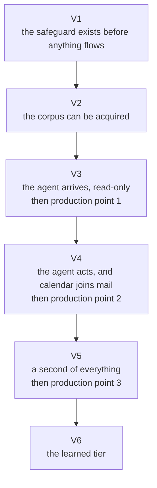
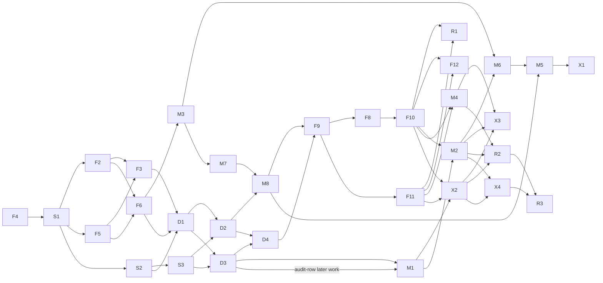

# Mediated Mailbox MCP — Roadmap

This file holds all the work in one place, meaning the delivery posture, the value path, the work
units with their finish lines, the production points, the dependencies, and the open decisions. It
is the one top-level document that changes as work progresses. [USE_CASES.md](./USE_CASES.md) and
[DESIGN.md](./DESIGN.md) are the stable contract it is measured against.

**Reading rules.** Status distinguishes *authored → merged → released → deployed-and-observed*, four
different states, never collapsed (`main` is not deployed state, in either direction). Claims are
**[measured]** (read from the repo, an API, or a record that records its own measurement) or
**[inferred]**.

**Finish lines.** Every unit names the state it must reach to be done, the lowest one that proves
what it delivers. *Tested* means implemented with the tests [TESTING.md](./TESTING.md) requires for
what the unit holds, its automatable verification rows proven, and their mutation demonstrations
recorded. *Image* means tested, and the deployable's image builds, which the images workflow proves.
*Packaged* means image, and the chart stands the deployables up on a bare kind cluster under the
chainsaw suite, against a release
([ADR-0052](./docs/adr/engineering/0052-kubernetes-deployment-helm-chart.md)). A unit that delivers
code inside a deployable or a library is proven at tested. A unit that delivers a deployable, by
creating or changing its composition root, is proven at image, the deployable's artifact
([ADR-0049](./docs/adr/engineering/0049-image-per-component-lockstep.md)). A unit that delivers the
chart's coverage is proven at packaged. Continuous integration builds every image and lints the
chart on the changes the workflow table of [CLAUDE.md](./CLAUDE.md#ci-workflows) names, so the upper
rungs add no check of their own beyond what they name.

**Production points.** Taking the system to production is outside this repository. A production
point is a point in the sequence where production first needs new supplied inputs or platform-side
steps, and there are three. Between points, new versions flow as ordinary version bumps with no
manual step. Each point names the units behind it, any precondition a build or a proof needs from
the real mailbox or the deployed system, the inputs the chart declares that arrive there
([ADR-0052](./docs/adr/engineering/0052-kubernetes-deployment-helm-chart.md)), the proofs, and the
learning that can happen only there. Each point also carries a **Crossed:** line, which reads *no*
until the operator alone decides the point is crossed and a pull request sets it to *yes*. This line
is the authority on whether a point is crossed. The work of standing the system up, a module in the
operator's repository homelab-ops-kubernetes-apps used from the repository
homelab-ops-kubernetes-clusters, and its tickets belong to those repositories. *The real mailbox*
and *production* are terms of [DESIGN.md's Glossary](./DESIGN.md#glossary).

**Acceptance.** Every control's proving injection lives in
[docs/VERIFICATIONS.md](./docs/VERIFICATIONS.md), keyed to the units and production points below. A
unit is not done while the rows keyed to it are unproven for the part they key to it. A row keyed to
a unit and a production point is proven at the unit for the mechanism and at the point for the rest.
An automatable control's acceptance also includes the mutation demonstration recorded in the
mutation ledger, [docs/MUTATIONS.md](./docs/MUTATIONS.md) and the files it lists
([ADR-0046](./docs/adr/engineering/0046-tests-are-evidence-once-seen-to-fail.md)). A drill or manual
exercise keyed to a production point is proven there, on its date. A row keyed to a delivered unit
as later work keys that later work, filed under the unit whose mechanism it concerns as a discovery
is ([CLAUDE.md](./CLAUDE.md#repository-process)), and leaves the unit delivered.

**Identifiers.** Outcomes
([C1](./USE_CASES.md#c1--metadata-always-visible)–[C4](./USE_CASES.md#c4--the-sensitive-sender-list-keeps-pace),
[G1](./USE_CASES.md#g1--whole-mailbox-visibility)–[G4](./USE_CASES.md#g4--the-index-tracks-the-live-mailbox),
[P1](./USE_CASES.md#p1--one-contract)–[P3](./USE_CASES.md#p3--multi-account),
[A1](./USE_CASES.md#a1--asymmetric-mutation)–[A4](./USE_CASES.md#a4--released-bodies-are-clean-markdown-that-cannot-do-anything),
[O1](./USE_CASES.md#o1--rate-limited-politely)–[O6](./USE_CASES.md#o6--deployable)) are defined in
[USE_CASES.md](./USE_CASES.md). Work units (S·F·D·M·X·R + number), value increments
([V1](#v1--the-safeguard-exists-before-anything-flows)–[V6](#v6--the-learned-tier)) and production
points (1 to 3) are defined here. A retired unit identifier is never reused, and F1, F7 and H1
are retired. Decisions are cited by number, each linked to its record, and indexed in the
[decision-record index](./docs/adr/README.md). Every reference in prose links to the section
defining it. Table cells and dependency edges within this document may use bare identifiers.

**How this document relates to tickets.** How a ticket is cut and when it is done are
[CLAUDE.md](./CLAUDE.md#repository-process)'s. Every ticket names the one unit it serves and the
value increment this document places its work in, and is a sub-issue of that increment's issue,
which lists the increment's tickets by unit. Each increment's issue is a sub-issue of
[#118](https://github.com/ppat/mediated-mailbox-mcp/issues/118). The **Position** line below is
re-dated whenever the checklists are reconciled against the tickets, so staleness is detectable
instead of silent.

**Position: 2026-10-10.**

## Delivery posture

Four commitments govern how every unit is scoped and sequenced. They exist to pre-empt a known
failure mode, an implementation effort that tries to account for every minute thing before shipping
and takes forever to put value in front of its user.

1. **Deliver value faster.** Each increment on the value path is cut at the smallest shape that
   ships real value, not at capability-complete.
2. **Learn from the real mailbox, and iterate on what it teaches.** First passes are deliberately
   minimal, and what running against the real mailbox teaches drives the next pass. Discoveries that
   do not block the value path become tickets, not scope.
3. **Harden and tighten later, once real behavior exists.** The learned detection tier is built
   against observed behavior rather than guesses, which is also what makes it cheap. A dashboard on
   a metric that exists is a configuration change ([O2](./USE_CASES.md#o2--observable)), the
   collection, shipping and retention of what the application emits and alerting based on logs are
   the platform's ([ADR-0051](./docs/adr/engineering/0051-environment-contract.md),
   [ADR-0028](./docs/adr/operability/0028-trust-anchor-hardening.md)), admission policy is the
   cluster's ([ADR-0052](./docs/adr/engineering/0052-kubernetes-deployment-helm-chart.md)), and
   backups are the deployment's ([ADR-0028](./docs/adr/operability/0028-trust-anchor-hardening.md)),
   so none of them is a unit here. Every condition a record names is raised by the unit that owns
   it.
4. **Do no more per unit than what proves it.** Every unit stops at the lowest finish line that
   proves what it delivers.

Four things are **not** deferrable under this posture. The membership test is that *deferral is
irreversible, or the failure it permits is silent*.

- **The fail-closed safeguard machinery before any body flows**
  ([V1](#v1--the-safeguard-exists-before-anything-flows) precedes everything). A gate bug fails
  catastrophically and silently. It cannot be "learned from" on the real mailbox because nothing
  visibly breaks when it leaks.
- **The rate hard cap before the first corpus-scale run against the real mailbox**, which is
  [production point 1](#production-point-1--the-read-path). [F3](#delivered-mapped-to-outcomes) also precedes
  [D1](#delivered-mapped-to-outcomes) as a build dependency, so backfill spends from the budget from its
  first page. Collectively overrunning the provider's budget risks a provider-side account
  restriction on the operator's personal mailbox, which is not recoverable by iteration.
- **Audit and measurement emission riding as acceptance criteria on the units being built anyway**
  (gate decisions, masking events, audit rows, rate gauges). An uninstrumented window is gone
  forever, and the design refuses unmeasured accepted risks.
- **Every production touch batched into one of the three [production points](#production-points)**,
  with every manual step and every proof that needs the real mailbox or the deployed system. A
  manual step performed outside a point cannot be gathered into one afterwards, and the spread it
  leaves is the failure the points exist to prevent.

The same posture bounds quality scope in the other direction. First passes of detection rules, gate
predicates and heuristics are expected to be tuned from observed traffic via the review loops, not
perfected up front.

## Where things stand

| Layer | State |
| --- | --- |
| Documents (design, outcomes, decisions, this roadmap, verifications, mutations) | Authored **[measured]** |
| Code | Merged to `main`, none of it yet released. What each pull request merged is the Code column of [the table by pull request](#what-each-pull-request-landed-proved-and-demonstrated), and what each deployable's composition root runs is [the table by composition root](#what-each-composition-root-runs) **[measured]** |
| Infrastructure (database, secrets, deployments) | None provisioned for this system |
| Verifications | The verification column of [the table by pull request](#what-each-pull-request-landed-proved-and-demonstrated) says whose rows each pull request proved, and each proven row names its pull request as the proof in [docs/VERIFICATIONS.md](./docs/VERIFICATIONS.md). Every other row is pending or parked (see [docs/VERIFICATIONS.md](./docs/VERIFICATIONS.md)) **[measured]** |
| Mutations | The demonstrations each pull request recorded are the Mutations column of [the table by pull request](#what-each-pull-request-landed-proved-and-demonstrated). See [docs/MUTATIONS.md](./docs/MUTATIONS.md) **[measured]** |
| **The delivery gap** | Every unit except F4, S1, S2, S3, F2, F5, F3, F6, D1, D2, D3, D4, M7, M8, F9, F8, F11 and F10, which are delivered. M3 has started, with the golden-file helper, the UI's server, the browser app's shell, the system screen, the jobs and run screens with their reads, and the home screen. No other unit has started |

### What each pull request landed, proved and demonstrated

One row per pull request, or per group of pull requests a unit merged together, in the order of
their numbers. A new pull request adds its row. "—" means the pull request recorded nothing in that
column. The verification column names the unit whose rows a pull request proved, in whole or for
its part, and the rows it added. Which rows it proved are the rows whose Status line in
[docs/VERIFICATIONS.md](./docs/VERIFICATIONS.md) names it as the proof, beside a proven date, so
"D1's rows" there means D1's rows among those, not every row keyed to D1.

| Pull request | Unit | Code merged | Verification rows proven | Mutation demonstrations |
| --- | --- | --- | --- | --- |
| [#60](https://github.com/ppat/mediated-mailbox-mcp/pull/60), [#131](https://github.com/ppat/mediated-mailbox-mcp/pull/131), [#132](https://github.com/ppat/mediated-mailbox-mcp/pull/132), [#134](https://github.com/ppat/mediated-mailbox-mcp/pull/134), [#137](https://github.com/ppat/mediated-mailbox-mcp/pull/137), [#138](https://github.com/ppat/mediated-mailbox-mcp/pull/138) | F4 | F4's layout and tooling, with the F4 pull requests #149, #189, #190, #198 and #199 below | Every row keyed to F4 is proven, by #60, #131 and #137, and by the F4 pull requests below for the rows each names | — |
| [#141](https://github.com/ppat/mediated-mailbox-mcp/pull/141), [#142](https://github.com/ppat/mediated-mailbox-mcp/pull/142), [#143](https://github.com/ppat/mediated-mailbox-mcp/pull/143), [#144](https://github.com/ppat/mediated-mailbox-mcp/pull/144), [#145](https://github.com/ppat/mediated-mailbox-mcp/pull/145), [#150](https://github.com/ppat/mediated-mailbox-mcp/pull/150) | S1 | S1's marker text, synthetic fixtures, sensitivity types, property-testing harness, policy snapshot, sender classifier, Redaction Gate and Mutation Authorizer | The S1 rows of the sensitivity types and the property-testing harness by #142, those of the policy snapshot by #143, those of the sender classifier by #144, those of the Redaction Gate by #145, and the rows on verdict types for the Mutation Authorizer's verdict by #150 | The controls of S1's sensitivity types and property-testing harness by #142, those of the policy snapshot by #143, those of the sender classifier by #144, those of the Redaction Gate by #145, and those of the Mutation Authorizer by #150 |
| [#149](https://github.com/ppat/mediated-mailbox-mcp/pull/149) | F4 | Part of F4's layout and tooling | The rows of the `go vet` analysers' rules against package-level state in a pure core | The controls of the `go vet` analysers' rules against package-level state in a pure core |
| [#151](https://github.com/ppat/mediated-mailbox-mcp/pull/151) | S2 | S2's content scanner and subject masking | The S2 rows, S2's part of the search of scanner output included | The controls of S2's content scanner and subject masking |
| [#152](https://github.com/ppat/mediated-mailbox-mcp/pull/152) | S3 | S3's body sanitization and serve-time pattern check | The S3 rows and S3's parts of the rows it shares with D3 | Those of S3's conversion, release step and the scanner's pattern entry point |
| [#153](https://github.com/ppat/mediated-mailbox-mcp/pull/153) | F2 | F2's schema, migration chain, runtime roles and transaction helper | The F2 rows | Those of F2's data layer |
| [#154](https://github.com/ppat/mediated-mailbox-mcp/pull/154) | F5 | F5's canonical model, Provider Port, provider fake and contract suite | The F5 row for the body fetch being the port's one body path | Those of F5's canonical model, provider fake and contract suite |
| [#155](https://github.com/ppat/mediated-mailbox-mcp/pull/155) | F5 | F5's Gmail OAuth, mounted credentials and rotation write-back | The F5 rows for the grant's scope and mounted credentials, and F5's half of the rotation row | Those of F5's Gmail OAuth and credential handling |
| [#156](https://github.com/ppat/mediated-mailbox-mcp/pull/156) | F3 | F3's rate controller rules | — | Those of F3's rate controller rules |
| [#157](https://github.com/ppat/mediated-mailbox-mcp/pull/157) | F3 | F3's leases, Gmail cost profile, metrics and alerting rules | The F3 rows | Those of F3's leases, alerting rules and the grant check's planning of a shared library's statements |
| [#158](https://github.com/ppat/mediated-mailbox-mcp/pull/158) | F5 | F5's Gmail adapter and its contract run against real Gmail | The rest of the F5 rows, two of them by hand against real Gmail | Those of F5's Gmail adapter, its contract run against real Gmail and the command that run requires |
| [#160](https://github.com/ppat/mediated-mailbox-mcp/pull/160) | D1 | D1's policy loader | D1's rows for the policy loader | Those of D1's policy loader |
| [#161](https://github.com/ppat/mediated-mailbox-mcp/pull/161) | F3 | F3's runaway rule for every provider and its tunable rate target | F3's rows for the runaway rule's emitted hard cap and the lowered target | Those of F3's runaway rule for every provider and its lowered target, with the rate limiter's rows reproduced |
| [#162](https://github.com/ppat/mediated-mailbox-mcp/pull/162) | M3 | M3's golden-file helper | — | Those of M3's golden-file helper |
| [#167](https://github.com/ppat/mediated-mailbox-mcp/pull/167) | D2 | D2's scan gate predicate in `core/scangate`, a pure core applying the composite gate's rules in order, the first match deciding and naming the reason, with its thresholds a value the caller passes and failing closed on thresholds that cannot decide | The five rows it adds for the predicate | Twelve controls of the predicate, over 35 patches |
| [#171](https://github.com/ppat/mediated-mailbox-mcp/pull/171) | D3 | D3's operation registry, its two roots, the bearer check, TLS and the readiness state | D3's rows, and D3's parts of the rows it shares | Those of D3's registry, derivation of each operation's method and annotations, argument round trip, roots, account check, bound on argument keys, bearer check, TLS, uncacheable responses, readiness, refusals of approval, of header bindings, of `MCPGODEBUG` and of a database password in the environment, failure content, policy loading and approval grants |
| [#177](https://github.com/ppat/mediated-mailbox-mcp/pull/177) | D1 | D1's configuration library with the `go vet` analyser against reading the environment outside a deployable's `main.go` and backfill's database connection taken from it | D1's rows, and the parts of the rows D1 shares that the configuration library and backfill's connection carry | Those of D1's configuration library, the analyser against reading the environment and backfill's database connection |
| [#178](https://github.com/ppat/mediated-mailbox-mcp/pull/178) | F6 | F6's accounts, OAuth clients and sealed credentials in the database, with the `credential/` and `accountload/` libraries and the Gmail adapter taking its credential from what a deployable supplies | F6's rows, and F6's parts of the rows it shares with D1, D3, D4, M2, M3, M7, R1 and production point 1. It also extends the F2 row for isolation across every account-keyed table to `account_state` | Those of F6's sealing, key handling, account snapshot, compare-and-set write-back, re-seal and the values of its scan, account listing, the reads of `oauth_clients` and `account_state`, the Gmail token source's rotation, and the `provider/gmail` package's refusal to read a credential from the environment, with F2's row-level security row reproduced for `account_state` |
| [#181](https://github.com/ppat/mediated-mailbox-mcp/pull/181) | D1 | D1's reading of backfill's accounts and credentials from the database, with the database connection library `dbconnect/`, the credential section in `credential/core`, the `txhelper` analyser, the grant rule of [ADR-0075](./docs/adr/data/0075-one-runtime-role-per-deployable.md)'s three lines with the data-access layout [ADR-0066](./docs/adr/data/0066-data-access-generated-from-sql.md) derives from it, and the release job attaching signed key-generation binaries | D1's row for the data-access library's layout, and D1's parts of the rows it shares, the part of the row for calling a data-access function in a transaction that did not set the account that the `txhelper` analyser carries among them | Those of backfill's account snapshot, the accounts a run serves, keyring, token-source credentials and hand-over, the credential section, the `txhelper` analyser and the moved database connection. It also repeats the demonstrations of the accounts listing policy with its patch regenerated and of the effective configuration logged at start |
| [#182](https://github.com/ppat/mediated-mailbox-mcp/pull/182) | M3 | M3's UI server, its dataset registry and endpoint, the contract pipeline, the content security policy, the reads more than one screen makes and the server half of the event stream | M3's rows, and M3's parts of the rows it shares | Those of M3's UI server, its registry, contract pipeline, content security policy, event stream and configuration, and of the golden-file helper's refusal of a `GoldenAt` path that is absolute or not clean. It adds the `GoldenAt` tests to the golden-file helper's rows for a differing file, a missing one and `-update` off by default, and adds two breaks to the account state grants' row, the UI's read of its account's progress widened to the credential and narrowed below what its statement reads. It reproduces the golden-file helper's row for a name leaving `testdata/golden` |
| [#186](https://github.com/ppat/mediated-mailbox-mcp/pull/186) | D3 | D3's read operations, identifier listings, system status and UTC timestamps, with the mediator's configuration, account snapshot reload and rate-state series | D3's rows, and the mediator's parts of the rows D3 shares. Of D3's rows it adds those for the redaction matrix on served metadata, cursors and paging, the arguments a served operation takes, the read operations reading the serving state, the rate-state series on the mediator's metrics endpoint and the mediator's configuration refusals | The controls of D3's redaction matrix on served metadata, UTC timestamps in and out, cursors and paging, system status, argument refusals, the arguments a served operation takes, the read operations' sources, the mediator's configuration refusals, account reload, reload schedule and rate-state series, and the policy loader's changing account set are new and demonstrated. It adds breaks for the mediator, and its tests, to the rows for a public key matching none of the private keys and for the pinned configuration type. It adds its new tests to the rows for the argument object both roots hand the service layer, the registry's operations served on both roots, an operation failing generation, the account check, the structured failure, the approval vocabulary and policy loading, the last with its breaks regenerated against the reworked composition root and a break added that registers the reload-failure series off the metrics endpoint. It replaces the mediator's three breaks of its refusal of a database password in the environment with two, one that skips the refusal and one that moves it after the configuration is read, since `dbconnect/` carries the rest, moves the break of a missing key pair from the TLS row to the configuration refusals' row, and retires the account check's break of the seam that served no account. It reproduces the rows of S3's serve-time pattern check, release step and delimiters, and of D3's method and annotations, bound on argument keys, tools-only MCP root, build-time refusals, uncacheable responses, `MCPGODEBUG` refusal, bearer check and readiness |
| [#189](https://github.com/ppat/mediated-mailbox-mcp/pull/189) | F4 | Part of F4's layout and tooling | The row for a `depguard` list that is not strict or carries a `deny` key | The ban-proof script's refusal of a `depguard` list that is not strict or carries a `deny` key |
| [#190](https://github.com/ppat/mediated-mailbox-mcp/pull/190) | F4 | Part of F4's layout and tooling | The row for importing, from code that ships, a package `./...` does not list | The ban-proof script's refusal of a package the build of `./...` reaches that `./...` does not list |
| [#193](https://github.com/ppat/mediated-mailbox-mcp/pull/193) | M3 | The route check, import list and sqlfluff configuration of [#182](https://github.com/ppat/mediated-mailbox-mcp/pull/182) tightened, closing the discovery [#191](https://github.com/ppat/mediated-mailbox-mcp/issues/191) | It extends the proof of the registry's refusal to a route registered outside `/api` and to one registered on the probes listener | The route check's row reproduced and two breaks added, one registering a route outside `/api` and one registering a route after the server stores its mux, the rows of the content security policy and of a path claimed twice reproduced, and the new controls that the probes listener serves only its three routes and that `go vet` refuses a copy of a recording mux demonstrated, the latter's patch regenerated in [#207](https://github.com/ppat/mediated-mailbox-mcp/pull/207) |
| [#195](https://github.com/ppat/mediated-mailbox-mcp/pull/195) | M3 | M3's browser app shell, with the URL grammar and routing, the data cache, the global chrome, the lens shell at levels 0 and 3, the region patterns, the keyboard map, both palettes with the vendored fonts, and the stream client with its live indicator, with the mutation runner running browser tests under `bun test`, and the page of the content security policy's browser drill, which is deferred to production point 1 | M3's part of the content security policy's static-scan row for the first built bundle of the browser app and for a font inlined as a `data:` URI, M3's part of the inert-rendering row for the lens shell's rows table, and the standing disposition for [ADR-0064](./docs/adr/engineering/0064-browser-tests-run-under-bun-against-a-dom-shim.md)'s shim fidelity by its drill in a real browser | It adds a break to the content security policy scan's row, the scan passing a font inlined as a `data:` URI, and reproduces the row with its patches regenerated. It demonstrates the new control that message-derived text renders inert, the first demonstration run under `bun test`, and reproduces the UI's rows for the refusal of the database's password variables and the pinned configuration type with their patches regenerated |
| [#196](https://github.com/ppat/mediated-mailbox-mcp/pull/196) | D1 | D1's pass 1 over the full history with its per-page checkpoint, the run record, the scanner's section of the configuration, each account's lowered rate target handed to the rate limiter, the crash harness and the operation sampler | D1's rows, the rows for the crash harness and the operation sampler, and D1's parts of the rows it shares | The controls of D1's pass 1, its resume from the last checkpointed page, a page's commit being one transaction, a page taken twice counting nothing twice, the run record, the completion flag, masking and classification at ingest, the unclassified-sender volume, the hand-over after every page, the probes and the reload-failure series, the scanner's section and its revision, each account's lowered target, and the crash harness and the operation sampler, are new and demonstrated. It reproduces the rows for a scanner that refuses to decide, whose refusal of an invalid configuration now covers an empty revision, and for the scan verdict that carries no text, since the revision became a string, and reproduces F3's rows for the hard cap the declared ceiling gives, convergence, the stored cut, the ask instant and the one-second window, whose patches it regenerates against the limiter's targets for each account. It regenerates backfill's composition-root patches against the root's rewrite and reproduces their rows, those of the pinned configuration type, the logged effective configuration, the validated database and credential sections, the connection settings, the public key matching a private key, the account snapshot and the accounts a run serves, and the token source's credentials. The end-of-run hand-over's row is retired, and its breaks now demonstrate the hand-over after every page |
| [#198](https://github.com/ppat/mediated-mailbox-mcp/pull/198) | F4 | Part of F4's layout and tooling | The rows for a file that ships whose build constraint keeps it from the gating lint and for a `go vet` step whose tags differ from the lint configuration's | The ban-proof script's refusals of a file a build that ships compiles that the gating lint does not read and of a `go vet` step whose tags differ from the lint configuration's, reproducing the row of [#190](https://github.com/ppat/mediated-mailbox-mcp/pull/190) with three of its patches regenerated |
| [#199](https://github.com/ppat/mediated-mailbox-mcp/pull/199) | F4 | Part of F4's layout and tooling | It extends the proof of the registry's refusal to a route registered in the UI other than through its recording mux by the calls the `go vet` routes analyser refuses | The `go vet` routes analyser's refusal of a route the UI registers other than through its recording mux |
| [#204](https://github.com/ppat/mediated-mailbox-mcp/pull/204) | M3 | M3's system screen | M3's part of the inert-rendering row for the system screen | It adds three breaks of the system screen to the inert-rendering row |
| [#205](https://github.com/ppat/mediated-mailbox-mcp/pull/205) | M3 | M3's reads for the jobs and run screens, the `runs` and `failures` datasets with the dataset endpoint's levels 1 and 2, the `failures` row detail and the run summary endpoint, settling that a run's detail is the Run screen and the `runs` dataset declares no row detail | M3's parts of the rows it shares, and the row it adds, that a group's filter word selects the rows the group counts | It adds breaks to the rows of the dataset endpoint's refusal, which now covers filter values, the word naming a value stored empty and the row detail's parameters, of its refusal before any statement runs, of the statement-set check, which now covers row identities and dimensions named as parameters, of per-account reads and of a path claimed twice, demonstrates the new control that a group's filter word selects the rows the group counts, and reproduces the UI's server rows with their patches regenerated |
| [#207](https://github.com/ppat/mediated-mailbox-mcp/pull/207) | — | — | — | The patch of the control that `go vet` refuses a copy of a recording mux, demonstrated by [#193](https://github.com/ppat/mediated-mailbox-mcp/pull/193), regenerated |
| [#208](https://github.com/ppat/mediated-mailbox-mcp/pull/208) | M3 | M3's jobs and run screens, with the message row, the page row, the bars, the run timeline, the lens shell's levels 1 and 2 with the group-by control, the Jobs item in the navigation with its running mark, the system screen's links to Jobs, the partial-index banner's link to Jobs, and the progress bars of the backfill card and the rate budget | M3's parts of the rows it shares | It adds breaks to the inert-rendering row for the message row, the page row, the bars, the timeline's hovers, a failure's panel and its subject, and the applying and last-applied plans' titles on the jobs screen, with the rows table's three breaks and the system screen's three regenerated, adds breaks to the row that a group's filter word selects the rows the group counts for the bars and the group table, demonstrates the new controls that a streamed event redraws a live surface's text without re-rendering a component and that a screen's text, rows, cursor, focus, range fields and loading timers follow the route, answers, range and read in view, and reproduces the per-account row |
| [#211](https://github.com/ppat/mediated-mailbox-mcp/pull/211) | F4 | F4's dedicated CI workflow proving every mutation patch still applies | The row for a mutation patch's diff context going stale | — |
| [#214](https://github.com/ppat/mediated-mailbox-mcp/pull/214) | D2 | Backfill's second pass, as [the table by composition root](#what-each-composition-root-runs) states | D2's rows, and D2's parts of the rows it shares | The fourteen controls of D2's second pass and delisting transition, and demonstrates again the first pass's and the composition root's breaks whose code it changed |
| [#221](https://github.com/ppat/mediated-mailbox-mcp/pull/221) | D1 | D1's record of the policy rule that set each message's sender class apart from its content rules, which a failure's panel shows | The inert-rendering row for the rule that set a failure's message's class | It adds the inert-rendering row's break for the rule that set a failure's message's class, with the row's other breaks reproduced, and demonstrates again the first pass's classification and unclassified-sender rows, whose code it changed |
| [#222](https://github.com/ppat/mediated-mailbox-mcp/pull/222) | D1 | D1's enumeration total on the Provider Port, reported by the provider fake when configured to and by the Gmail adapter on every page, with pass 1's checkpoint carrying the pages it implies | D1's row for the contract suite's check of an enumeration total | It demonstrates the contract suite's check of an enumeration total, adds the profile read an enumeration page makes for its total as a break of Gmail's cost profile, and regenerates and demonstrates again the patches for an enumeration page past the hard cap, a page of threads holding two threads, an enumeration page logged whole and a page made durable keeping the token it was asked with, and demonstrates again, with the tests it changed, the rows for the body fetch being the port's one body path, for counting every Gmail request at its cost and for emitting the hard cap beside the count, and, with the tests it adds, the rows for the contract suite's promises of the port and for the first pass's completion flag, masking and classification, run record and page counted once |
| [#223](https://github.com/ppat/mediated-mailbox-mcp/pull/223) | D2 | Backfill's re-run of each pass after a change of scanner, as [the table by composition root](#what-each-composition-root-runs) states | D2's row for a change of scanner, and D2's parts of the rows it shares, for a change of scanner | The ten controls of D2's re-scan after a change of scanner, among them the return of stale verdicts to pending before the first pass and both halves of every staleness comparison, and reproduces the rows of the first and second passes, whose code and crash harnesses it changed, with the patches whose code it changed regenerated, and an example test added for a resumed run whose enumeration had ended, which the crash harness no longer reaches at the gating case count. It also reproduces the inert-rendering row and the row that a streamed event redraws a live surface's text without re-rendering a component, since it changed the run screen's wording of a gone item, and reproduces from a run over every patch of each control the rows of the pinned configuration type, the connection settings, the validated database and credential sections, the public key matching a private key, a page made durable twice counting nothing twice, the revision a verdict records and each account's lowered target |
| [#227](https://github.com/ppat/mediated-mailbox-mcp/pull/227) | D3 | D3's recording of the last provider authentication outcome, with the Gmail token source reporting its latest attempt and backfill recording it | It adds and proves D3's rows for recording only the latest authentication attempt, for the outcome the Gmail adapter reports, part of it by hand against real Gmail, and backfill's part of the row for recording the attempt at the end of each unit of work | The controls that the recorded authentication outcome is the latest attempt, that the Gmail token source reports a refusal, a failure and no attempt apart, and that backfill records the attempt at the end of every unit of work, and demonstrates again the rows of the token source's rotation and backfill's hand-over, with five of their patches regenerated, and of no credential read from the environment, with its six patches regenerated |
| [#230](https://github.com/ppat/mediated-mailbox-mcp/pull/230) | M3 | M3's home screen, with the attention endpoint and its backlog, masking, body-serves and sync-gap rules, the candidates' recorded signals typed, and one stream connection per account shared by a tab's live surfaces | M3's parts of the rows it shares | It demonstrates the body-serves rule and the sync-gap rule, adds breaks to the inert-rendering, render-counter, route-following and per-account rows for the home screen, its strip, the shared stream connection and the attention route, and demonstrates again those rows' browser breaks and the UI's configuration pinning, with the tests it changed |
| [#231](https://github.com/ppat/mediated-mailbox-mcp/pull/231) | D2 | Backfill's re-decision of every stored gate skip, as [the table by composition root](#what-each-composition-root-runs) states | D2's row for a change of the scan gate's thresholds | The two controls of D2's re-decision of stored gate skips at every backfill run's start, and reproduces, with their patches regenerated, the rows for a reopened first pass leading to a second pass, for a stale verdict returning to pending, for a signalled skip returning to pending, for the second pass waiting for the first and for the mark that starts the second pass over, whose code it changed |
| [#232](https://github.com/ppat/mediated-mailbox-mcp/pull/232) | F5 | The Gmail adapter's port error for a call that could not obtain an access token, a refused credential only for the token endpoint's refusal | It adds and proves F5's row for a token request the provider refuses surfacing as a refused credential and one that fails any other way before the call is cancelled or its deadline passes as a provider failure, part of it by hand against real Gmail | The control that a token request the provider refuses surfaces as a refused credential and one that fails any other way before the call is cancelled or its deadline passes as a provider failure, and demonstrates again, with the test it changed, the row for counting every Gmail request at its cost |
| [#233](https://github.com/ppat/mediated-mailbox-mcp/pull/233) | D1 | D1's re-read of a refused credential, with backfill reading a credential the provider refuses again from the account's row before it reports the refusal | Backfill's part of the row for picking up a replaced credential, a refused credential read again from the account's row and a replaced one used for the call that was refused | The control that a credential the provider refuses is read again from the account's row before the refusal is reported and a replaced one used for the call it refused, and demonstrates again the rows of backfill's snapshot load, hand-over and attempt recording, with eleven of their patches regenerated |
| [#235](https://github.com/ppat/mediated-mailbox-mcp/pull/235) | D3 | D3's body release through the gate, the conversion and the release step, with the policy loaded for each body request, message text with no HTML form released as a code block, and the failure contract naming each failure's origin | It adds and proves D3's rows for the policy load each body request waits for and the one every reload runs, the snippet and filenames following the body, the audit of every serve and denial, message text with no HTML form, the serve-time check over everything released and over every message's filenames, the body counts, both roots' shapes, the interactive lease and the provider timeout, and proves D3's parts of the rows it shares | The controls of D3's body release and failure contract, and reproduces, with their patches regenerated, the rows for the release step, the failure classification, the mediator's reloads and its configuration, whose code it changed |
| [#236](https://github.com/ppat/mediated-mailbox-mcp/pull/236) | M3 | M3's browser tests settling on the reads and effects pending instead of a fixed count of task turns, with the recorded answers read from memory, closing the discovery [#224](https://github.com/ppat/mediated-mailbox-mcp/issues/224) | — | — |
| [#239](https://github.com/ppat/mediated-mailbox-mcp/pull/239) | D4 | D4's delta sync, with the decisions it shares with backfill moved to `core/index`, the shared `lease.Call`, the re-seal of an OAuth client's secret, the scan series and the cursor gap rule | D4's rows and D4's parts of the rows it shares, among them the rows it adds for a tick's change application, its idempotency, an account's first reconciliation, a gap recovery's removal of what the provider no longer holds, a tick or recovery left running by a stopped process, scanning once backfill's second pass has ended, the gate thresholds and scanner it shares with backfill, and the sync class with the series between ticks, the adapter's request cost and hard cap among them | D4's controls, among them the gate thresholds and scanner delta sync shares with backfill, with a break on each side, and demonstrates again the rows of the decisions that moved from backfill to `core/index`, of the txhelper analyser's exemptions, of the grants on `oauth_clients`, of the unclassified-sender volume, of the credentials a token source is built from, of the contract suite's promises of the port, which gain the trash and spam, of backfill's composition root and of the account snapshot library, whose code it changed, with the patches the move left stale regenerated |
| [#240](https://github.com/ppat/mediated-mailbox-mcp/pull/240) | D3 | D3's start-up tests of the mediator holding the listeners they hand its start, with the composition root opening them before it serves | — | It closes the discovery [#238](https://github.com/ppat/mediated-mailbox-mcp/issues/238), so the mediator's start-up tests hold the listeners they hand the start instead of racing another process for a port they released, and demonstrates again the rows for the mediator's readiness, its scheduled reload, its TLS-only surface and its read operations' serving state, with the readiness row's start-marks-ready patch regenerated |
| [#243](https://github.com/ppat/mediated-mailbox-mcp/pull/243) | F4 | F4's mutation runner running `go test` with `-trimpath`, so a demonstration's copies reuse the build cache | — | — |
| [#246](https://github.com/ppat/mediated-mailbox-mcp/pull/246) | D3 | D3's index reads, a search, a count that groups and the sender listing, selecting by an index query of the client surface's own and classifying senders under the policy in force, with the rebuild of the sender statistics and the counts of prior scan hits moved to a subsection the mediator does not admit | It adds and proves D3's rows for a message whose body is denied staying in every count, group and search result, enumeration and counting reaching the whole corpus, and the sender class the index reads use being the policy in force's, and proves D3's parts of the rows it shares, the two rows for the live agent by manual exercise on 2026-10-02 against this pull request's exercise harness, and with them every row keyed to D3 is proven for D3's part | The controls of D3's index reads, the denied message kept in every result, the whole corpus reached and the sender class under the policy in force, adds the index reads' breaks to the rows for the cursor and the argument names, and demonstrates again the rows for UTC timestamps, the cursor and the argument names, whose tests or code it changed, and one break each of the rows for approval, a flagged message's prior hit, a verdict made under another scanner and a page made durable twice, whose patches it regenerated |
| [#251](https://github.com/ppat/mediated-mailbox-mcp/pull/251) | F4 | F4's mutation runner giving the go commands a demonstration's tests start `-trimpath` too | — | — |
| [#253](https://github.com/ppat/mediated-mailbox-mcp/pull/253) | M3 | M3's partial-index banner telling a backfill pass 1 a change of scanner re-opened apart from a first one, with the system endpoint naming when pass 1 last succeeded and no count reading as a count so far while a re-opened pass 1 runs, closing the discovery [#225](https://github.com/ppat/mediated-mailbox-mcp/issues/225) | — | — |
| [#254](https://github.com/ppat/mediated-mailbox-mcp/pull/254) | D1 | D1's backfill handing each account's credential over with the adoption stamp of the credential its source holds | D1's part of the row for a write-back based on a credential the operator has since replaced, for backfill's hand-over | It closes the discovery [#250](https://github.com/ppat/mediated-mailbox-mcp/issues/250), demonstrating backfill's breaks of the control that discards a hand-over from before an adoption, and demonstrates again the rows of that control, of backfill's hand-over, of its recorded attempt and of its re-read of a refused credential, which gains a break handing the refused source over with the re-read's stamp, whose code it changed, with the patches the change left stale regenerated |
| [#255](https://github.com/ppat/mediated-mailbox-mcp/pull/255) | F6 | F6's several OAuth clients per provider, keyed on a name, with each account naming the client it connects through by a reference that carries the provider, the migration that names the client already stored after its provider and points every account of that provider at it, the account snapshot pairing each account with the client it names, backfill, the mediator and delta sync building every token source through one helper over the account's own client and credential, and delta sync's client-secret series labelled with the client's name, closing the discovery [#244](https://github.com/ppat/mediated-mailbox-mcp/issues/244) | F6's rows, and the rows it adds for a client stored twice and for an account served without its client | Every control it lands or reshapes |
| [#256](https://github.com/ppat/mediated-mailbox-mcp/pull/256) | M7 | M7's OAuth client setup and account setup, the request token, the consent package and the UI's client-secret part | M7's rows and M7's parts of the rows it shares, and it adds and proves the rows for a consent attempt's binding to its session, a client changed while an attempt runs, the UI's open of a credential refused and a client's secret reaching no answer, cookie or log line, with the check of OAuth client setup against the live Google Cloud console a manual exercise at production point 1 | Every control M7 delivered, and reproduces the demonstrations of the consent, the token source and the grants its move of Gmail's consent and its grants touched |
| [#258](https://github.com/ppat/mediated-mailbox-mcp/pull/258) | M8 | M8's policy management, the policy tables keyed by scope with the policy history, the base-policy transaction, the policy screens, import and export, and the restriction of the stored classes a rule added since restricts in backfill's second pass and delta sync | M8's rows and M8's parts of the rows it shares, and it adds and proves the rows for the base-policy transaction, an added rule reaching the stored classes and a base edit landing mid-reload | Every control M8 delivered, and reproduces the demonstrations of the policy snapshot's validation, the sender classifier, the transaction helper's analyser, the policy loader, the delisting transition, delta sync's scanning, the row-level security, the consent redirect's check and the pinned configuration, whose code or tests it changed |
| [#270](https://github.com/ppat/mediated-mailbox-mcp/pull/270) | F9 · F10 · F11 | No code. It records the design of the background worker, the code organized for growth and the schema baseline, in [ADR-0117](./docs/adr/operability/0117-one-background-worker-runs-every-job-kind.md) to [ADR-0121](./docs/adr/redaction/0121-the-run-start-step-decides-each-gate-skip-again.md), Proposed, and in place in existing records | It adds the pending rows for the new controls | It demonstrates again the second break of the row for missing account-level series firing the absence rule, with its patch's description reworded |
| [#271](https://github.com/ppat/mediated-mailbox-mcp/pull/271) | F9 | F9's mutation runner printing each ledger row in the form [docs/MUTATIONS.md](./docs/MUTATIONS.md) defines, a section per control with a line per field | — | — |
| [#272](https://github.com/ppat/mediated-mailbox-mcp/pull/272) | F9 | F9's account session package, through which the mediator, backfill and delta sync hold each account's provider connection, and an entry package per deployable that its `main.go` calls | — | It demonstrates again every control whose code, tests or patches the move touched, with every other patch of those controls |
| [#317](https://github.com/ppat/mediated-mailbox-mcp/pull/317) | F9 | F9's families, `process/`, `executioncontext/` and `content/`, holding the shared libraries' packages with each package's own `core`, the probe and metrics listener moved out of backfill's and delta sync's composition roots, the pure-core match at any depth, package names unique inside the data-access library, and the commit taxonomy reading what ships as each binary's build graph | It proves F9's row for a pure core at any depth, and proves the empty-scope row again for the build graph's reading | It demonstrates again every control whose code, tests or patches the moves touched, with every other patch of those controls, and adds the any-depth match's demonstration |
| [#320](https://github.com/ppat/mediated-mailbox-mcp/pull/320) | F9 | F9's conventions pass over the document set, with comment-only changes to the Go code, and F9 moved to the delivered register | — | — |
| [#321](https://github.com/ppat/mediated-mailbox-mcp/pull/321) | D2 | D2's re-mask from the store as later work, a backfill run's start masking every stale subject stored unmasked again from the index in batches, the first pass fetching again by identifier only the subjects stored masked once its enumeration has ended and enumerating nothing when reopened, the call size moved to `core/mail` for delta sync and backfill alike, and Home, Jobs, System and the partial-index banner showing the subjects fetched again | D2's rows for the re-mask from the store and for a call fetching subjects again that leaves every one of them stale, and D2's rows for a change of scanner, for killing the process running backfill mid-run and for the leak search over persisted rows proven again for its mechanism, with M3's render-counter row for the strip's fetch | The controls of the re-mask from the store, the fetch by identifier, the pass ending only while no subject is stale and a call that leaves every subject it fetched stale failing the run, and it demonstrates again every control whose code, tests or patches the change touched, with every other patch of those controls, the live strip's included |
| [#322](https://github.com/ppat/mediated-mailbox-mcp/pull/322) | D3 | D3's later work, sender domains stored and bound through one normalizer in Go, `index.StoredDomain`, with a statement check refusing the case-folding forms over a domain its scope names, and the sender class term classifying the domains the statistics hold and matching them by a join ([ADR-0016](./docs/adr/data/0016-schema.md), [ADR-0108](./docs/adr/operability/0108-index-reads-select-by-an-index-query-of-the-surfaces-own.md)) | D3's rows for a stored domain in the normalizer's form classifying as its address, for every caller binding the normalizer's output and for the statement check refusing the case-folding forms over a domain its scope names, and the sender class row again | The normalizer's two controls, the sender class row with its patches regenerated, and every break whose tests the change edited |
| [#323](https://github.com/ppat/mediated-mailbox-mcp/pull/323) | F8 | F8's `log_level` value in every running deployable, the logger and level `main.go` hands each entry package and the entry hands its shells, `process/logging`, the shells' levels, and the ban on reading a process default logger | The rows it adds for the configured level, the ban on reading a default logger and a pure core's refusal of a logging import | Those of the configured level and of the refusal of a level that names none, and a break per entry package of the effective configuration's logging, whose row moves to the cross-component file |
| [#326](https://github.com/ppat/mediated-mailbox-mcp/pull/326) | F11 | F11's schema baseline, the migration chain flattened into four files and two migrations after it, the sender domains as lowercase `text`, the checked vocabularies, `job_runs.pass` never null with the run and audit indexes, pgvector, the label and subject indexes and `pg_trgm` removed with the extension bootstrap, the helper for a migration tested over rows, and the statement check refusing a cast to `citext` beside a domain | F11's rows, and it demonstrates again the F2 rows whose migration or test changed | The controls of F11's checks, migrations and chain, and every demonstration whose patch carried a migration file's diff context, regenerated |
| [#328](https://github.com/ppat/mediated-mailbox-mcp/pull/328) | F10 | F10's worker, `worker/`, running backfill and delta sync as job kinds, each with its import list, runtime role, connection pool and loaders, its scheduler and the due decisions, the in-run comparisons of a running second pass, the job series and the two alerting rules, the one configuration tree, the `go vet` analysers refusing, in the worker outside its scheduler, a `go` statement and any use of a function that starts a goroutine running what it is given, and, in the module, an import of `unsafe` and any use of reflect's unsafe pointers, the worker's test holding its dependencies that import `unsafe` or hold assembly or object files to a reviewed list, and the retirement of the backfill, delta sync, reorganization and heuristics deployables | F10's rows, the rows it adds for the scheduler's rules, a job's success, the fail-closed reload, the re-seal with no account, the pinned constructors, the due decisions, a page taking the active policy, the per-job-kind and worker import lists, the grant check per job kind's list, the goroutine analyser and the held source's reuse rule, and every row of backfill and delta sync whose code or tests moved, proven again in the worker. The two rows on the heuristics run's job kind key to M4 | The controls of F10's scheduler, job kinds, alerting rules, configuration and isolation checks, and every demonstration whose code, tests or patches moved into the worker, regenerated and demonstrated again |
| [#336](https://github.com/ppat/mediated-mailbox-mcp/pull/336) | F6 | F6's later work, a known-answer test in `executioncontext/credential/open` holding a key pair and a value sealed by an earlier build, which this build must open, with the seed deriving that public key and the identifier the value names | The row it adds for a build that cannot open a value an earlier build sealed, or derives another public key or key identifier from the same seed | The control that this build opens a value an earlier build sealed, with the key pair an earlier build wrote, broken so this build binds less in the additional data or hashes less into the key identifier, and so it runs another key schedule, expands the seed into another key pair or derives another key identifier |
| [#337](https://github.com/ppat/mediated-mailbox-mcp/pull/337) | F4 | F4's later work, each kind of test in a CI workflow of its own, the unit tests, the property tests, the crash sequences, the integration tests, the recording of the browser's fixtures and the mutation demonstrations, `go tool testkinds` selecting each kind and checking that every test runs in its kind's workflows and no other, the deep search split into a deep workflow for the property tests and one for the crash sequences, and the whole mutation ledger run weekly and by hand ([ADR-0124](./docs/adr/engineering/0124-each-kind-of-test-runs-in-a-workflow-of-its-own.md)) | It adds and proves the rows for a test that would run outside its kind's workflows or in none and for a ledger run that would pass on a surviving mutant or on no patch | The control that every test runs in the workflows of its kind and level and in no other |
| [#339](https://github.com/ppat/mediated-mailbox-mcp/pull/339) | D1 | D1's later work, messages carrying their attachment types from ingest, mapped once in `core/mail` to a closed vocabulary from each attachment's media type and filename, reported by the Gmail adapter and the provider fake and checked by the contract suite, written by pass 1 and delta sync's insert, held to the vocabulary by a check on `messages.attachment_types`, with the backfill and sync roles' insert on the column | The rows it adds for an attachment's type being a word of the closed vocabulary and for ingest writing the types, and the rows for the checked vocabularies and the redaction matrix on served metadata, proven again with the types | The controls of the attachment type's mapping and of ingest writing the types, the checked vocabularies and the redaction matrix on served metadata regenerated and demonstrated again, and the patches of the index's decision whose diff context moved |

### What each composition root runs

What the code on `main` runs today, per composition root, none of it yet released **[measured]**.

| Composition root | What it runs |
| --- | --- |
| The worker | It reads one configuration tree through the configuration library and validates it, a `database` section naming the server once with a block per job kind, `backfill` and `sync`, each holding its user, password file and pool size, the credential and scanner sections, its probe address, `reload_interval`, backfill's `concurrency`, delta sync's `sync_interval`, `first_window`, `decisions_per_tick` and `concurrency`, and `log_level`. It loads its keyring and refuses to start when the public key matches none of its private keys, builds one scanner from its one scanner section for both job kinds, and opens a connection pool per job kind under that job kind's own runtime role. Its one scheduler runs each job kind's reload as a job of the kind on the reload interval. The reload takes the kind's accounts, the OAuth clients and the opened credentials through the kind's own account loader and the policy through its own policy loader, adds a job for each account it can serve and drops the job of each it no longer lists, cancelling that job's run, and adds no job while its policy load fails. The scheduler holds one run per job, coalesces wakes, bounds each job kind's runs at once by its concurrency, backs a failing job off and recovers a panic in the run that raised it as that run's failure. Backfill's job for an account makes the run-start step once in the process, returning the verdicts made under another scanner to pending, masking every stale subject stored unmasked again from the store, and deciding each stored gate skip again under the thresholds it holds, returning to pending each one the gate no longer decides as the same skip and reopening the second pass. It then runs whichever pass has not ended, a page at a time, each page taking the account snapshot and the policy its job kind holds. Pass 1 spends under the account's target, and once its enumeration has ended after a change of scanner fetches again by identifier only the stale subjects stored masked. Pass 2 runs the delisting transition and then the restriction of the stored classes a rule added since restricts, makes both again in the same run at a page boundary where the policy's rules differ by value from those it last compared under, decides each waiting message through the scan gate, fetches and scans in memory the bodies the gate selects in the batch class, and sets the account's scan backlog series after every page. Delta sync's job ticks its account on the sync interval's phase, applying every change set since the account's cursor, recovering a cursor gap in a run of its own, and once the account's backfill second pass has ended running the delisting transition and the restriction of the stored classes, then deciding and scanning a bounded number of the messages waiting for a scan. Delta sync's reload also re-seals what it opened with an old key and sets the key-scan series, whether or not it lists an account. Each job hands the account's current refresh token back at the end of each unit of work with the adoption stamp of the credential its source was built over, records the account's latest provider authentication attempt, and has a credential the provider refuses read again from the account's row, building its token source and port again over a replaced one and making the call once more. It serves the health probe and the metrics endpoint for its whole life, every job kind's series labelled with its job kind beside each job's latest success and its bound, and logs as JSON to standard output at the level its `log_level` sets, each job's lines carrying its job kind and account |
| The mediator | It serves both roots, whose registry holds the reads of the index and of the recorded state, the search, counts and sender statistics of the index, and the body operation, which releases a body the gate lets through. It reads its configuration through the library, takes the accounts it serves from the account snapshot at start and on its reload interval, loads their policy at every reload and before every body request, and carries the rate-state series of each account it serves through the Gmail adapter on its metrics endpoint. It logs as JSON to standard output at the level its `log_level` sets |
| The UI | It reads its configuration through the library, loads the key pair and logs the key identifier it seals to, builds the sender classifier's lookups, and serves its read API, the setups' requests, the policy writes, the import and export of the policy and the browser app, whose chrome frames the home screen, the system screen, the jobs screen, the run screen, the installation screens, account settings, the policy screens and the base policy screens. The home screen's running-work strip, the jobs screen and the run screen follow the event stream as live surfaces, and the chrome's partial-index banner follows it while the banner shows, every surface on a tab sharing one connection per account. Of the keys [docs/UI.md section 18.1](./docs/UI.md#181-the-configuration-the-ui-declares) declares, it reads `database`, `listen`, `probe_listen`, `tls_cert`, `tls_key`, `insecure_http`, `sync_interval`, `heuristics_interval`, `stream_interval`, `default_theme`, `stream_reconnect_max`, `stream_poll_interval`, `attention_backlog_share`, `attention_mask_count`, `attention_serve_factor`, `attention_gap_days`, `seal_public_key_file`, `private_key_files`, `token_key_file`, `consent_redirect`, `identity_header`, `operator_name`, which defaults to `operator`, and `log_level`, which sets the level it logs at as JSON to standard output, with `default_theme`, `stream_reconnect_max`, `stream_poll_interval` and `consent_redirect` rendered into the entry document for the browser |

## Delivered, mapped to outcomes

- [x] **F4 — Layout, build, test and static-analysis tooling** → [O6](./USE_CASES.md#o6--deployable)
  · [V1](#v1--the-safeguard-exists-before-anything-flows) · finished at image
  Delivered by pull requests [#60](https://github.com/ppat/mediated-mailbox-mcp/pull/60),
  [#131](https://github.com/ppat/mediated-mailbox-mcp/pull/131),
  [#132](https://github.com/ppat/mediated-mailbox-mcp/pull/132),
  [#137](https://github.com/ppat/mediated-mailbox-mcp/pull/137),
  [#138](https://github.com/ppat/mediated-mailbox-mcp/pull/138) and
  [#337](https://github.com/ppat/mediated-mailbox-mcp/pull/337), which closed its tickets
  [#90](https://github.com/ppat/mediated-mailbox-mcp/issues/90),
  [#69](https://github.com/ppat/mediated-mailbox-mcp/issues/69),
  [#135](https://github.com/ppat/mediated-mailbox-mcp/issues/135),
  [#136](https://github.com/ppat/mediated-mailbox-mcp/issues/136) and
  [#334](https://github.com/ppat/mediated-mailbox-mcp/issues/334), and not yet released. Pull
  requests [#149](https://github.com/ppat/mediated-mailbox-mcp/pull/149),
  [#189](https://github.com/ppat/mediated-mailbox-mcp/pull/189),
  [#190](https://github.com/ppat/mediated-mailbox-mcp/pull/190),
  [#199](https://github.com/ppat/mediated-mailbox-mcp/pull/199),
  [#198](https://github.com/ppat/mediated-mailbox-mcp/pull/198),
  [#211](https://github.com/ppat/mediated-mailbox-mcp/pull/211),
  [#243](https://github.com/ppat/mediated-mailbox-mcp/pull/243) and
  [#251](https://github.com/ppat/mediated-mailbox-mcp/pull/251) closed the discoveries
  [#148](https://github.com/ppat/mediated-mailbox-mcp/issues/148),
  [#187](https://github.com/ppat/mediated-mailbox-mcp/issues/187),
  [#188](https://github.com/ppat/mediated-mailbox-mcp/issues/188),
  [#192](https://github.com/ppat/mediated-mailbox-mcp/issues/192),
  [#194](https://github.com/ppat/mediated-mailbox-mcp/issues/194),
  [#210](https://github.com/ppat/mediated-mailbox-mcp/issues/210),
  [#242](https://github.com/ppat/mediated-mailbox-mcp/issues/242) and
  [#245](https://github.com/ppat/mediated-mailbox-mcp/issues/245) after delivery. Every
  component laid out as documented packages, the Go module with its linters, formatters and the
  ban-proof program over its violation files, the data-access checks, the browser's build, lint and
  test runner, every Dockerfile, the chart skeleton, the chainsaw configuration and every CI
  workflow, including the release workflow that publishes and signs every image and the chart by
  digest ([ADR-0028](./docs/adr/operability/0028-trust-anchor-hardening.md),
  [ADR-0049](./docs/adr/engineering/0049-image-per-component-lockstep.md),
  [ADR-0052](./docs/adr/engineering/0052-kubernetes-deployment-helm-chart.md)). The layout is
  [CLAUDE.md](./CLAUDE.md#code-layout-and-conventions)'s, deciding records
  [ADR-0042](./docs/adr/engineering/0042-implementation-stack.md),
  [ADR-0046](./docs/adr/engineering/0046-tests-are-evidence-once-seen-to-fail.md),
  [ADR-0050](./docs/adr/engineering/0050-shared-code-pure-or-narrow.md),
  [ADR-0054](./docs/adr/engineering/0054-one-repository-flat-layout-naming-convention.md),
  [ADR-0068](./docs/adr/engineering/0068-test-substrate-containers-directly.md),
  [ADR-0069](./docs/adr/engineering/0069-property-and-crash-sequences-from-rapid.md),
  [ADR-0070](./docs/adr/engineering/0070-unit-comparison-through-one-options-value.md),
  [ADR-0071](./docs/adr/engineering/0071-static-enforcement-toolchain.md) and
  [ADR-0072](./docs/adr/engineering/0072-browser-bans-under-oxlint-and-ast-grep.md). Every
  verification row keyed to it is proven, each seen to fail through a violation file or a
  deliberately broken input
  ([ADR-0046](./docs/adr/engineering/0046-tests-are-evidence-once-seen-to-fail.md)). It also
  delivered the runner that records mutation demonstrations, which runs ordinary Go tests,
  property tests included. F4 carries the static controls of other outcomes as well, the import
  boundaries, the lint bans and the lint half of the unconstructability checks, because one
  program proves them all. It also delivered the commit vocabulary with its gates over the branch
  commits and the pull request title, and the check that derives every header Renovate and
  release-please can emit and requires each to be inside the vocabulary and true of its file
  ([ADR-0073](./docs/adr/engineering/0073-commit-header-type-sizes-release-scope-names-surface.md)),
  and the workflow that sets a pull request's component labels from its diff. Its `go vet`
  analysers refuse package-level state in a pure core, and a route the UI registers other than
  through its recording mux by the calls
  [ADR-0071](./docs/adr/engineering/0071-static-enforcement-toolchain.md) names, and what the
  mediator's composition root mounts stays with review, for the reason ADR-0071 gives.
  **What it did not deliver.** No feature code. No mutation demonstration of the controls it
  delivered before those rules, each of which is recorded with the implementation work that touches
  the surface area the control interacts with. The runner's support for integration tests, crash
  sequences and browser tests, which the first demonstration needing each kind adds. A real
  release, so the release workflow's keyless signing has run only against a local registry with a
  key pair standing in, and the first real release is the first to exercise it. Component labels on
  a pull request from a fork, whose token cannot write labels, and on the ticket, which the author
  still corrects by hand. Its later work, delivered before production point 1, separated the kinds
  of tests in CI, each kind in a workflow of its own, the unit tests, the property tests, the crash
  sequences, the integration tests, the recording of the browser's fixtures beside the browser
  tests, and the mutation demonstrations
  ([ADR-0124](./docs/adr/engineering/0124-each-kind-of-test-runs-in-a-workflow-of-its-own.md)). A
  test file's name gives its kind and its build constraint its level, `go tool testkinds` turns a
  kind and a level into go test's arguments, and its check refuses a test that would run outside
  its kind's workflows or in none. The property tests and the crash sequences each have a gating
  workflow on every pull request and a deep workflow on a schedule and by hand, and every
  workflow's triggers alone decide when it runs. The whole mutation ledger runs
  weekly and by hand, never on every pull request, because a full run costs hours of runner time,
  which revised the trigger of
  [ADR-0046](./docs/adr/engineering/0046-tests-are-evidence-once-seen-to-fail.md) in place, and the
  bounded crash runs keep gating every pull request in a workflow of their own, which clarified
  [ADR-0045](./docs/adr/engineering/0045-crash-injection-testing.md) in place.
- [x] **F2 — The data layer** → [G1](./USE_CASES.md#g1--whole-mailbox-visibility) ·
  [V2](#v2--the-corpus-can-be-acquired) · finished at tested
  Delivered by pull request [#153](https://github.com/ppat/mediated-mailbox-mcp/pull/153), which
  closed its ticket [#70](https://github.com/ppat/mediated-mailbox-mcp/issues/70), and not yet
  released. PostgreSQL as the one store
  ([ADR-0015](./docs/adr/data/0015-postgres-not-a-kv-store.md)), the schema with no body column and
  every table account-keyed ([ADR-0016](./docs/adr/data/0016-schema.md)), and the forward-only
  migration chain under its own role, applied from empty on every test run
  ([ADR-0048](./docs/adr/data/0048-forward-only-migrations.md),
  [ADR-0067](./docs/adr/data/0067-migration-runner-goose.md)), holding no database-resident code
  ([ADR-0060](./docs/adr/engineering/0060-no-code-in-the-database.md)). The runtime roles, one per
  deployable and one per job kind of the worker
  ([ADR-0118](./docs/adr/data/0118-each-job-kind-connects-as-a-runtime-role-of-its-own.md)), the
  UI's decision grants
  ([ADR-0084](./docs/adr/mutation/0084-ui-writes-decisions-and-account-setup.md)),
  the audit log append-only to every
  runtime role, row-level security on every account-keyed table with the operation log scoped
  through its plan, and the transaction helper that sets and verifies the account
  ([ADR-0016](./docs/adr/data/0016-schema.md),
  [ADR-0047](./docs/adr/data/0047-schema-first-data-access.md)). Integration-tested against a real
  PostgreSQL container ([ADR-0068](./docs/adr/engineering/0068-test-substrate-containers-directly.md)),
  and the mutation demonstration runner now runs integration tests. Every verification row keyed to
  it is proven for its part, the generated data-access functions' part by the `txhelper` analyser
  of [#181](https://github.com/ppat/mediated-mailbox-mcp/pull/181), and every control it delivered
  has its mutation demonstration. **What it did not
  deliver.** Any statement file or the generator's configuration, which the unit whose code first
  calls a statement writes, together with the grants that statement needs. The map from component to
  database role, whose entries arrive with the first import list that admits a data-access
  subsection, because the check refuses a role that no such list names. Backfill and the UI connect
  to the database through their runtime roles. **Later work.** After
  [production point 3](#production-point-3--a-second-of-everything), row-level security is
  reconsidered, with the label and subject indexes it rules out, since no index over an operator
  that is not leakproof serves a runtime role ([ADR-0016](./docs/adr/data/0016-schema.md)).
- [x] **F5 — The Gmail adapter** → [G1](./USE_CASES.md#g1--whole-mailbox-visibility) ·
  [V2](#v2--the-corpus-can-be-acquired) · finished at tested
  Delivered by pull requests [#154](https://github.com/ppat/mediated-mailbox-mcp/pull/154),
  [#155](https://github.com/ppat/mediated-mailbox-mcp/pull/155) and
  [#158](https://github.com/ppat/mediated-mailbox-mcp/pull/158), which closed its tickets
  [#75](https://github.com/ppat/mediated-mailbox-mcp/issues/75),
  [#76](https://github.com/ppat/mediated-mailbox-mcp/issues/76) and
  [#77](https://github.com/ppat/mediated-mailbox-mcp/issues/77), and not yet released. Pull
  request [#232](https://github.com/ppat/mediated-mailbox-mcp/pull/232) closed the discovery
  [#228](https://github.com/ppat/mediated-mailbox-mcp/issues/228) after delivery, so a port call
  that could not obtain an access token returns a refused credential only for a refusal from the
  token endpoint, and a provider failure for any other failure, apart from a call cancelled or
  past its deadline, which returns the context's error. The canonical model and the provider
  port's first compilation to a real backend
  ([ADR-0010](./docs/adr/provider/0010-one-provider-port.md)), with every operation of the port and
  the cost of each request it sends counted for the runaway rule
  ([ADR-0077](./docs/adr/operability/0077-conditions-raised-as-alerting-rules.md)). Installed-app
  OAuth with the modify scope and the operator's consent command
  ([ADR-0011](./docs/adr/provider/0011-gmail-auth-installed-app-oauth.md)), credentials read as
  mounted files ([ADR-0038](./docs/adr/operability/0038-credentials-as-mounted-files.md)), and the
  application half of rotation write-back
  ([ADR-0039](./docs/adr/operability/0039-rotation-writeback.md)). The provider fake and the
  contract suite every port implementation passes
  ([ADR-0043](./docs/adr/engineering/0043-no-mocking.md)), which the adapter passed against real
  Gmail on an account set aside for testing, through `go tool livecontract gmail` with the
  credentials the `gmail-contract` workflow uses, run by hand because GitHub dispatches a workflow
  only once it is on `main`. The
  workflow's own first run, dispatched after this merge, is what checks its setup and how it passes
  the secrets, and from then on it runs as [TESTING.md](./TESTING.md#when-tests-run) says.
  Mute left the verbs, because Gmail's API cannot mute a thread
  ([ADR-0019](./docs/adr/mutation/0019-asymmetric-mutation.md)). Every verification row keyed to
  it is proven for its part, two of them by hand against real Gmail, and every control it delivered
  has its mutation demonstration. **What it did not deliver.** The first real call from a
  deployable, which happens at [production point 1](#production-point-1--the-read-path). The
  contract cases that need a message removed from the account, which run against the fake alone
  because nothing in this system deletes mail. No deployable calls the adapter yet. Its credential
  read from mounted files and its write-back to a file are replaced by
  [F6](#delivered-mapped-to-outcomes)'s reading from and writing to the database, and its consent
  command by [M7](#delivered-mapped-to-outcomes)'s connection through the UI, the command
  staying as a developer's tool for the test account's token
  ([ADR-0080](./docs/adr/data/0080-accounts-and-credentials-live-in-the-database.md),
  [ADR-0082](./docs/adr/operability/0082-rotation-writeback-to-the-database.md),
  [ADR-0107](./docs/adr/provider/0107-gmail-through-an-installed-app-oauth-client-set-up-in-the-ui.md)).
- [x] **F3 — Rate limiter + Gmail cost profile** → [O1](./USE_CASES.md#o1--rate-limited-politely) ·
  [V2](#v2--the-corpus-can-be-acquired) · finished at tested
  Delivered by pull requests [#156](https://github.com/ppat/mediated-mailbox-mcp/pull/156) and
  [#157](https://github.com/ppat/mediated-mailbox-mcp/pull/157), which closed its tickets
  [#74](https://github.com/ppat/mediated-mailbox-mcp/issues/74) and
  [#78](https://github.com/ppat/mediated-mailbox-mcp/issues/78), with its discovery ticket
  [#159](https://github.com/ppat/mediated-mailbox-mcp/issues/159) closed by
  [#161](https://github.com/ppat/mediated-mailbox-mcp/pull/161), with the total observed request
  rate arriving in [#158](https://github.com/ppat/mediated-mailbox-mcp/pull/158) as the Gmail
  adapter's count of each request it sends, and not yet released. The cost profile the adapter
  declares ([ADR-0023](./docs/adr/operability/0023-adapter-declares-cost.md)), the conservative
  target with the hard cap and AIMD
  ([ADR-0024](./docs/adr/operability/0024-conservative-target-aimd.md)), and priority classes and
  database leases ([ADR-0025](./docs/adr/operability/0025-priority-classes-and-leases.md)), tested
  against a simulated provider that throttles on schedule. The rate, lease and throttle series are
  emitted through [ADR-0076](./docs/adr/engineering/0076-metrics-emitted-through-client-golang.md)'s
  library, and collapse and runaway are raised as
  [ADR-0077](./docs/adr/operability/0077-conditions-raised-as-alerting-rules.md)'s alerting rules,
  shipped with the chart and tested with `promtool`. Every verification row keyed to it is proven,
  and every control it delivered has its mutation demonstration. **What it did not deliver.**
  Mounting the account-level collector on the mediator's metrics endpoint, which is
  [D3](#delivered-mapped-to-outcomes)'s. Reading an account's lowered rate target from its state row,
  which is [D1](#delivered-mapped-to-outcomes)'s. How delta sync's request count reaches the runaway rule,
  which [D4](#delivered-mapped-to-outcomes) delivered by running delta sync until stopped. The real ceiling for the account, which reveals itself at
  [production point 1](#production-point-1--the-read-path). No deployable spends from the budget
  yet. **Later work.** After [production point 1](#production-point-1--the-read-path), with
  [M1](#group-m--mutation-and-approval), a provider call costs one lease transaction rather than
  two, as [ADR-0025](./docs/adr/operability/0025-priority-classes-and-leases.md) describes the
  lease.
- [x] **F6 — Accounts and their sealed credentials in the database** →
  [P3](./USE_CASES.md#p3--multi-account) · [V2](#v2--the-corpus-can-be-acquired) · finished at
  tested
  Delivered by pull requests [#178](https://github.com/ppat/mediated-mailbox-mcp/pull/178) and
  [#181](https://github.com/ppat/mediated-mailbox-mcp/pull/181), which closed its tickets
  [#172](https://github.com/ppat/mediated-mailbox-mcp/issues/172) and
  [#180](https://github.com/ppat/mediated-mailbox-mcp/issues/180), and by pull request
  [#255](https://github.com/ppat/mediated-mailbox-mcp/pull/255), which closed its discovery
  [#244](https://github.com/ppat/mediated-mailbox-mcp/issues/244), and, as later work, by pull
  request [#336](https://github.com/ppat/mediated-mailbox-mcp/pull/336), which closed its ticket
  [#294](https://github.com/ppat/mediated-mailbox-mcp/issues/294), and not yet released. Accounts
  and their provider credentials live in the database
  ([ADR-0080](./docs/adr/data/0080-accounts-and-credentials-live-in-the-database.md)), split between
  `accounts` and `account_state`
  ([ADR-0091](./docs/adr/data/0091-accounts-listed-apart-from-their-state.md),
  [ADR-0016](./docs/adr/data/0016-schema.md)), with any number of OAuth clients for a provider that
  authenticates through one in `oauth_clients`, each account naming the client it connects through
  ([ADR-0106](./docs/adr/provider/0106-accounts-of-a-provider-connect-through-any-of-its-oauth-clients.md)).
  The three tables' statements sit in `db/accounts`, `db/accountstate` and `db/oauthclients`, and
  the statements for an account's sealed credential in `db/accountstate/credential`
  ([ADR-0066](./docs/adr/data/0066-data-access-generated-from-sql.md)), and each grant on the
  columns the UI's two setups write arrives with the statement that uses it
  ([ADR-0084](./docs/adr/mutation/0084-ui-writes-decisions-and-account-setup.md),
  [ADR-0118](./docs/adr/data/0118-each-job-kind-connects-as-a-runtime-role-of-its-own.md)). The
  credential library, `executioncontext/credential/`, seals to the public key and opens with a
  keyring of private keys, and its `keygen` command writes the key pair
  ([ADR-0081](./docs/adr/operability/0081-credentials-sealed-to-a-public-key.md),
  [ADR-0088](./docs/adr/operability/0088-credentials-sealed-with-hpke-x-wing.md)).
  `executioncontext/accountload/` builds the account snapshot
  ([ADR-0090](./docs/adr/operability/0090-accounts-reach-deployables-as-reloaded-snapshots.md)),
  writes a rotated credential back by compare-and-set
  ([ADR-0089](./docs/adr/operability/0089-sealed-values-written-by-compare-and-set.md)), re-seals
  account credentials to the current key, and returns the scan of what is sealed to an old key or
  not opening, which [D4](#delivered-mapped-to-outcomes) reports as series
  ([ADR-0092](./docs/adr/operability/0092-key-replacement-by-keyring-and-re-seal.md)), as
  [executioncontext/README.md](./executioncontext/README.md) describes. The Gmail adapter takes its
  credential from what a deployable supplies, and its token source holds a rotated refresh token for
  the deployable to persist
  ([ADR-0082](./docs/adr/operability/0082-rotation-writeback-to-the-database.md)). A known-answer
  test holds a key pair and a value sealed by an earlier build, which this build must open to the
  plaintext sealed, with the seed deriving that public key and the identifier the value names, so a
  Go release or a change to the format an account credential is sealed in that would stop opening
  the stored values fails CI
  ([ADR-0088](./docs/adr/operability/0088-credentials-sealed-with-hpke-x-wing.md)). Every
  verification row keyed to it is proven for F6's part, and every control it delivered has its
  mutation demonstration. **What it did not deliver.** Each deployable's composition root taking its
  account snapshot and persisting a rotated credential at the end of each unit of work, which landed
  for backfill with [D1](#delivered-mapped-to-outcomes)'s
  [#181](https://github.com/ppat/mediated-mailbox-mcp/pull/181) and is each later deployable's in
  its own unit. The re-seal of an OAuth client's secret, with its statement and delta sync's grant,
  and the scan's series, which [D4](#delivered-mapped-to-outcomes) delivered. Attaching the
  key-generation command's signed binaries to each release, which landed with
  [#181](https://github.com/ppat/mediated-mailbox-mcp/pull/181), its run against a published release
  waiting on [R1](#group-r--packaging). The UI's grants for its two setups, which landed with
  [M7](#delivered-mapped-to-outcomes)'s statements. The UI's read of `account_state`, which landed
  with [M3](#group-m--mutation-and-approval)'s
  [#182](https://github.com/ppat/mediated-mailbox-mcp/pull/182) and never covers the credential. The
  rotation write-back against the real provider, proven at [production point
  1](#production-point-1--the-read-path).
- [x] **S1 — Redaction Gate + Sender Classifier + Mutation Authorizer, isolated** →
  [C2](./USE_CASES.md#c2--sensitive-sender-content-never-released) ·
  [V1](#v1--the-safeguard-exists-before-anything-flows) · finished at tested
  Delivered by pull requests [#141](https://github.com/ppat/mediated-mailbox-mcp/pull/141),
  [#142](https://github.com/ppat/mediated-mailbox-mcp/pull/142),
  [#143](https://github.com/ppat/mediated-mailbox-mcp/pull/143),
  [#144](https://github.com/ppat/mediated-mailbox-mcp/pull/144),
  [#145](https://github.com/ppat/mediated-mailbox-mcp/pull/145) and
  [#150](https://github.com/ppat/mediated-mailbox-mcp/pull/150), which closed its tickets
  [#122](https://github.com/ppat/mediated-mailbox-mcp/issues/122),
  [#71](https://github.com/ppat/mediated-mailbox-mcp/issues/71),
  [#72](https://github.com/ppat/mediated-mailbox-mcp/issues/72),
  [#79](https://github.com/ppat/mediated-mailbox-mcp/issues/79),
  [#83](https://github.com/ppat/mediated-mailbox-mcp/issues/83) and
  [#91](https://github.com/ppat/mediated-mailbox-mcp/issues/91), and not yet released. The gate's
  field-level matrix ([ADR-0001](./docs/adr/redaction/0001-redaction-matrix.md)), fetch-time
  re-evaluation and the deny branches
  ([ADR-0002](./docs/adr/redaction/0002-fetch-time-re-evaluation.md)), the sender classifier and the
  pure half of policy snapshots, meaning validation, the atomic swap and composing the base policy
  with an account's overlay so an overlay only adds restrictions
  ([ADR-0004](./docs/adr/classification/0004-sender-list-decides.md),
  [ADR-0041](./docs/adr/engineering/0041-policy-as-immutable-snapshots.md),
  [ADR-0085](./docs/adr/provider/0085-multi-account-contexts-with-an-installation-client.md)), and
  the authorization matrix ([ADR-0019](./docs/adr/mutation/0019-asymmetric-mutation.md)), as
  pure cores whose verdicts are values
  ([ADR-0040](./docs/adr/engineering/0040-pure-core-decisions-as-values.md)). Sensitivity travels
  in types no unsafe value can be constructed in
  ([ADR-0042](./docs/adr/engineering/0042-implementation-stack.md)). Fail-closed paths are tested
  first, because production never exercises them. The first property-based tests landed here
  ([ADR-0055](./docs/adr/engineering/0055-property-based-safety-invariants.md)), and with them the
  generator report, the failing-case store and the go vet analyser's rules of
  [ADR-0069](./docs/adr/engineering/0069-property-and-crash-sequences-from-rapid.md). So did the
  marker text and the synthetic fixtures that every later fixture-based test uses
  ([ADR-0044](./docs/adr/engineering/0044-synthetic-fixtures-marker-text.md)). Every verification
  row keyed to it is proven, and every control it delivered has its mutation demonstration.
  **What it did not deliver.** The operation sampler, built with the crash harness at
  [D1](#delivered-mapped-to-outcomes). The audit row written for every denied body, built in
  [D3](#delivered-mapped-to-outcomes), and the one written for every refused mutation, built in
  [M1](#group-m--mutation-and-approval), which also decides which sender class a mutation is
  authorized against and fails a whole batch by authorization class. The policy loader that reads
  the policy tables, built in [D1](#delivered-mapped-to-outcomes). None of its cores runs in a deployable
  yet. **Later work.** After [production point 1](#production-point-1--the-read-path), once the
  policy reaches hundreds of suffixes or [X3](#group-x--expansion) lands, the sender classifier
  normalizes the policy's suffixes once per snapshot rather than on every call.
- [x] **S2 — Content Scanner tiers 1–2 + subject masking** →
  [C3](./USE_CASES.md#c3--content-based-secrets-caught) ·
  [V1](#v1--the-safeguard-exists-before-anything-flows) · finished at tested
  Delivered by pull request [#151](https://github.com/ppat/mediated-mailbox-mcp/pull/151), which
  closed its ticket [#80](https://github.com/ppat/mediated-mailbox-mcp/issues/80), and not yet
  released. The detection tiers, over the sanitizing converter's Markdown, with their vocabulary
  and tuning as configuration and English defaults set against an evaluation set
  ([ADR-0005](./docs/adr/classification/0005-tiered-detection.md)). Subject masking ([ADR-0003](./docs/adr/redaction/0003-subject-masking.md)) and the verdict type
  that cannot carry content
  ([ADR-0009](./docs/adr/redaction/0009-scanner-verdicts-carry-no-content.md)), fixture-driven over
  marker text ([ADR-0044](./docs/adr/engineering/0044-synthetic-fixtures-marker-text.md)), with a
  test that searches scanner output for fixture body text. Every verification row keyed to it is
  proven, and every control it delivered has its mutation demonstration.
  **What it did not deliver.** The same search over persisted rows and workload logs, which rides
  [D2](#delivered-mapped-to-outcomes), where verdicts are first stored. Recording masking events, from the
  first run that masks a corpus, which is [D1](#delivered-mapped-to-outcomes). Defining the scanner's
  section of the configuration, which [D1](#delivered-mapped-to-outcomes) does as the first unit that runs
  the scanner, because pass 1 masks subjects. Tuning against the real one-time-code formats, which
  waits for [production point 1](#production-point-1--the-read-path). None of it runs in a
  deployable yet.
- [x] **S3 — Body sanitization + injection hardening** →
  [A4](./USE_CASES.md#a4--released-bodies-are-clean-markdown-that-cannot-do-anything) ·
  [V1](#v1--the-safeguard-exists-before-anything-flows) · finished at tested
  Delivered by pull request [#152](https://github.com/ppat/mediated-mailbox-mcp/pull/152), which
  closed its ticket [#87](https://github.com/ppat/mediated-mailbox-mcp/issues/87), and not yet
  released. The conversion of a body's HTML to clean Markdown
  ([ADR-0036](./docs/adr/redaction/0036-released-bodies-are-clean-markdown.md),
  [ADR-0074](./docs/adr/redaction/0074-html-to-markdown-v2-converts-bodies.md)) sits in
  `content/markdown` ([content/README.md](./content/README.md)), which says why the mediator and
  backfill's pass 2 share it. The release step, which wraps a body in the
  untrusted-content delimiters and runs the serve-time pattern check on a body released unscanned
  ([ADR-0002](./docs/adr/redaction/0002-fetch-time-re-evaluation.md)), is a pure core of the
  mediator, and the Content Scanner gained the entry point that runs its pattern tier alone. Every
  verification row keyed to it is proven for its part, and every control it delivered has its
  mutation demonstration. **What it did not deliver.** Serving, which calls the conversion and then
  the release step, the audit row for each serve and each serve-time denial, the observation that
  no remote image is fetched, and how a body with no HTML part is released, all
  [D3](#delivered-mapped-to-outcomes)'s. Backfill's call into the conversion before scanning, and what it
  records for a body the conversion refuses, which are [D2](#delivered-mapped-to-outcomes)'s. The alert on
  release volume, [M3](#group-m--mutation-and-approval)'s. None of it runs in a deployable yet.

- [x] **D1 — Backfill pass 1, full history** → [G2](./USE_CASES.md#g2--historical-understanding) ·
  [V2](#v2--the-corpus-can-be-acquired) · finished at image
  Delivered by pull requests [#160](https://github.com/ppat/mediated-mailbox-mcp/pull/160),
  [#177](https://github.com/ppat/mediated-mailbox-mcp/pull/177),
  [#181](https://github.com/ppat/mediated-mailbox-mcp/pull/181),
  [#196](https://github.com/ppat/mediated-mailbox-mcp/pull/196),
  [#221](https://github.com/ppat/mediated-mailbox-mcp/pull/221),
  [#222](https://github.com/ppat/mediated-mailbox-mcp/pull/222),
  [#233](https://github.com/ppat/mediated-mailbox-mcp/pull/233) and, as later work,
  [#339](https://github.com/ppat/mediated-mailbox-mcp/pull/339), which closed its tickets
  [#73](https://github.com/ppat/mediated-mailbox-mcp/issues/73),
  [#166](https://github.com/ppat/mediated-mailbox-mcp/issues/166),
  [#123](https://github.com/ppat/mediated-mailbox-mcp/issues/123),
  [#81](https://github.com/ppat/mediated-mailbox-mcp/issues/81),
  [#209](https://github.com/ppat/mediated-mailbox-mcp/issues/209),
  [#197](https://github.com/ppat/mediated-mailbox-mcp/issues/197),
  [#229](https://github.com/ppat/mediated-mailbox-mcp/issues/229) and
  [#302](https://github.com/ppat/mediated-mailbox-mcp/issues/302), and not yet released. Pull
  request [#254](https://github.com/ppat/mediated-mailbox-mcp/pull/254) closed the discovery
  [#250](https://github.com/ppat/mediated-mailbox-mcp/issues/250) after delivery, so backfill's
  hand-over carries the adoption stamp that
  [ADR-0089](./docs/adr/operability/0089-sealed-values-written-by-compare-and-set.md) describes.
  The backfill workload
  ([ADR-0117](./docs/adr/operability/0117-one-background-worker-runs-every-job-kind.md)) makes the
  first pass of [ADR-0017](./docs/adr/data/0017-two-pass-backfill.md) over every served account,
  enumerating the full history a page at a time. Each page's messages are classified against the
  account's policy and their subjects masked, a restricted sender's included
  ([ADR-0003](./docs/adr/redaction/0003-subject-masking.md)), and the page's rows, the masking
  events of the messages it added, the statistics of its senders rebuilt from the stored messages
  and the run's checkpoint become durable in one transaction, so a page taken twice counts nothing
  twice. Each message records the policy rule that set its sender class apart from the content
  rules that set its flags ([ADR-0016](./docs/adr/data/0016-schema.md)). A run records its
  checkpoint, counters, timeline and failed pages, and pass 1 sets the account's completion flag
  when it ends. Its checkpoint carries the pages an enumeration takes where the provider reports an
  [enumeration total](./DESIGN.md#provider-abstraction-and-accounts)
  ([ADR-0010](./docs/adr/provider/0010-one-provider-port.md),
  [ADR-0095](./docs/adr/provider/0095-enumeration-total-on-every-page.md)). Every page spends from
  the account's rate budget in the batch class, under the lowered target its state row sets
  ([ADR-0024](./docs/adr/operability/0024-conservative-target-aimd.md),
  [ADR-0025](./docs/adr/operability/0025-priority-classes-and-leases.md)). It built the policy
  loader every later deployable that loads policy uses, with its reload-failure alarm
  ([ADR-0041](./docs/adr/engineering/0041-policy-as-immutable-snapshots.md)), and the configuration
  library every deployable uses, with the scanner's section, whose revision every verdict records
  ([ADR-0078](./docs/adr/engineering/0078-configuration-layers-through-an-owned-library.md),
  [ADR-0005](./docs/adr/classification/0005-tiered-detection.md)). It takes its account snapshot at
  the start of a run, refuses to start unless its public key matches one of its private keys, hands
  each account's refresh token over after every page, and reads a refused credential again before it
  reports the refusal
  ([ADR-0090](./docs/adr/operability/0090-accounts-reach-deployables-as-reloaded-snapshots.md),
  [ADR-0088](./docs/adr/operability/0088-credentials-sealed-with-hpke-x-wing.md),
  [ADR-0082](./docs/adr/operability/0082-rotation-writeback-to-the-database.md)). It serves the
  health probe, the metrics endpoint with the unclassified-sender volume and the reload-failure
  series, and structured logs ([ADR-0051](./docs/adr/engineering/0051-environment-contract.md)). It
  built the crash harness and the operation sampler, whose checkpoint and resume target is backfill
  ([ADR-0045](./docs/adr/engineering/0045-crash-injection-testing.md),
  [ADR-0069](./docs/adr/engineering/0069-property-and-crash-sequences-from-rapid.md)). The release
  step that builds, signs and attaches the key-generation binaries landed with it. Every
  verification row keyed to it is proven for D1's part, and every control it delivered has its
  mutation demonstration. As later work before production point 1, since a column whose value comes
  from the provider costs a refetch of the corpus once the corpus is ingested
  ([ADR-0001](./docs/adr/redaction/0001-redaction-matrix.md),
  [ADR-0048](./docs/adr/data/0048-forward-only-migrations.md)), messages carry their attachment
  types from ingest. Each type is a word of a closed vocabulary that the canonical model maps from
  each attachment's media type, and from its filename's extension when the media type says nothing,
  so no text the sender wrote reaches a field served in every sensitivity state, and a message
  carries its types as a sorted set taken from the same parts as its attachment names
  ([ADR-0123](./docs/adr/provider/0123-attachment-types-are-words-of-a-closed-vocabulary.md)). The
  Gmail adapter, the provider fake and the contract suite carry them, the fixtures carry attachments
  with media types, one sent as `application/octet-stream`, and pass 1 and delta sync's insert of an
  added message write the column, which a check holds to the vocabulary and which the backfill and
  sync roles may insert and never update, both edited into the baseline in place. Its verification
  rows are proven, its controls have their mutation demonstrations, and the contract suite's run
  against the Gmail test account through `go tool livecontract gmail` reported the types Gmail
  returns. **What it did not deliver.** Pass 2 and the scan gate, which are
  [D2](#delivered-mapped-to-outcomes)'s. Recording the last provider authentication outcome, which
  [D3](#delivered-mapped-to-outcomes) added to backfill through pull request
  [#227](https://github.com/ppat/mediated-mailbox-mcp/pull/227). The backfill card's rendering of
  the page count pass 1's checkpoint now carries, which the ticket
  [#97](https://github.com/ppat/mediated-mailbox-mcp/issues/97) of
  [M3](#group-m--mutation-and-approval) takes up. The key-generation release step's run against a
  published release, which waits on [R1](#group-r--packaging). Meeting the real corpus, killing the
  process running backfill mid-run on real substrate, the rotation write-back against the real provider and watching the
  rate gauge for the real ceiling, all at [production point 1](#production-point-1--the-read-path).

- [x] **D2 — Scan gate + backfill pass 2** → [C3](./USE_CASES.md#c3--content-based-secrets-caught) ·
  [V2](#v2--the-corpus-can-be-acquired) · finished at image
  Delivered by pull requests [#167](https://github.com/ppat/mediated-mailbox-mcp/pull/167),
  [#214](https://github.com/ppat/mediated-mailbox-mcp/pull/214),
  [#223](https://github.com/ppat/mediated-mailbox-mcp/pull/223),
  [#231](https://github.com/ppat/mediated-mailbox-mcp/pull/231) and, as later work,
  [#321](https://github.com/ppat/mediated-mailbox-mcp/pull/321), which closed its tickets
  [#82](https://github.com/ppat/mediated-mailbox-mcp/issues/82),
  [#84](https://github.com/ppat/mediated-mailbox-mcp/issues/84),
  [#126](https://github.com/ppat/mediated-mailbox-mcp/issues/126),
  [#226](https://github.com/ppat/mediated-mailbox-mcp/issues/226) and
  [#292](https://github.com/ppat/mediated-mailbox-mcp/issues/292), and not yet released. The
  composite gate over pass-1 statistics ([ADR-0093](./docs/adr/redaction/0093-composite-scan-gate.md)),
  evaluating every message with no memo
  ([ADR-0094](./docs/adr/redaction/0094-scan-gate-decisions-are-not-memoized.md)), restricted bodies
  never scanned ([ADR-0008](./docs/adr/redaction/0008-restricted-senders-are-never-scanned.md)), gated
  scanning out of band ([ADR-0009](./docs/adr/redaction/0009-scanner-verdicts-carry-no-content.md)),
  every gate decision recorded with its reason from the first evaluation, and the delisting transition
  ([ADR-0037](./docs/adr/redaction/0037-delisting-transition.md)), wired into the backfill workload's
  root beside pass 1. Pass 2 spends from [F3](#delivered-mapped-to-outcomes)'s budget in the batch
  class ([ADR-0025](./docs/adr/operability/0025-priority-classes-and-leases.md)), and converts each
  gated-in body with [S3](#delivered-mapped-to-outcomes)'s converter and scans it, as
  [ADR-0017](./docs/adr/data/0017-two-pass-backfill.md) states. It records its runs, progress events
  and per-item failures, sets its completion flag when it ends
  ([ADR-0117](./docs/adr/operability/0117-one-background-worker-runs-every-job-kind.md)), and
  emits the scan backlog depth as a metric
  ([ADR-0093](./docs/adr/redaction/0093-composite-scan-gate.md)). A change of scanner re-opens
  backfill
  ([ADR-0120](./docs/adr/redaction/0120-a-scanner-change-re-masks-stored-subjects-from-the-store.md)),
  and backfill's run-start step, which the worker makes once per process and account, at its start
  and for a newly listed account, decides each stored gate skip again under the thresholds it holds
  ([ADR-0121](./docs/adr/redaction/0121-the-run-start-step-decides-each-gate-skip-again.md)), as
  each record states. Every verification row keyed to it is proven for D2's part, and every
  control it delivered has its mutation demonstration. **What it did not deliver.** Running backfill
  after each release and each change to the scanner's section with no manual step, which is
  [R1](#group-r--packaging)'s. A configuration section for the gate's thresholds, which backfill
  takes as [ADR-0093](./docs/adr/redaction/0093-composite-scan-gate.md)'s defaults, so a change of
  thresholds is a release. How messages returned to pending are scanned once backfill has ended,
  and the scan backlog emitted after that, which [D4](#delivered-mapped-to-outcomes) delivered, as
  it did the leak search over delta sync's logs. Reviewing the skip rates before the residual is
  trusted, tuning the scanner against the real mail, and killing the process running backfill
  mid-run on real substrate, all at [production point 1](#production-point-1--the-read-path).
  **Later work.** Before production point 1, the second pass walks newest first, so the mail an
  agent most likely asks for is readable first. And a known-answer test pins the scanner section's
  revision, so a change that re-scans the index is a decision taken in review
  ([ADR-0005](./docs/adr/classification/0005-tiered-detection.md)).

- [x] **D4 — Delta sync** → [G4](./USE_CASES.md#g4--the-index-tracks-the-live-mailbox) ·
  [V3](#v3--the-agent-arrives-read-only) · finished at image
  Delivered by pull request [#239](https://github.com/ppat/mediated-mailbox-mcp/pull/239), which closed its ticket
  [#89](https://github.com/ppat/mediated-mailbox-mcp/issues/89), and not yet released. The sync
  workload runs as delta sync's job kind in the worker, a process that runs until stopped
  ([ADR-0117](./docs/adr/operability/0117-one-background-worker-runs-every-job-kind.md)), ticking
  on the sync interval and serving its probe, metrics and logs between ticks as during them
  ([ADR-0103](./docs/adr/operability/0103-delta-sync-runs-continuously-and-ticks-on-the-sync-interval.md),
  [ADR-0018](./docs/adr/data/0018-delta-sync-polls.md),
  [ADR-0051](./docs/adr/engineering/0051-environment-contract.md)). Each reload of delta sync's
  account snapshot re-seals what it opened with an old key and sets the key-scan series, and each
  tick takes the latest account snapshot and policy
  ([ADR-0090](./docs/adr/operability/0090-accounts-reach-deployables-as-reloaded-snapshots.md),
  [ADR-0092](./docs/adr/operability/0092-key-replacement-by-keyring-and-re-seal.md),
  [ADR-0089](./docs/adr/operability/0089-sealed-values-written-by-compare-and-set.md)), applies
  every change set since each account's cursor
  ([ADR-0018](./docs/adr/data/0018-delta-sync-polls.md)), recovers a cursor gap in a run of its own
  ([ADR-0105](./docs/adr/data/0105-a-cursor-gap-is-recovered-from-the-last-cursors-write-time.md),
  [ADR-0077](./docs/adr/operability/0077-conditions-raised-as-alerting-rules.md)), records as failed
  a run a stopped process left running
  ([ADR-0103](./docs/adr/operability/0103-delta-sync-runs-continuously-and-ticks-on-the-sync-interval.md)),
  and once backfill's second pass has ended for an account, scans what waits
  ([ADR-0104](./docs/adr/redaction/0104-once-pass-2-has-ended-each-delta-sync-tick-scans-what-waits.md),
  [ADR-0037](./docs/adr/redaction/0037-delisting-transition.md),
  [ADR-0093](./docs/adr/redaction/0093-composite-scan-gate.md)). What a message adds to the index,
  the delisting comparison, the gate and the scan moved from backfill to the shared pure library's
  `core/index`, so both workloads decide alike. Every tick spends from
  [F3](#delivered-mapped-to-outcomes)'s budget in the sync class
  ([ADR-0025](./docs/adr/operability/0025-priority-classes-and-leases.md)), emits the
  unclassified-sender volume, hands each account's token over and records its latest authentication
  attempt when the account's tick ends, and reads a refused credential again before it reports the
  refusal ([ADR-0082](./docs/adr/operability/0082-rotation-writeback-to-the-database.md),
  [ADR-0097](./docs/adr/operability/0097-authentication-outcome-reported-by-the-adapter-recorded-by-the-deployable.md)).
  The worker it runs in refuses to start unless its public key matches one of its private keys
  ([ADR-0088](./docs/adr/operability/0088-credentials-sealed-with-hpke-x-wing.md)). Every
  verification row keyed to it is proven for D4's part, and every control it delivered has its
  mutation demonstration. **What it did not deliver.** Running beside backfill for days and
  reconciling counts against the provider, the retirement step of a real key replacement, and the
  gap alert reaching a person, all at [production point 1](#production-point-1--the-read-path) or on
  the deploying side. The removal of a message removed during a gap and dated before the gap's
  window, which stays in the index, since no workload reconciles it
  ([ADR-0105](./docs/adr/data/0105-a-cursor-gap-is-recovered-from-the-last-cursors-write-time.md)).
  The chart's deployment of delta sync, which is [R1](#group-r--packaging)'s.
  The sync-gap rule that shows a recovery to the operator, which
  [M3](#group-m--mutation-and-approval) delivered through pull request
  [#230](https://github.com/ppat/mediated-mailbox-mcp/pull/230). **Later work.** After production
  point 1 and before [production point 2](#production-point-2--the-agent-acts), the index reflects
  messages deleted from the account, whether through this system or outside it, by the operator's
  placement at the design review of 2026-10-07. Its design is its own.

- [x] **D3 — Client surface (API + thin MCP adapter), read-only** →
  [G1](./USE_CASES.md#g1--whole-mailbox-visibility) · [V3](#v3--the-agent-arrives-read-only) ·
  finished at image
  Delivered by pull requests [#171](https://github.com/ppat/mediated-mailbox-mcp/pull/171),
  [#186](https://github.com/ppat/mediated-mailbox-mcp/pull/186),
  [#227](https://github.com/ppat/mediated-mailbox-mcp/pull/227),
  [#235](https://github.com/ppat/mediated-mailbox-mcp/pull/235),
  [#240](https://github.com/ppat/mediated-mailbox-mcp/pull/240),
  [#246](https://github.com/ppat/mediated-mailbox-mcp/pull/246) and
  [#322](https://github.com/ppat/mediated-mailbox-mcp/pull/322), which closed its tickets
  [#85](https://github.com/ppat/mediated-mailbox-mcp/issues/85),
  [#86](https://github.com/ppat/mediated-mailbox-mcp/issues/86),
  [#125](https://github.com/ppat/mediated-mailbox-mcp/issues/125),
  [#88](https://github.com/ppat/mediated-mailbox-mcp/issues/88),
  [#127](https://github.com/ppat/mediated-mailbox-mcp/issues/127) and
  [#273](https://github.com/ppat/mediated-mailbox-mcp/issues/273) and the discovery
  [#238](https://github.com/ppat/mediated-mailbox-mcp/issues/238), and not yet released. The
  mediator's serving surface is one service layer under two thin roots generated from one registry
  ([ADR-0030](./docs/adr/operability/0030-api-core-mcp-thin-adapter.md),
  [ADR-0053](./docs/adr/engineering/0053-parity-by-construction.md)), each operation's HTTP method,
  path shape and MCP annotations derived from the effect it declares
  ([ADR-0087](./docs/adr/operability/0087-client-surface-derives-method-and-hints-from-each-operations-effect.md)),
  with TLS and the bearer check on both roots. It serves the read operations
  [G1](./USE_CASES.md#g1--whole-mailbox-visibility) names, enumerating, counting, sorting, grouping
  and searching over the index, and the reads over sender aggregates and label distribution
  [G2](./USE_CASES.md#g2--historical-understanding) names
  ([ADR-0017](./docs/adr/data/0017-two-pass-backfill.md)), carried by a search, a count that groups
  and the sender listing, which select by an index query of the client surface's own, classify
  senders under the policy in force and read one snapshot of the index each
  ([ADR-0108](./docs/adr/operability/0108-index-reads-select-by-an-index-query-of-the-surfaces-own.md),
  [ADR-0109](./docs/adr/operability/0109-the-index-is-read-through-search-count-and-the-sender-listing.md)).
  A read that selects or groups by sender class classifies the sender domains the statistics hold
  and matches the stored domains against the normal ones by a join the planner hashes in custom and
  generic plans alike. Every stored sender domain is written through one normalizer in Go, which
  lowercases so a stored domain classifies as its address, every caller that binds a domain binds
  its output, and a statement check refuses the case-folding forms over a domain its scope names
  ([ADR-0016](./docs/adr/data/0016-schema.md)).
  It serves the identifier listings
  ([ADR-0035](./docs/adr/operability/0035-required-identifiers-are-discoverable.md)), the
  per-account system status ([ADR-0034](./docs/adr/operability/0034-system-status-operation.md)),
  the masking-events listing ([ADR-0003](./docs/adr/redaction/0003-subject-masking.md)), UTC-only
  timestamps ([ADR-0033](./docs/adr/operability/0033-utc-only-timestamps.md)), and the failure
  contract clients tell apart, a gated body denial being a successful result carrying its reason
  ([ADR-0101](./docs/adr/operability/0101-every-failure-names-its-origin-and-a-body-denial-is-a-result.md)).
  The reads of message and thread metadata read the index alone, which holds no snippet and no
  attachment filename ([ADR-0016](./docs/adr/data/0016-schema.md)), so they serve neither. Every
  served body passes through [S3](#delivered-mapped-to-outcomes)'s conversion and release step,
  text with no HTML form released as a fenced code block
  ([ADR-0100](./docs/adr/redaction/0100-message-text-without-html-is-released-as-a-literal-code-block.md)).
  Body fetches spend from [F3](#delivered-mapped-to-outcomes)'s budget in the interactive class
  ([ADR-0025](./docs/adr/operability/0025-priority-classes-and-leases.md)). The policy is loaded
  before each body request decides and at each scheduled account reload
  ([ADR-0099](./docs/adr/engineering/0099-a-body-request-loads-the-policy-before-it-decides.md),
  [ADR-0002](./docs/adr/redaction/0002-fetch-time-re-evaluation.md)).
  The mediator records the latest provider authentication attempt its adapter reports at the end of
  each body request, as backfill does at the end of each unit of work, and the system status reads it
  ([ADR-0097](./docs/adr/operability/0097-authentication-outcome-reported-by-the-adapter-recorded-by-the-deployable.md),
  [ADR-0034](./docs/adr/operability/0034-system-status-operation.md)). Every serve and denial is
  audited, served and denied bodies are counted as metrics, and the mediator serves the health probe,
  the metrics endpoint with F3's collector of each account's rate-state series, and structured logs
  ([ADR-0036](./docs/adr/redaction/0036-released-bodies-are-clean-markdown.md),
  [ADR-0051](./docs/adr/engineering/0051-environment-contract.md),
  [ADR-0077](./docs/adr/operability/0077-conditions-raised-as-alerting-rules.md)). It reloads its
  account snapshot on a schedule and refuses to start unless its public key matches one of its
  private keys
  ([ADR-0090](./docs/adr/operability/0090-accounts-reach-deployables-as-reloaded-snapshots.md),
  [ADR-0088](./docs/adr/operability/0088-credentials-sealed-with-hpke-x-wing.md)). The main build
  session, on the operator's instruction, pointed a live headless agent at the mediator over the
  fixture corpus through the exercise harness ([CLAUDE.md](./CLAUDE.md#tests)), talked it into
  requesting a restricted body and sent it a prompt injection, the first end-to-end proof of the invariant against a live adversary, on 2026-10-02.
  Every verification row keyed to it is proven for D3's part, and every control it delivered has
  its mutation demonstration. **What it did not deliver.** The mutating operations, which are
  [M1](#group-m--mutation-and-approval)'s, and the read-only plan tools,
  [M2](#group-m--mutation-and-approval)'s. The mediator's deployment, its TLS material and its bearer
  token in a cluster, which are [R1](#group-r--packaging)'s and the deploying side's. The refusal of
  an account identifier that is exactly `.`, `..` or `/`, which is
  [M7](#delivered-mapped-to-outcomes)'s account setup. Pairing each account with the OAuth client
  it connects through in the mediator's composition root, which landed with
  [F6](#delivered-mapped-to-outcomes)'s discovery
  [#244](https://github.com/ppat/mediated-mailbox-mcp/issues/244). Running against the real mailbox
  and a real agent session, at [production point 1](#production-point-1--the-read-path).
  **Later work.** Before production point 1, the audit row records what a body decision rests on,
  in typed and checked columns, with reason tokens for the agent
  ([ADR-0016](./docs/adr/data/0016-schema.md)). After it, the mediator's index reads run under a
  statement timeout, on a pool of a configured size, with custom plans.

- [x] **M7 — The UI's OAuth client setup and account setup** → [O6](./USE_CASES.md#o6--deployable)
  · [V3](#v3--the-agent-arrives-read-only) · finished at image
  Delivered by pull request [#256](https://github.com/ppat/mediated-mailbox-mcp/pull/256), which
  closed its ticket [#174](https://github.com/ppat/mediated-mailbox-mcp/issues/174), and not yet
  released. The UI builds the installation, OAuth client setup, connecting, re-authorizing and
  moving an account, and account settings screens
  [docs/UI.md sections 8.10 to 8.13](./docs/UI.md#810-installation) design, on
  [M3](#group-m--mutation-and-approval)'s server and browser app, with the installation frame, `/`
  sending a browser with no account to the installation screen, the account selector's links, the
  `g a` key, the refused-credential banner and the last authentication rows linking to account
  settings ([docs/UI.md sections 6, 8.1, 8.8, 12 and 13](./docs/UI.md#6-global-chrome)). OAuth
  client setup and account setup are separate flows over separate stored records
  ([ADR-0080](./docs/adr/data/0080-accounts-and-credentials-live-in-the-database.md),
  [ADR-0084](./docs/adr/mutation/0084-ui-writes-decisions-and-account-setup.md)), the screens that
  belong to no account show no account's state
  ([ADR-0056](./docs/adr/operability/0056-ui-organized-around-the-operators-work.md)), and an
  installation holds any number of clients per provider, each account connecting through one and
  moving to another only through a re-authorization that writes the client and the credential in
  one transaction
  ([ADR-0106](./docs/adr/provider/0106-accounts-of-a-provider-connect-through-any-of-its-oauth-clients.md)).
  Client setup links to each Google Cloud console page, gives each step's instructions with the
  value to enter, and checks the client against Google before storing its secret sealed
  ([ADR-0107](./docs/adr/provider/0107-gmail-through-an-installed-app-oauth-client-set-up-in-the-ui.md)).
  Connecting runs the consent with the modify scope, PKCE, state and the mailbox check, the account
  remembers the mailbox the provider confirmed, and re-authorizing refuses a grant for any other
  ([ADR-0080](./docs/adr/data/0080-accounts-and-credentials-live-in-the-database.md)). An account's
  two rows are written in one transaction
  ([ADR-0091](./docs/adr/data/0091-accounts-listed-apart-from-their-state.md)), and the code
  exchange's attempt is recorded as the account's latest
  ([ADR-0097](./docs/adr/operability/0097-authentication-outcome-reported-by-the-adapter-recorded-by-the-deployable.md)).
  Account setup refuses an identifier that is exactly `.`, `..` or `/`, as a migration's `CHECK`
  on `accounts.account_id` does
  ([ADR-0087](./docs/adr/operability/0087-client-surface-derives-method-and-hints-from-each-operations-effect.md)),
  and one equal to a top-level path segment the UI serves. The consent code lives in
  `provider/gmail/consent`, a package of the provider library holding no Provider Port code, so the
  UI links it without the Gmail adapter, and a consent attempt travels in a cookie the UI's server
  seals
  ([ADR-0111](./docs/adr/operability/0111-a-consent-attempt-travels-in-a-cookie-the-ui-server-seals.md)).
  The request token binds every state-changing request to the session, refused before routing
  without it, and [M5](#group-m--mutation-and-approval) and [M8](#delivered-mapped-to-outcomes)
  reuse it ([ADR-0061](./docs/adr/operability/0061-ui-browser-security-posture.md)). The UI seals
  through [F6](#delivered-mapped-to-outcomes)'s library and holds the private key, which one
  isolated part of it, `ui/internal/clientsecret`, uses to open an OAuth client's secret for a
  consent's code exchange and nothing else
  ([ADR-0081](./docs/adr/operability/0081-credentials-sealed-to-a-public-key.md)). The UI's import
  lists hold the rest of its shipped code to the seven packages under `crypto/` it uses, and a `go vet`
  analyser refuses a statement that code runs other than through the data-access library
  ([ADR-0071](./docs/adr/engineering/0071-static-enforcement-toolchain.md)). The UI runs under
  the trust anchor's hardening
  ([ADR-0028](./docs/adr/operability/0028-trust-anchor-hardening.md)). The UI's role gains exactly
  the columns the two setups write, the removal of an unused client, and a read of `oauth_clients`,
  its sealed `client_secret` for the client-secret part alone, and a migration adds `project_id`
  and the account's mailbox
  ([ADR-0118](./docs/adr/data/0118-each-job-kind-connects-as-a-runtime-role-of-its-own.md),
  [ADR-0016](./docs/adr/data/0016-schema.md)). Its composition root reads the key pair, logs the
  key identifier it seals to
  ([ADR-0092](./docs/adr/operability/0092-key-replacement-by-keyring-and-re-seal.md)) and reaches
  Google. Every verification row keyed to it is proven for M7's part, and every control it delivered
  has its mutation demonstration. **What it did not deliver.** The check of OAuth client setup's
  instructions step by step against the live Google Cloud console, with the Google behaviours the
  screens' wording rests on, a manual exercise at
  [production point 1](#production-point-1--the-read-path) whose row in
  [docs/VERIFICATIONS.md](./docs/VERIFICATIONS.md) lists what it settles. Setting up the real client
  and connecting the real mailbox, also at production point 1. The parts that read the base policy
  with no account named, the installation endpoint's count of base rules, the getting-started
  list's base policy item, the installation's Base policy navigation and the base policy sentence a
  connection's success adds, which [M8](#delivered-mapped-to-outcomes) delivered. Each workload
  picking up a connected account and a replaced credential with no manual step, which the worker of
  [F10](#delivered-mapped-to-outcomes) does within a reload, beside the mediator's own reload. **Later
  work.** Before production point 1, account identifiers follow one grammar, in the UI's proposal,
  the server's check and the database, and the UI names its key files as the credential section
  does.

- [x] **M8 — The UI's policy management** →
  [C4](./USE_CASES.md#c4--the-sensitive-sender-list-keeps-pace) ·
  [V3](#v3--the-agent-arrives-read-only) · finished at image
  Delivered by pull request [#258](https://github.com/ppat/mediated-mailbox-mcp/pull/258), which
  closed its ticket [#124](https://github.com/ppat/mediated-mailbox-mcp/issues/124), and not yet
  released. The UI builds the policy screen, a rule's screen, adding, editing and lifting rules,
  changing where a rule applies, putting a lift back, the policy history, the sender picker, and
  importing and exporting one scope's rules as a file
  ([docs/UI.md section 8.7](./docs/UI.md#87-policy),
  [ADR-0110](./docs/adr/mutation/0110-a-policy-file-holds-one-scope-and-importing-it-replaces-that-scope.md)),
  the base policy's installation screens of
  [section 8.14](./docs/UI.md#814-base-policy), the installation endpoint's count of base rules,
  the getting-started list's base policy item, the installation's Base policy navigation and the
  base policy sentence a connection's success adds ([section 8.10](./docs/UI.md#810-installation)),
  over the `rules`, `policy_changes` and `senders` datasets and the policy endpoints of
  [section 17.4](./docs/UI.md#174-the-bespoke-endpoints). Every policy write is bound to the
  session's request token and records who made it, the declared identity header's value or else
  the operator name, and is refused when that identity is empty. It is one transaction written by
  the UI's own code, appends its history row in that transaction, and is checked first by the policy
  snapshot's own validation, so no write fails a reload
  ([ADR-0061](./docs/adr/operability/0061-ui-browser-security-posture.md),
  [ADR-0060](./docs/adr/engineering/0060-no-code-in-the-database.md),
  [ADR-0102](./docs/adr/mutation/0102-policy-changes-recorded-in-an-append-only-history.md),
  [ADR-0041](./docs/adr/engineering/0041-policy-as-immutable-snapshots.md)). The schema keys the
  policy rules on their scope and identifier, holds the policy history with its row-level security,
  and grants the UI's role exactly the policy writes and the insert on the history, and
  the snapshot's validation refuses a repeated identifier within one scope only
  ([ADR-0016](./docs/adr/data/0016-schema.md),
  [ADR-0084](./docs/adr/mutation/0084-ui-writes-decisions-and-account-setup.md)). It settled its
  three open decisions. The base policy is read and written in a base-policy transaction, which
  names no account and reaches only the base policy's statements
  ([ADR-0112](./docs/adr/data/0112-the-base-policy-is-written-and-read-in-a-transaction-of-its-own.md)).
  An added rule restricts the stored classes by its effect, through the comparison backfill's
  second pass and delta sync already make
  ([ADR-0113](./docs/adr/redaction/0113-an-added-rule-reaches-the-stored-classes-by-its-effect.md)).
  A policy reload whose accounts read different base rules reads them once more and pages only when
  they still disagree
  ([ADR-0114](./docs/adr/engineering/0114-a-torn-base-policy-read-is-read-again-before-it-fails-the-reload.md)).
  The UI's composition root gains the identity header and the operator name, which defaults to
  `operator`, and the sender classifier's lookups, so the unit finished at image. Every
  verification row keyed to it is proven for M8's part, and every control it delivered has its
  mutation demonstration. **What it did not deliver.** Importing the real policy, at
  [production point 1](#production-point-1--the-read-path). Any signal telling a process of a
  policy edit, which none needs, since an edit takes effect at each process's own next reload,
  within a minute in the mediator and in [F10](#delivered-mapped-to-outcomes)'s worker. The `senders`
  analysis lens, its groupable dimensions and its range, which are [M6](#group-m--mutation-and-approval)'s. A confirmed candidate's rule and
  its history row, which are [M5](#group-m--mutation-and-approval)'s.
- [x] **F9 — The code organized for growth** →
  [O3](./USE_CASES.md#o3--survives-its-failure-modes) · [V3](#v3--the-agent-arrives-read-only) ·
  finished at image
  Delivered by pull requests [#270](https://github.com/ppat/mediated-mailbox-mcp/pull/270),
  [#271](https://github.com/ppat/mediated-mailbox-mcp/pull/271),
  [#272](https://github.com/ppat/mediated-mailbox-mcp/pull/272),
  [#317](https://github.com/ppat/mediated-mailbox-mcp/pull/317) and
  [#320](https://github.com/ppat/mediated-mailbox-mcp/pull/320), which closed its ticket
  [#269](https://github.com/ppat/mediated-mailbox-mcp/issues/269), and not yet released. The code is
  reorganized with every deployable's behaviour held. #270 records the decisions and conventions
  the reorganization rests on. #271 gives the proof ledgers a form with a line per field,
  [docs/VERIFICATIONS.md](./docs/VERIFICATIONS.md) one file in its sections and the mutation rows
  in a file per component under `docs/mutations/` with [docs/MUTATIONS.md](./docs/MUTATIONS.md) as
  their index, and `go tool mutproof` prints each row in that form
  ([ADR-0046](./docs/adr/engineering/0046-tests-are-evidence-once-seen-to-fail.md)). #272 lands the
  account session package, the one package for the rules every provider-calling composition root
  had repeated, pairing an account with its credentials, holding a token source, re-reading a
  refused credential and retrying once, handing the credential over with its adoption stamp and
  recording the latest authentication attempt, written once where three copies had drifted
  ([ADR-0089](./docs/adr/operability/0089-sealed-values-written-by-compare-and-set.md),
  [ADR-0097](./docs/adr/operability/0097-authentication-outcome-reported-by-the-adapter-recorded-by-the-deployable.md)).
  It also lands an exported entry package per deployable, which `main.go` calls
  ([ADR-0040](./docs/adr/engineering/0040-pure-core-decisions-as-values.md)), with
  [CLAUDE.md](./CLAUDE.md#inside-a-component)'s composition-root convention changed with it. #317
  groups the shared libraries into families by the rules against sprawl of
  [ADR-0050](./docs/adr/engineering/0050-shared-code-pure-or-narrow.md), named under
  [ADR-0054](./docs/adr/engineering/0054-one-repository-flat-layout-naming-convention.md)'s
  convention, each family's README arguing its case once. It makes the pure-core match hold at any
  depth ([ADR-0071](./docs/adr/engineering/0071-static-enforcement-toolchain.md)), with
  CLAUDE.md's pure-core row and its rules mirror changed with it, makes package names unique inside
  the data-access library, selects the inter-component import rules again for the regrouping with
  the pure-core rule staying on `depguard`, and has the commit taxonomy read what ships as the
  non-test build graph of each binary a release publishes
  ([ADR-0073](./docs/adr/engineering/0073-commit-header-type-sizes-release-scope-names-surface.md)).
  #320 brings the document set into line with the conventions and the purpose of each document
  type, removing historical narration, build state outside this document, restated facts and
  in-sentence em dashes, semicolons and colons, and trimming this document's table by pull request
  and this register to what landed and where its mechanism and proof live. Every existing test and
  mutation demonstration the moves touched ran again, since a move of a path alone is a change,
  and the verification row for a pure core at any depth is proven, so every verification row keyed
  to F9 is proven and every control it delivered has its mutation demonstration. Its criteria
  hold. None of the shared account-handling functions appears in any composition root, and the
  only change in what any binary links, by `go list -deps` before and after the families, is the
  probe and metrics listener moving out of backfill's and delta sync's composition roots into
  `process/` **[measured]**. It changed the composition roots, so it finished at image. **What it
  did not deliver.** [docs/UI.md](./docs/UI.md), [DESIGN.md](./DESIGN.md) and
  [USE_CASES.md](./USE_CASES.md) are outside the conventions pass and keep their own form. The
  background worker and the schema baseline the reorganization prepares for, which are
  [F10](#delivered-mapped-to-outcomes)'s and [F11](#delivered-mapped-to-outcomes)'s.

- [x] **F8 — Logging levels** → [O2](./USE_CASES.md#o2--observable) ·
  [V3](#v3--the-agent-arrives-read-only) · finished at image
  Delivered by pull request [#323](https://github.com/ppat/mediated-mailbox-mcp/pull/323), which
  closed its ticket [#266](https://github.com/ppat/mediated-mailbox-mcp/issues/266), and not yet
  released. Every deployable that runs, the mediator, the UI and the worker, logs as JSON to
  standard output at the level its `log_level` sets, `info` by default, and refuses at start a value
  that names no level, through the configuration library
  ([ADR-0122](./docs/adr/engineering/0122-logs-through-slog-at-a-configured-level-handed-to-shells.md),
  [ADR-0078](./docs/adr/engineering/0078-configuration-layers-through-an-owned-library.md),
  [ADR-0051](./docs/adr/engineering/0051-environment-contract.md)). Each `main.go` builds the logger
  and its level variable through `process/logging` and hands both to its entry package, which sets
  the level from the configuration and hands the logger to every shell that logs, so no project
  code reads a process default, which a `forbidigo` ban refuses
  ([ADR-0040](./docs/adr/engineering/0040-pure-core-decisions-as-values.md),
  [ADR-0071](./docs/adr/engineering/0071-static-enforcement-toolchain.md)). The shells log errors
  and the decisions an operator acts on at `warn` or above, routine progress at `info` and detail
  at `debug`. No pure core logs, and the pure-core import lists' refusal of a logging import is
  proven by violation files. Every verification row keyed to it is proven, and every control it
  delivered has its mutation demonstration. It changed the composition roots, so it finished at
  image. **What it did not deliver.** The job kind and the account on the worker's job loggers,
  which are [F10](#delivered-mapped-to-outcomes)'s, derived from the logger its entry package
  receives. The reorganization and heuristics job kinds, which log through the worker once
  [M2](#group-m--mutation-and-approval) and [M4](#group-m--mutation-and-approval) add them. The
  collection and shipping of the logs, which are the platform's.

- [x] **F11 — The schema baseline for production** →
  [O3](./USE_CASES.md#o3--survives-its-failure-modes) · [V3](#v3--the-agent-arrives-read-only) ·
  finished at tested
  Delivered by pull request [#326](https://github.com/ppat/mediated-mailbox-mcp/pull/326), which
  closed its ticket [#300](https://github.com/ppat/mediated-mailbox-mcp/issues/300), and not yet
  released. The migration chain is a baseline of four files, the one extension the schema needs,
  every table in its final shape in [ADR-0016](./docs/adr/data/0016-schema.md)'s order, the
  row-level security policies, and the grants with one section per runtime role followed by one per
  shared library, then two migrations after it, the account identifier grammar altering the accounts
  table and the run and audit indexes, each tested over rows the chain before it wrote through the
  helper in `testsupport/postgres`
  ([ADR-0048](./docs/adr/data/0048-forward-only-migrations.md),
  [ADR-0067](./docs/adr/data/0067-migration-runner-goose.md)). The sender domains are lowercase
  `text` with their guard check, the closed vocabularies are checked in ADR-0016's three tiers,
  `job_runs.pass` is never null, so the latest-run reads compare it by equality, and the jobs cards
  read the latest run of each pair the check holds, one lookup on the run index each. pgvector, the
  embedding column, the label and subject indexes and `pg_trgm` are gone, so nothing runs in the
  application database before the chain, and the integration runs start the official PostgreSQL
  image ([ADR-0068](./docs/adr/engineering/0068-test-substrate-containers-directly.md)). The
  statement check on folding a sender domain's case also refuses a cast to `citext` beside a
  domain ([ADR-0066](./docs/adr/data/0066-data-access-generated-from-sql.md)). The catalog the
  baseline builds differs from the one the chain it replaced built only in those changes, with every
  runtime role's table, column and sequence privileges and every policy unchanged **[measured]**.
  Every verification row keyed to F11 is proven, every control it delivered has its mutation
  demonstration, and every patch whose diff context a migration file carried is regenerated and
  demonstrated again. Its criteria hold. Every grant of a role sits in one section, and the
  generated data-access code changed only where a column's type or nullability changed, the domain
  parameters and `job_runs.pass`. It changed no composition root, so it finished at tested. **What
  it did not deliver.** The typed audit row, attachment types' writer and grant, and the identifier
  grammar in the UI's proposal and server check, which are the later work of
  [D3](#delivered-mapped-to-outcomes), [D1](#delivered-mapped-to-outcomes) and
  [M7](#delivered-mapped-to-outcomes), D1's delivered by pull request
  [#339](https://github.com/ppat/mediated-mailbox-mcp/pull/339). The chart's database setup without an extension step, which
  is [R1](#group-r--packaging)'s. The rollback request's status, and the heuristics run's pass and
  the storage of its embeddings, which are [M2](#group-m--mutation-and-approval)'s and
  [M4](#group-m--mutation-and-approval)'s. The UI's tests seed no apply or heuristics run, since the
  closed set of run pairs refuses them, so the proof of those surfaces is M2's and M4's, which add
  those pairs.

- [x] **F10 — The background worker** →
  [G4](./USE_CASES.md#g4--the-index-tracks-the-live-mailbox) ·
  [V3](#v3--the-agent-arrives-read-only) · finished at image
  Delivered by pull request [#328](https://github.com/ppat/mediated-mailbox-mcp/pull/328), which
  closed its ticket [#304](https://github.com/ppat/mediated-mailbox-mcp/issues/304), and not yet
  released. One deployable, the worker, published as `mediated-mailbox-worker` from `worker/`, runs
  backfill and delta sync as job kinds in one process, each with its own import list, runtime role,
  connection pool, account loader and policy loader, and replaces the backfill and delta sync
  deployables, their images and composition roots, and the empty reorganization and heuristics
  deployables ([ADR-0117](./docs/adr/operability/0117-one-background-worker-runs-every-job-kind.md),
  [ADR-0118](./docs/adr/data/0118-each-job-kind-connects-as-a-runtime-role-of-its-own.md)). Its
  scheduler is hand-written on Go's standard library and stores nothing. It asks a timed job on its
  interval's phase, coalesces wakes, holds one run per job, bounds each job kind's runs at once by
  its concurrency, backs a failing job off and resets the backoff on success, and recovers a panic
  in the run that raised it, and job code starts a goroutine only through its recovering helper,
  which a `go vet` analyser holds apart from the forms ADR-0119 leaves to review
  ([ADR-0119](./docs/adr/operability/0119-the-workers-jobs-are-scheduled-from-recorded-state.md)).
  Each job kind's due decision is a pure core, and backfill makes its run-start step once per
  process and account
  ([ADR-0121](./docs/adr/redaction/0121-the-run-start-step-decides-each-gate-skip-again.md)), so a
  newly connected account is backfilled with no manual step, and a dropped account's runs are
  cancelled. Each page takes its job kind's active policy, and a running second pass makes the
  delisting and added-rule comparisons again when the rules differ by value
  ([ADR-0037](./docs/adr/redaction/0037-delisting-transition.md),
  [ADR-0113](./docs/adr/redaction/0113-an-added-rule-reaches-the-stored-classes-by-its-effect.md)).
  A reload whose policy load fails adds no job, and delta sync's reload re-seals what it opens with
  an old key whether or not it lists an account
  ([ADR-0092](./docs/adr/operability/0092-key-replacement-by-keyring-and-re-seal.md),
  [ADR-0103](./docs/adr/operability/0103-delta-sync-runs-continuously-and-ticks-on-the-sync-interval.md)).
  A job's success is a run that succeeds or a unit of work a run makes durable, each job exports its
  latest success, starting from what its job kind's runs record, its bound and its waits for a slot
  of its kind's limit, and the rules on a stopped worker and on a job whose latest success has aged
  past its bound, not counting those waits, ship with the chart
  ([ADR-0077](./docs/adr/operability/0077-conditions-raised-as-alerting-rules.md)). Every series
  carries its job kind, the scan backlog and the unclassified senders each have one series name for
  both job kinds, and each job's logs carry its job kind and account. It reads one configuration
  tree, a `database` section naming the server once with a block per job kind, and a section per
  job kind ([ADR-0078](./docs/adr/engineering/0078-configuration-layers-through-an-owned-library.md)). Code
  isolation per job kind is carried by the import lists, the grant check keyed per job kind's list,
  the pinned entry constructors, and the checks refusing `unsafe` and reflect's unsafe pointers in
  the project's own code, a dependency added for a job that imports `unsafe` or holds assembly or an
  object file, and cgo in the worker's build. It sets ADR-0117, ADR-0118, ADR-0119 and ADR-0121
  Accepted, superseding
  [ADR-0022](./docs/adr/operability/0022-four-workloads.md),
  [ADR-0075](./docs/adr/data/0075-one-runtime-role-per-deployable.md) and
  [ADR-0098](./docs/adr/redaction/0098-every-backfill-run-decides-each-gate-skip-again.md). Every
  verification row keyed to F10 is proven, apart from the two on the heuristics run's job kind,
  which key to [M4](#group-m--mutation-and-approval), every row of backfill and delta sync whose
  code or tests moved is proven again in the worker, and every control it delivered has its
  mutation demonstration. It changed the composition roots, so it finished at image. **What it did
  not deliver.** The chart's object for the worker, a single copy, its role credentials, its
  scratch space and one scanner block, which ticket
  [#103](https://github.com/ppat/mediated-mailbox-mcp/issues/103) builds for
  [R1](#group-r--packaging). Reorg apply and rollback and the heuristics run as job kinds, which are
  [M2](#group-m--mutation-and-approval)'s and [M4](#group-m--mutation-and-approval)'s. Replicas of
  the worker, ruled out while the platform runs one copy. Interrupting and pausing a job. The hint
  from the mediator that a body waits, built only if
  [production point 1](#production-point-1--the-read-path) shows agents waiting. The worker killed
  mid-run on real substrate, at production point 1.

What does **not** exist yet, stated so a cold reader does not assume otherwise. The mediator's API
and MCP roots serve the reads of the index and the recorded state, release the bodies the gate lets
through, and change nothing. The UI's server serves its read API, the setups' requests, the policy writes and the browser app's screens that the
[table by composition root](#what-each-composition-root-runs) names, and no OAuth client has
been set up against the real Google Cloud console. Backfill builds the index and delta sync keeps it current against the provider fake and a real
database, and neither has run against the real mailbox. There is no deployment. The properties and checks whose verification rows
are marked proven are demonstrated by the code of the pull requests those rows name. Every other
claim in the design is authored, and none is yet demonstrated by code in this repository.

## The value path

The value path is the order value lands in. The order units are built in is the [parallel
build](#what-can-be-built-in-parallel) table, and the two differ.

```mermaid
flowchart TB
    V1["V1<br/>the safeguard exists before anything flows"]
    V2["V2<br/>the corpus can be acquired"]
    V3["V3<br/>the agent arrives, read-only<br/>then production point 1"]
    V4["V4<br/>the agent acts, and calendar joins mail<br/>then production point 2"]
    V5["V5<br/>a second of everything<br/>then production point 3"]
    V6["V6<br/>the learned tier"]
    V1 --> V2 --> V3 --> V4 --> V5 --> V6
```

### V1 — The safeguard exists before anything flows

**Units:** [F4](#delivered-mapped-to-outcomes) · [S1](#delivered-mapped-to-outcomes) ·
[S2](#delivered-mapped-to-outcomes) · [S3](#delivered-mapped-to-outcomes). **Value shipped:** the
operator gets the safeguard proven before anything is built on it. The tooling's checks that stand
in for controls exist and have been seen to fail, and the whole path a body would take, the gate,
the scanner and the sanitization step, is proven offline and cheaply. **Why it is first:** the gate
is the only component that fails catastrophically *and* silently, so it is built where correctness
is provable against fixtures.

### V2 — The corpus can be acquired

**Units:** [F2](#delivered-mapped-to-outcomes) · [F5](#delivered-mapped-to-outcomes) ·
[F3](#delivered-mapped-to-outcomes) · [F6](#delivered-mapped-to-outcomes) · [D1](#delivered-mapped-to-outcomes) ·
[D2](#delivered-mapped-to-outcomes). **Value shipped:** the machinery that acquires a full-history metadata
index (every sender classified, every subject masked, sender
statistics built, scan verdicts recorded) politely enough to never antagonize the provider, proven
against the provider fake and a real database, ready to meet the real corpus at [production point
1](#production-point-1--the-read-path). **Why here:** the index is built by machinery whose failure
modes are already proven, and it is the instrument every later acceptance depends on. And backfill
is where the canonical mapping meets the real corpus, where a flaw costs a re-run now versus a
redesign after agent workflows exist.

### V3 — The agent arrives, read-only

**Units:** [D3](#delivered-mapped-to-outcomes) · [D4](#delivered-mapped-to-outcomes) ·
[M3](#group-m--mutation-and-approval) · [M7](#delivered-mapped-to-outcomes) ·
[M8](#delivered-mapped-to-outcomes) · [F9](#delivered-mapped-to-outcomes) ·
[F8](#delivered-mapped-to-outcomes) · [F10](#delivered-mapped-to-outcomes) · [F11](#delivered-mapped-to-outcomes) ·
[F12](#group-f--foundation) · [R1](#group-r--packaging), then
[production point 1](#production-point-1--the-read-path). **Value shipped:** the first value from
the deployed system, an agent doing whole-mailbox analysis over live, current data, with the
invariant proven against a live adversary (an agent the operator, or a session on the operator's
instruction, deliberately tries to talk into a restricted body) before the point, the UI's screens
that show the read path's work, runs, failures, rate and sync state, so the operator can watch
production point 1 and judge it, the guided flow in the UI through which the operator connects the
mailbox and repairs it, the UI's policy management through which the operator imports the
policy and keeps it current, and the performance measurements from which the operator tunes the
system and finds its bottlenecks and problem areas. **Why here:** connecting the agent read-only is the first end-to-end proof of the invariant against a
real adversary. Mutation capability opens only after that proof exists.

### V4 — The agent acts, and calendar joins mail

**Units:** [M1](#group-m--mutation-and-approval) · [M2](#group-m--mutation-and-approval) ·
[M4](#group-m--mutation-and-approval) · [M5](#group-m--mutation-and-approval) ·
[M6](#group-m--mutation-and-approval) · [X2](#group-x--expansion) · [R2](#group-r--packaging), and
the later work recorded under [D3](#delivered-mapped-to-outcomes), [D4](#delivered-mapped-to-outcomes),
[F3](#delivered-mapped-to-outcomes), [M3](#group-m--mutation-and-approval) and
[S1](#delivered-mapped-to-outcomes) that is placed after
[production point 1](#production-point-1--the-read-path), then
[production point 2](#production-point-2--the-agent-acts). **Value shipped:** the system's headline
capability (organize, then propose and enact a mailbox-wide reorganization) with approval, rollback
and the review loops that keep the policy list alive, and calendar behind the same invariant. **Why
here:** mutation opens only after the read invariant survived a live adversary, and calendar joins
once the mail vertical it mirrors works. **One disposition inside this band:** approval is a
hand-written database update until [M5](#group-m--mutation-and-approval) lands. The UI's review screens
are what make review humane, and they arrive inside the same band as the engine they review.

### V5 — A second of everything

**Units:** [X3](#group-x--expansion) · [X4](#group-x--expansion) · [R3](#group-r--packaging), then
[production point 3](#production-point-3--a-second-of-everything). **Value shipped:** the second
account and the second mail backend, the deferred proofs of the account model and the provider
contract. **Why here:** each is the real test of a contract authored earlier. If anything above the
port must change to accommodate it, the contract was wrong, and finding that out cheaply is the
point.

### V6 — The learned tier

**Units:** [X1](#group-x--expansion), and the later work recorded under
[F2](#delivered-mapped-to-outcomes) that is placed after
[production point 3](#production-point-3--a-second-of-everything). **Value shipped:** the learned
detection tier, trained on examples confirmed from the real mailbox's masking events and gate
decisions, shipped as a version bump behind the scanner-version flag. **Why it is last:** the tier is trained on labels only the
real mailbox produces ([ADR-0006](./docs/adr/classification/0006-tier-3-local-model-deferred.md)),
and confirming them needs the feedback verb that is open against [X1](#group-x--expansion).

## Production points

Three points, each following the last unit of an increment. Everything a point needs is either an
input the chart declares
([ADR-0052](./docs/adr/engineering/0052-kubernetes-deployment-helm-chart.md)), a platform-side step,
or a proof that needs the real mailbox or the deployed system. All of it is supplied or performed on
the deploying side, and the roadmap names it so nothing is discovered late. What is proven only
there is a drill or manual exercise whose row in [docs/VERIFICATIONS.md](./docs/VERIFICATIONS.md)
keys to the unit for the mechanism, proven at that unit's finish line, and to the point for the
exercise. What is learned only there is a question the catalogue's answerable-by-doing section
holds, with an entry naming the point.

### Production point 1 — the read path

- **Crossed:** no.
- **After:** [F4](#delivered-mapped-to-outcomes) · [S1](#delivered-mapped-to-outcomes) ·
  [S2](#delivered-mapped-to-outcomes) · [S3](#delivered-mapped-to-outcomes) ·
  [F2](#delivered-mapped-to-outcomes) · [F5](#delivered-mapped-to-outcomes) ·
  [F3](#delivered-mapped-to-outcomes) · [F6](#delivered-mapped-to-outcomes) · [D1](#delivered-mapped-to-outcomes) ·
  [D2](#delivered-mapped-to-outcomes) · [D3](#delivered-mapped-to-outcomes) · [D4](#delivered-mapped-to-outcomes) ·
  [M3](#group-m--mutation-and-approval) · [M7](#delivered-mapped-to-outcomes) ·
  [M8](#delivered-mapped-to-outcomes) · [F9](#delivered-mapped-to-outcomes) ·
  [F8](#delivered-mapped-to-outcomes) · [F10](#delivered-mapped-to-outcomes) · [F11](#delivered-mapped-to-outcomes) ·
  [F12](#group-f--foundation) · [R1](#group-r--packaging), the end of
  [V3](#v3--the-agent-arrives-read-only), and the later work recorded under
  [F4](#delivered-mapped-to-outcomes), [D1](#delivered-mapped-to-outcomes),
  [D2](#delivered-mapped-to-outcomes), [D3](#delivered-mapped-to-outcomes),
  [M3](#group-m--mutation-and-approval) and [M7](#delivered-mapped-to-outcomes) that is placed before
  this point.
- **Supplied there:**
  - PostgreSQL with the roles created, which needs the privilege to create roles and no superuser
    step inside the application database, the migration role, and the credentials of the runtime
    roles the mediator, the UI and the worker's backfill and delta sync job kinds connect as, each
    delivered to the process that connects as it, the worker receiving those of its backfill and
    delta sync job kinds
    ([ADR-0048](./docs/adr/data/0048-forward-only-migrations.md),
    [ADR-0067](./docs/adr/data/0067-migration-runner-goose.md),
    [ADR-0118](./docs/adr/data/0118-each-job-kind-connects-as-a-runtime-role-of-its-own.md)).
  - The client bearer token and TLS material
    ([ADR-0030](./docs/adr/operability/0030-api-core-mcp-thin-adapter.md)).
  - The policy data, imported through the UI once the system runs
    ([ADR-0004](./docs/adr/classification/0004-sender-list-decides.md)), so no policy is supplied
    at deployment.
  - The key pair that seals account credentials, the public key and the private key to the UI,
    the mediator and the worker
    ([ADR-0079](./docs/adr/operability/0079-secrets-arrive-as-mounted-files.md),
    [ADR-0081](./docs/adr/operability/0081-credentials-sealed-to-a-public-key.md)). The Gmail OAuth
    client is set up and the mailbox connected through the UI once the system runs
    ([ADR-0107](./docs/adr/provider/0107-gmail-through-an-installed-app-oauth-client-set-up-in-the-ui.md)), so no
    account credential is supplied at deployment.
  - The UI's TLS material, and whether an authenticating proxy forwards an identity header
    ([ADR-0084](./docs/adr/mutation/0084-ui-writes-decisions-and-account-setup.md)).
  - The module in homelab-ops-kubernetes-apps and its use from homelab-ops-kubernetes-clusters, the
    first deployment of the system, the UI included, with their tickets cut in those repositories.
  - The credential-rotation runbook
    ([ADR-0028](./docs/adr/operability/0028-trust-anchor-hardening.md)), written on the deploying
    side.
- **Proven only there:** setting up a Gmail OAuth client and connecting the real mailbox through
  the UI's guided flows
  ([ADR-0080](./docs/adr/data/0080-accounts-and-credentials-live-in-the-database.md)), rotation
  write-back to the database against the real provider
  ([ADR-0082](./docs/adr/operability/0082-rotation-writeback-to-the-database.md)), backfill
  killed mid-run on real substrate, as a kill of the worker
  ([O3](./USE_CASES.md#o3--survives-its-failure-modes)), the
  retirement step of a key replacement exercised by hand, which waits while one account's scan series
  is missing and completes once every series reads 0
  ([ADR-0092](./docs/adr/operability/0092-key-replacement-by-keyring-and-re-seal.md)), and the
  drill in which a person loads the UI's drill page in a real browser and sees the content security
  policy block its inline script and its fetch of another origin
  ([ADR-0064](./docs/adr/engineering/0064-browser-tests-run-under-bun-against-a-dom-shim.md)),
  deferred here by the operator's ruling of 2026-09-29, and the check of OAuth client setup's
  instructions step by step against the live Google Cloud console, with the Google behaviours the
  screens' wording rests on, a manual exercise whose row in
  [docs/VERIFICATIONS.md](./docs/VERIFICATIONS.md) lists what it settles
  ([ADR-0107](./docs/adr/provider/0107-gmail-through-an-installed-app-oauth-client-set-up-in-the-ui.md)).
- **Learned only there:** the real Gmail ceiling for the account
  ([ADR-0024](./docs/adr/operability/0024-conservative-target-aimd.md)), the canonical mapping
  against the real corpus ([ADR-0017](./docs/adr/data/0017-two-pass-backfill.md)), the real
  MFA-format corpus the scanner's patterns are tuned against
  ([ADR-0003](./docs/adr/redaction/0003-subject-masking.md),
  [ADR-0005](./docs/adr/classification/0005-tiered-detection.md)), the skip-rate review before the
  residual is trusted ([ADR-0093](./docs/adr/redaction/0093-composite-scan-gate.md)), and whether
  the index drifts from the provider over days of delta sync beside backfill
  ([ADR-0018](./docs/adr/data/0018-delta-sync-polls.md)). Two checks run there too. One renames in
  Gmail a label older messages carry that will not otherwise change, and after the next delta sync
  tick reads one of those messages and the labels, to see whether its stored label path goes stale
  and whether the history feed reported anything for it, an answer the reorganization unit
  [M2](#group-m--mutation-and-approval) decides on. The other reads
  `SELECT message_id, sent_at FROM messages ORDER BY message_id LIMIT 20` against the real index, to
  see whether message identifiers are ordered by time.

### Production point 2 — the agent acts

- **Crossed:** no.
- **After:** [M1](#group-m--mutation-and-approval) · [M2](#group-m--mutation-and-approval) ·
  [M4](#group-m--mutation-and-approval) · [M5](#group-m--mutation-and-approval) ·
  [M6](#group-m--mutation-and-approval) · [X2](#group-x--expansion) · [R2](#group-r--packaging), the
  end of [V4](#v4--the-agent-acts-and-calendar-joins-mail), and the later work recorded under
  [D3](#delivered-mapped-to-outcomes), [D4](#delivered-mapped-to-outcomes),
  [F3](#delivered-mapped-to-outcomes), [M3](#group-m--mutation-and-approval) and
  [S1](#delivered-mapped-to-outcomes) that is placed after
  [production point 1](#production-point-1--the-read-path).
- **Preconditions:** [production point 1](#production-point-1--the-read-path) has run long enough
  for the index to hold the real corpus and the review loops to have traffic.
- **Supplied there:**
  - The worker's two new role credentials, for its reorganization and heuristics job kinds
    ([ADR-0118](./docs/adr/data/0118-each-job-kind-connects-as-a-runtime-role-of-its-own.md)).
  - Re-consent on the first account's grant for the calendar scope
    ([ADR-0027](./docs/adr/provider/0027-calendar-classification.md),
    [ADR-0080](./docs/adr/data/0080-accounts-and-credentials-live-in-the-database.md)).
  - The module's change delivering those two credentials to the worker, with its tickets in the
    sibling repositories.
- **Proven only there:** rollback of a real plan of around a thousand messages before any plan of
  corpus scale is trusted
  ([ADR-0020](./docs/adr/mutation/0020-reorg-plan-approve-apply-rollback.md)), apply after a
  referenced message was removed at the provider
  ([ADR-0032](./docs/adr/mutation/0032-whole-batch-validation.md)), and calendar classification on
  the real grant ([ADR-0027](./docs/adr/provider/0027-calendar-classification.md)).
- **Learned only there:** the provider effects of the non-reorg mutations on the real mailbox
  ([ADR-0019](./docs/adr/mutation/0019-asymmetric-mutation.md)).

### Production point 3 — a second of everything

- **Crossed:** no.
- **After:** [X3](#group-x--expansion) · [X4](#group-x--expansion) · [R3](#group-r--packaging), the
  end of [V5](#v5--a-second-of-everything).
- **Supplied there:**
  - The second account, with a grant independent of the first's
    ([ADR-0085](./docs/adr/provider/0085-multi-account-contexts-with-an-installation-client.md),
    [ADR-0080](./docs/adr/data/0080-accounts-and-credentials-live-in-the-database.md)).
  - The Fastmail mail and calendar tokens
    ([ADR-0012](./docs/adr/provider/0012-fastmail-scoped-jmap-tokens.md)).
  - The module's change for the Fastmail backend, with its tickets in the sibling repositories.
- **Proven only there:** isolation with a real second mailbox
  ([ADR-0085](./docs/adr/provider/0085-multi-account-contexts-with-an-installation-client.md)).
- **Learned only there:** how Fastmail throttles under the system's real workload, which Fastmail
  does not document ([ADR-0023](./docs/adr/operability/0023-adapter-declares-cost.md)). Simpler
  facts, such as whether Fastmail sends a `Retry-After` header, can already show up when the
  contract suite runs against Fastmail at [X4](#group-x--expansion)
  ([ADR-0024](./docs/adr/operability/0024-conservative-target-aimd.md)).

What accumulates from [production point 1](#production-point-1--the-read-path) onward is the masking
events and gate decisions [X1](#group-x--expansion)'s examples are drawn from, the tier 1 and 2 hits
and the gate-passing misses
([ADR-0006](./docs/adr/classification/0006-tier-3-local-model-deferred.md)), and training starts
once a few hundred confirmed examples exist. After
[production point 3](#production-point-3--a-second-of-everything) nothing new is supplied, and
[X1](#group-x--expansion) and every later change ship as version bumps, [X1](#group-x--expansion)
behind the scanner-version flag
([ADR-0006](./docs/adr/classification/0006-tier-3-local-model-deferred.md),
[ADR-0009](./docs/adr/redaction/0009-scanner-verdicts-carry-no-content.md)).

## Remaining work — the units

Each unit serves exactly one outcome and names its finish line. Where a unit's machinery also
carries another outcome's acceptance, its group's preamble flags it rather than splitting the unit.
Checkboxes are the only state marker. Nuance lives in prose. A unit names the records whose
mechanisms it carries, what proves it, and which of its proofs wait for a production point. What
each unit needs before it can start is the [parallel build](#what-can-be-built-in-parallel) table.

### Group S — safeguard machinery

The invariant's enforcement components, built first, offline, against fixtures. No network, no
database, no provider. A criterion that needs a table rides the first unit holding both the
mechanism and the table, [D1](#delivered-mapped-to-outcomes) for masking events and the policy-snapshot
loader, [D2](#delivered-mapped-to-outcomes) for the leak search over persisted rows and workload logs, and
[D3](#delivered-mapped-to-outcomes) for body-denial audit rows and the sensitive-fixture check, and those
units say so. S1, S2 and S3 are delivered and sit in the
[delivered register](#delivered-mapped-to-outcomes), so no unit of this group remains. S3 also
carried [C3](./USE_CASES.md#c3--content-based-secrets-caught)'s serve-time check, because the
check runs inside the sanitization step
([ADR-0002](./docs/adr/redaction/0002-fetch-time-re-evaluation.md)).

### Group F — foundation

What everything runs on. The tooling, the store, the adapter, the budget, where accounts and their
credentials are kept, how the code is organized, how each deployable logs, the background worker,
the schema production point 1 locks in, and the performance measurements the code captures and
exposes. F1 is retired. Its application half lives in [F5](#delivered-mapped-to-outcomes) and its
platform half at [production point 1](#production-point-1--the-read-path). F7 is retired. Its
criterion, that an account newly connected, a credential replaced by re-authorization and a policy
edit each reach every process that acts on them with no manual step and no restart, is met by
[F10](#delivered-mapped-to-outcomes)'s worker, which picks each change up within one reload and
starts an account's backfill when the account appears, beside the reloads the mediator already
makes ([ADR-0090](./docs/adr/operability/0090-accounts-reach-deployables-as-reloaded-snapshots.md),
[ADR-0119](./docs/adr/operability/0119-the-workers-jobs-are-scheduled-from-recorded-state.md)), so
no signal between deployables is built. F4, F2, F5, F3, F6, F9, F8, F11 and F10 are delivered and
sit in the [delivered register](#delivered-mapped-to-outcomes), and F12 remains.
F5 also carried [A2](./USE_CASES.md#a2--no-destructive-action-on-sensitive-mail)'s token half, the
scope that excludes permanent delete, because the grant is the adapter's.
[F10](#delivered-mapped-to-outcomes) served
[G4](./USE_CASES.md#g4--the-index-tracks-the-live-mailbox) and also carried
[O6](./USE_CASES.md#o6--deployable)'s connection of an account with no manual step, because the
worker's reload of accounts is what starts a new account's backfill, flagged here rather than
split. [F11](#delivered-mapped-to-outcomes) served
[O3](./USE_CASES.md#o3--survives-its-failure-modes) and also carried
[O2](./USE_CASES.md#o2--observable)'s checked spellings on the append-only policy history, because
the schema's checks are one baseline.

- [ ] **F12 — Performance measurements** → [O2](./USE_CASES.md#o2--observable) ·
  [V3](#v3--the-agent-arrives-read-only) · finishes at image
  The code captures and exposes the performance measurements that are known to be useful and
  effective in tuning its performance and in finding its bottlenecks and problem areas later on,
  and no more, so nothing is overkill or unnecessary work. The unit first analyzes where in the code
  base measurements should be captured and exposed, and then implements them. Examples of what it
  considers are the latency of each database query, counts of what is held in memory where that
  applies, and the performance measures typical of a Go program. The analysis does not follow best
  practice blindly. It works out the intent behind each practice, and researches what proves
  effective in real-world use. Which measurements, where they are captured and how they are exposed
  are the unit's own decisions. A measurement emitted as a metric goes through
  [ADR-0076](./docs/adr/engineering/0076-metrics-emitted-through-client-golang.md)'s library. A
  dashboard on a metric that exists is a configuration change, and the collection, shipping and
  retention of what is emitted are the platform's
  ([ADR-0051](./docs/adr/engineering/0051-environment-contract.md)), so neither is this unit's. Its
  measurements are exposed by the running deployables, so it finishes at image. What proves it is
  the tests [TESTING.md](./TESTING.md) requires of what it holds. It is done when the analysis
  names, for each measurement it keeps, the tuning or bottleneck question it answers and the
  evidence that it is effective, and names what it leaves out as unnecessary, and the code captures
  and exposes each measurement it keeps.

### Group D — data flows

The index and the surfaces that read it. D1, D2, D3 and D4 are delivered and sit in the
[delivered register](#delivered-mapped-to-outcomes), so no unit of this group remains.
[D3](#delivered-mapped-to-outcomes) carried
[O5](./USE_CASES.md#o5--clients-can-tell-failures-apart)'s failure-transparency criteria, flagged
here rather than split, because the error contract and the surface are built as one piece. It also
carried the S group's criteria that need a table, as Group S states, after
[D1](#delivered-mapped-to-outcomes) and [D2](#delivered-mapped-to-outcomes) carried their share,
[P3](./USE_CASES.md#p3--multi-account)'s identifier-discoverability criterion
([ADR-0035](./docs/adr/operability/0035-required-identifiers-are-discoverable.md)), because the
listings are operations of the one surface,
[C2](./USE_CASES.md#c2--sensitive-sender-content-never-released)'s release-time falsifiers, the
absent override setting, prompt injection, the live adversary and the provider never contacted on a
denial, because release happens on the surface, and
[G2](./USE_CASES.md#g2--historical-understanding)'s reads over sender aggregates and label
distribution, because they are operations on the same surface. [D4](#delivered-mapped-to-outcomes)
carried [C3](./USE_CASES.md#c3--content-based-secrets-caught)'s scanning of new mail as it
arrives, because each delta sync tick runs the scan gate.

### Group M — mutation and approval

The write path, in escalating blast radius, and the operator's surface. This group carries
[A3](./USE_CASES.md#a3--bulk-change-is-reversible)'s machinery inside
[M2](#group-m--mutation-and-approval), flagged here rather than split, because the engine and its
reversibility are built as one piece. [M5](#group-m--mutation-and-approval) serves
[G3](./USE_CASES.md#g3--reorganization) and also carries
[C4](./USE_CASES.md#c4--the-sensitive-sender-list-keeps-pace)'s candidate review and
[O4](./USE_CASES.md#o4--the-operator-can-see-and-steer)'s decision screens, because the four
decision requests and the rollback request are one write surface
([ADR-0084](./docs/adr/mutation/0084-ui-writes-decisions-and-account-setup.md)) and are built as
one piece. [M1](#group-m--mutation-and-approval) serves
[A1](./USE_CASES.md#a1--asymmetric-mutation) and also carries
[A2](./USE_CASES.md#a2--no-destructive-action-on-sensitive-mail)'s surface half, the absence of a
permanent-delete verb, because the surface is one registry. [M4](#group-m--mutation-and-approval)
serves [C4](./USE_CASES.md#c4--the-sensitive-sender-list-keeps-pace) and also carries
[C2](./USE_CASES.md#c2--sensitive-sender-content-never-released)'s editable-list falsifier, because
a confirmed candidate's rule binds on the next classification there
([ADR-0004](./docs/adr/classification/0004-sender-list-decides.md)).
[M3](#group-m--mutation-and-approval) serves [O4](./USE_CASES.md#o4--the-operator-can-see-and-steer)
and also carries
[A4](./USE_CASES.md#a4--released-bodies-are-clean-markdown-that-cannot-do-anything)'s volume alert
as the body-serves rule of [docs/UI.md section 8.1](./docs/UI.md#81-home), because that rule is one
of its screens' worth-a-look cards. [M3](#group-m--mutation-and-approval) sits in
[V3](#v3--the-agent-arrives-read-only), ahead of the rest of this group, because its screens show
the read path's work at [production point 1](#production-point-1--the-read-path).
[M7](#delivered-mapped-to-outcomes) sits in [V3](#v3--the-agent-arrives-read-only) too, because
the mailbox is connected through it before production point 1, and builds on
[M3](#group-m--mutation-and-approval)'s server and browser app and [F6](#delivered-mapped-to-outcomes)'s
account rows and sealing. [M8](#delivered-mapped-to-outcomes) sits in
[V3](#v3--the-agent-arrives-read-only) as well, because the policy is imported through it before
production point 1, and builds on [M7](#delivered-mapped-to-outcomes)'s request token and
[D2](#delivered-mapped-to-outcomes)'s delisting transition. [M3](#group-m--mutation-and-approval) reads the
schema over synthetic fixtures
([ADR-0064](./docs/adr/engineering/0064-browser-tests-run-under-bun-against-a-dom-shim.md)), so it
starts once [F2](#delivered-mapped-to-outcomes), [F6](#delivered-mapped-to-outcomes)'s accounts table and
[S1](#delivered-mapped-to-outcomes)'s marker text and fixtures exist and builds beside the D group.
[M6](#group-m--mutation-and-approval) builds the UI's remaining read screens on
[M3](#group-m--mutation-and-approval)'s server and
browser app once [M2](#group-m--mutation-and-approval) has plans to show, and
[M5](#group-m--mutation-and-approval) follows it, because the decisions act on the plan reviewer and
the review queue [M6](#group-m--mutation-and-approval) shows. M4 and M5 also come after
[M8](#delivered-mapped-to-outcomes), whose answer on how a newly added policy rule changes the
classifications already stored in the index they follow
([ADR-0113](./docs/adr/redaction/0113-an-added-rule-reaches-the-stored-classes-by-its-effect.md)).

- [ ] **M1 — Mutations, non-reorg** → [A1](./USE_CASES.md#a1--asymmetric-mutation) ·
  [V4](#v4--the-agent-acts-and-calendar-joins-mail) · finishes at tested
  Single and batch label and unlabel, move, archive, mark read, star, trash and spam on the
  client surface
  under the authorization matrix ([ADR-0019](./docs/adr/mutation/0019-asymmetric-mutation.md)),
  spending from [F3](#delivered-mapped-to-outcomes)'s budget in the interactive class
  ([ADR-0025](./docs/adr/operability/0025-priority-classes-and-leases.md)), dry-run on every
  mutating operation ([ADR-0031](./docs/adr/mutation/0031-dry-run-on-mutating-operations.md)), and
  whole-batch validation before the first write
  ([ADR-0032](./docs/adr/mutation/0032-whole-batch-validation.md)), built in the shared pure core
  the reorg workload also uses. Permanent delete exists on
  neither the surface nor the granted scope. It adds operations inside the mediator's service layer
  and touches no composition root, so it finishes at tested. *Criteria:* every applied and every
  refused mutation writes an audit row ([ADR-0016](./docs/adr/data/0016-schema.md)) and is counted
  as a metric ([O2](./USE_CASES.md#o2--observable)). A mixed-class
  batch with a disposal verb fails whole. A batch with an invalid operation anywhere in it fails
  whole before any write. Dry-run changes no state of any kind. Provider effects are verified
  against the fake here, and what the real provider does with them is learned at [production point
  2](#production-point-2--the-agent-acts).
- [ ] **M2 — Reorg engine** → [G3](./USE_CASES.md#g3--reorganization) ·
  [V4](#v4--the-agent-acts-and-calendar-joins-mail) · finishes at image
  Reorg apply and rollback as a job kind of the worker
  ([ADR-0117](./docs/adr/operability/0117-one-background-worker-runs-every-job-kind.md)) and the plan
  lifecycle of [ADR-0020](./docs/adr/mutation/0020-reorg-plan-approve-apply-rollback.md), plan
  storage with flows, validation at creation and re-validation at apply with the plan-age check
  ([ADR-0032](./docs/adr/mutation/0032-whole-batch-validation.md)), the client operation that
  writes a draft plan with its dry-run
  ([ADR-0031](./docs/adr/mutation/0031-dry-run-on-mutating-operations.md)), a read operation listing
  plans so the two read-only plan tools have their identifiers
  ([ADR-0035](./docs/adr/operability/0035-required-identifiers-are-discoverable.md)), the two
  read-only plan tools on the client surface, checkpointed apply spending from
  [F3](#delivered-mapped-to-outcomes)'s budget in the batch class
  ([ADR-0025](./docs/adr/operability/0025-priority-classes-and-leases.md)), the op log, and rollback
  as exact replay. Apply starts from APPROVED by a compare-and-set on the plan's status, and a
  rollback is requested as a plan status the UI writes within its existing grant, both read by the
  apply job's due decision ([ADR-0020](./docs/adr/mutation/0020-reorg-plan-approve-apply-rollback.md),
  [ADR-0119](./docs/adr/operability/0119-the-workers-jobs-are-scheduled-from-recorded-state.md)).
  The rollback request's status value and the interval at which apply checks are settled here, and
  apply's role gains the update of the last authentication columns the other provider-calling roles
  hold ([ADR-0097](./docs/adr/operability/0097-authentication-outcome-reported-by-the-adapter-recorded-by-the-deployable.md)).
  Apply and rollback are the crash harness's first target by payoff
  ([ADR-0045](./docs/adr/engineering/0045-crash-injection-testing.md)). *Criteria:* saving a plan
  writes its operations as rows with their flows, apply and rollback runs are recorded with their
  per-operation failures, and every operation that apply or rollback performs is checked by the
  authorizer, spends from the batch class, writes its audit row and is counted as a metric, and its
  series and logs carry its job kind
  ([ADR-0020](./docs/adr/mutation/0020-reorg-plan-approve-apply-rollback.md),
  [ADR-0117](./docs/adr/operability/0117-one-background-worker-runs-every-job-kind.md),
  [ADR-0016](./docs/adr/data/0016-schema.md),
  [ADR-0051](./docs/adr/engineering/0051-environment-contract.md)). The apply job kind takes its
  account snapshot from its own loader at each batch, and the worker refuses to start unless its
  public key matches one of its private keys
  ([ADR-0090](./docs/adr/operability/0090-accounts-reach-deployables-as-reloaded-snapshots.md),
  [ADR-0088](./docs/adr/operability/0088-credentials-sealed-with-hpke-x-wing.md)). Approval is a
  hand-written database update until [M5](#group-m--mutation-and-approval) lands. The apply and
  rollback pairs this unit adds to the schema's closed set of run pairs let the UI's tests seed apply
  runs again, so it restores the proof of the UI's apply surfaces, the plans dataset's apply run,
  the event stream's apply run carrying its plan's status, the jobs card's applying run and last run
  with rollback's availability, a plan's title in that card and in the runs table, and the home
  strip's apply cell ([ADR-0016](./docs/adr/data/0016-schema.md),
  [docs/UI.md](./docs/UI.md)). The maximum plan age is open against this unit. Rollback of a real plan waits for
  [production point 2](#production-point-2--the-agent-acts).
- [ ] **M3 — The UI's reads of the read path** →
  [O4](./USE_CASES.md#o4--the-operator-can-see-and-steer) ·
  [V3](#v3--the-agent-arrives-read-only) · finishes at image
  The UI's Go server and browser app
  ([ADR-0084](./docs/adr/mutation/0084-ui-writes-decisions-and-account-setup.md),
  [ADR-0042](./docs/adr/engineering/0042-implementation-stack.md),
  [ADR-0063](./docs/adr/engineering/0063-browser-app-is-preact-with-signals.md)), the dataset
  registry and its endpoint
  ([ADR-0057](./docs/adr/operability/0057-one-dataset-endpoint-behind-a-registry.md),
  [ADR-0066](./docs/adr/data/0066-data-access-generated-from-sql.md)), the contract pipeline
  ([ADR-0065](./docs/adr/engineering/0065-contract-built-from-registry-consumed-as-generated-types.md)),
  the recorded fixtures with the golden-file helper that writes and compares them
  ([ADR-0070](./docs/adr/engineering/0070-unit-comparison-through-one-options-value.md)) and the
  browser tests
  ([ADR-0064](./docs/adr/engineering/0064-browser-tests-run-under-bun-against-a-dom-shim.md)), the
  lens model, the home screen, the jobs and run screens and the system screen, the live surfaces
  ([ADR-0058](./docs/adr/operability/0058-live-surfaces-stream-over-server-sent-events.md)), the
  palettes
  ([ADR-0059](./docs/adr/operability/0059-two-palettes-derived-in-oklch-and-checked-for-contrast.md))
  and the content security policy
  ([ADR-0062](./docs/adr/operability/0062-ui-content-security-policy.md)), built to
  [docs/UI.md](./docs/UI.md). Its scoped database role is created at [F2](#delivered-mapped-to-outcomes)
  and its separate deployment is packaged at [R1](#group-r--packaging). The UI's Go server and
  its fixture database exist before the browser tests are written
  ([ADR-0064](./docs/adr/engineering/0064-browser-tests-run-under-bun-against-a-dom-shim.md)).
  *Criteria:* message-derived text renders inert, the dataset registry refuses what it does not
  declare, no account-scoped route or dataset answers without an account, the account list being
  the one unscoped read this unit adds
  ([ADR-0056](./docs/adr/operability/0056-ui-organized-around-the-operators-work.md),
  [ADR-0057](./docs/adr/operability/0057-one-dataset-endpoint-behind-a-registry.md)), and the
  content security policy holds
  ([ADR-0062](./docs/adr/operability/0062-ui-content-security-policy.md)), its browser drill
  excepted, which the operator ruled on 2026-09-29 is "to be deferred to test after production
  point 1", and the UI's server serves the health and readiness probes, the metrics endpoint and
  structured logs ([ADR-0051](./docs/adr/engineering/0051-environment-contract.md)). The
  worth-a-look rules surface scan backlog, masking, body-serve volume and sync gaps inside the
  application. Until [M6](#group-m--mutation-and-approval) lands, the UI links only to the screens that exist. The plans
  screens, home's plan row and expiry rule, the analysis lenses and the review queue screens are
  M6's, so the maximum plan age the UI's configuration carries is first read there, and the policy
  screens are [M8](#delivered-mapped-to-outcomes)'s.
  The framework spike ran outside this repository, on the chosen candidate **[measured]**.
  [ADR-0063](./docs/adr/engineering/0063-browser-app-is-preact-with-signals.md) records when it ran
  and weighs its result, and nothing from it is code here. What M3's pull requests landed and
  settled so far, and the discoveries they closed, are their rows in
  [the table by pull request](#what-each-pull-request-landed-proved-and-demonstrated). Among them,
  a run's detail is the Run screen
  ([docs/UI.md section 5](./docs/UI.md#5-information-architecture-and-the-url)), the UI's route
  check compares every route registered through the recording muxes of its two listeners, the UI's
  with the contract and the probes' with their three routes, the UI's import list names the driver
  packages it uses exactly, sqlfluff's rule against unqualified column references stays on in every
  data-access subsection the UI's multi-table reads sit in, and the home screen's attention endpoint
  derives its cards at read time from recorded state. Before production point 1, the UI's route
  words become a closed list a test pins. After it, the UI's dataset reads run under a statement
  timeout, on a pool of a configured size, with custom plans.
- [ ] **M4 — Heuristics job + embeddings** →
  [C4](./USE_CASES.md#c4--the-sensitive-sender-list-keeps-pace) ·
  [V4](#v4--the-agent-acts-and-calendar-joins-mail) · finishes at image
  The heuristics run, a job kind of the worker held by code isolation away from every credential,
  provider and account session
  ([ADR-0117](./docs/adr/operability/0117-one-background-worker-runs-every-job-kind.md)), proposing
  candidates into the review queue from the heuristics of
  [ADR-0004](./docs/adr/classification/0004-sender-list-decides.md), over the sender statistics
  [D1](#delivered-mapped-to-outcomes) builds. It runs headless, and [M5](#group-m--mutation-and-approval) is
  what makes its queue reviewable. What proves it is a confirmed candidate's rule binding on the
  next classification ([ADR-0004](./docs/adr/classification/0004-sender-list-decides.md)).
  Confirmation is a hand-written database update until [M5](#group-m--mutation-and-approval) lands.
  A newly added policy rule changes the classifications already stored in the index by its effect,
  through the comparison every scanning workload makes, which
  [M8](#delivered-mapped-to-outcomes) settled
  ([ADR-0113](./docs/adr/redaction/0113-an-added-rule-reaches-the-stored-classes-by-its-effect.md)),
  so a confirmed candidate's rule reaches the stored classes the same way. This unit and M5 follow
  that answer. How the heuristics run finds its accounts, since no account comes from
  configuration, is an [open decision](#open-decisions) settled here, and so is how embeddings are
  stored, if they are, since the schema holds no vector column and needs no extension
  ([ADR-0016](./docs/adr/data/0016-schema.md)). Its runs name a pass in `job_runs`, which this
  unit adds with its pair to the schema's closed set of run pairs, and the UI's tests then seed
  heuristics runs again, so it restores the proof of the heuristics card's last run and next run and
  the home strip's heuristics cell.
  *Criteria:* each run is recorded, and its series and logs carry its job kind
  ([ADR-0117](./docs/adr/operability/0117-one-background-worker-runs-every-job-kind.md),
  [ADR-0051](./docs/adr/engineering/0051-environment-contract.md)).
- [ ] **M5 — The UI's decisions** → [G3](./USE_CASES.md#g3--reorganization) ·
  [V4](#v4--the-agent-acts-and-calendar-joins-mail) · finishes at tested
  The plan reviewer with approve and reject, and the review queue with confirm and dismiss, the four
  decision requests, and the rollback request for an applied plan
  ([ADR-0084](./docs/adr/mutation/0084-ui-writes-decisions-and-account-setup.md)),
  with the second confirmation a plan touching more than a quarter of the corpus demands
  ([ADR-0020](./docs/adr/mutation/0020-reorg-plan-approve-apply-rollback.md)), and whether a plan
  touching exactly a quarter also needs it is an [open decision](#open-decisions) settled here. The
  four requests and the rollback request are each bound to the session's request token, which
  [M7](#delivered-mapped-to-outcomes) built
  ([ADR-0061](./docs/adr/operability/0061-ui-browser-security-posture.md)), and the declared
  identity, each one transaction written by the UI's own code
  ([ADR-0060](./docs/adr/engineering/0060-no-code-in-the-database.md)). A confirmation writes its
  rule's row in the policy history in the same transaction
  ([ADR-0102](./docs/adr/mutation/0102-policy-changes-recorded-in-an-append-only-history.md)). One
  integration test drives a fixture plan from DRAFT to APPROVED through the real server. It adds
  handlers and screens inside
  the UI's server and browser app and touches no composition root, so it finishes at tested.
  *Criteria:* a verb without its request token or its declared identity is refused. No path writes a
  decision's status without its companion columns and, on confirm, its rule row and its history row
  ([ADR-0060](./docs/adr/engineering/0060-no-code-in-the-database.md)). Decision outcomes are counted
  as metrics ([docs/UI.md](./docs/UI.md#182-the-uis-own-observability)).
- [ ] **M6 — The UI's plans, analysis lenses and review queue screens** →
  [O4](./USE_CASES.md#o4--the-operator-can-see-and-steer) ·
  [V4](#v4--the-agent-acts-and-calendar-joins-mail) · finishes at tested
  The plans screen and the plan reviewer without its decision controls, over the `ops` dataset and
  the plan and sample endpoints
  ([ADR-0020](./docs/adr/mutation/0020-reorg-plan-approve-apply-rollback.md),
  [ADR-0117](./docs/adr/operability/0117-one-background-worker-runs-every-job-kind.md)), home's plan row and expiry rule, the
  analysis lenses over the `messages`, `senders`, `masking`, `gate` and `audit` datasets, and the
  review queue without its decision controls, built to [docs/UI.md](./docs/UI.md) sections 8.2, 8.5,
  8.6 and 8.9. The `senders` dataset exists from [M8](#delivered-mapped-to-outcomes) at levels 0
  and 3 with its search filter, the sender picker's part of it, so M6 adds its groupable dimensions,
  its range and the lens over it. It builds on
  [M3](#group-m--mutation-and-approval)'s server, browser app and lens model
  ([ADR-0056](./docs/adr/operability/0056-ui-organized-around-the-operators-work.md),
  [ADR-0057](./docs/adr/operability/0057-one-dataset-endpoint-behind-a-registry.md),
  [ADR-0066](./docs/adr/data/0066-data-access-generated-from-sql.md),
  [ADR-0004](./docs/adr/classification/0004-sender-list-decides.md)). Its datasets are generated
  from statements, and its screens are tested in the browser tests over recorded fixtures
  ([ADR-0064](./docs/adr/engineering/0064-browser-tests-run-under-bun-against-a-dom-shim.md)). It
  adds datasets and screens inside the UI's server and browser app and touches no composition root,
  so it finishes at tested, and none of its proofs waits for a production point. *Criteria:* every
  dataset it adds is declared in the registry with the statements it requires, and
  [M3](#group-m--mutation-and-approval)'s controls hold on every screen it adds. It follows
  [M2](#group-m--mutation-and-approval), which settles the maximum plan age the plans screens read, so
  the UI's configuration carries that value as its default.

### Group X — expansion

Each unit is a deliberate test of a contract authored long before it. [X2](#group-x--expansion)
serves [C1](./USE_CASES.md#c1--metadata-always-visible) and also carries
[C2](./USE_CASES.md#c2--sensitive-sender-content-never-released)'s calendar content-release side,
flagged here rather than split, because one gate decides both. [X4](#group-x--expansion) serves
[P2](./USE_CASES.md#p2--backend-swap) and also carries the part of
[A2](./USE_CASES.md#a2--no-destructive-action-on-sensitive-mail) that concerns Fastmail's mail
token, whether that token can be kept from permanently deleting mail, because the token belongs to
the adapter.

- [ ] **X2 — Calendar** → [C1](./USE_CASES.md#c1--metadata-always-visible) ·
  [V4](#v4--the-agent-acts-and-calendar-joins-mail) · finishes at image
  The calendar port and the Google Calendar adapter on the first account's grant, participant-set
  classification and private-event restriction through the same gate, the join link as a content
  flag, and mutation rights mirroring mail in the authorization matrix
  ([ADR-0027](./docs/adr/provider/0027-calendar-classification.md)), wired into the mediator and
  the worker's backfill and delta sync job kinds with dry-run on each calendar mutation
  ([ADR-0031](./docs/adr/mutation/0031-dry-run-on-mutating-operations.md)). The index gains
  calendar tables, whose schema is decided and recorded when they are built beside
  [ADR-0016](./docs/adr/data/0016-schema.md). Where the adapter is built, two
  [open decisions](#open-decisions) are settled. One is what the calendar side of the provider port
  and the canonical calendar model look like. The other is how calendar calls share an account's rate
  budget. What proves it is its rows over
  calendar fixtures, including dry-run on calendar mutations. As with [F5](#delivered-mapped-to-outcomes), the
  adapter is not done until the contract suite has also passed against the real provider. *Criteria:* every release and every denial of gated calendar content writes its
  audit row, a released event description is converted to clean Markdown like a message body
  ([ADR-0002](./docs/adr/redaction/0002-fetch-time-re-evaluation.md),
  [ADR-0036](./docs/adr/redaction/0036-released-bodies-are-clean-markdown.md)), and every applied and
  refused calendar mutation writes its audit row and is counted as a metric. Re-consent on the real
  grant waits for [production point 2](#production-point-2--the-agent-acts).
- [ ] **X3 — Second account** → [P3](./USE_CASES.md#p3--multi-account) ·
  [V5](#v5--a-second-of-everything) · finishes at tested
  The real test of the account model
  ([ADR-0085](./docs/adr/provider/0085-multi-account-contexts-with-an-installation-client.md)). A
  second account is another account's rows connected through the UI and another account context in
  the deployables that exist
  ([ADR-0080](./docs/adr/data/0080-accounts-and-credentials-live-in-the-database.md)), so no
  composition root changes and the unit finishes at tested. Two fixture accounts run the
  adversarial cross-account injection. The real second mailbox and its independent grant arrive
  at [production point 3](#production-point-3--a-second-of-everything). If anything above the port
  needs changing, the model was wrong, and finding out here, cheaply, is the point. With the second
  account, the mediator loads only the requesting account's policy before each body request, which
  keeps loading before each request, as
  [ADR-0099](./docs/adr/engineering/0099-a-body-request-loads-the-policy-before-it-decides.md)
  requires, while removing a cost that grows with every account's rules. Each account's background
  work runs in parallel with the other's, as separate jobs of the worker
  ([ADR-0119](./docs/adr/operability/0119-the-workers-jobs-are-scheduled-from-recorded-state.md)).
- [ ] **X4 — The Fastmail backend** → [P2](./USE_CASES.md#p2--backend-swap) ·
  [V5](#v5--a-second-of-everything) · finishes at image
  The JMAP mail adapter and the CalDAV calendar adapter, with scoped tokens per protocol
  ([ADR-0012](./docs/adr/provider/0012-fastmail-scoped-jmap-tokens.md),
  [ADR-0027](./docs/adr/provider/0027-calendar-classification.md)) and the JMAP rate profile
  ([ADR-0023](./docs/adr/operability/0023-adapter-declares-cost.md)), passing the same contract
  suite ([ADR-0043](./docs/adr/engineering/0043-no-mocking.md)), selected per account by the
  provider its row names, through the connector per provider that
  [F9](#delivered-mapped-to-outcomes)'s account session package takes, so the dispatch is written once for
  the mediator and the worker
  ([ADR-0085](./docs/adr/provider/0085-multi-account-contexts-with-an-installation-client.md)), and
  connected through the UI's account setup, which takes the Fastmail tokens and seals them
  ([ADR-0080](./docs/adr/data/0080-accounts-and-credentials-live-in-the-database.md)). Whether a
  Fastmail mail token can be issued without the ability to permanently delete mail, which
  [A2](./USE_CASES.md#a2--no-destructive-action-on-sensitive-mail) requires of the token, is an
  [open decision](#open-decisions) settled where the JMAP adapter is built. The real
  test of the provider contract, one layer down from [X3](#group-x--expansion). What running the
  contract suite against Fastmail shows about its throttling is learned here, and how it
  throttles under the system's real workload is learned at
  [production point 3](#production-point-3--a-second-of-everything).
- [ ] **X1 — Scanner tier 3** → [C3](./USE_CASES.md#c3--content-based-secrets-caught) ·
  [V6](#v6--the-learned-tier) · finishes at tested
  The small local model of
  [ADR-0006](./docs/adr/classification/0006-tier-3-local-model-deferred.md), trained once a few
  hundred confirmed examples exist from the real mailbox, evaluated against held-out fixtures, and
  shipped inside the scanning workloads behind the scanner-version flag so rollback is a version
  bump ([ADR-0006](./docs/adr/classification/0006-tier-3-local-model-deferred.md)). It finishes at
  tested as code inside those workloads. Its model, its training setup, the feedback verb that
  confirms its examples, and whether its weights ship in the binary or beside it in the image, are
  open against this unit. The feedback verb is built first, before any training, because the
  confirmed examples accumulate only once it exists, and it needs its own record, since it is a
  decision beside the UI's two and its rollback request
  ([ADR-0084](./docs/adr/mutation/0084-ui-writes-decisions-and-account-setup.md),
  [docs/UI.md](./docs/UI.md#20-what-remains-open)). The scanner-version flag itself is built here, since
  the tier is the first thing to ship behind it. Shipping the tier re-scans the stored index with
  the operation [D2](#delivered-mapped-to-outcomes) builds.

### Group R — packaging

The chart of [ADR-0052](./docs/adr/engineering/0052-kubernetes-deployment-helm-chart.md) stands up
the assembled system, so its templates, its Helm tests and the chainsaw suite are built once per
production point rather than once per deployable. Each unit finishes packaged, which needs a
release, because the chainsaw suite deploys the images published for a version. Until
[R2](#group-r--packaging) lands the chart stands up the migration step, the read path's
deployables, the mediator and the worker running backfill and delta sync, and the UI, and no
other, whatever else a release's images carry, and from [R2](#group-r--packaging) it stands up every deployable, as
[ADR-0052](./docs/adr/engineering/0052-kubernetes-deployment-helm-chart.md) requires.
[R3](#group-r--packaging) adds inputs only. What proves an R unit is the chainsaw suite passing
against its release, as [ADR-0052](./docs/adr/engineering/0052-kubernetes-deployment-helm-chart.md)
states, and the install on a bare kind cluster is the standing proof that the chart assumes nothing
about its cluster.

- [ ] **R1 — Package the read path** → [O6](./USE_CASES.md#o6--deployable) ·
  [V3](#v3--the-agent-arrives-read-only) · finishes at packaged
  Templates, Helm tests and chainsaw tests for the migration step, the mediator, the worker and the
  UI, with the UI's separate deployment and database role
  ([ADR-0084](./docs/adr/mutation/0084-ui-writes-decisions-and-account-setup.md)), the pod security
  contexts of [ADR-0028](./docs/adr/operability/0028-trust-anchor-hardening.md), the secrets
  mounted as files, the public key to the UI, the mediator and the worker and the private key only
  to those processes, whose one isolated part opens an OAuth client's
  secret with it
  ([ADR-0079](./docs/adr/operability/0079-secrets-arrive-as-mounted-files.md),
  [ADR-0081](./docs/adr/operability/0081-credentials-sealed-to-a-public-key.md)), memory-backed
  scratch space for the processes that handle bodies
  ([ADR-0009](./docs/adr/redaction/0009-scanner-verdicts-carry-no-content.md)), the worker as one
  process that runs until stopped, never two at once, a rollout included, delivered the credential
  of each role its job kinds run as
  ([ADR-0103](./docs/adr/operability/0103-delta-sync-runs-continuously-and-ticks-on-the-sync-interval.md),
  [ADR-0118](./docs/adr/data/0118-each-job-kind-connects-as-a-runtime-role-of-its-own.md)), and
  every input supplied as values or pre-existing objects
  ([ADR-0052](./docs/adr/engineering/0052-kubernetes-deployment-helm-chart.md)). How the chart runs
  the migration step is open against this unit
  ([ADR-0048](./docs/adr/data/0048-forward-only-migrations.md)). One
  [open decision](#open-decisions) is settled here, which pull request closes a packaging ticket
  whose proof needs a release published after it merges. The chart restarts the worker on each
  release and each change to its configuration, which starts backfill's run-start comparisons with
  no manual step, as [D2](#delivered-mapped-to-outcomes)'s re-scan after a change of scanner and
  its re-decision of the gate skips after a change of the gate's thresholds need
  ([ADR-0120](./docs/adr/redaction/0120-a-scanner-change-re-masks-stored-subjects-from-the-store.md),
  [ADR-0121](./docs/adr/redaction/0121-the-run-start-step-decides-each-gate-skip-again.md),
  [ADR-0052](./docs/adr/engineering/0052-kubernetes-deployment-helm-chart.md)). It builds on
  [F9](#delivered-mapped-to-outcomes), [F10](#delivered-mapped-to-outcomes) and [F11](#delivered-mapped-to-outcomes), whose
  worker, schema and roles it packages, and has no extension bootstrap to run.
  Against the first
  release that attaches the key-generation binaries, the binary is downloaded, its keyless signature
  verified and a tampered copy refused, and the pair it writes is one the library seals and opens with
  ([ADR-0088](./docs/adr/operability/0088-credentials-sealed-with-hpke-x-wing.md)).
  The bare-cluster install proof stands from here.
- [ ] **R2 — Package the action path and calendar** → [O6](./USE_CASES.md#o6--deployable) ·
  [V4](#v4--the-agent-acts-and-calendar-joins-mail) · finishes at packaged
  The chart and its suites gain the reorganization and heuristics job kinds' inputs, the worker
  delivered their two role credentials
  ([ADR-0118](./docs/adr/data/0118-each-job-kind-connects-as-a-runtime-role-of-its-own.md)), the
  worker already holding the pod security contexts and the mounted private key
  ([ADR-0028](./docs/adr/operability/0028-trust-anchor-hardening.md),
  [ADR-0081](./docs/adr/operability/0081-credentials-sealed-to-a-public-key.md)), and no new
  deployable to package, since the worker schedules the heuristics run and starts apply on
  approval itself
  ([ADR-0119](./docs/adr/operability/0119-the-workers-jobs-are-scheduled-from-recorded-state.md)),
  and the calendar scope's inputs
  ([ADR-0027](./docs/adr/provider/0027-calendar-classification.md)), added to the chart and its
  suites.
- [ ] **R3 — Package the second account and the Fastmail backend** →
  [O6](./USE_CASES.md#o6--deployable) · [V5](#v5--a-second-of-everything) · finishes at packaged
  A second account and the Fastmail tokens are connected through the UI and add no input to the
  chart ([ADR-0080](./docs/adr/data/0080-accounts-and-credentials-live-in-the-database.md)).
  Whether anything is left for this unit to package, or it is retired, is an
  [open decision](#open-decisions).

### The mapping at a glance

| Outcome | Remaining units | Gaps |
| --- | --- | --- |
| [C1](./USE_CASES.md#c1--metadata-always-visible) metadata visible | X2 | Mail-side visibility landed with F2, F5 and D3 (G1 units), which are delivered. X2 is the calendar half |
| [C2](./USE_CASES.md#c2--sensitive-sender-content-never-released) content never released | — | The gate, the classifier and the authorizer landed with S1, which is delivered. Injection hardening on released bodies is A4's, and landed with S3, which is delivered. The calendar content-release side rides X2. The static controls, import boundaries and the lint half of unconstructability, landed with F4, which is delivered. The release-time falsifiers are proven at D3, flagged in Group D's preamble, and the editable-list falsifier at M4, where a confirmed candidate's rule binds, flagged in Group M's preamble |
| [C3](./USE_CASES.md#c3--content-based-secrets-caught) secrets caught | X1 | The tiers and subject masking landed with S2, which is delivered. The scan gate, pass 2 and the re-scan after a change of scanner landed with D2, which is delivered. The serve-time check landed with S3, an A4 unit, which is delivered. Scanning new mail as it arrives landed with D4, a G4 unit, which is delivered |
| [C4](./USE_CASES.md#c4--the-sensitive-sender-list-keeps-pace) list keeps pace | M4 | The UI's policy management landed with M8, which is delivered. Candidate review rides M5 |
| [G1](./USE_CASES.md#g1--whole-mailbox-visibility) whole-mailbox view | — | The data layer landed with F2, the adapter with F5 and the client surface with D3, all delivered |
| [G2](./USE_CASES.md#g2--historical-understanding) historical understanding | — | The full-history index landed with D1, and the agent's reads over sender aggregates and label distribution with D3, both delivered |
| [G3](./USE_CASES.md#g3--reorganization) reorganization | M2 · M5 | — |
| [G4](./USE_CASES.md#g4--the-index-tracks-the-live-mailbox) index tracks live | — | Delta sync landed with D4, and the worker that keeps it fresh, with the alert on a sync job whose last success has aged, landed with F10, both delivered |
| [P1](./USE_CASES.md#p1--one-contract) one contract | — | No dedicated unit, correctly. The contract is authored in the decision records, first compiled by F5, which is delivered, and proven by X4 |
| [P2](./USE_CASES.md#p2--backend-swap) backend swap | X4 | — |
| [P3](./USE_CASES.md#p3--multi-account) multi-account | X3 | Accounts and their sealed credentials in the database landed with F6, which is delivered. The identifier-discoverability criterion ([ADR-0035](./docs/adr/operability/0035-required-identifiers-are-discoverable.md)) landed with D3, which is delivered |
| [A1](./USE_CASES.md#a1--asymmetric-mutation) asymmetric mutation | M1 | — |
| [A2](./USE_CASES.md#a2--no-destructive-action-on-sensitive-mail) no destructive action | — | No dedicated unit, correctly. One structural half landed with F5 (token scope), which is delivered, and the other rides M1 (client surface). Whether Fastmail's mail token can be kept from permanently deleting mail is an open decision in X4. Criteria ride those units |
| [A3](./USE_CASES.md#a3--bulk-change-is-reversible) reversible bulk change | — | Carried inside M2, flagged in Group M's preamble |
| [A4](./USE_CASES.md#a4--released-bodies-are-clean-markdown-that-cannot-do-anything) harmless released bodies | M3 | The conversion, the delimiters and the serve-time check landed with S3, which is delivered. Serving every body through them landed with D3, a G1 unit, which is delivered. The volume alert rides M3, an O4 unit, as the body-serves rule of [docs/UI.md section 8.1](./docs/UI.md#81-home), over the audit rows D3 writes |
| [O1](./USE_CASES.md#o1--rate-limited-politely) rate-limited | — | The rate limiter and the Gmail cost profile landed with F3, which is delivered. The real ceiling reveals itself at production point 1 |
| [O2](./USE_CASES.md#o2--observable) observable | F12 | Logging at a configured level through a logger every shell is handed landed with F8, which is delivered. F12 captures and exposes the performance measurements its analysis finds useful for tuning and for finding bottlenecks. Emission rides F3 · D1 · D2 · D3 · D4 · F10 · M1 · M2 · M3 · M4 · M5 · X2 as criteria, F11 carried the checked spellings of the append-only policy history, flagged in Group F's preamble, every condition a record names is raised by the unit that owns it, and the UI's surfacing is M3's. The collection, shipping and retention of what is emitted and alerting based on logs are the platform's ([ADR-0051](./docs/adr/engineering/0051-environment-contract.md), [ADR-0028](./docs/adr/operability/0028-trust-anchor-hardening.md)) |
| [O3](./USE_CASES.md#o3--survives-its-failure-modes) survives failure | — | Writing the account-handling rules once where copies drifted landed with F9, and the schema settled before production point 1 makes the chain history landed with F11, both delivered. Otherwise no dedicated unit. The recovery mechanisms are proven at their units' finish lines, checkpoint and resume by the crash harness at D1 and M2, lease expiry at F3, rotation write-back's library and application half at F6, with the rest proven at D1, at each later deployable that calls a provider, and at [production point 1](#production-point-1--the-read-path), and the evidence that survives a compromise by F2's append-only audit grants and R1's pod security contexts. The drills on real substrate happen at the production points |
| [O4](./USE_CASES.md#o4--the-operator-can-see-and-steer) operator legibility | M3 · M6 | The decisions ride M5, a G3 unit |
| [O5](./USE_CASES.md#o5--clients-can-tell-failures-apart) failures distinguishable | — | Landed with D3 as criteria, flagged in Group D's preamble, and D3 is delivered. The system-status read ([ADR-0034](./docs/adr/operability/0034-system-status-operation.md)) is the transparency half |
| [O6](./USE_CASES.md#o6--deployable) deployable | R1 · R2 · R3 | The chart's skeleton and every workflow landed with F4, which is delivered, and F4's later work, which is delivered, separated each kind of test into a CI workflow of its own before production point 1. The bare-cluster install proof stands from R1. Connecting a mailbox through the UI instead of at deployment landed with M7, which is delivered, and the worker taking up what the UI changes with no manual step landed with F10, a G4 unit, which is delivered, flagged in Group F's preamble |

## Dependencies

One kind, structural, meaning the dependent cannot be built and tested without what the dependency
supplies. Either side of an edge is a unit, or a unit's later work named by what it lands. What a
unit needs from the real mailbox or the deployed system is stated at the
[production point](#production-points) that supplies it, never as an edge here. The order value
lands in is the [value path](#the-value-path)'s.

| Edge | What only the dependency supplies |
| --- | --- |
| F4 → every unit | The module, the checks, the workflows, the images and the chart skeleton |
| S1 → S2 | The sensitivity types the scanner's verdict carries |
| S1 → S3, S2 → S3 | The sensitivity types and the scan state the serve-time check reads, and the pattern tier it runs ([ADR-0002](./docs/adr/redaction/0002-fetch-time-re-evaluation.md)) |
| S1 → F3, F2 → F3, F5 → F3 | The property-testing setup the hard-cap test runs under ([ADR-0069](./docs/adr/engineering/0069-property-and-crash-sequences-from-rapid.md)), the rate-state row and grants table leases are held in ([ADR-0025](./docs/adr/operability/0025-priority-classes-and-leases.md)), the provider fake whose throttle schedule the controller is tested against ([ADR-0043](./docs/adr/engineering/0043-no-mocking.md)), and the Gmail adapter's count of each request's cost, which F3's observed-rate criterion reads ([ADR-0077](./docs/adr/operability/0077-conditions-raised-as-alerting-rules.md)) |
| F2 → M3, M3 → M6, M2 → M6, M3 → M5, M6 → M5 | The schema the fixtures populate, the UI's server and browser app the later screens and the decisions live in, the plans and the maximum plan age the plans screens read, and the plan reviewer and review queue the decisions act on |
| F2 → F6, F5 → F6 | The schema whose accounts table F6 splits, and the Gmail adapter whose credential comes from the database instead of mounted files |
| F6 → M3 | The accounts table every role reads in full, which the UI's account selector lists ([ADR-0091](./docs/adr/data/0091-accounts-listed-apart-from-their-state.md)) |
| F6 → D4 | The keyring and the re-seal delta sync runs, and the scan of what is sealed to an old key ([ADR-0092](./docs/adr/operability/0092-key-replacement-by-keyring-and-re-seal.md)) |
| F6 → D1, F6 → D3 | The accounts, their state rows and the sealed credentials the first provider-calling deployables read, the library that opens them, and `executioncontext/accountload/`, which builds the account snapshot from them ([ADR-0080](./docs/adr/data/0080-accounts-and-credentials-live-in-the-database.md), [ADR-0081](./docs/adr/operability/0081-credentials-sealed-to-a-public-key.md), [ADR-0090](./docs/adr/operability/0090-accounts-reach-deployables-as-reloaded-snapshots.md)) |
| F6 → M7, M3 → M7 | The accounts and state rows and the sealing library account setup writes through, the several clients per provider F6's discovery [#244](https://github.com/ppat/mediated-mailbox-mcp/issues/244) landed, and the UI's server and browser app its screens live in |
| F9 → F10 | The entry package per deployable, the account session package and the families, which the worker's composition root composes and its job kinds' import lists name |
| F9 → F8 | The entry package per deployable, which takes the logger and its level from `main.go`, and the process family `process/logging` joins |
| F8 → F10 | The logger and level variable each entry package takes, from which the worker derives each job's logger with its job kind and account ([ADR-0122](./docs/adr/engineering/0122-logs-through-slog-at-a-configured-level-handed-to-shells.md)) |
| D1 → F10, D2 → F10, D4 → F10 | Backfill's two passes and delta sync, the job kinds the worker runs from the start |
| F11 → D1's attachment-types later work, F11 → D3's audit-row later work, F11 → M7's identifier-grammar later work | The flattened chain and schema baseline each edits in place before production point 1, the grants in `00004` that ingest's insert of the attachment types is added to, the `audit_log` in `00002` whose columns become typed and checked, and the check on `accounts.account_id` in the kept migration `00005` whose grammar the UI's proposal and the server check follow |
| F10 → D4's deletion later work, F11 → D4's deletion later work | The worker the index's reflection of deleted messages runs in as a job kind, with its scheduler, and the schema baseline whose closed set of `job_runs (workload, pass)` pairs a new pair joins with its migration |
| D3 → S1's later work | Classification per sender domain in the class-filtered read, which S1's later work measures its saving against |
| D3's statement-timeout later work → M3's statement-timeout later work | The bounded transaction in `db/tx` the UI's dataset reads run in |
| D3's audit-row later work → M6, D3 → M6 | The audit row's typed columns the `audit` dataset reads, and the one normalizer in `core/index` every dataset binds a sender domain through |
| D3's audit-row later work → M1 | The typed audit row the mutations' audit rows are written in, to which M1 adds the columns its rows for applied and refused mutations need, or a table of its own |
| F10 → X1 | The worker whose backfill and delta sync job kinds the learned tier ships inside |
| F11 → X2 | The flattened chain and schema baseline the calendar tables are added to, and the migration test helper in `testsupport/postgres` the progress move is tested through |
| M7 → F10, M8 → F10 | The changes the UI makes that the worker's reloads pick up, a connected account and a replaced credential (M7) and a policy edit (M8) |
| F9 → F11, D3 → F11 | The families whose paths the chain's tests and patches name, and the one Go normalizer of sender domains that D3 landed, so every writer lowercases before the domain columns become `text` |
| F9 → R1, F10 → R1, F11 → R1 | The worker, its roles and the schema with no extension bootstrap, which the chart packages |
| F10 → F12, F11 → F12 | The worker whose job kinds each run with a role and a connection pool of their own and whose series carry the job kind, and the schema baseline the data-access statements run against, which the measurements are captured from |
| F10 → F4's test-separation later work, F11 → F4's test-separation later work | The worker, into which backfill's and delta sync's tests moved with their job kinds, crash sequences included, and whose scheduler is tested under `testing/synctest`, and the schema baseline's migrations tested over rows through the helper in `testsupport/postgres`, which are among the tests the later work separates by kind |
| F10 → M2, F10 → M4, F11 → M4, F10 → X2, F9 → X2, F10 → X3, F9 → X4, F10 → X4 | The worker each background job kind runs in, with its scheduler, role, pool and loaders, the schema baseline the heuristics run's candidates and pass are written into, and the account session package through which a provider's connector is passed once |
| M7 → M5 | The request token the decisions reuse ([ADR-0061](./docs/adr/operability/0061-ui-browser-security-posture.md)) |
| F2 → every later unit that holds a database role | The runtime database roles, created with the schema, that each unit's component connects to the database as |
| S1 → M3, S1 → F5 | The marker text and synthetic fixtures the UI's recorded fixtures, the provider fake and the adapter's tests are built from ([ADR-0044](./docs/adr/engineering/0044-synthetic-fixtures-marker-text.md)) |
| S1 → M8, D1 → M8, D2 → M8 | The policy snapshot validation a reload applies to every published edit, the stored senders the search picks from, and how a removed rule reaches the delisting transition |
| M7 → M8 | The request token every policy request is bound to ([ADR-0061](./docs/adr/operability/0061-ui-browser-security-posture.md)) |
| D2 → R1 | The re-scan after a change of scanner and the re-decision of the gate skips after a change of the gate's thresholds, which the packaged read path runs because the chart restarts the worker after each release and each change to its configuration, and the worker makes backfill's run-start step at its start ([ADR-0120](./docs/adr/redaction/0120-a-scanner-change-re-masks-stored-subjects-from-the-store.md), [ADR-0121](./docs/adr/redaction/0121-the-run-start-step-decides-each-gate-skip-again.md)) |
| S1 → D1, S2 → D1 | Sender classification, the policy snapshot the policy loader builds on, and subject masking, which pass 1 applies |
| F2 → D1, F3 → D1, F5 → D1 | The schema backfill writes through, the budget it spends from, the adapter it reads with |
| F3 → D1, F3 → D4 | The form conditions are raised in, an alerting rule over emitted metrics ([ADR-0077](./docs/adr/operability/0077-conditions-raised-as-alerting-rules.md)). The policy loader's reload-failure alarm and delta sync's gap alert take the same form |
| D1 → D2 | The sender statistics the gate evaluates, which cannot exist before pass 1 builds them |
| S2 → D2, S3 → D2 | The tiers pass 2 scans with, and the converter whose Markdown they read ([ADR-0005](./docs/adr/classification/0005-tiered-detection.md)) |
| S1 → D3, S3 → D3, F2 → D3, F5 → D3, D1 → D3 | The gate the surface serves through, the sanitization every body passes, the index it reads, the adapter it fetches with, the policy loader, the configuration library, and backfill as the first deployable whose authentication outcome is recorded |
| D2 → D4, F5 → D4 | The gate the tick runs and the body scanning pass 2 builds, and the adapter's change cursor |
| F5 → M2 | The provider fake, the contract suite, and its run against the real provider, which any addition to the port for renaming and deleting labels must pass |
| D3 → M1 | The surface the mutating operations live on |
| M1 → M2, D3 → M2, D1 → M2 | The authorized batch mutation path apply runs through, the surface the two read-only plan tools live on, the crash harness with its operation sampler, the policy loader, the configuration library and the reading of accounts from the database, and how the last authentication outcome is recorded |
| M8 → M4, M8 → M5 | How a newly added policy rule changes the classifications already stored in the index, which the UI's policy management decided and a confirmed candidate's rule follows ([ADR-0113](./docs/adr/redaction/0113-an-added-rule-reaches-the-stored-classes-by-its-effect.md)). For M5 also the policy history table and the UI's insert on it, which a confirmation writes its rule's row into ([ADR-0102](./docs/adr/mutation/0102-policy-changes-recorded-in-an-append-only-history.md)) |
| D1 → M4 | The sender statistics the heuristics read, and the policy loader and the configuration library the heuristics workload uses |
| D1 → X2, D3 → X2, D4 → X2, F5 → X2, M1 → X2 | The surface, the workloads and the Google grant calendar joins, the dry-run and authorized mutation path calendar mutations run through, the provider fake, and the convention for running the contract suite against the real provider. Calendar also follows how a running deployable learns of a new account or a replaced credential ([ADR-0090](./docs/adr/operability/0090-accounts-reach-deployables-as-reloaded-snapshots.md)), and the answers on recording the authentication outcome and on denying a newly deny-listed domain on the next call |
| F3 → D2, F3 → D3, F3 → D4, F3 → M1, F3 → M2, F3 → X2 | The rate budget each spends from ([ADR-0025](./docs/adr/operability/0025-priority-classes-and-leases.md)), and for D3 the collector of each account's rate-state series its metrics endpoint carries ([ADR-0077](./docs/adr/operability/0077-conditions-raised-as-alerting-rules.md)) |
| S3 → X2 | The sanitization a released event description goes through ([ADR-0036](./docs/adr/redaction/0036-released-bodies-are-clean-markdown.md)) |
| D1 → D4 | The policy loader, the configuration library and the reading of accounts from the database that delta sync reuses |
| D3 → D4 | How the last provider authentication outcome is recorded, which delta sync follows |
| M6 → X1, M5 → X1 | The masking-events and gate views and the UI's decision path the feedback verb joins |
| S1 → D2, S1 → M1, S1 → M2, S1 → X2 | The pure cores these units run, the classifier, the gate and the authorization matrix |
| F2 → M1, F2 → M2, F2 → M4, F2 → X2, F2 → D4 | The schema each writes through |
| F2 → R2 | The runtime database roles the worker's reorganization and heuristics job kinds connect as |
| M7 → X3 | The account setup a second account is connected through |
| M1 → X3, M2 → X3, D4 → X3, M4 → X3, X2 → X3 | The mutation the cross-account injection attempts, the reorg, delta sync and heuristics job kinds a second account also runs, and the calendar client every account holds, which the injection also covers |
| S1 → F2, and S1 → every later unit | The marker text and synthetic fixtures later tests are built from ([ADR-0044](./docs/adr/engineering/0044-synthetic-fixtures-marker-text.md)) |
| F5 → X4, F3 → X4, D1 → X4, D3 → X4, D4 → X4, M2 → X4, X2 → X4 | The contract suite, the provider fake, the convention for running the suite against the real provider, the rate limiter the Fastmail backend spends through, the deployables that call a provider, how a label is renamed and deleted at the provider, and the calendar side of the port the CalDAV adapter implements. The Fastmail wiring also follows the answers on how a running deployable learns of a new account or a replaced credential and on recording the authentication outcome |
| S2 → X1, D2 → X1, D4 → X1 | The tier boundary and the scanner version tier 3 fits into, the masking events and gate decisions its training examples come from, the re-scan that ships it, which re-masks stale subjects stored unmasked from the store and fetches again only those stored masked ([ADR-0120](./docs/adr/redaction/0120-a-scanner-change-re-masks-stored-subjects-from-the-store.md)), and the scanning workloads it runs in |
| F2 → R1, D1 → R1, D3 → R1, D4 → R1, M3 → R1, M7 → R1, M8 → R1 | The migration chain the step runs, the runtime database role the UI connects as, the read path's deployables and the UI with its account setup, to which the chart mounts the public key and the private key its client-secret part opens a client's secret with, and its policy management, whose writes the UI's role is granted |
| M2 → R2, M4 → R2, X2 → R2, R1 → R2 | The action path's job kinds and their roles, the calendar inputs, and the chart and suites R2 adds to |
| X4 → R3, R2 → R3 | The Fastmail backend, and the chart and suites R3 would add to |
| R1 → R2, R1 → R3 | Which pull request closes a packaging ticket whose proof needs a release published after it merges, which R2 and R3 follow |

### What can be built in parallel

Units in one row share no structural dependency and can be built at once. A row starts once the
units in its second column are done, and [X1](#group-x--expansion)'s training also waits for the
confirmed examples stated under [production points](#production-points). A ticket can start once every ticket
it is blocked by is closed, even if its unit cannot start yet. The table and the graph below show
only the edges no other edge implies, while the dependency table above lists each edge with what it
supplies, including edges another edge implies.

| Can start together | Once |
| --- | --- |
| S1 | F4 lands |
| F2 · F5 | S1 |
| S2 | S1 |
| S3 | S2 |
| F3 · F6 | F2 · F5 |
| M3 | F6 |
| M7 | M3 |
| D1 | S2 · F3 · F6 |
| D3 | S3 · D1 |
| D2 | D1 · S3 |
| M8 | M7 · D2 |
| D4 | D2 · D3 |
| M1 | D3 · D3's audit-row later work |
| X2 | M1 · F10 · F11 |
| M2 | M1 · F10 |
| X3 | M2 · M4 · X2 |
| X4 | M2 · X2 |
| F9 | D4 · M8 |
| F8 | F9 |
| F10 | F8 |
| F11 | F9 |
| R1 | F10 · F11 |
| F12 | F10 · F11 |
| M4 | F10 · F11 |
| M6 | M3 · M2 |
| M5 | M6 · M8 |
| R2 | M2 · M4 · X2 |
| R3 | X4 · R2 |
| X1 | M5 |

```mermaid
flowchart LR
    F4 --> S1
    S1 --> F2
    S1 --> F5
    S1 --> S2
    S2 --> S3
    F2 --> F3
    F5 --> F3
    F2 --> F6
    F5 --> F6
    F6 --> M3
    M3 --> M6
    M2 --> M6
    M6 --> M5
    M3 --> M7
    M7 --> M8
    D2 --> M8
    M8 --> F9
    F9 --> F8
    F8 --> F10
    F9 --> F11
    F10 --> R1
    F11 --> R1
    F10 --> F12
    F11 --> F12
    S2 --> D1
    F3 --> D1
    F6 --> D1
    D1 --> D2
    S3 --> D2
    M8 --> M5
    S3 --> D3
    D1 --> D3
    D2 --> D4
    D3 --> D4
    D3 --> M1
    D3 -- audit-row later work --> M1
    M1 --> X2
    M1 --> M2
    M2 --> X3
    M4 --> X3
    X2 --> X3
    D4 --> F9
    F10 --> M2
    F10 --> M4
    F11 --> M4
    F10 --> X2
    F11 --> X2
    M2 --> R2
    X2 --> R2
    M4 --> R2
    R2 --> R3
    X2 --> X4
    M2 --> X4
    X4 --> R3
    M5 --> X1
```

## Orderings that would guarantee waste

The inverse of the value path. Each is an anti-constraint the posture must not be read as licensing.

- Building the client surface before the gate exists, "adding redaction after". Retrofitting the
  invariant is the fail-open path.
- Running backfill against the real mailbox before the rate limiter exists. That is debugging two
  new systems against a live provider at once, with the account-restriction failure mode in play on
  day one.
- Evaluating the scan gate before pass-1 statistics exist. A gate deciding blind is either
  scan-everything (the cost it exists to avoid) or skip-blind (the leak it exists to prevent).
- Shipping the UI's review value before the reorg engine's. Building the UI in parallel against
  fixtures is fine, but the increment that carries the review screens carries the engine first,
  because a review screen with nothing to review is no value. The screens that show the read path's
  work are the exception, since at [production point 1](#production-point-1--the-read-path) that
  work exists to show.
- Training tier 3 on synthetic data because real labels haven't accumulated. Confident wrong answers
  on exactly the ambiguous cases.
- Adding a second datastore for coordination before contention exists. Infrastructure for a
  predicted bottleneck.
- Trusting the scan gate's compromise before reviewing its recorded skip rates. The rule is review
  before trust.
- Touching production for one unit's proof when that proof can wait for the next production point.
  Every such touch spreads the manual steps the points exist to batch.

## Open decisions

Where a decision is recorded, the row cites its number, resolved through the [decision-record
index](./docs/adr/README.md).

| Decision | Gates | Standing |
| --- | --- | --- |
| Tier-3 model choice and training setup | X1 | Deliberately open. [ADR-0006](./docs/adr/classification/0006-tier-3-local-model-deferred.md) defers it until real labeled data exists |
| Whether the tier-3 model's weights ship in the binary or beside it in the image | X1 | [ADR-0049](./docs/adr/engineering/0049-image-per-component-lockstep.md) lets a final stage copy runtime artifacts and [CLAUDE.md](./CLAUDE.md#images) says a Go deployable's image copies only its binary. No record decides which the model is, and beside the binary would need that convention to admit a second artifact |
| The feedback verb on masking and gate events | X1 | [ADR-0006](./docs/adr/classification/0006-tier-3-local-model-deferred.md) takes its confirmed examples from corrections the operator makes in the UI's masking-events view, and [docs/UI.md](./docs/UI.md#20-what-remains-open) leaves that verb to a record that does not exist yet. No unit produces a confirmed example until the verb exists, so X1 builds the verb and writes its record first. Training waits for the examples the verb then produces |
| How the audit of every applied and refused mutation is guaranteed | M1 | [docs/VERIFICATIONS.md](./docs/VERIFICATIONS.md) names the violation to refuse, a mutation reaching the provider with no audit row. It has no injection for it until a record decides between two mechanisms, writing the audit row before the provider call, or a structural check that refuses any path without an audit row. M1 writes the first audited mutation, so it decides, and M2's apply follows the same answer |
| Maximum plan age | M2 | [ADR-0032](./docs/adr/mutation/0032-whole-batch-validation.md) requires rejecting plans older than a maximum age at apply time. The value has not been chosen. The UI reads the same value from configuration ([docs/UI.md](./docs/UI.md)), and the value settled here is also that key's default, so the plans screens M6 builds follow this answer |
| Whether R3 keeps any work or is retired | X4, R3 | R3's cut packages the inputs a second account and the Fastmail backend need. Accounts and their credentials are connected through the UI ([ADR-0080](./docs/adr/data/0080-accounts-and-credentials-live-in-the-database.md)), which leaves it no input named anywhere. Whether X4 adds anything to the chart is known once the JMAP adapter is built, so it is decided there |
| Which pull request closes a packaging ticket whose proof needs a release published after it merges | R1 | An R unit is proven by running the chainsaw suite against the images published for a release ([ADR-0052](./docs/adr/engineering/0052-kubernetes-deployment-helm-chart.md)), and that release is only cut after the pull request that changes the chart has merged. [CLAUDE.md](./CLAUDE.md#repository-process) says a ticket is closed by the pull request that meets its part of the unit's acceptance. Nothing says which pull request closes a packaging ticket in that case, or who starts the chainsaw run. It is decided where the first packaging unit is built, and R2 and R3 follow it |
| What ADR-0001's per-rule subject-masking switch does, and how policy rows store it | nothing yet | [ADR-0001](./docs/adr/redaction/0001-redaction-matrix.md) says the policy schema keeps a per-rule switch for subject masking, off by default, [ADR-0016](./docs/adr/data/0016-schema.md) has no column for it, and [ADR-0003](./docs/adr/redaction/0003-subject-masking.md) masks every message. No outcome, verification row or screen depends on it, so no unit needs it yet. Whoever first extends a rule's shape, this switch or any other field, meets two facts. Importing a policy file is making the scope's rules equal to the file ([ADR-0110](./docs/adr/mutation/0110-a-policy-file-holds-one-scope-and-importing-it-replaces-that-scope.md)), so importing an older file that lacks the new key silently resets that key on every rule to its default. And `policy_changes` records only a rule's suffixes before and after ([ADR-0102](./docs/adr/mutation/0102-policy-changes-recorded-in-an-append-only-history.md)), so a later rule field needs columns there for its history |
| How a reorganization renames and deletes a label at the provider | M2 | [ADR-0020](./docs/adr/mutation/0020-reorg-plan-approve-apply-rollback.md) plans creating, renaming and deleting labels, and [ADR-0010](./docs/adr/provider/0010-one-provider-port.md)'s port has `ensure_label` and `mutate` and nothing to rename or delete a label. It is decided where apply is built, together with any addition to the port, the provider fake and the contract suite |
| Whether a plan touching exactly a quarter of the corpus needs the second confirmation | M5 | [ADR-0020](./docs/adr/mutation/0020-reorg-plan-approve-apply-rollback.md) requires it for a plan touching more than a quarter, and [docs/UI.md](./docs/UI.md#82-plan-reviewer) for a plan touching a quarter or more. It is decided where approve, and the server's recalculation of the plan's share, are built |
| How a reorganization or batch operation is represented in Go | M1 | [ADR-0071](./docs/adr/engineering/0071-static-enforcement-toolchain.md) leaves the representation undecided. The shared validation core used by both the mediator and the reorg workload depends on it, so it is decided where that core is first built |
| Whether the heuristics' embeddings run in Go or in a separate deployable, and how they are stored if they are | M4 | [ADR-0042](./docs/adr/engineering/0042-implementation-stack.md) allows either, and a model runtime that needs cgo runs outside the worker ([ADR-0117](./docs/adr/operability/0117-one-background-worker-runs-every-job-kind.md)). The schema holds no vector column and needs no extension, so stored embeddings take a column of their own in a migration of M4's ([ADR-0016](./docs/adr/data/0016-schema.md)). It is decided where the heuristics workload is built |
| The calendar index schema | X2 | [ADR-0016](./docs/adr/data/0016-schema.md) has no calendar table, and storing calendar data needs one. It is decided, and recorded beside ADR-0016, where the tables are built, before calendar is wired into the deployables |
| The calendar side of the provider port and the canonical calendar model | X2 | [ADR-0085](./docs/adr/provider/0085-multi-account-contexts-with-an-installation-client.md) puts a calendar provider on each account, [ADR-0027](./docs/adr/provider/0027-calendar-classification.md) adds a calendar part to the data model, and [ADR-0010](./docs/adr/provider/0010-one-provider-port.md) defines only the mail side of the port. The Google Calendar adapter is the first work that implements it, so it is decided there. Calendar classification, the calendar tables, the calendar operations and the CalDAV adapter follow it |
| How calendar calls share an account's rate budget | X2 | [ADR-0085](./docs/adr/provider/0085-multi-account-contexts-with-an-installation-client.md) gives an account one rate profile and one rate controller, [ADR-0016](./docs/adr/data/0016-schema.md) keeps one rate-state row per account, and [ADR-0023](./docs/adr/operability/0023-adapter-declares-cost.md) defines costs for mail calls only. No record says what a calendar call costs, or how throttling on calendar calls affects the account's controller. The Google Calendar adapter makes the first calendar calls, so it is decided there. The calendar wiring, the CalDAV adapter and the Fastmail wiring follow it |
| Which credentials the contract suite's run against a real provider holds | X2, X4 | [ADR-0043](./docs/adr/engineering/0043-no-mocking.md) runs it on an account set aside for testing, never the real mailbox, assuming nothing about what the account holds and deleting nothing, and [TESTING.md](./TESTING.md#when-tests-run) says where its credentials are held. For Gmail the operator ruled that nothing deletes mail, the test harness included, and supplies an old, unused account whose contents the run must not assume. So the run holds the adapter's modify grant alone and adds its messages by insertion, which that grant permits. The operator also ruled that the run may move a message it added to the trash and leave it there for Gmail to purge. Each later adapter unit settles its own provider |
| Whether a Fastmail mail token can be issued without the ability to permanently delete mail | X4 | [A2](./USE_CASES.md#a2--no-destructive-action-on-sensitive-mail) requires that the granted token cannot permanently delete, [ADR-0012](./docs/adr/provider/0012-fastmail-scoped-jmap-tokens.md) scopes Fastmail tokens by protocol, and [DESIGN.md](./DESIGN.md) treats a capability missing from a credential as a guarantee wherever the provider allows it. No record says whether a Fastmail mail token can leave out permanent delete, or what takes its place if it cannot. The JMAP adapter is the first work that holds that token, so it is decided there, and its run against Fastmail is followed by a delete attempted by hand |
| How the chart runs the migration step | R1 | [ADR-0048](./docs/adr/data/0048-forward-only-migrations.md) runs migrations as their own step before the deployables, from the migration image [ADR-0049](./docs/adr/engineering/0049-image-per-component-lockstep.md) lists. The chart can run it as an init container in each deployable's pod or as one job before them. The migration role's credential must reach only the migrating container, and several pods starting together must not run the chain at once |
| How a per-project throttle reaches other accounts in the same Google Cloud project | X3 | [ADR-0023](./docs/adr/operability/0023-adapter-declares-cost.md) gives a per-project throttle the same response as a per-user one while one account uses a project. [ADR-0106](./docs/adr/provider/0106-accounts-of-a-provider-connect-through-any-of-its-oauth-clients.md) lets accounts share an OAuth client and so its Cloud project, and Gmail counts its limit per user per project. X3 brings the second account, so it is decided there |
| Whether the rate may rise above the target so a ceiling above the declared one can be found | X4 | [ADR-0024](./docs/adr/operability/0024-conservative-target-aimd.md) keeps the rate between the floor and the target, which is half the declared ceiling, so the controller can find only a lower real ceiling. [ADR-0023](./docs/adr/operability/0023-adapter-declares-cost.md) has the controller discover JMAP's budget from a conservative guess, which needs finding a higher one, and [ADR-0024](./docs/adr/operability/0024-conservative-target-aimd.md)'s own alternatives count discovery as the only way to find JMAP's. ADR-0024's token bucket and one-second window are sized from the hard cap, which the answer does not move. Gmail publishes its ceiling, so only the JMAP adapter depends on the answer, and it is decided there |
| What taking a message out of view means for the label verbs | M1 | [ADR-0019](./docs/adr/mutation/0019-asymmetric-mutation.md) lets restricted mail be labelled and moved but "nothing that removes a message from view: no archive, trash, or spam", and [USE_CASES A1](./USE_CASES.md#a1--asymmetric-mutation) is falsified if a restricted message cannot be moved. Label verbs can reach what the refused verbs do. A label or move into the trash or spam label trashes or spams a message in one operation, and an unlabel of the inbox archives it in one. A move out of the inbox followed by an unlabel of the new label reaches archive's end state over two operations, which a check of one operation at a time cannot see. M1 runs the verbs with the Mutation Authorizer and whole-batch validation, and decides where the line falls and how it is enforced |
| How the heuristics workload finds its accounts | M4 | [ADR-0080](./docs/adr/data/0080-accounts-and-credentials-live-in-the-database.md) takes no account from configuration, and [ADR-0091](./docs/adr/data/0091-accounts-listed-apart-from-their-state.md) grants the read of every account in `accounts` only to the roles whose consumer is decided, which leaves out the heuristics workload's. It proposes from each account's sender statistics, which row-level security confines to one account, so it needs the list. The heuristics workload is built in M4, so it is decided there. If the workload reads `accounts`, its role joins ADR-0091's list of roles |
| Whether the audit log is ever trimmed, and by what | nothing yet | No runtime role may delete from it ([ADR-0016](./docs/adr/data/0016-schema.md)), so nothing in the running system trims it. Never trimming is affordable at the stated corpus and is the strongest form of the surviving-evidence claim. If trimming is ever wanted it is a forward migration plus a step under a role that does not exist today |
| How long run history is kept, and what trims it | nothing yet | Delta sync records about 105,000 runs a year per account at the default interval **[inferred]**, with two timeline events each, and one pass 1 run on a seed of 100,000 messages records 33,334 events. No runtime role may delete run rows ([ADR-0016](./docs/adr/data/0016-schema.md)), and the schema baseline's indexes keep the reads of them [F11](#delivered-mapped-to-outcomes) measured fast through the first year. So nothing trims them, and no unit needs a trim yet. A ticket is cut when the run tables' size or a read's time shows a need |
